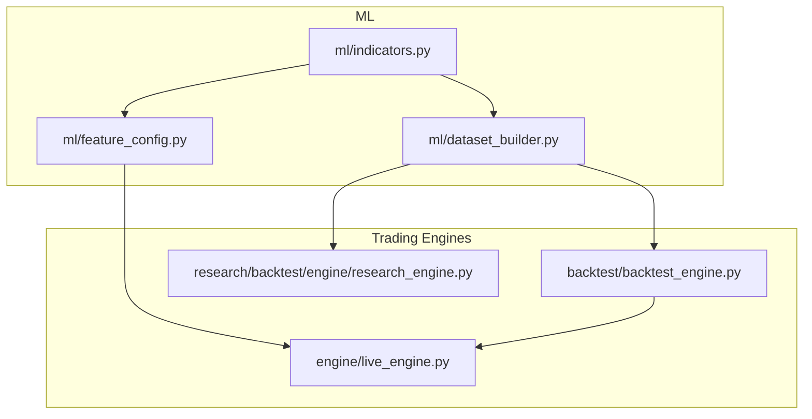
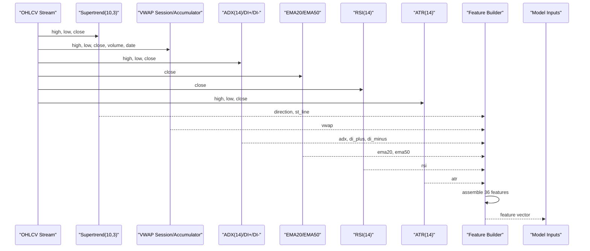
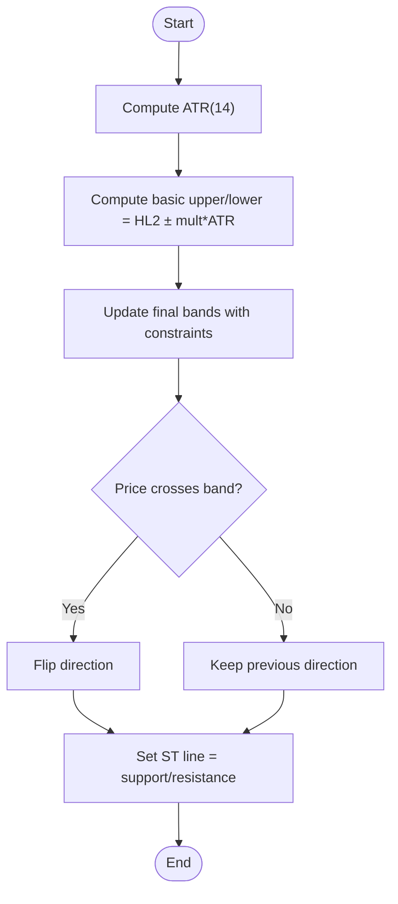
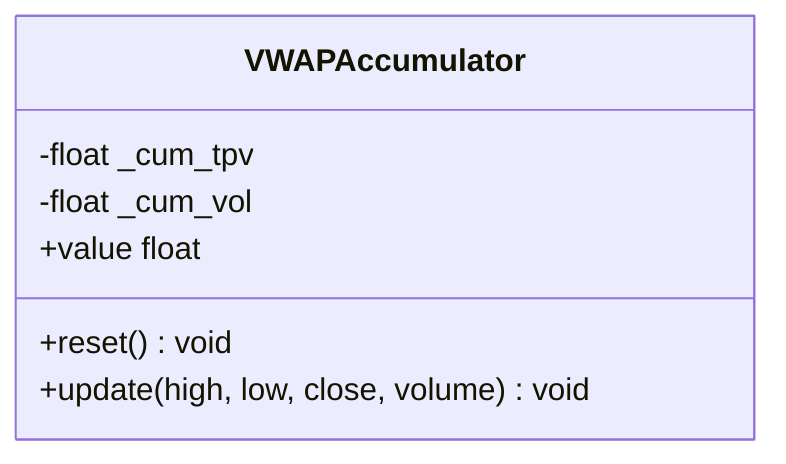
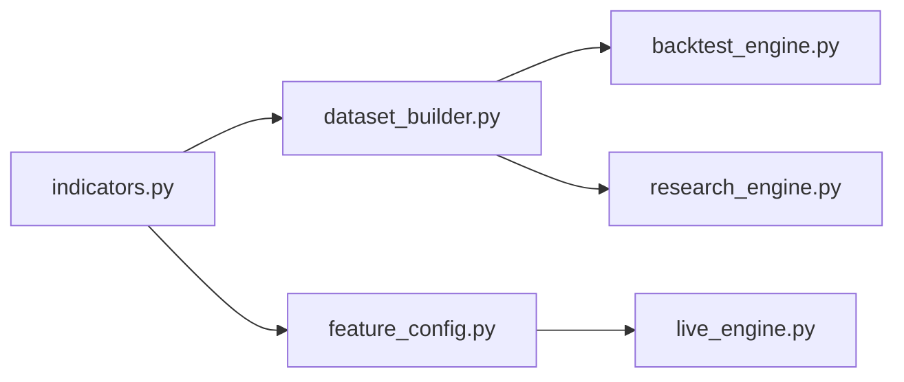

# Technical Indicators

<cite>
**Referenced Files in This Document**
- [indicators.py](file://ml/indicators.py)
- [feature_config.py](file://ml/feature_config.py)
- [dataset_builder.py](file://ml/dataset_builder.py)
- [backtest_engine.py](file://backtest/backtest_engine.py)
- [research_engine.py](file://research/backtest/engine/research_engine.py)
- [live_engine.py](file://engine/live_engine.py)
</cite>

## Table of Contents
1. [Introduction](#introduction)
2. [Project Structure](#project-structure)
3. [Core Components](#core-components)
4. [Architecture Overview](#architecture-overview)
5. [Detailed Component Analysis](#detailed-component-analysis)
6. [Dependency Analysis](#dependency-analysis)
7. [Performance Considerations](#performance-considerations)
8. [Troubleshooting Guide](#troubleshooting-guide)
9. [Conclusion](#conclusion)
10. [Appendices](#appendices)

## Introduction
This document explains the technical indicators used by the machine learning pipeline and how they are computed from OHLCV data, integrated into features, and consumed by training, backtesting, and live trading systems. It covers Supertrend (10, 3), VWAP, ADX (14), RSI, ATR, MACD via EMA alignment, and Directional Movement indicators (DI+/-). It also documents parameter choices, timeframe considerations, interpretation guidelines, and optimization techniques for integration with ML inputs.

## Project Structure
The indicator implementations and their usage are distributed across:
- ml/indicators.py: Core vectorized indicator functions (ATR, Supertrend, ADX, VWAP session, VWAP accumulator).
- ml/feature_config.py: Live feature builder that assembles the 36-feature vector fed to the ML model.
- ml/dataset_builder.py: Training-time feature computation and labeling; uses the same indicator logic for consistency.
- backtest_engine.py, research_engine.py, live_engine.py: Consume indicators to compute signals and build features at runtime.

**Diagram sources**
- [indicators.py:1-202](file://ml/indicators.py#L1-L202)
- [feature_config.py:25-64](file://ml/feature_config.py#L25-L64)
- [dataset_builder.py:84-176](file://ml/dataset_builder.py#L84-L176)
- [backtest_engine.py:381-407](file://backtest/backtest_engine.py#L381-L407)
- [research_engine.py:172-201](file://research/backtest/engine/research_engine.py#L172-L201)
- [live_engine.py:573-604](file://engine/live_engine.py#L573-L604)

**Section sources**
- [indicators.py:1-202](file://ml/indicators.py#L1-L202)
- [feature_config.py:25-64](file://ml/feature_config.py#L25-L64)
- [dataset_builder.py:84-176](file://ml/dataset_builder.py#L84-L176)
- [backtest_engine.py:381-407](file://backtest/backtest_engine.py#L381-L407)
- [research_engine.py:172-201](file://research/backtest/engine/research_engine.py#L172-L201)
- [live_engine.py:573-604](file://engine/live_engine.py#L573-L604)

## Core Components
- ATR (Wilder): Measures volatility using True Range smoothed with Wilder’s RMA. Used for normalization and risk sizing.
- Supertrend (10, 3): Trend direction and dynamic support/resistance line; provides a directional gate and distance metric.
- VWAP (session-reset): Institutional anchor; price vs VWAP indicates intraday bias. Includes an accumulator for live use.
- ADX (14) and DI+/DI-: Trend strength and directional movement; DI spread confirms momentum direction.
- EMA alignment (20 vs 50): Simple trend confirmation; used to derive MACD-like signal (EMA20 - EMA50) and alignment flag.
- RSI: Momentum oscillator based on smoothed gains/losses.
- Feature assembly: The live feature builder composes these into a consistent 36-feature vector for ML.

Key outputs used by ML:
- supertrend_dir, supertrend_dist
- price_vs_vwap
- adx, di_spread
- ema_alignment, macd (as ema20 - ema50)
- rsi, atr, returns, volatility, volume_ratio, and candle structure features

**Section sources**
- [indicators.py:12-34](file://ml/indicators.py#L12-L34)
- [indicators.py:41-90](file://ml/indicators.py#L41-L90)
- [indicators.py:97-129](file://ml/indicators.py#L97-L129)
- [indicators.py:136-169](file://ml/indicators.py#L136-L169)
- [indicators.py:176-202](file://ml/indicators.py#L176-L202)
- [feature_config.py:25-64](file://ml/feature_config.py#L25-L64)
- [feature_config.py:82-252](file://ml/feature_config.py#L82-L252)
- [dataset_builder.py:92-127](file://ml/dataset_builder.py#L92-L127)

## Architecture Overview
Indicators are computed from OHLCV (and dates/volume where needed) and then assembled into features consumed by ML models. The same indicator code is reused in training (dataset_builder), backtesting, and live engines to ensure consistency.

**Diagram sources**
- [indicators.py:41-90](file://ml/indicators.py#L41-L90)
- [indicators.py:97-129](file://ml/indicators.py#L97-L129)
- [indicators.py:136-169](file://ml/indicators.py#L136-L169)
- [feature_config.py:82-252](file://ml/feature_config.py#L82-L252)
- [dataset_builder.py:92-127](file://ml/dataset_builder.py#L92-L127)

## Detailed Component Analysis

### ATR (Wilder, period=14)
- Mathematical formulation:
  - True Range per bar: max(high - low, |high - prev_close|, |low - prev_close|).
  - Smoothed with Wilder’s RMA over period=14.
- Parameters:
  - period=14 (default).
- Trading significance:
  - Volatility measure; used to normalize range breaks and wicks, and to size risk.
- Input/Output:
  - Inputs: high, low, close arrays.
  - Output: array of ATR values.
- Timeframe tuning:
  - 1m/5m/15m: period=14 is standard; shorter timeframes may benefit from smoothing via rolling averages or adaptive periods if noise is high.
- ML role:
  - Normalizes features like range_break_strength and wick ratios; ensures stable scaling across regimes.

**Section sources**
- [indicators.py:12-34](file://ml/indicators.py#L12-L34)
- [feature_config.py:135-148](file://ml/feature_config.py#L135-L148)
- [dataset_builder.py:124-127](file://ml/dataset_builder.py#L124-L127)

### Supertrend (period=10, multiplier=3)
- Mathematical formulation:
  - HL2 = (high + low)/2.
  - Basic bands: HL2 ± multiplier × ATR(14).
  - Final bands update with constraints; direction flips when price crosses bands.
  - ST line = lower band when bullish, upper band when bearish.
- Parameters:
  - period=10 (for ATR inside Supertrend), multiplier=3.0.
- Trading significance:
  - Primary trend gate; distance from ST line measures trend strength.
- Input/Output:
  - Inputs: high, low, close arrays.
  - Outputs: direction (+1/-1), st_line values.
- Timeframe tuning:
  - 1m: sensitive; consider higher multiplier or longer period to reduce whipsaws.
  - 5m/15m: default (10,3) often works well; can adjust multiplier to 2.5–3.5 depending on regime.
- ML role:
  - Features: supertrend_dir, supertrend_dist; used as strong directional priors.

**Diagram sources**
- [indicators.py:41-90](file://ml/indicators.py#L41-L90)

**Section sources**
- [indicators.py:41-90](file://ml/indicators.py#L41-L90)
- [feature_config.py:25-33](file://ml/feature_config.py#L25-L33)
- [dataset_builder.py:92-97](file://ml/dataset_builder.py#L92-L97)

### VWAP (session-reset) and Accumulator
- Mathematical formulation:
  - Typical price = (high + low + close)/3.
  - Cumulative TPV / cumulative volume resets each calendar day.
  - Zero-volume guard: uniform weight fallback.
- Parameters:
  - Date-based reset; no explicit period.
- Trading significance:
  - Intraday institutional benchmark; price above/below VWAP indicates bias.
- Input/Output:
  - Inputs: high, low, close, volume, dates arrays.
  - Output: array of VWAP values per bar.
- Live usage:
  - VWAPAccumulator maintains running sums; reset daily; value property returns current VWAP.
- Timeframe tuning:
  - Works across 1m/5m/15m; ensure correct date boundaries for session resets.
- ML role:
  - Feature: price_vs_vwap (normalized); used as bias filter.

**Diagram sources**
- [indicators.py:176-202](file://ml/indicators.py#L176-L202)

**Section sources**
- [indicators.py:136-169](file://ml/indicators.py#L136-L169)
- [indicators.py:176-202](file://ml/indicators.py#L176-L202)
- [feature_config.py:109-116](file://ml/feature_config.py#L109-L116)
- [dataset_builder.py:99-103](file://ml/dataset_builder.py#L99-L103)

### ADX (14) and Directional Movement (DI+, DI-)
- Mathematical formulation:
  - True Range and directional movements (DM+) and (DM-) computed per bar.
  - Smooth DM+ and DM- with RMA(14); DI+ = 100 × RMA(DM+)/ATR; DI- = 100 × RMA(DM-)/ATR.
  - DX = 100 × |DI+ - DI-| / (DI+ + DI-); ADX = RMA(DX, 14).
- Parameters:
  - period=14.
- Trading significance:
  - ADX > 25 trending; < 20 ranging. DI spread (DI+ - DI-) confirms momentum direction.
- Input/Output:
  - Inputs: high, low, close arrays.
  - Outputs: adx_arr, di_plus, di_minus arrays.
- Timeframe tuning:
  - 1m: ADX can be noisy; consider smoothing or threshold adjustments.
  - 5m/15m: standard parameters work well; combine with Supertrend for robustness.
- ML role:
  - Features: adx, di_spread; used as regime filter and momentum confirmation.

**Section sources**
- [indicators.py:97-129](file://ml/indicators.py#L97-L129)
- [feature_config.py:25-33](file://ml/feature_config.py#L25-L33)
- [dataset_builder.py:105-110](file://ml/dataset_builder.py#L105-L110)

### RSI (14)
- Mathematical formulation:
  - Gains and losses per bar; smoothed averages via RMA(14); RS = avg_gain / avg_loss; RSI = 100 - 100/(1+RS).
- Parameters:
  - period=14.
- Trading significance:
  - Momentum oscillator; extremes indicate overbought/oversold conditions.
- Input/Output:
  - Inputs: close array.
  - Output: RSI array.
- Timeframe tuning:
  - 1m: frequent extremes; use with filters (e.g., ADX, Supertrend).
  - 5m/15m: more reliable signals; pair with trend indicators.
- ML role:
  - Feature: rsi; combined with other momentum features for entry timing.

**Section sources**
- [dataset_builder.py:55-72](file://ml/dataset_builder.py#L55-L72)
- [feature_config.py:104-116](file://ml/feature_config.py#L104-L116)

### MACD and EMA Alignments
- Implementation:
  - MACD derived as EMA20 - EMA50; trend_strength normalized by price; ema_alignment is +1/-1 based on EMA20 vs EMA50.
- Parameters:
  - EMA periods: 20 and 50.
- Trading significance:
  - EMA alignment confirms trend direction; MACD-like difference captures short-term momentum relative to medium-term trend.
- Input/Output:
  - Inputs: close array.
  - Outputs: ema20, ema50, macd, trend_strength, ema_alignment.
- Timeframe tuning:
  - 1m: faster crossovers; consider wider EMAs to reduce noise.
  - 5m/15m: standard 20/50 effective for intraday trends.
- ML role:
  - Features: ema_alignment, macd, trend_strength; used as trend confirmation.

**Section sources**
- [dataset_builder.py:112-119](file://ml/dataset_builder.py#L112-L119)
- [feature_config.py:25-33](file://ml/feature_config.py#L25-L33)

### Indicator Combinations
- Trend detection:
  - Supertrend direction + EMA alignment + ADX > threshold.
- Momentum analysis:
  - RSI + DI spread + MACD (EMA diff).
- Volatility measurement:
  - ATR for normalization; range compression and wick ratios contextualize moves.

These combinations form the “direction stack” and core features that guide ML decisions.

**Section sources**
- [feature_config.py:25-64](file://ml/feature_config.py#L25-L64)
- [dataset_builder.py:92-127](file://ml/dataset_builder.py#L92-L127)

## Dependency Analysis
- Core dependencies:
  - dataset_builder imports supertrend, adx, vwap_session from indicators.
  - feature_config computes additional features and integrates indicator outputs into the 36-feature vector.
  - Backtest and research engines compute indicators similarly to maintain parity with training.
  - Live engine builds features per candle and passes them to ML inference.

**Diagram sources**
- [dataset_builder.py:37](file://ml/dataset_builder.py#L37)
- [feature_config.py:82-252](file://ml/feature_config.py#L82-L252)
- [backtest_engine.py:381-407](file://backtest/backtest_engine.py#L381-L407)
- [research_engine.py:172-201](file://research/backtest/engine/research_engine.py#L172-L201)
- [live_engine.py:573-604](file://engine/live_engine.py#L573-L604)

**Section sources**
- [dataset_builder.py:37](file://ml/dataset_builder.py#L37)
- [feature_config.py:82-252](file://ml/feature_config.py#L82-L252)
- [backtest_engine.py:381-407](file://backtest/backtest_engine.py#L381-L407)
- [research_engine.py:172-201](file://research/backtest/engine/research_engine.py#L172-L201)
- [live_engine.py:573-604](file://engine/live_engine.py#L573-L604)

## Performance Considerations
- Vectorization:
  - ATR, Supertrend, ADX implemented with numpy loops optimized for speed; avoid per-bar Python overhead in hot paths.
- Rolling windows:
  - Use efficient rolling operations (pandas/numpy) for RSI, EMA, and volatility to minimize recomputation.
- Memory:
  - Preallocate arrays and reuse buffers where possible; clip values to bounded ranges to prevent overflow.
- Live updates:
  - VWAPAccumulator avoids recomputing session totals; reset daily to keep memory footprint small.
- Timeframe scaling:
  - Shorter timeframes (1m) produce more bars; ensure computations scale linearly and avoid excessive lookbacks.

[No sources needed since this section provides general guidance]

## Troubleshooting Guide
- Zero volume handling:
  - VWAP falls back to uniform weights when volume is zero; ensure date arrays align with bars for correct session resets.
- Insufficient history:
  - Feature builder returns zeros for early bars until sufficient history exists (e.g., <25 candles).
- Parameter mismatches:
  - Ensure training and live pipelines use identical indicator parameters (e.g., Supertrend 10/3, ADX 14) to avoid distribution shifts.
- Clipping and bounds:
  - Many features are clipped (e.g., adx 0–100, di_spread -60–60, price_vs_vwap -0.05–0.05) to stabilize ML; verify clipping thresholds match training.

**Section sources**
- [indicators.py:136-169](file://ml/indicators.py#L136-L169)
- [feature_config.py:94-96](file://ml/feature_config.py#L94-L96)
- [feature_config.py:201-252](file://ml/feature_config.py#L201-L252)
- [dataset_builder.py:92-127](file://ml/dataset_builder.py#L92-L127)

## Conclusion
The indicator suite provides a robust foundation for trend, momentum, and volatility analysis tailored to intraday trading. By computing indicators consistently across training, backtesting, and live environments, the system ensures stable feature distributions and reliable ML performance. Proper parameter selection per timeframe and careful combination of indicators enhance signal quality and reduce false positives.

[No sources needed since this section summarizes without analyzing specific files]

## Appendices

### Practical Examples and Interpretation Guidelines
- Supertrend (10,3):
  - Use direction as a primary gate; enter only when aligned with your intended side. Distance from ST line gauges trend strength.
- VWAP:
  - Price above VWAP favors long setups; below favors shorts. Combine with Supertrend for stronger confirmation.
- ADX (14):
  - Prefer trades when ADX > 25 (trending). Low ADX suggests ranging; reduce exposure or switch strategies.
- RSI:
  - Use with trend context; extreme readings in strong trends can persist—do not fade solely on RSI extremes.
- ATR:
  - Normalize entries/exits by ATR; position sizing scales with volatility.
- EMA alignment/MACD:
  - Confirm trend direction; use EMA20 vs EMA50 alignment to filter counter-trend signals.

[No sources needed since this section provides general guidance]

### Integration with Machine Learning Model Inputs
- Feature vector:
  - 36 features include direction stack (supertrend_dir, supertrend_dist, price_vs_vwap, adx, di_spread, ema_alignment, volume_ratio), core indicators (ema20, ema50, macd, returns, volatility, rsi, atr, trend_strength), time/session features, and candle structure metrics.
- Consistency:
  - Dataset builder mirrors live feature computation to prevent drift; ensure all components use identical logic and parameters.
- Optimization techniques:
  - Parameter sweeps for timeframe-specific tuning (e.g., Supertrend multiplier, ADX thresholds).
  - Feature importance analysis to prune redundant or noisy features.
  - Cross-validation across regimes and sessions to validate robustness.

**Section sources**
- [feature_config.py:25-64](file://ml/feature_config.py#L25-L64)
- [feature_config.py:82-252](file://ml/feature_config.py#L82-L252)
- [dataset_builder.py:84-176](file://ml/dataset_builder.py#L84-L176)