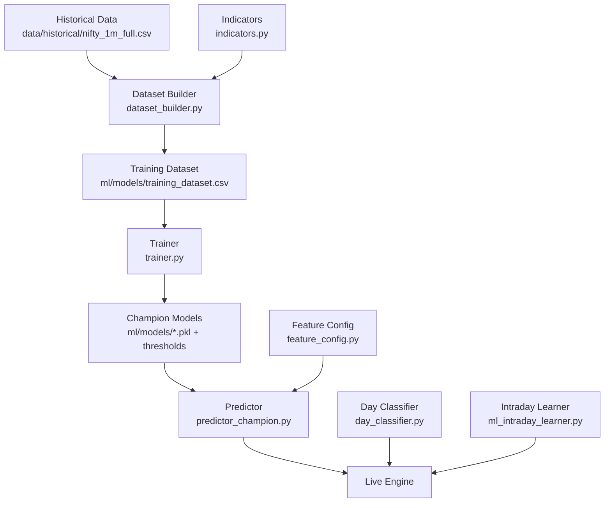
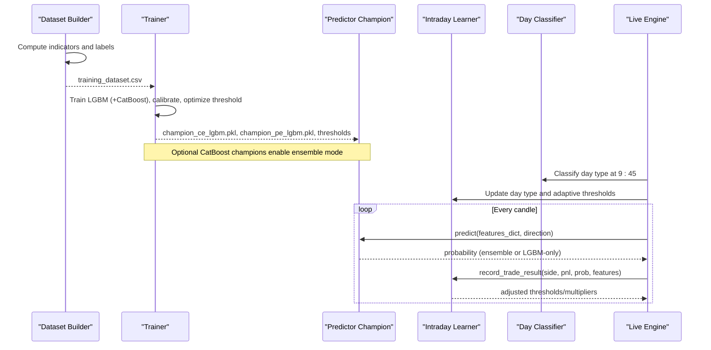
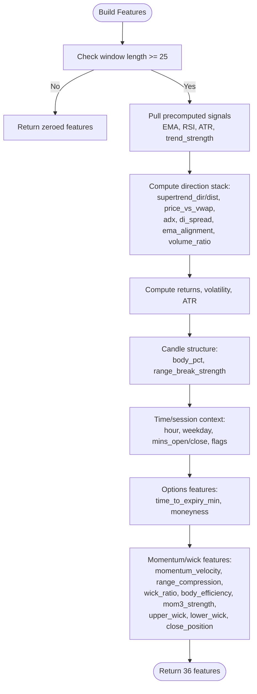
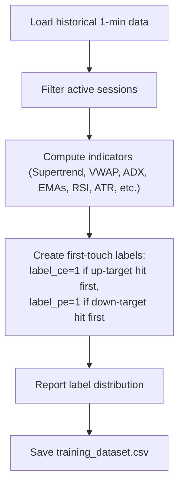
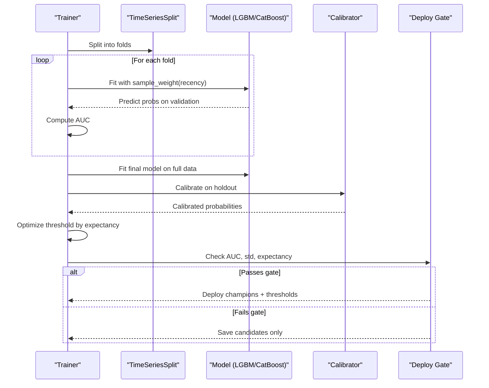
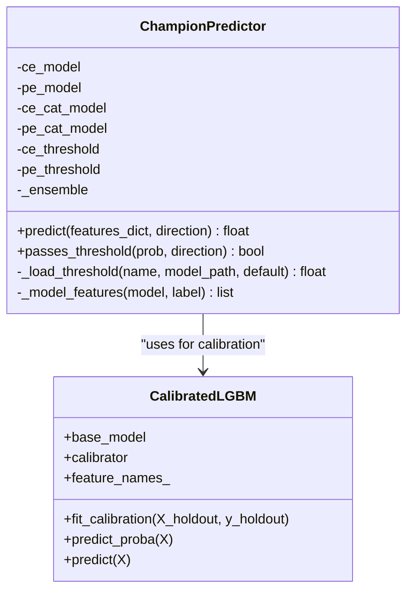
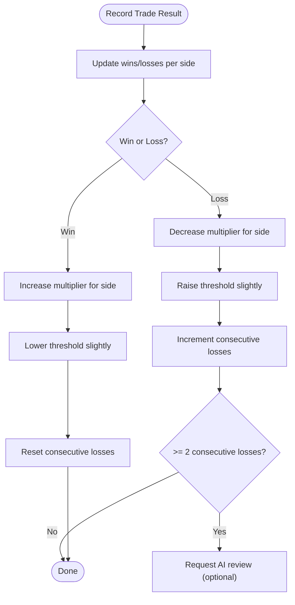
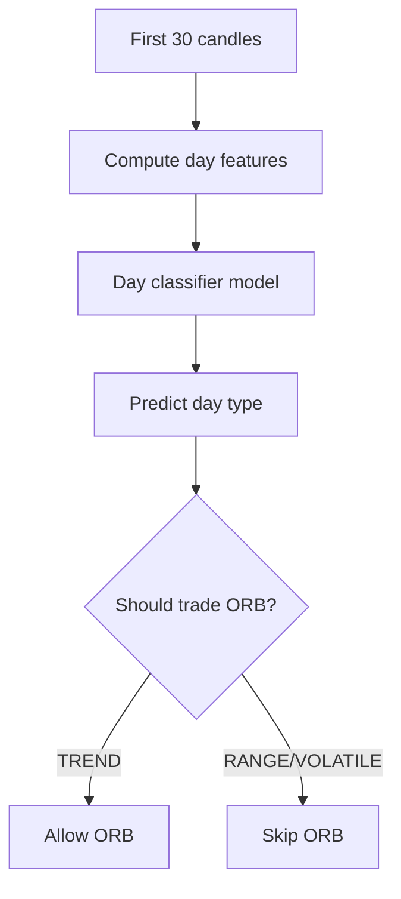
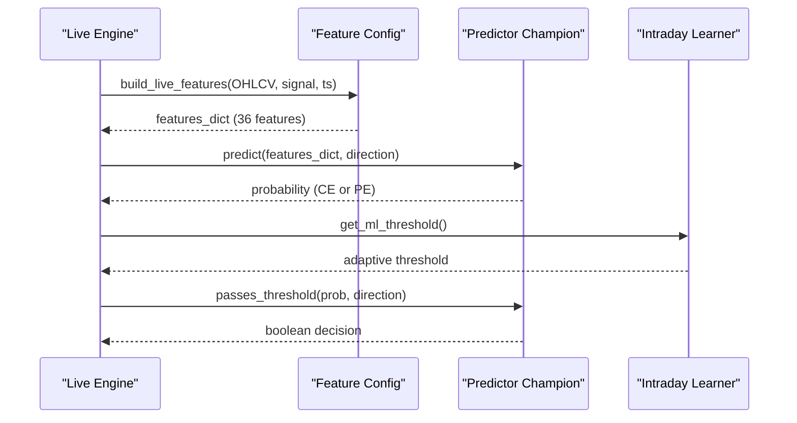
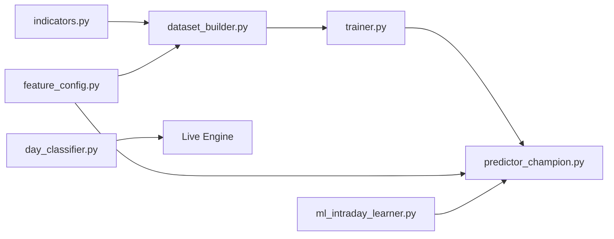

# Machine Learning Pipeline

<cite>
**Referenced Files in This Document**
- [predictor_champion.py](file://ml/predictor_champion.py)
- [feature_config.py](file://ml/feature_config.py)
- [trainer.py](file://ml/trainer.py)
- [ml_intraday_learner.py](file://ml/ml_intraday_learner.py)
- [day_classifier.py](file://ml/day_classifier.py)
- [dataset_builder.py](file://ml/dataset_builder.py)
- [indicators.py](file://ml/indicators.py)
</cite>

## Table of Contents
1. [Introduction](#introduction)
2. [Project Structure](#project-structure)
3. [Core Components](#core-components)
4. [Architecture Overview](#architecture-overview)
5. [Detailed Component Analysis](#detailed-component-analysis)
6. [Dependency Analysis](#dependency-analysis)
7. [Performance Considerations](#performance-considerations)
8. [Troubleshooting Guide](#troubleshooting-guide)
9. [Conclusion](#conclusion)
10. [Appendices](#appendices)

## Introduction
This document explains the machine learning pipeline that powers directional predictions for call and put options. It covers:
- Ensemble prediction using LightGBM and optional CatBoost models
- Feature engineering framework with 36 technical indicators and custom features
- Training, calibration, validation, and deployment processes
- Intraday learning, day-type classification, and dataset construction
- Practical examples of feature calculation, model input/output formats, and performance metrics
- Champion selection, versioning, retraining schedules, drift handling, and integration with trading decisions

## Project Structure
The ML subsystem is organized around a clear separation of concerns:
- Dataset construction and labeling: dataset_builder.py
- Feature definitions and live computation: feature_config.py, indicators.py
- Model training, calibration, and deployment gates: trainer.py
- Live inference and ensemble logic: predictor_champion.py
- Intraday adaptation and risk controls: ml_intraday_learner.py
- Market regime detection (day classifier): day_classifier.py

**Diagram sources**
- [dataset_builder.py:236-270](file://ml/dataset_builder.py#L236-L270)
- [trainer.py:212-286](file://ml/trainer.py#L212-L286)
- [predictor_champion.py:57-100](file://ml/predictor_champion.py#L57-L100)
- [day_classifier.py:293-340](file://ml/day_classifier.py#L293-L340)
- [ml_intraday_learner.py:46-100](file://ml/ml_intraday_learner.py#L46-L100)
- [indicators.py:41-169](file://ml/indicators.py#L41-L169)
- [feature_config.py:25-64](file://ml/feature_config.py#L25-L64)

**Section sources**
- [dataset_builder.py:236-270](file://ml/dataset_builder.py#L236-L270)
- [trainer.py:212-286](file://ml/trainer.py#L212-L286)
- [predictor_champion.py:57-100](file://ml/predictor_champion.py#L57-L100)
- [day_classifier.py:293-340](file://ml/day_classifier.py#L293-L340)
- [ml_intraday_learner.py:46-100](file://ml/ml_intraday_learner.py#L46-L100)
- [indicators.py:41-169](file://ml/indicators.py#L41-L169)
- [feature_config.py:25-64](file://ml/feature_config.py#L25-L64)

## Core Components
- Predictor champion: loads LightGBM champions for CE and PE, optionally ensembles with CatBoost if both are present; applies Platt calibration wrapper and threshold checks.
- Feature config: defines canonical 36-feature order and computes live features from OHLCV plus precomputed signals.
- Trainer: trains LightGBM and optional CatBoost models with time-series cross-validation, Platt calibration, threshold optimization, and deploy gate based on AUC, probability spread, and expectancy.
- Intraday learner: adapts thresholds and side multipliers intraday, detects day type early, and provides early exit logic.
- Day classifier: classifies market regime (TREND/RANGE/VOLATILE) using first 30 minutes to gate strategies like ORB.
- Dataset builder: constructs training dataset with first-touch barrier labels and full indicator set aligned to live features.
- Indicators: vectorized implementations of Supertrend, ADX, VWAP, and ATR used across dataset and live pipelines.

**Section sources**
- [predictor_champion.py:18-53](file://ml/predictor_champion.py#L18-L53)
- [predictor_champion.py:57-218](file://ml/predictor_champion.py#L57-L218)
- [feature_config.py:25-64](file://ml/feature_config.py#L25-L64)
- [feature_config.py:82-252](file://ml/feature_config.py#L82-L252)
- [trainer.py:82-176](file://ml/trainer.py#L82-L176)
- [trainer.py:196-286](file://ml/trainer.py#L196-L286)
- [ml_intraday_learner.py:46-100](file://ml/ml_intraday_learner.py#L46-L100)
- [ml_intraday_learner.py:205-245](file://ml/ml_intraday_learner.py#L205-L245)
- [day_classifier.py:49-155](file://ml/day_classifier.py#L49-L155)
- [day_classifier.py:250-340](file://ml/day_classifier.py#L250-L340)
- [dataset_builder.py:84-176](file://ml/dataset_builder.py#L84-L176)
- [dataset_builder.py:185-233](file://ml/dataset_builder.py#L185-L233)
- [indicators.py:41-169](file://ml/indicators.py#L41-L169)

## Architecture Overview
End-to-end flow from data to live trading:

**Diagram sources**
- [dataset_builder.py:236-270](file://ml/dataset_builder.py#L236-L270)
- [trainer.py:212-286](file://ml/trainer.py#L212-L286)
- [predictor_champion.py:57-218](file://ml/predictor_champion.py#L57-L218)
- [ml_intraday_learner.py:205-245](file://ml/ml_intraday_learner.py#L205-L245)
- [day_classifier.py:293-340](file://ml/day_classifier.py#L293-L340)

## Detailed Component Analysis

### Feature Engineering Framework
- Canonical feature order ensures consistency across training, backtesting, and live inference.
- Direction stack features include Supertrend direction and distance, VWAP bias, ADX regime, DI spread, EMA alignment, and volume ratio.
- Core indicators include EMAs, MACD, returns, volatility, RSI, ATR, trend strength.
- Time features capture session context (hour, weekday, minutes since open/close, session flags).
- Options-specific features include time to expiry and moneyness.
- Reversal/momentum features include momentum velocity, range compression, wick ratios, body efficiency, mom3 strength, upper/lower wicks, close position.

**Diagram sources**
- [feature_config.py:82-252](file://ml/feature_config.py#L82-L252)

**Section sources**
- [feature_config.py:25-64](file://ml/feature_config.py#L25-L64)
- [feature_config.py:82-252](file://ml/feature_config.py#L82-L252)
- [indicators.py:41-169](file://ml/indicators.py#L41-L169)

### Dataset Construction and Labeling
- Active sessions defined to focus on high-liquidity windows.
- Indicator computation aligns exactly with live feature pipeline to avoid train/live mismatch.
- First-touch barrier labels determine whether price hits an upward target before a downward target within a lookahead window, producing label_ce and label_pe per bar.
- Output includes all 36 features and labels ready for training.

**Diagram sources**
- [dataset_builder.py:236-270](file://ml/dataset_builder.py#L236-L270)
- [dataset_builder.py:84-176](file://ml/dataset_builder.py#L84-L176)
- [dataset_builder.py:185-233](file://ml/dataset_builder.py#L185-L233)

**Section sources**
- [dataset_builder.py:236-270](file://ml/dataset_builder.py#L236-L270)
- [dataset_builder.py:84-176](file://ml/dataset_builder.py#L84-L176)
- [dataset_builder.py:185-233](file://ml/dataset_builder.py#L185-L233)

### Training, Calibration, and Deployment
- Time-series cross-validation with recency weighting emphasizes recent regimes without biasing by label.
- LightGBM trained with conservative parameters; no class over-weighting to keep probabilities honest.
- Platt calibration applied via CalibratedLGBM wrapper on holdout fold to produce well-calibrated probabilities.
- Threshold optimization selects operating point maximizing expectancy under constraints on trade count and win rate.
- Deploy gate requires minimum AUC, calibrated probability spread, and positive expectancy; otherwise saves candidates without overwriting champions.
- Backups created before any overwrite to ensure safe rollback.

**Diagram sources**
- [trainer.py:82-176](file://ml/trainer.py#L82-L176)
- [trainer.py:196-286](file://ml/trainer.py#L196-L286)
- [predictor_champion.py:18-53](file://ml/predictor_champion.py#L18-L53)

**Section sources**
- [trainer.py:82-176](file://ml/trainer.py#L82-L176)
- [trainer.py:196-286](file://ml/trainer.py#L196-L286)
- [predictor_champion.py:18-53](file://ml/predictor_champion.py#L18-L53)

### Ensemble Prediction and Champion Selection
- Loads CE and PE LightGBM champions; if both CE and PE CatBoost champions exist, enables ensemble averaging of probabilities.
- Validates required features and sanitizes inputs; returns None on missing or invalid features to prevent silent bad predictions.
- Applies hard floor removal to preserve low-probability signals for downstream threshold/edge logic.
- Thresholds loaded per model; passes_threshold determines signal acceptance.

**Diagram sources**
- [predictor_champion.py:18-53](file://ml/predictor_champion.py#L18-L53)
- [predictor_champion.py:57-218](file://ml/predictor_champion.py#L57-L218)

**Section sources**
- [predictor_champion.py:57-218](file://ml/predictor_champion.py#L57-L218)

### Intraday Learning and Risk Controls
- Tracks daily wins/losses per side and adjusts multipliers to boost winning sides and reduce losing sides.
- Adaptive threshold rises after losses and falls after wins, bounded to realistic ranges.
- Early detection of day type influences threshold adjustments and strategy gating.
- Early exit logic considers day type, adverse move thresholds, and ML edge collapse to protect capital.

**Diagram sources**
- [ml_intraday_learner.py:247-319](file://ml/ml_intraday_learner.py#L247-L319)
- [ml_intraday_learner.py:205-245](file://ml/ml_intraday_learner.py#L205-L245)

**Section sources**
- [ml_intraday_learner.py:205-245](file://ml/ml_intraday_learner.py#L205-L245)
- [ml_intraday_learner.py:247-319](file://ml/ml_intraday_learner.py#L247-L319)
- [ml_intraday_learner.py:348-391](file://ml/ml_intraday_learner.py#L348-L391)

### Day Classifier for Market Regime Detection
- Computes day-level features from first 30 minutes (open-to-close move, range, directionality, momentum, ATR metrics, EMA slope, consecutive same-direction bars, gap).
- Trains LightGBM classifier with balanced class weights; outputs TREND/RANGE/VOLATILE.
- Provides should_trade_orb gating: only TRADE days allow ORB entries.

**Diagram sources**
- [day_classifier.py:49-155](file://ml/day_classifier.py#L49-L155)
- [day_classifier.py:250-340](file://ml/day_classifier.py#L250-L340)

**Section sources**
- [day_classifier.py:49-155](file://ml/day_classifier.py#L49-L155)
- [day_classifier.py:250-340](file://ml/day_classifier.py#L250-L340)

### Integration Between ML Predictions and Trading Decisions
- Predictor returns calibrated probability for CE or PE; ensemble averages LGBM and CatBoost when available.
- Thresholds per model determine acceptance; intraday learner further adjusts thresholds and multipliers based on daily performance and day type.
- Confidence scoring comes from model probabilities; low-probability signals are preserved for downstream edge/threshold logic rather than being truncated.

**Diagram sources**
- [feature_config.py:82-252](file://ml/feature_config.py#L82-L252)
- [predictor_champion.py:151-218](file://ml/predictor_champion.py#L151-L218)
- [ml_intraday_learner.py:205-245](file://ml/ml_intraday_learner.py#L205-L245)

**Section sources**
- [predictor_champion.py:151-218](file://ml/predictor_champion.py#L151-L218)
- [ml_intraday_learner.py:205-245](file://ml/ml_intraday_learner.py#L205-L245)

## Dependency Analysis
Key dependencies and relationships:
- dataset_builder.py depends on indicators.py for Supertrend, ADX, VWAP, ATR and produces training_dataset.csv.
- trainer.py depends on feature_config.py for canonical feature order and uses CalibratedLGBM from predictor_champion.py for calibration.
- predictor_champion.py depends on feature_config.py for fallback feature names and loads champion models and thresholds.
- ml_intraday_learner.py integrates with predictor_champion.py via thresholds and multipliers and can trigger optional AI review.
- day_classifier.py is independent but informs strategy gating (e.g., ORB) in the live engine.

**Diagram sources**
- [indicators.py:41-169](file://ml/indicators.py#L41-L169)
- [dataset_builder.py:84-176](file://ml/dataset_builder.py#L84-L176)
- [trainer.py:82-176](file://ml/trainer.py#L82-L176)
- [predictor_champion.py:57-218](file://ml/predictor_champion.py#L57-L218)
- [feature_config.py:25-64](file://ml/feature_config.py#L25-L64)
- [ml_intraday_learner.py:205-245](file://ml/ml_intraday_learner.py#L205-L245)
- [day_classifier.py:293-340](file://ml/day_classifier.py#L293-L340)

**Section sources**
- [indicators.py:41-169](file://ml/indicators.py#L41-L169)
- [dataset_builder.py:84-176](file://ml/dataset_builder.py#L84-L176)
- [trainer.py:82-176](file://ml/trainer.py#L82-L176)
- [predictor_champion.py:57-218](file://ml/predictor_champion.py#L57-L218)
- [feature_config.py:25-64](file://ml/feature_config.py#L25-L64)
- [ml_intraday_learner.py:205-245](file://ml/ml_intraday_learner.py#L205-L245)
- [day_classifier.py:293-340](file://ml/day_classifier.py#L293-L340)

## Performance Considerations
- Use time-series splits to avoid look-ahead bias during training.
- Recency weighting emphasizes recent regimes without distorting label distributions.
- Platt calibration improves probability reliability; monitor calibrated probability spread to detect saturation.
- Ensemble averaging reduces variance when CatBoost is available; degrade gracefully to LGBM-only if CatBoost fails.
- Feature scaling and clipping (e.g., volatility capped, ATR minimums) improve robustness in live inference.
- Monitor AUC, calibrated probability std, and expectancy to maintain model quality.

[No sources needed since this section provides general guidance]

## Troubleshooting Guide
Common issues and resolutions:
- Missing features: Predictor returns None if required features are absent; ensure feature pipeline matches FEATURE_COLUMNS order.
- Invalid feature values: NaN or Inf values cause rejection; validate inputs and handle edge cases in feature computation.
- Low probabilities: If calibrated probabilities are near zero, check calibration step and threshold logic; avoid hard floors that suppress signals.
- CatBoost failures: Ensemble falls back to LGBM if CatBoost prediction fails; inspect logs for exceptions.
- Day type misclassification: Ensure first 30 minutes data is complete and deduplicated; verify open price and minute-based collection.
- Retraining gate failures: If AUC, std, or expectancy thresholds fail, adjust START_DATE or target parameters and rerun trainer.

**Section sources**
- [predictor_champion.py:151-218](file://ml/predictor_champion.py#L151-L218)
- [trainer.py:234-286](file://ml/trainer.py#L234-L286)
- [ml_intraday_learner.py:109-148](file://ml/ml_intraday_learner.py#L109-L148)

## Conclusion
The ML pipeline combines robust feature engineering, careful dataset labeling, calibrated model training, and adaptive intraday learning to deliver reliable directional predictions for options. The ensemble approach leverages LightGBM and optional CatBoost, while deploy gates ensure only validated models reach production. Day-type classification and intraday adaptation provide additional layers of risk control and performance resilience.

[No sources needed since this section summarizes without analyzing specific files]

## Appendices

### Practical Examples

- Feature calculation example:
  - Inputs: closes, opens, highs, lows, volumes, signal dict with precomputed indicators, timestamp.
  - Outputs: dictionary of 36 features aligned to FEATURE_COLUMNS.
  - Reference: [build_live_features:82-252](file://ml/feature_config.py#L82-L252)

- Model input/output format:
  - Input: features_dict mapping feature names to numeric values; direction string "CE" or "PE".
  - Output: probability between 0 and 1; None indicates invalid input or error.
  - Reference: [predict:151-208](file://ml/predictor_champion.py#L151-L208)

- Performance metrics:
  - AUC from time-series cross-validation.
  - Calibrated probability std to assess spread.
  - Expectancy computed from win rate and average win/loss sizes at optimized threshold.
  - Reference: [train_one:82-129](file://ml/trainer.py#L82-L129), [find_threshold:68-79](file://ml/trainer.py#L68-L79), [expectancy:60-66](file://ml/trainer.py#L60-L66)

### Champion Model Versioning and Deployment
- Champions stored as .pkl files with corresponding _threshold.txt and _features.txt artifacts.
- Backup directory created before overwrite to enable rollback.
- Candidate models saved separately when deploy gate fails.
- Reference: [backup_existing:179-193](file://ml/trainer.py#L179-L193), [deploy:196-203](file://ml/trainer.py#L196-L203), [candidate:206-209](file://ml/trainer.py#L206-L209)

### Retraining Schedules and Drift Handling
- Retrain when new data becomes available or performance degrades below thresholds.
- Use START_DATE to emphasize recent regimes; adjust RECENCY_CUTOFF and RECENCY_MULT as needed.
- Monitor calibrated probability spread and AUC; if they drop, investigate feature drift or regime shifts.
- Reference: [recency_weights:51-57](file://ml/trainer.py#L51-L57), [main:212-286](file://ml/trainer.py#L212-L286)

### Integration Notes
- Probability thresholds:
  - Per-model thresholds loaded from _threshold.txt; passed through passes_threshold.
  - Intraday learner adjusts thresholds based on daily performance and day type.
- Confidence scoring:
  - Model probabilities serve as confidence; ensemble averaging improves stability.
- Strategy gating:
  - Day classifier restricts certain strategies (e.g., ORB) to TREND days.
- Reference: [predictor_champion.py:105-112](file://ml/predictor_champion.py#L105-L112), [ml_intraday_learner.py:205-245](file://ml/ml_intraday_learner.py#L205-L245), [day_classifier.py:333-340](file://ml/day_classifier.py#L333-L340)