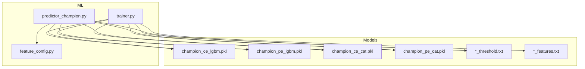
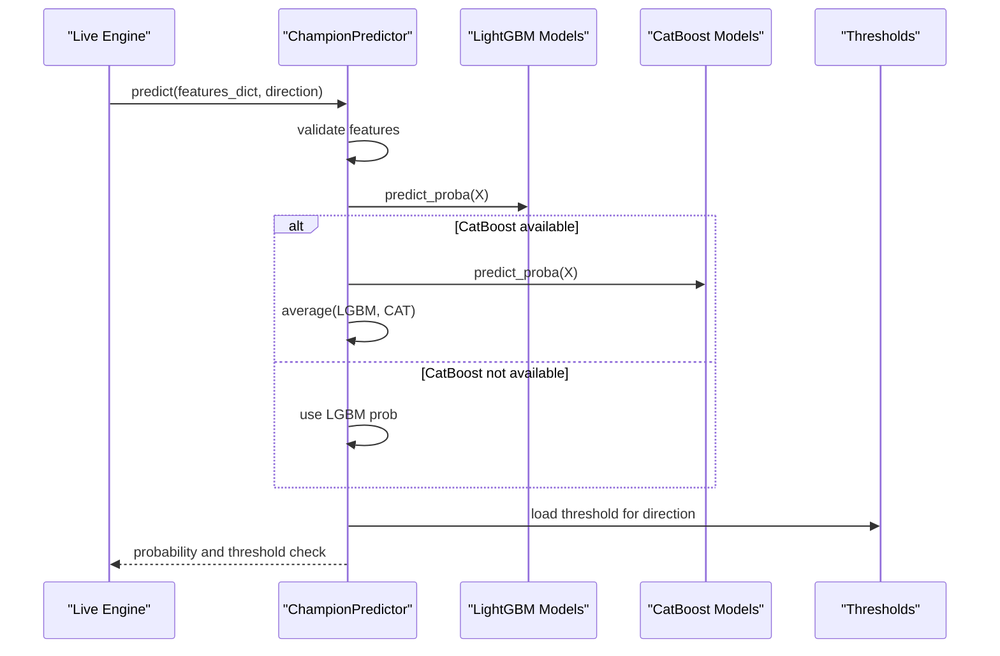
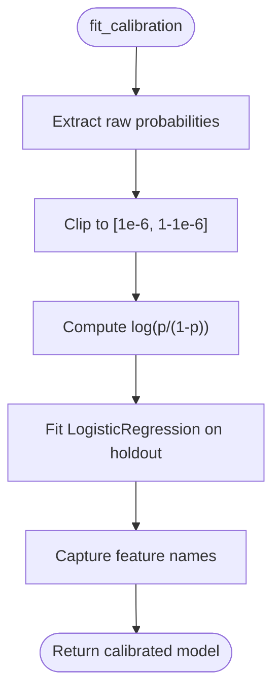
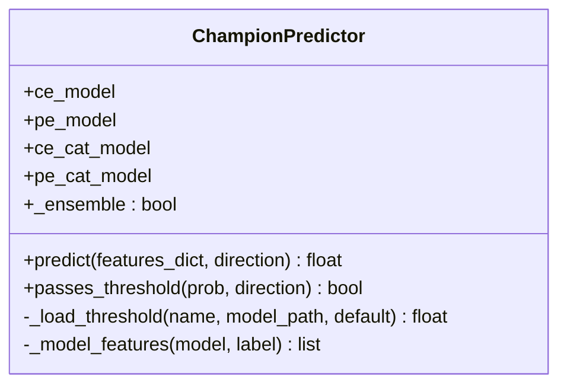
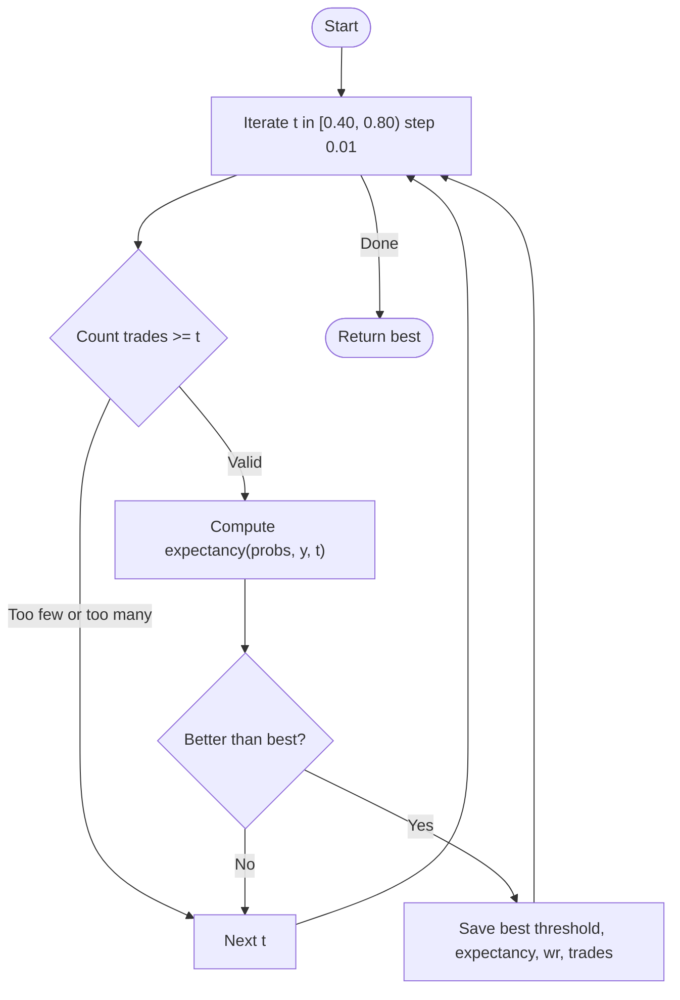
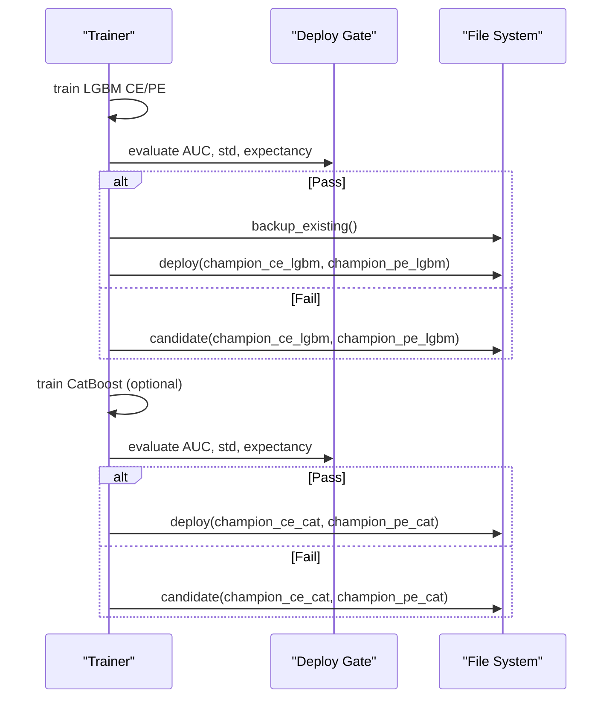
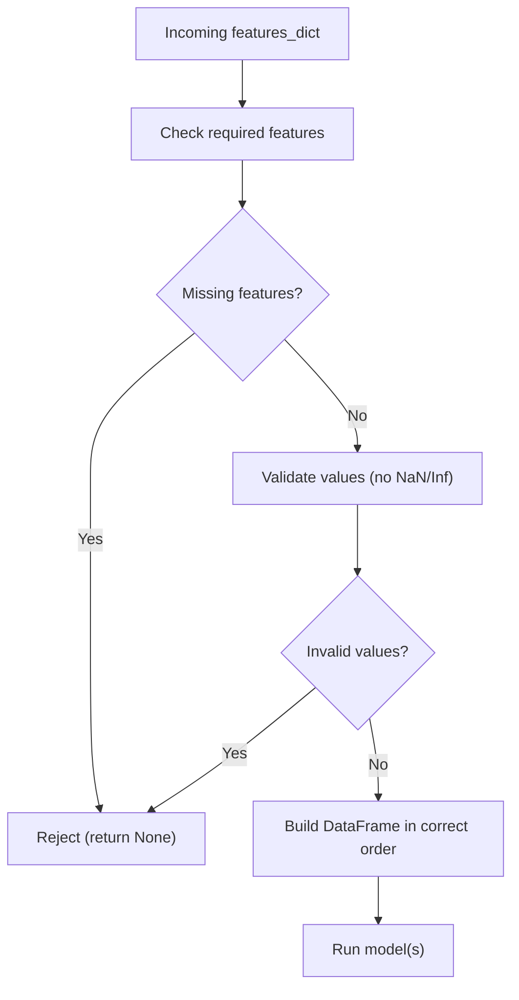
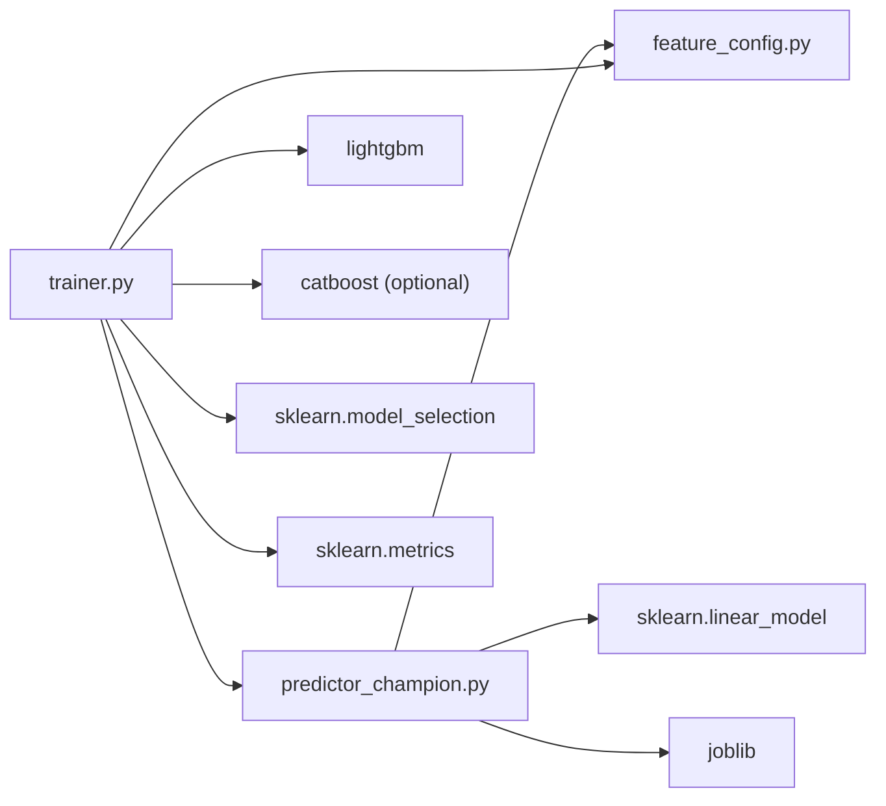

# Champion Model Selection

<cite>
**Referenced Files in This Document**
- [predictor_champion.py](file://ml/predictor_champion.py)
- [trainer.py](file://ml/trainer.py)
- [feature_config.py](file://ml/feature_config.py)
</cite>

## Table of Contents
1. [Introduction](#introduction)
2. [Project Structure](#project-structure)
3. [Core Components](#core-components)
4. [Architecture Overview](#architecture-overview)
5. [Detailed Component Analysis](#detailed-component-analysis)
6. [Dependency Analysis](#dependency-analysis)
7. [Performance Considerations](#performance-considerations)
8. [Troubleshooting Guide](#troubleshooting-guide)
9. [Conclusion](#conclusion)
10. [Appendices](#appendices)

## Introduction
This document explains the champion model selection and deployment system used for directional trading signals. It focuses on:
- How the predictor loads and runs models, including an ensemble strategy combining LightGBM and CatBoost when available.
- The CalibratedLGBM class that applies Platt scaling to produce well-calibrated probabilities.
- Threshold optimization via find_threshold() that searches probability cutoffs between 0.40 and 0.80 using expectancy calculations.
- The trainer’s backup and deployment workflow that protects existing champions and saves candidates when gates fail.
- Model versioning, feature validation, and error handling for missing or corrupted models.
- Practical guidance on interpreting evaluation metrics, adjusting thresholds, and troubleshooting model loading issues.

## Project Structure
The ML subsystem relevant to this documentation is organized under ml/. Key files:
- ml/predictor_champion.py: Runtime predictor that loads champion models, validates features, predicts with optional ensemble, and applies thresholds.
- ml/trainer.py: Training pipeline that trains LightGBM and (optionally) CatBoost models, calibrates them, optimizes thresholds, and deploys or saves candidates based on a deploy gate.
- ml/feature_config.py: Canonical feature set and live feature builder ensuring consistent inputs across training and inference.

**Diagram sources**
- [predictor_champion.py:57-100](file://ml/predictor_champion.py#L57-L100)
- [trainer.py:179-203](file://ml/trainer.py#L179-L203)
- [feature_config.py:25-64](file://ml/feature_config.py#L25-L64)

**Section sources**
- [predictor_champion.py:57-100](file://ml/predictor_champion.py#L57-L100)
- [trainer.py:179-203](file://ml/trainer.py#L179-L203)
- [feature_config.py:25-64](file://ml/feature_config.py#L25-L64)

## Core Components
- CalibratedLGBM: A wrapper around any sklearn-compatible classifier that performs Platt scaling calibration using a logistic regression calibrator on logit-transformed raw probabilities. It preserves feature names for downstream validation.
- ChampionPredictor: Loads LightGBM champions by default and optionally CatBoost champions if both CE and PE CatBoost models exist. It validates features, builds input vectors, predicts with LGBM alone or LGBM+CatBoost ensemble, and enforces direction-specific thresholds.
- Trainer: Trains LightGBM and CatBoost models with time-series cross-validation, applies Platt calibration on holdout folds, optimizes thresholds via find_threshold(), and deploys only if the deploy gate passes; otherwise, it saves candidates without overwriting champions.

**Section sources**
- [predictor_champion.py:18-53](file://ml/predictor_champion.py#L18-L53)
- [predictor_champion.py:57-100](file://ml/predictor_champion.py#L57-L100)
- [predictor_champion.py:151-218](file://ml/predictor_champion.py#L151-L218)
- [trainer.py:82-176](file://ml/trainer.py#L82-L176)
- [trainer.py:179-203](file://ml/trainer.py#L179-L203)
- [trainer.py:212-286](file://ml/trainer.py#L212-L286)

## Architecture Overview
The system separates training and inference:
- Training (trainer.py):
  - Reads dataset, ensures feature columns exist.
  - Trains LightGBM and CatBoost directional models (CE and PE).
  - Applies Platt calibration on holdout folds.
  - Optimizes threshold using find_threshold() over 0.40–0.80 with expectancy scoring.
  - Backs up existing champions before deployment.
  - Deploys new champions if they pass the deploy gate; otherwise saves as candidates.
- Inference (predictor_champion.py):
  - Loads champion models and thresholds from ml/models/.
  - Validates incoming features against expected feature sets.
  - Predicts with LGBM; if CatBoost models are present, averages probabilities for ensemble.
  - Returns calibrated probability and checks against direction-specific threshold.

**Diagram sources**
- [predictor_champion.py:151-218](file://ml/predictor_champion.py#L151-L218)
- [predictor_champion.py:105-112](file://ml/predictor_champion.py#L105-L112)

**Section sources**
- [predictor_champion.py:151-218](file://ml/predictor_champion.py#L151-L218)
- [trainer.py:212-286](file://ml/trainer.py#L212-L286)

## Detailed Component Analysis

### CalibratedLGBM (Platt Scaling Calibration)
- Purpose: Convert raw model outputs into well-calibrated probabilities using Platt scaling.
- Mechanism:
  - Extracts raw positive-class probabilities from base_model.predict_proba().
  - Clips probabilities to avoid log(0), computes logits, and fits a LogisticRegression calibrator.
  - Stores feature names for later validation.
  - During prediction, repeats clipping and logit transformation, then uses the calibrator to output calibrated probabilities.
- Complexity:
  - Fit: O(n) for probability extraction plus logistic regression fit cost.
  - Predict: O(n) per sample for probability extraction and logit transform.
- Error handling:
  - Clipping prevents numerical issues.
  - Feature name extraction gracefully falls back if attributes differ across model types.

**Diagram sources**
- [predictor_champion.py:23-42](file://ml/predictor_champion.py#L23-L42)

**Section sources**
- [predictor_champion.py:18-53](file://ml/predictor_champion.py#L18-L53)

### ChampionPredictor (Model Loading and Ensemble Strategy)
- Model loading:
  - Always loads LightGBM champions for CE and PE directions.
  - Optionally loads CatBoost champions if both CE and PE CatBoost files exist; enables ensemble mode.
- Feature validation:
  - Ensures all required features exist in the input dict.
  - Rejects invalid values (NaN/Inf) and returns None to signal unsafe predictions.
- Prediction:
  - Builds a DataFrame row aligned to expected feature order.
  - Predicts with LGBM; if CatBoost is available, averages probabilities for robustness.
  - Caps probabilities to [0, 1].
  - Logs low-probability cases but does not hard-floor them; relies on threshold logic.
- Threshold application:
  - Loads direction-specific thresholds from *_threshold.txt files.
  - provides passes_threshold() to compare predicted probability against threshold.

**Diagram sources**
- [predictor_champion.py:57-100](file://ml/predictor_champion.py#L57-L100)
- [predictor_champion.py:105-147](file://ml/predictor_champion.py#L105-L147)
- [predictor_champion.py:151-218](file://ml/predictor_champion.py#L151-L218)

**Section sources**
- [predictor_champion.py:57-100](file://ml/predictor_champion.py#L57-L100)
- [predictor_champion.py:105-147](file://ml/predictor_champion.py#L105-L147)
- [predictor_champion.py:151-218](file://ml/predictor_champion.py#L151-L218)

### Threshold Optimization (find_threshold and Expectancy)
- Objective: Find the optimal probability cutoff that maximizes expectancy while maintaining reasonable trade counts.
- Search space: Probabilities from 0.40 to 0.80 in steps of 0.01.
- Constraints:
  - Minimum number of trades at threshold to ensure statistical reliability.
  - Upper bound on fraction of total samples to avoid overly selective thresholds.
- Expectancy calculation:
  - Computes win rate among trades above threshold.
  - Estimates expectancy using average win and loss parameters.
- Output: Best threshold, associated expectancy, win rate, and trade count.

**Diagram sources**
- [trainer.py:60-79](file://ml/trainer.py#L60-L79)

**Section sources**
- [trainer.py:60-79](file://ml/trainer.py#L60-L79)

### Trainer Workflow (Backup, Deployment, Candidate Saving)
- Backup:
  - Before overwriting champions, creates a timestamped backup directory under ml/models/backup_YYYYMMDD_HHMMSS/.
  - Copies existing champion pkl files and their threshold and feature files.
- Deployment:
  - If models pass the deploy gate (AUC >= MIN_AUC, calibrated prob std >= MIN_STD, expectancy > 0), writes new champions and thresholds/features.
- Candidate saving:
  - If gate fails, saves models as *_candidate.pkl without replacing champions.
- Optional CatBoost:
  - If installed, trains CatBoost models similarly and deploys or saves candidates based on gate results.

**Diagram sources**
- [trainer.py:179-203](file://ml/trainer.py#L179-L203)
- [trainer.py:212-286](file://ml/trainer.py#L212-L286)

**Section sources**
- [trainer.py:179-203](file://ml/trainer.py#L179-L203)
- [trainer.py:212-286](file://ml/trainer.py#L212-L286)

### Feature Validation and Consistency
- Canonical feature order is defined in FEATURE_COLUMNS to ensure identical ordering during training and inference.
- Predictor validates incoming features against model expectations and rejects rows with missing or invalid values.
- Feature builder in feature_config.py constructs the same 36 features consistently for live data, matching training assumptions.

**Diagram sources**
- [predictor_champion.py:151-178](file://ml/predictor_champion.py#L151-L178)
- [feature_config.py:25-64](file://ml/feature_config.py#L25-L64)

**Section sources**
- [predictor_champion.py:151-178](file://ml/predictor_champion.py#L151-L178)
- [feature_config.py:25-64](file://ml/feature_config.py#L25-L64)

## Dependency Analysis
- predictor_champion.py depends on:
  - joblib for model loading.
  - numpy and pandas for data manipulation.
  - sklearn.linear_model.LogisticRegression for Platt calibration.
  - ml.feature_config.FEATURE_COLUMNS for canonical feature order.
- trainer.py depends on:
  - lightgbm for LightGBM training.
  - catboost (optional) for CatBoost training.
  - sklearn.model_selection.TimeSeriesSplit for temporal CV.
  - sklearn.metrics.roc_auc_score for AUC evaluation.
  - ml.predictor_champion.CalibratedLGBM for calibration.
  - ml.feature_config.FEATURE_COLUMNS for consistent features.

**Diagram sources**
- [predictor_champion.py:1-13](file://ml/predictor_champion.py#L1-L13)
- [trainer.py:18-39](file://ml/trainer.py#L18-L39)
- [feature_config.py:1-20](file://ml/feature_config.py#L1-L20)

**Section sources**
- [predictor_champion.py:1-13](file://ml/predictor_champion.py#L1-L13)
- [trainer.py:18-39](file://ml/trainer.py#L18-L39)
- [feature_config.py:1-20](file://ml/feature_config.py#L1-L20)

## Performance Considerations
- Calibration overhead: Platt scaling adds a small logistic regression step; negligible compared to tree model inference.
- Ensemble averaging: Adds CatBoost inference cost; improves robustness when both models are available.
- Threshold search: Conducted once during training; no runtime impact.
- Feature validation: Early rejection avoids expensive inference on invalid inputs.
- Recency weighting: Applied during training to emphasize recent regimes without biasing labels.

[No sources needed since this section provides general guidance]

## Troubleshooting Guide
Common issues and resolutions:
- Missing model files:
  - Symptom: FileNotFoundError when loading champion models.
  - Resolution: Ensure champion_ce_lgbm.pkl and champion_pe_lgbm.pkl exist; re-run trainer to generate them.
- Corrupted model files:
  - Symptom: Exception during joblib.load or predict_proba.
  - Resolution: Replace with a valid backup from ml/models/backup_*/ or retrain.
- Missing features:
  - Symptom: Warning about missing features; prediction returns None.
  - Resolution: Ensure features_dict contains all FEATURE_COLUMNS; verify feature builder consistency.
- Invalid feature values:
  - Symptom: Warning about NaN/Inf; prediction returns None.
  - Resolution: Clean upstream data; handle outliers before building features.
- Low probabilities:
  - Symptom: Very low predicted probabilities logged.
  - Resolution: Inspect threshold and edge logic; consider recalibration or retraining with updated data.
- Threshold adjustment:
  - Use find_threshold() outputs (threshold, expectancy, win rate, trades) to interpret performance.
  - Adjust target expectancy or recency parameters in trainer to influence optimal cutoff.
- Deploy gate failures:
  - Symptom: New models saved as candidates; champions unchanged.
  - Resolution: Review AUC, calibrated prob std, and expectancy; adjust training data or hyperparameters and rerun.

**Section sources**
- [predictor_champion.py:65-70](file://ml/predictor_champion.py#L65-L70)
- [predictor_champion.py:156-178](file://ml/predictor_champion.py#L156-L178)
- [predictor_champion.py:200-208](file://ml/predictor_champion.py#L200-L208)
- [trainer.py:234-250](file://ml/trainer.py#L234-L250)
- [trainer.py:267-280](file://ml/trainer.py#L267-L280)

## Conclusion
The champion model selection system combines robust calibration, careful threshold optimization, and a safe deployment workflow. LightGBM is always used; CatBoost can be added for ensemble predictions when available. The trainer protects existing champions via backups and only deploys models that pass strict quality gates. Feature validation ensures consistent inputs, and comprehensive logging aids troubleshooting. By interpreting AUC, calibrated probability spread, and expectancy, practitioners can iteratively improve model performance and maintain reliable live trading signals.

[No sources needed since this section summarizes without analyzing specific files]

## Appendices

### Model File Structure
- Champions:
  - champion_ce_lgbm.pkl, champion_pe_lgbm.pkl
  - champion_ce_cat.pkl, champion_pe_cat.pkl (optional)
- Thresholds:
  - champion_ce_lgbm_threshold.txt, champion_pe_lgbm_threshold.txt
  - champion_ce_cat_threshold.txt, champion_pe_cat_threshold.txt (optional)
- Features:
  - *_features.txt files documenting expected feature columns.
- Backups:
  - ml/models/backup_YYYYMMDD_HHMMSS/ containing copies of previous champions and metadata.

**Section sources**
- [trainer.py:179-203](file://ml/trainer.py#L179-L203)

### Metrics Interpretation
- AUC: Discrimination ability; higher indicates better separation of classes.
- Calibrated probability std: Indicates spread; very low suggests saturation or lack of signal.
- Expectancy: Expected profit per trade given threshold; must be positive to deploy.
- Win rate and trade count: Provide context on threshold selectivity and statistical reliability.

**Section sources**
- [trainer.py:60-79](file://ml/trainer.py#L60-L79)
- [trainer.py:224-250](file://ml/trainer.py#L224-L250)