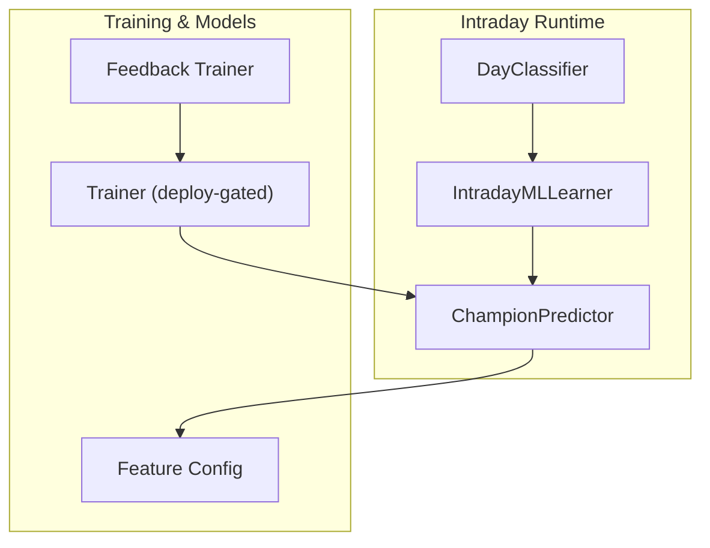
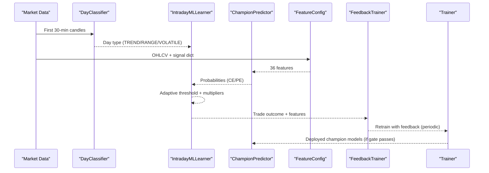
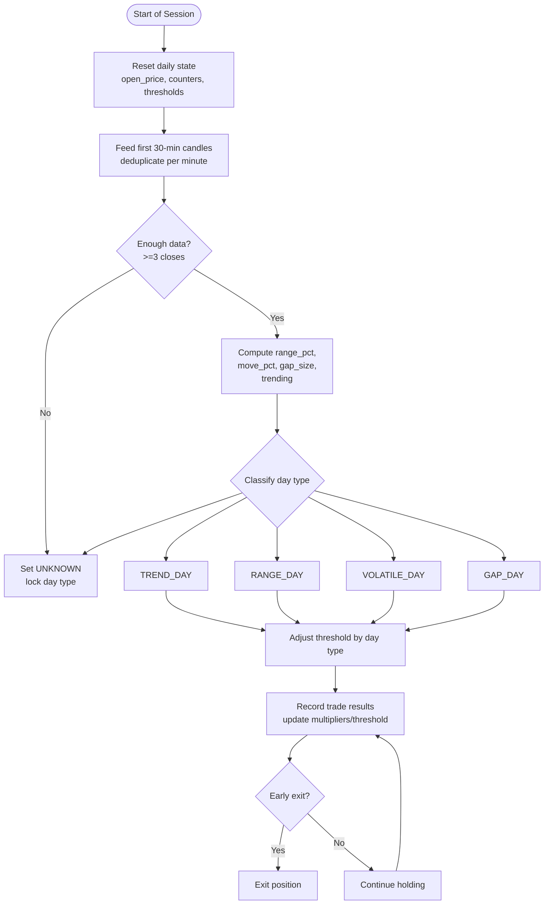
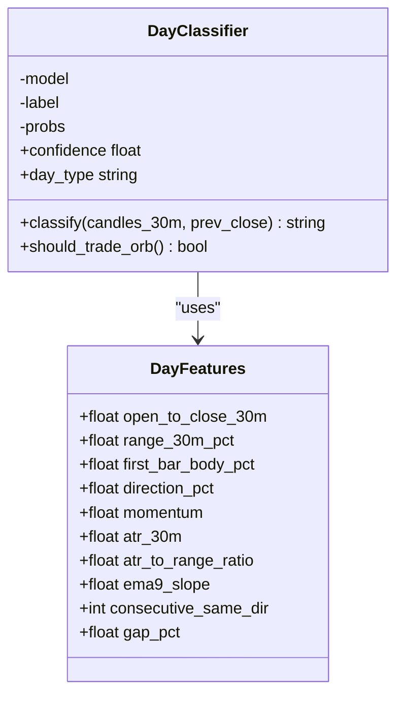
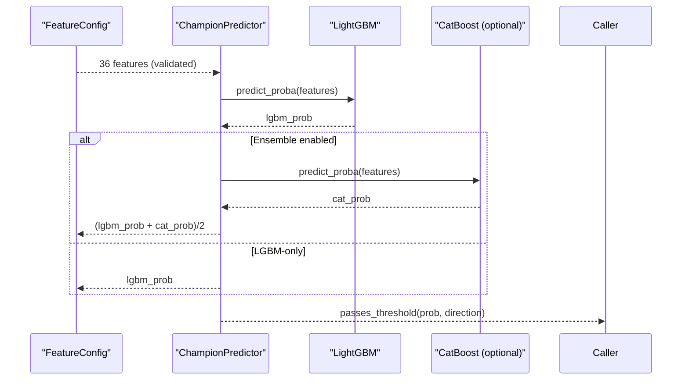
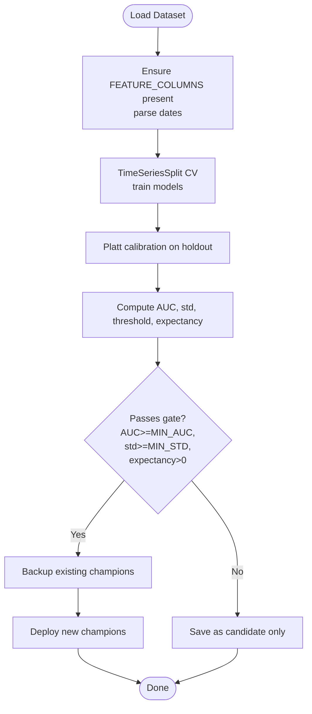
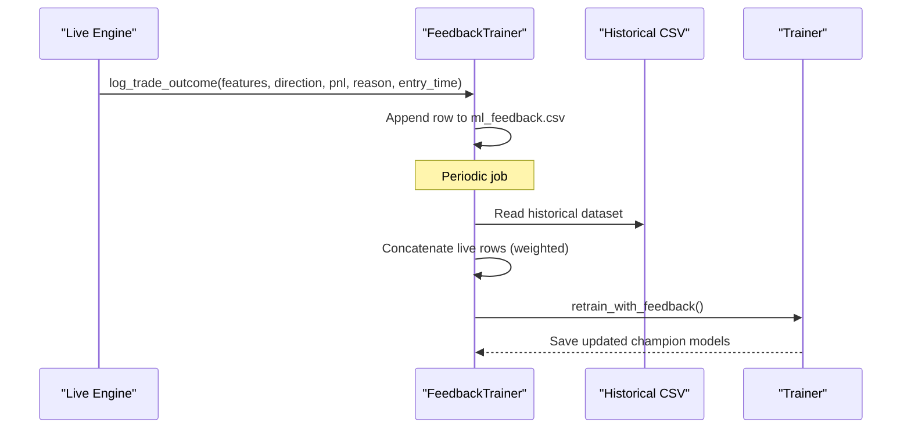
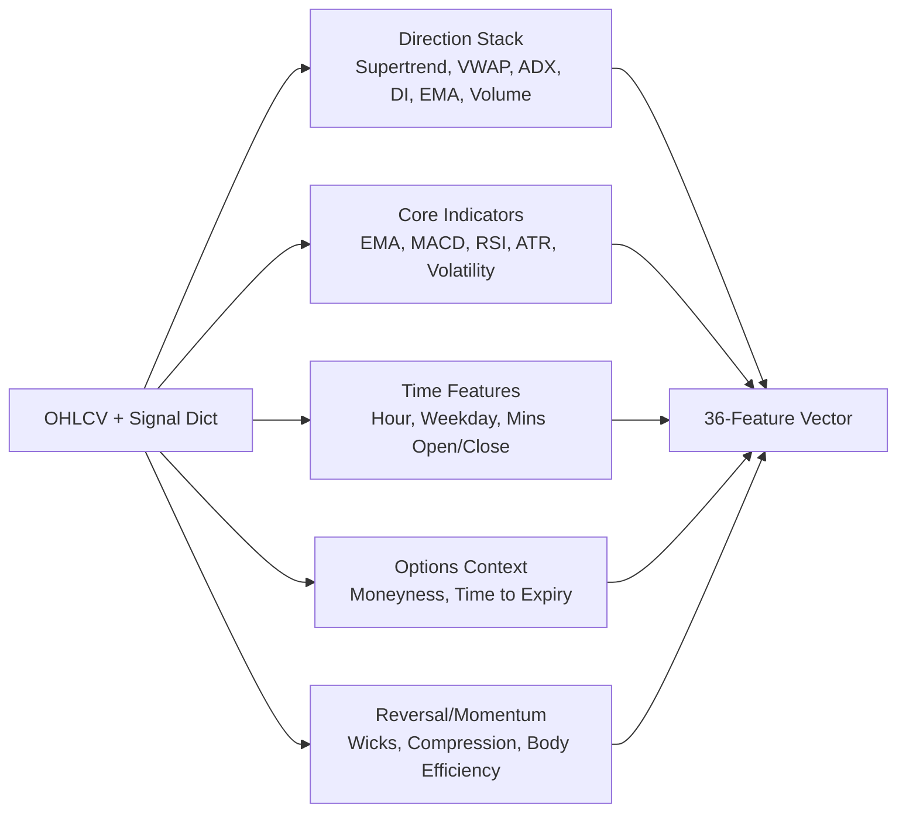
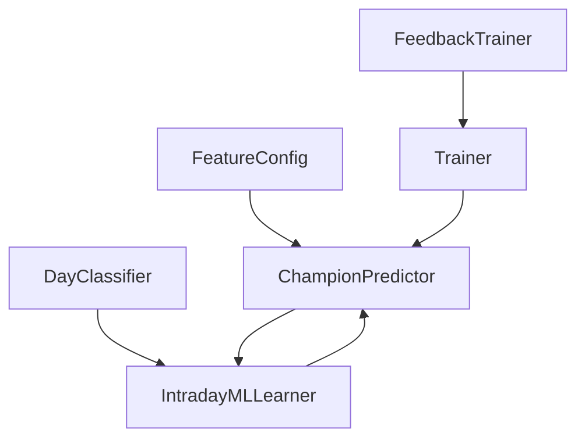

# Intraday Learning System

<cite>
**Referenced Files in This Document**
- [ml_intraday_learner.py](file://ml/ml_intraday_learner.py)
- [day_classifier.py](file://ml/day_classifier.py)
- [feedback_trainer.py](file://ml/feedback_trainer.py)
- [trainer.py](file://ml/trainer.py)
- [predictor_champion.py](file://ml/predictor_champion.py)
- [feature_config.py](file://ml/feature_config.py)
</cite>

## Table of Contents
1. [Introduction](#introduction)
2. [Project Structure](#project-structure)
3. [Core Components](#core-components)
4. [Architecture Overview](#architecture-overview)
5. [Detailed Component Analysis](#detailed-component-analysis)
6. [Dependency Analysis](#dependency-analysis)
7. [Performance Considerations](#performance-considerations)
8. [Troubleshooting Guide](#troubleshooting-guide)
9. [Conclusion](#conclusion)
10. [Appendices](#appendices)

## Introduction
This document explains the intraday learning system that powers adaptive, session-aware trading decisions. It focuses on:
- Intraday-specific training and adaptation that accounts for market microstructure patterns, session-based features, and temporal dependencies unique to intraday trading.
- Day classification logic that categorizes market regimes early in the session and gates strategy behavior accordingly.
- A feedback loop that incorporates live trade outcomes into model retraining, adjusts thresholds adaptively during the day, and supports drift detection signals to trigger retraining.
- Integration with the main training pipeline, intraday data preprocessing, and validation techniques that ensure stability across market conditions.
- Practical guidance for configuring parameters, monitoring performance, and tuning learning rates under different volatility regimes.

## Project Structure
The intraday learning system spans several modules:
- Real-time learner and regime gating: ml_intraday_learner.py, day_classifier.py
- Model training and deployment: trainer.py, predictor_champion.py
- Feature engineering and configuration: feature_config.py
- Live feedback collection and retraining: feedback_trainer.py

**Diagram sources**
- [ml_intraday_learner.py:46-406](file://ml/ml_intraday_learner.py#L46-L406)
- [day_classifier.py:293-339](file://ml/day_classifier.py#L293-L339)
- [predictor_champion.py:57-218](file://ml/predictor_champion.py#L57-L218)
- [trainer.py:212-286](file://ml/trainer.py#L212-L286)
- [feedback_trainer.py:29-143](file://ml/feedback_trainer.py#L29-L143)
- [feature_config.py:25-64](file://ml/feature_config.py#L25-L64)

**Section sources**
- [ml_intraday_learner.py:46-406](file://ml/ml_intraday_learner.py#L46-L406)
- [day_classifier.py:293-339](file://ml/day_classifier.py#L293-L339)
- [predictor_champion.py:57-218](file://ml/predictor_champion.py#L57-L218)
- [trainer.py:212-286](file://ml/trainer.py#L212-L286)
- [feedback_trainer.py:29-143](file://ml/feedback_trainer.py#L29-L143)
- [feature_config.py:25-64](file://ml/feature_config.py#L25-L64)

## Core Components
- IntradayMLLearner: Real-time Bayesian updates to side-specific multipliers, adaptive thresholding, day-type detection, early exit logic, and optional AI-driven suggestions after consecutive losses.
- DayClassifier: Early-session classifier using first 30 minutes of data to label days as TREND, RANGE, or VOLATILE; gates ORB-style strategies accordingly.
- ChampionPredictor: Loads calibrated models (LightGBM, optional CatBoost ensemble), validates features, returns probabilities and threshold checks.
- Trainer: Trains directional models with time-series cross-validation, Platt calibration, deploy gate based on AUC, probability spread, and expectancy; backs up champions before overwrite.
- FeedbackTrainer: Logs live outcomes, merges historical and recent live data, retrains models with recency weighting, and trains regime-aware models when sufficient samples exist.
- FeatureConfig: Canonical 36-feature set including a “direction stack” (Supertrend, VWAP bias, ADX, DI spread, EMA alignment, volume ratio) and session/time features tailored for intraday.

**Section sources**
- [ml_intraday_learner.py:46-406](file://ml/ml_intraday_learner.py#L46-L406)
- [day_classifier.py:49-155](file://ml/day_classifier.py#L49-L155)
- [predictor_champion.py:57-218](file://ml/predictor_champion.py#L57-L218)
- [trainer.py:82-129](file://ml/trainer.py#L82-L129)
- [feedback_trainer.py:29-143](file://ml/feedback_trainer.py#L29-L143)
- [feature_config.py:25-64](file://ml/feature_config.py#L25-L64)

## Architecture Overview
The system combines real-time adaptation with robust offline training:
- At session open, the DayClassifier analyzes the first 30 minutes to determine the market regime.
- The Predictor produces calibrated probabilities for CE/PE entries using the latest champion models.
- The IntradayMLLearner continuously adapts thresholds and side multipliers based on intra-day outcomes and detected regime.
- After each trade, outcomes are logged via FeedbackTrainer; periodic retraining merges live feedback with historical data and deploys new models only if they pass strict gates.

**Diagram sources**
- [day_classifier.py:293-339](file://ml/day_classifier.py#L293-L339)
- [ml_intraday_learner.py:109-206](file://ml/ml_intraday_learner.py#L109-L206)
- [feature_config.py:82-252](file://ml/feature_config.py#L82-L252)
- [predictor_champion.py:151-218](file://ml/predictor_champion.py#L151-L218)
- [feedback_trainer.py:29-143](file://ml/feedback_trainer.py#L29-L143)
- [trainer.py:212-286](file://ml/trainer.py#L212-L286)

## Detailed Component Analysis

### IntradayMLLearner: Real-Time Adaptation and Regime-Aware Controls
Key responsibilities:
- Session reset and tracking of trades, wins/losses per side, and consecutive streaks.
- First-30-minute candle ingestion with deduplication to compute range and trend metrics.
- Day-type detection (TREND, RANGE, VOLATILE, GAP, UNKNOWN) based on opening gap, range, and momentum.
- Adaptive ML threshold that tightens or relaxes based on day type and recent performance.
- Side-specific multipliers that boost winning sides and penalize losing sides.
- Early exit logic tuned by day type and ML edge collapse signals.
- Optional AI review after consecutive losses to suggest reduced exposure or bias changes.

**Diagram sources**
- [ml_intraday_learner.py:55-206](file://ml/ml_intraday_learner.py#L55-L206)
- [ml_intraday_learner.py:247-391](file://ml/ml_intraday_learner.py#L247-L391)

Practical notes:
- Use get_ml_threshold() to obtain today’s effective threshold; it blends base threshold with day-type adjustments and clamps to a safe range.
- Use get_adjusted_ml_prob() to apply learned multipliers to raw probabilities from the predictor.
- is_side_blocked() prevents trading a side that has been consistently losing today.
- should_exit_early() implements guardrails against adverse moves, especially in volatile or range-bound sessions.

**Section sources**
- [ml_intraday_learner.py:55-206](file://ml/ml_intraday_learner.py#L55-L206)
- [ml_intraday_learner.py:247-391](file://ml/ml_intraday_learner.py#L247-L391)

### DayClassifier: Early-Session Regime Detection
Responsibilities:
- Compute day-level features from the first 30 one-minute candles (range, momentum, ATR, EMA slope, directionality, gaps).
- Label days historically as TREND, RANGE, or VOLATILE based on full-day characteristics and persistence.
- Train a LightGBM classifier with time-series cross-validation and save the model.
- Provide live inference at 9:45 to return the predicted regime and confidence.

**Diagram sources**
- [day_classifier.py:49-155](file://ml/day_classifier.py#L49-L155)
- [day_classifier.py:293-339](file://ml/day_classifier.py#L293-L339)

Operational guidance:
- Build dataset once using build_day_classifier_dataset(), then train with train_day_classifier().
- During live trading, call classify() at 9:45 with the first 30 candles to gate ORB-like strategies.
- Use should_trade_orb() to restrict entries to TREND days.

**Section sources**
- [day_classifier.py:160-245](file://ml/day_classifier.py#L160-L245)
- [day_classifier.py:250-288](file://ml/day_classifier.py#L250-L288)
- [day_classifier.py:293-339](file://ml/day_classifier.py#L293-L339)

### ChampionPredictor: Calibrated Probabilities and Ensemble
Responsibilities:
- Load calibrated LightGBM models (and optional CatBoost ensemble).
- Validate incoming features and handle missing or invalid values safely.
- Return probabilities and support threshold checks.

**Diagram sources**
- [predictor_champion.py:57-218](file://ml/predictor_champion.py#L57-L218)

Notes:
- The predictor avoids hard floors on low probabilities to preserve edge information for downstream thresholding and risk controls.
- Missing or invalid features result in None to prevent silent misclassification.

**Section sources**
- [predictor_champion.py:57-218](file://ml/predictor_champion.py#L57-L218)

### Trainer: Deploy-Gated Retraining Pipeline
Responsibilities:
- Train directional models (LightGBM and optional CatBoost) with time-series cross-validation.
- Apply Platt calibration on holdout folds to produce well-calibrated probabilities.
- Optimize thresholds based on expectancy over a realistic win/loss profile.
- Enforce a deploy gate requiring minimum AUC, probability spread, and positive expectancy before overwriting champions.
- Back up existing champions prior to any overwrite.

**Diagram sources**
- [trainer.py:82-129](file://ml/trainer.py#L82-L129)
- [trainer.py:179-210](file://ml/trainer.py#L179-L210)
- [trainer.py:212-286](file://ml/trainer.py#L212-L286)

**Section sources**
- [trainer.py:82-129](file://ml/trainer.py#L82-L129)
- [trainer.py:179-210](file://ml/trainer.py#L179-L210)
- [trainer.py:212-286](file://ml/trainer.py#L212-L286)

### FeedbackTrainer: Live Outcome Logging and Retraining
Responsibilities:
- Log each trade outcome with features, direction, PnL, reason, and date.
- Merge historical and live feedback, optionally weighting recent live data more heavily.
- Retrain both CE and PE models with regularization and balanced class weights.
- Train regime-aware models when sufficient samples exist per regime.

**Diagram sources**
- [feedback_trainer.py:29-143](file://ml/feedback_trainer.py#L29-L143)

**Section sources**
- [feedback_trainer.py:29-143](file://ml/feedback_trainer.py#L29-L143)

### Feature Engineering: Intraday-Specific Features
The feature set emphasizes:
- Direction stack: Supertrend direction/distance, VWAP bias, ADX, DI spread, EMA alignment, volume ratio.
- Session context: minutes since open/close, session flags, time-to-expiry, moneyness.
- Momentum and structure: returns, volatility, ATR, candle body/range metrics, wick ratios, compression measures.

**Diagram sources**
- [feature_config.py:25-64](file://ml/feature_config.py#L25-L64)
- [feature_config.py:82-252](file://ml/feature_config.py#L82-L252)

**Section sources**
- [feature_config.py:25-64](file://ml/feature_config.py#L25-L64)
- [feature_config.py:82-252](file://ml/feature_config.py#L82-L252)

## Dependency Analysis
- IntradayMLLearner depends on day-type detection and interacts with Predictor probabilities and thresholds.
- DayClassifier provides regime labels used to adjust thresholds and strategy gating.
- Predictor consumes features from FeatureConfig and loads trained models from Trainer outputs.
- FeedbackTrainer writes live outcomes consumed by periodic retraining jobs that feed Trainer.
- Trainer ensures model quality via deploy gates and backs up previous champions.

**Diagram sources**
- [feature_config.py:82-252](file://ml/feature_config.py#L82-L252)
- [day_classifier.py:293-339](file://ml/day_classifier.py#L293-L339)
- [ml_intraday_learner.py:109-206](file://ml/ml_intraday_learner.py#L109-L206)
- [predictor_champion.py:57-218](file://ml/predictor_champion.py#L57-L218)
- [feedback_trainer.py:29-143](file://ml/feedback_trainer.py#L29-L143)
- [trainer.py:212-286](file://ml/trainer.py#L212-L286)

**Section sources**
- [ml_intraday_learner.py:109-206](file://ml/ml_intraday_learner.py#L109-L206)
- [day_classifier.py:293-339](file://ml/day_classifier.py#L293-L339)
- [predictor_champion.py:57-218](file://ml/predictor_champion.py#L57-L218)
- [feedback_trainer.py:29-143](file://ml/feedback_trainer.py#L29-L143)
- [trainer.py:212-286](file://ml/trainer.py#L212-L286)

## Performance Considerations
- Calibration: Models use Platt calibration to produce reliable probabilities, improving decision thresholds and risk management.
- Recency weighting: Recent data receives higher weight during training to reflect evolving market conditions without biasing direction.
- Deploy gate: Only models passing AUC, probability spread, and expectancy thresholds replace champions, reducing risk of deploying degraded models.
- Intraday adaptation: Adaptive thresholds and side multipliers respond quickly to intra-day performance, preventing overexposure during drawdowns.
- Feature consistency: Canonical feature order and careful computation ensure parity between backtests and live systems.

[No sources needed since this section provides general guidance]

## Troubleshooting Guide
Common issues and mitigations:
- Missing or invalid features: Predictor returns None to avoid false signals; ensure all 36 features are computed and valid.
- Low probability outputs: Predictor preserves low probabilities for downstream thresholding; verify thresholds and day-type adjustments.
- Day-type misclassification: Ensure first 30 minutes have sufficient candles and correct timestamps; check gap and range thresholds.
- Retraining failures: Verify historical and feedback datasets contain required columns; confirm sample sizes for regime models.
- AI review not triggering: Check environment variables for API key and enable flags; ensure consecutive loss triggers are met.

**Section sources**
- [predictor_champion.py:151-218](file://ml/predictor_champion.py#L151-L218)
- [ml_intraday_learner.py:109-206](file://ml/ml_intraday_learner.py#L109-L206)
- [feedback_trainer.py:29-143](file://ml/feedback_trainer.py#L29-L143)
- [ml_intraday_learner.py:414-544](file://ml/ml_intraday_learner.py#L414-L544)

## Conclusion
The intraday learning system integrates real-time adaptation with robust training and deployment practices:
- Early-session regime detection informs strategy gating and threshold adjustments.
- Continuous Bayesian updates to side multipliers and thresholds improve intra-day responsiveness.
- Strict deploy gates protect live operations from deploying underperforming models.
- Feedback loops incorporate live outcomes to keep models current while maintaining stability through validation and backups.

[No sources needed since this section summarizes without analyzing specific files]

## Appendices

### Configuration Examples
- Intraday thresholds: Adjust base threshold via environment variable; day-type adjustments automatically refine thresholds during the session.
- AI review: Enable via environment variables; configure API key and model endpoint; throttle frequency to avoid excessive calls.
- Retraining cadence: Schedule periodic runs to merge live feedback and retrain; monitor deploy gate metrics before enabling new champions.

[No sources needed since this section provides general guidance]

### Monitoring Model Performance
- Track day-type distribution and accuracy of early-session classification.
- Monitor adaptive thresholds and multipliers throughout the session.
- Review live feedback logs for feature quality and outcome validity.
- Inspect deploy gate metrics (AUC, probability spread, expectancy) before model swaps.

[No sources needed since this section provides general guidance]

### Adjusting Learning Rates for Volatility Regimes
- For volatile days, rely on tighter thresholds and reduced exposure via multipliers; consider increasing regularization in retraining to avoid overfitting.
- For trending days, allow slightly lower thresholds and maintain exposure; ensure features capture momentum and direction stack agreement.
- For range-bound days, emphasize reversal features and tighten exits; reduce reliance on trend-following indicators.

[No sources needed since this section provides general guidance]