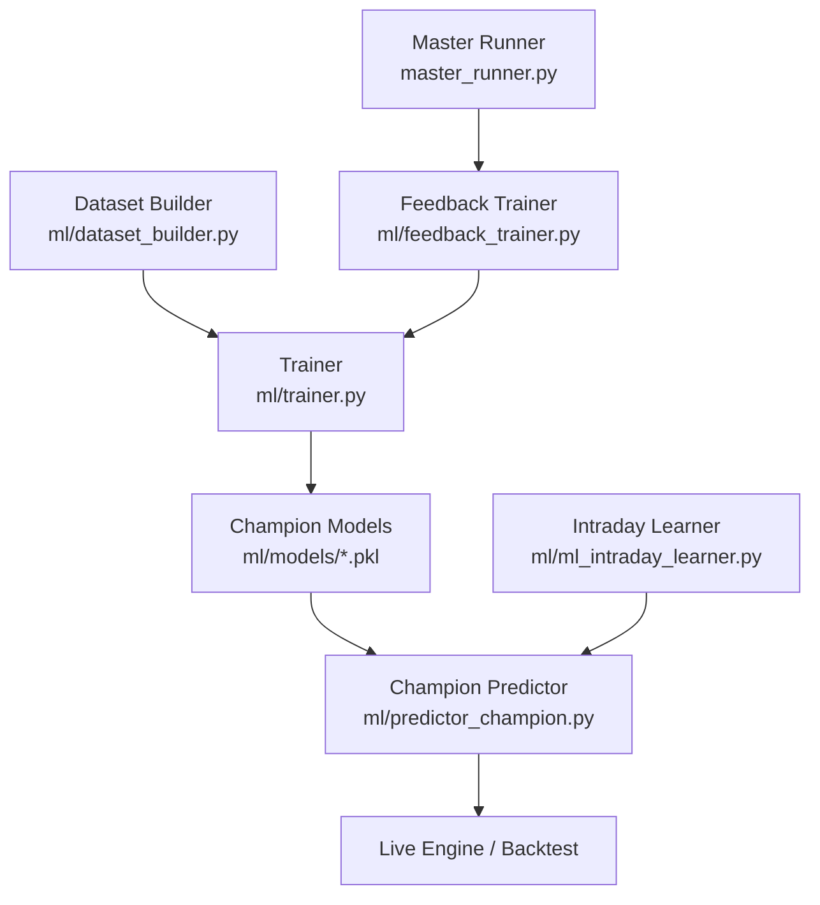
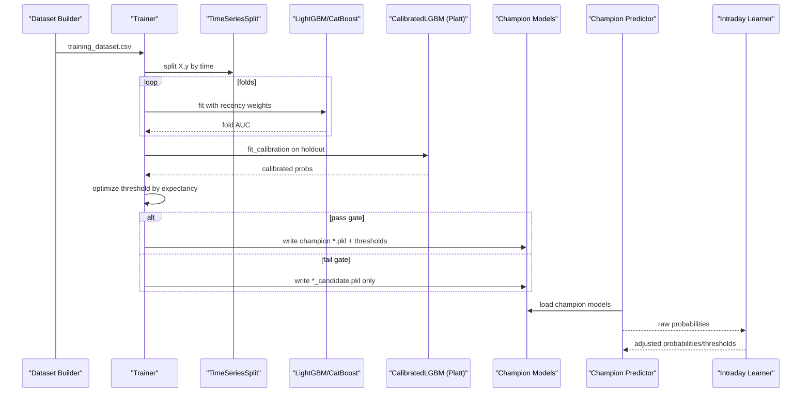
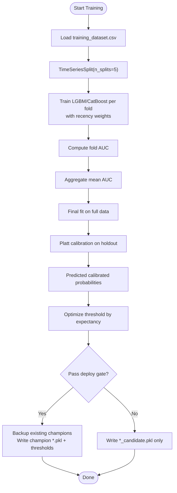
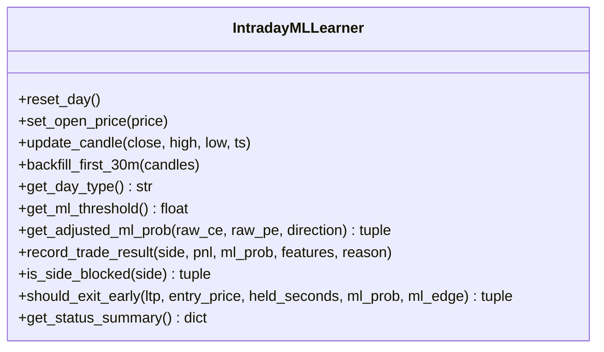
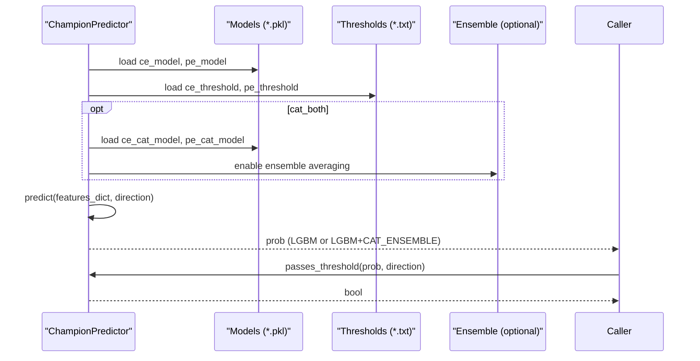
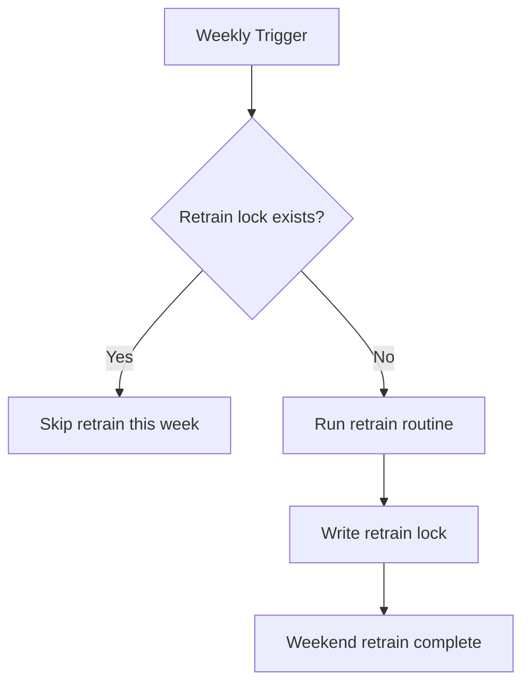
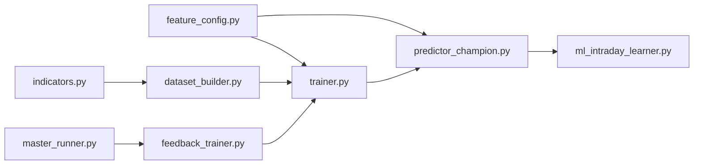

# Model Training & Deployment

<cite>
**Referenced Files in This Document**
- [trainer.py](file://ml/trainer.py)
- [ml_intraday_learner.py](file://ml/ml_intraday_learner.py)
- [predictor_champion.py](file://ml/predictor_champion.py)
- [dataset_builder.py](file://ml/dataset_builder.py)
- [feature_config.py](file://ml/feature_config.py)
- [indicators.py](file://ml/indicators.py)
- [feedback_trainer.py](file://ml/feedback_trainer.py)
- [master_runner.py](file://master_runner.py)
</cite>

## Table of Contents
1. [Introduction](#introduction)
2. [Project Structure](#project-structure)
3. [Core Components](#core-components)
4. [Architecture Overview](#architecture-overview)
5. [Detailed Component Analysis](#detailed-component-analysis)
6. [Dependency Analysis](#dependency-analysis)
7. [Performance Considerations](#performance-considerations)
8. [Troubleshooting Guide](#troubleshooting-guide)
9. [Conclusion](#conclusion)
10. [Appendices](#appendices)

## Introduction
This document explains the end-to-end model training and deployment pipeline for directional options trading (CE/PE). It covers dataset preparation, LightGBM and CatBoost training with cross-validation and calibration, intraday learning and probability adjustments, champion selection and deployment gates, model versioning via pkl files, and retraining schedules. Practical workflows, evaluation metrics, and deployment procedures are included to help both technical and non-technical users understand how models are built, validated, and served in production.

## Project Structure
The ML subsystem is organized around a clear separation of concerns:
- Dataset creation and feature engineering
- Model training and calibration
- Intraday adaptation and decision support
- Champion predictor loading and inference
- Retraining orchestration and scheduling

**Diagram sources**
- [dataset_builder.py:236-270](file://ml/dataset_builder.py#L236-L270)
- [trainer.py:212-286](file://ml/trainer.py#L212-L286)
- [predictor_champion.py:57-100](file://ml/predictor_champion.py#L57-L100)
- [ml_intraday_learner.py:46-100](file://ml/ml_intraday_learner.py#L46-L100)
- [feedback_trainer.py:55-100](file://ml/feedback_trainer.py#L55-L100)
- [master_runner.py:376-402](file://master_runner.py#L376-L402)

**Section sources**
- [dataset_builder.py:236-270](file://ml/dataset_builder.py#L236-L270)
- [trainer.py:212-286](file://ml/trainer.py#L212-L286)
- [predictor_champion.py:57-100](file://ml/predictor_champion.py#L57-L100)
- [ml_intraday_learner.py:46-100](file://ml/ml_intraday_learner.py#L46-L100)
- [feedback_trainer.py:55-100](file://ml/feedback_trainer.py#L55-L100)
- [master_runner.py:376-402](file://master_runner.py#L376-L402)

## Core Components
- Dataset builder: constructs features and first-touch directional labels for CE/PE on active session windows.
- Trainer: trains LightGBM and optional CatBoost models with time-series cross-validation, Platt calibration, threshold optimization, and deploy gate.
- Intraday learner: adapts probabilities and thresholds during the day based on outcomes and day-type detection.
- Champion predictor: loads deployed models, performs inference, supports LGBM-only or LGBM+CatBoost ensemble mode, and applies thresholds.
- Feedback trainer: merges live feedback into historical data and retrains models when triggered.
- Master runner: implements weekly retrain lock and triggers weekend retraining.

**Section sources**
- [dataset_builder.py:84-176](file://ml/dataset_builder.py#L84-L176)
- [dataset_builder.py:185-233](file://ml/dataset_builder.py#L185-L233)
- [trainer.py:82-176](file://ml/trainer.py#L82-L176)
- [ml_intraday_learner.py:46-100](file://ml/ml_intraday_learner.py#L46-L100)
- [predictor_champion.py:57-100](file://ml/predictor_champion.py#L57-L100)
- [feedback_trainer.py:55-100](file://ml/feedback_trainer.py#L55-L100)
- [master_runner.py:376-402](file://master_runner.py#L376-L402)

## Architecture Overview
The pipeline ensures robust, reproducible training with strict deployment gates and safe fallbacks.

**Diagram sources**
- [dataset_builder.py:236-270](file://ml/dataset_builder.py#L236-L270)
- [trainer.py:82-176](file://ml/trainer.py#L82-L176)
- [trainer.py:196-210](file://ml/trainer.py#L196-L210)
- [predictor_champion.py:57-100](file://ml/predictor_champion.py#L57-L100)
- [ml_intraday_learner.py:208-245](file://ml/ml_intraday_learner.py#L208-L245)

## Detailed Component Analysis

### Dataset Preparation (dataset_builder.py)
- Feature computation includes Supertrend, VWAP, ADX, EMAs, RSI, ATR, returns, volatility, volume ratio, time/session features, moneyness, candle structure, momentum/compression, wicks, and close position.
- Labels use a first-touch barrier approach within a lookahead window to determine whether price hits an upside target before downside (CE label) or vice versa (PE label). Bars where neither barrier is hit receive no direction label, teaching the model to output low confidence in choppy conditions.
- Active session windows restrict labeling to high-quality trading periods.

Key implementation highlights:
- Indicator calculations are vectorized and consistent between training and live pipelines.
- Label generation enforces realistic look-ahead constraints to avoid leakage.

**Section sources**
- [dataset_builder.py:84-176](file://ml/dataset_builder.py#L84-L176)
- [dataset_builder.py:185-233](file://ml/dataset_builder.py#L185-L233)
- [indicators.py:24-90](file://ml/indicators.py#L24-L90)
- [indicators.py:97-129](file://ml/indicators.py#L97-L129)
- [indicators.py:136-169](file://ml/indicators.py#L136-L169)

### Model Training Workflows (trainer.py)
- Cross-validation: TimeSeriesSplit with 5 folds ensures temporal integrity and prevents leakage.
- Recency weighting: recent dates receive higher weight to emphasize regime relevance without biasing labels.
- LightGBM training: default parameters tuned for stability; no class over-weighting to preserve calibrated probabilities.
- CatBoost training: optional; same workflow as LightGBM if installed.
- Calibration: Platt scaling via CalibratedLGBM using a holdout from the last time-series fold.
- Threshold optimization: search across thresholds to maximize expectancy given average win/loss assumptions and minimum trade count constraints.
- Deploy gate: new models overwrite champions only if AUC >= MIN_AUC, calibrated-prob std >= MIN_STD, and holdout expectancy > 0. Otherwise, candidates are saved separately.

**Diagram sources**
- [trainer.py:82-176](file://ml/trainer.py#L82-L176)
- [trainer.py:196-210](file://ml/trainer.py#L196-L210)
- [trainer.py:212-286](file://ml/trainer.py#L212-L286)

**Section sources**
- [trainer.py:44-65](file://ml/trainer.py#L44-L65)
- [trainer.py:82-176](file://ml/trainer.py#L82-L176)
- [trainer.py:196-210](file://ml/trainer.py#L196-L210)
- [trainer.py:212-286](file://ml/trainer.py#L212-L286)

### Intraday Learning and Probability Adjustments (ml_intraday_learner.py)
- Day-type detection: analyzes first 30 minutes to classify TREND, RANGE, VOLATILE, GAP, or UNKNOWN days. Detection locks after the initial window.
- Bayesian updates: after each trade outcome, multipliers for CE/PE probabilities are adjusted up or down based on wins/losses and consecutive streaks.
- Adaptive threshold: base threshold shifts with day type and performance to maintain appropriate selectivity under varying market regimes.
- Early exit logic: uses day type, adverse move thresholds, and ML edge collapse signals to decide early exits with conservative guards against noise.
- AI brain review: optional LLM-based advisory that can reduce side multipliers to be more selective after consecutive losses.

**Diagram sources**
- [ml_intraday_learner.py:46-100](file://ml/ml_intraday_learner.py#L46-L100)
- [ml_intraday_learner.py:109-148](file://ml/ml_intraday_learner.py#L109-L148)
- [ml_intraday_learner.py:150-206](file://ml/ml_intraday_learner.py#L150-L206)
- [ml_intraday_learner.py:208-245](file://ml/ml_intraday_learner.py#L208-L245)
- [ml_intraday_learner.py:247-346](file://ml/ml_intraday_learner.py#L247-L346)
- [ml_intraday_learner.py:348-391](file://ml/ml_intraday_learner.py#L348-L391)

**Section sources**
- [ml_intraday_learner.py:46-100](file://ml/ml_intraday_learner.py#L46-L100)
- [ml_intraday_learner.py:109-148](file://ml/ml_intraday_learner.py#L109-L148)
- [ml_intraday_learner.py:150-206](file://ml/ml_intraday_learner.py#L150-L206)
- [ml_intraday_learner.py:208-245](file://ml/ml_intraday_learner.py#L208-L245)
- [ml_intraday_learner.py:247-346](file://ml/ml_intraday_learner.py#L247-L346)
- [ml_intraday_learner.py:348-391](file://ml/ml_intraday_learner.py#L348-L391)

### Champion Model Selection and Deployment (predictor_champion.py)
- Loads LightGBM champions for CE/PE; optionally loads CatBoost champions to enable ensemble averaging.
- Reads thresholds persisted alongside models; falls back to defaults if missing.
- Validates input features and handles invalid values gracefully.
- Returns calibrated probabilities; ensemble mode averages LGBM and CatBoost outputs.
- Provides threshold check utility for signal gating.

**Diagram sources**
- [predictor_champion.py:57-100](file://ml/predictor_champion.py#L57-L100)
- [predictor_champion.py:105-147](file://ml/predictor_champion.py#L105-L147)
- [predictor_champion.py:151-208](file://ml/predictor_champion.py#L151-L208)
- [predictor_champion.py:210-218](file://ml/predictor_champion.py#L210-L218)

**Section sources**
- [predictor_champion.py:57-100](file://ml/predictor_champion.py#L57-L100)
- [predictor_champion.py:105-147](file://ml/predictor_champion.py#L105-L147)
- [predictor_champion.py:151-208](file://ml/predictor_champion.py#L151-L208)
- [predictor_champion.py:210-218](file://ml/predictor_champion.py#L210-L218)

### Feature Engineering and Consistency (feature_config.py, indicators.py)
- Canonical feature order ensures identical inputs across training, backtesting, and live inference.
- Live feature builder computes rolling indicators consistently with training-time computations, including corrected momentum velocity to match training scales.
- Indicators include Supertrend, ADX, and VWAP with session resets, ensuring alignment with dataset builder.

**Section sources**
- [feature_config.py:25-64](file://ml/feature_config.py#L25-L64)
- [feature_config.py:82-252](file://ml/feature_config.py#L82-L252)
- [indicators.py:24-90](file://ml/indicators.py#L24-L90)
- [indicators.py:97-129](file://ml/indicators.py#L97-L129)
- [indicators.py:136-169](file://ml/indicators.py#L136-L169)

### Retraining Schedule and Performance Monitoring
- Weekly retrain lock: master runner writes a lock file per ISO week to prevent duplicate weekend retraining runs.
- Weekend retraining: master runner triggers retraining routines (e.g., feedback-based retraining) asynchronously with error handling and logging.
- Feedback integration: feedback trainer merges live trade outcomes into historical data and retrains models when invoked.

**Diagram sources**
- [master_runner.py:376-402](file://master_runner.py#L376-L402)
- [master_runner.py:2187-2195](file://master_runner.py#L2187-L2195)
- [feedback_trainer.py:55-100](file://ml/feedback_trainer.py#L55-L100)

**Section sources**
- [master_runner.py:376-402](file://master_runner.py#L376-L402)
- [master_runner.py:2187-2195](file://master_runner.py#L2187-L2195)
- [feedback_trainer.py:55-100](file://ml/feedback_trainer.py#L55-L100)

## Dependency Analysis
- trainer.py depends on dataset_builder output and feature_config for canonical features; it also imports CalibratedLGBM from predictor_champion for Platt calibration.
- predictor_champion.py depends on feature_config for feature ordering and joblib for model persistence.
- ml_intraday_learner.py is independent but integrates with predictor_champion’s probabilities and thresholds at runtime.
- feedback_trainer.py depends on feature_config and persists/reloads models via joblib.
- master_runner.py orchestrates retraining and uses lock files to coordinate schedule.

**Diagram sources**
- [trainer.py:38-39](file://ml/trainer.py#L38-L39)
- [predictor_champion.py:13](file://ml/predictor_champion.py#L13)
- [dataset_builder.py:37-40](file://ml/dataset_builder.py#L37-L40)
- [feedback_trainer.py:19-24](file://ml/feedback_trainer.py#L19-L24)
- [master_runner.py:376-402](file://master_runner.py#L376-L402)

**Section sources**
- [trainer.py:38-39](file://ml/trainer.py#L38-L39)
- [predictor_champion.py:13](file://ml/predictor_champion.py#L13)
- [dataset_builder.py:37-40](file://ml/dataset_builder.py#L37-L40)
- [feedback_trainer.py:19-24](file://ml/feedback_trainer.py#L19-L24)
- [master_runner.py:376-402](file://master_runner.py#L376-L402)

## Performance Considerations
- Time-series cross-validation avoids leakage and provides realistic AUC estimates.
- Recency weighting emphasizes recent regimes without distorting label distributions.
- Platt calibration stabilizes probabilities and improves decision thresholds.
- Ensemble mode (LGBM+CatBoost) can improve robustness when both models are available.
- Intraday adaptive thresholds and multipliers adjust to daily performance and regime, reducing false signals in volatile or ranging markets.

[No sources needed since this section provides general guidance]

## Troubleshooting Guide
Common issues and mitigations:
- Missing model files: predictor_champion raises FileNotFoundError if champion pkl files are absent; ensure trainer completes successfully and deploys models.
- Invalid features: predictor logs warnings and returns None for rows with missing or invalid features; verify feature computation consistency between training and live.
- Low probability outputs: if calibration squashes outputs, the predictor keeps raw probabilities and relies on thresholds and edge logic; check calibration holdout and threshold optimization.
- Retraining conflicts: weekly retrain lock prevents duplicate runs; verify lock file status if retraining does not trigger.

**Section sources**
- [predictor_champion.py:65-70](file://ml/predictor_champion.py#L65-L70)
- [predictor_champion.py:156-177](file://ml/predictor_champion.py#L156-L177)
- [predictor_champion.py:196-204](file://ml/predictor_champion.py#L196-L204)
- [master_runner.py:376-402](file://master_runner.py#L376-L402)

## Conclusion
The pipeline combines rigorous dataset construction, time-aware training, Platt calibration, and a deploy gate to ensure only robust models reach production. Intraday learning dynamically adjusts probabilities and thresholds based on real-time outcomes and market regime. The system supports both LightGBM and CatBoost, with optional ensemble usage, and includes safeguards like backups, candidate-only saves, and weekly retrain locks. Together, these components provide a resilient, auditable, and adaptable ML engine for intraday options trading.

[No sources needed since this section summarizes without analyzing specific files]

## Appendices

### Practical Training Workflow
- Generate dataset: run dataset builder to produce training_dataset.csv with features and first-touch labels.
- Train models: run trainer to train LightGBM and optional CatBoost models, apply calibration, optimize thresholds, and enforce deploy gate.
- Validate: inspect AUC, calibrated probability spread, threshold, and expectancy; confirm candidates vs champions.
- Deploy: successful gate writes champion pkl files and thresholds; predictor loads them for inference.

**Section sources**
- [dataset_builder.py:236-270](file://ml/dataset_builder.py#L236-L270)
- [trainer.py:212-286](file://ml/trainer.py#L212-L286)
- [predictor_champion.py:57-100](file://ml/predictor_champion.py#L57-L100)

### Model Evaluation Metrics
- AUC from time-series cross-validation indicates discriminative power.
- Calibrated probability standard deviation reflects signal spread; too low suggests saturation.
- Threshold optimized by expectancy balances win rate and risk-adjusted returns with minimum trade counts.

**Section sources**
- [trainer.py:82-176](file://ml/trainer.py#L82-L176)
- [trainer.py:60-79](file://ml/trainer.py#L60-L79)

### Deployment Procedures
- Backup existing champions before overwrite.
- Persist model pkl and threshold txt files.
- Predictor loads models and thresholds; ensemble mode enabled if both LGBM and CatBoost champions exist.

**Section sources**
- [trainer.py:179-203](file://ml/trainer.py#L179-L203)
- [predictor_champion.py:57-100](file://ml/predictor_champion.py#L57-L100)

### Calibration Process (Platt Scaling)
- Raw probabilities are clipped and transformed to logit space.
- Logistic regression calibrator fits on holdout probabilities to map to well-calibrated outputs.
- Wrapper exposes predict_proba and predict methods compatible with sklearn-style interfaces.

**Section sources**
- [predictor_champion.py:18-53](file://ml/predictor_champion.py#L18-L53)

### Retraining Schedules and Drift Detection
- Weekly retrain lock prevents duplicate runs; master runner triggers retraining asynchronously.
- Feedback trainer merges live outcomes into historical data and retrains models when invoked.
- Drift detection: while explicit drift metrics are not implemented here, the deploy gate (AUC, probability spread, expectancy) and intraday adaptive thresholds serve as practical safeguards against performance decay.

**Section sources**
- [master_runner.py:376-402](file://master_runner.py#L376-L402)
- [master_runner.py:2187-2195](file://master_runner.py#L2187-L2195)
- [feedback_trainer.py:55-100](file://ml/feedback_trainer.py#L55-L100)
- [trainer.py:44-65](file://ml/trainer.py#L44-L65)