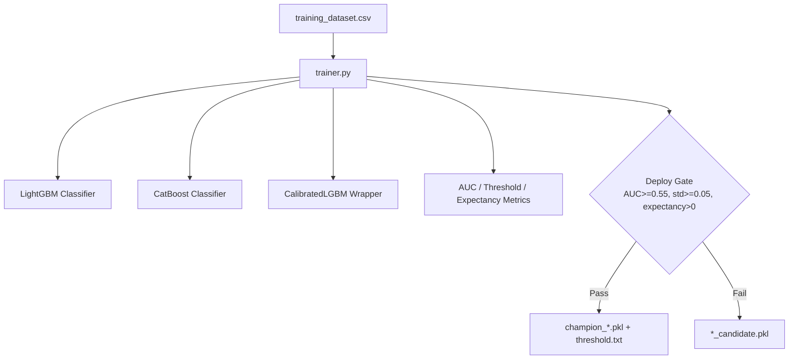
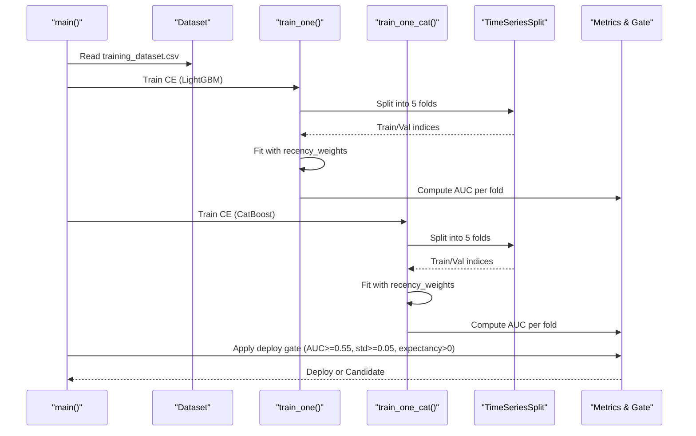
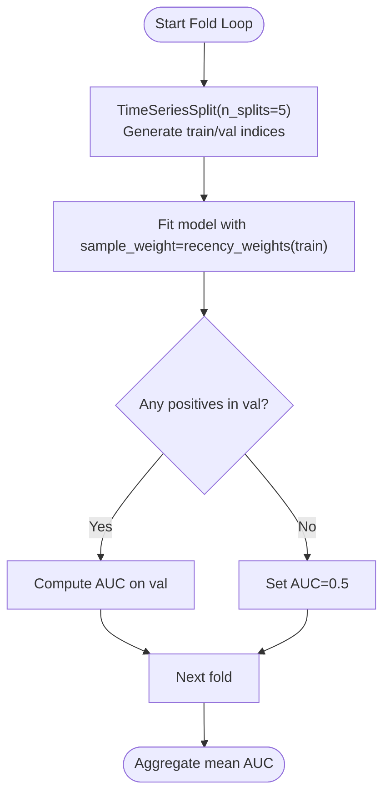
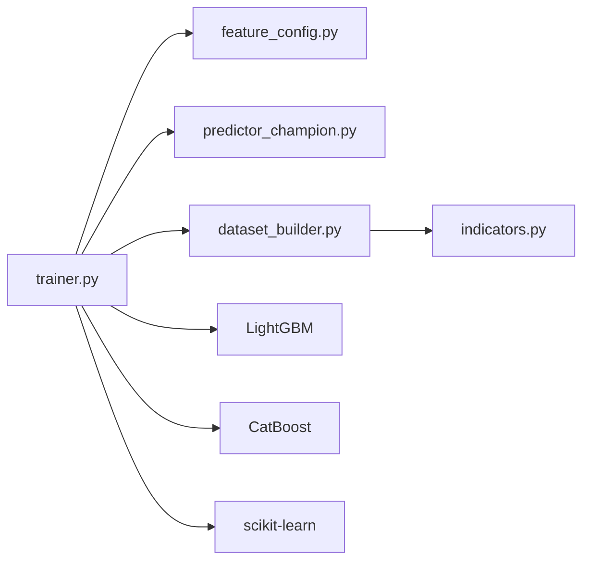

# Model Training Process

<cite>
**Referenced Files in This Document**
- [trainer.py](file://ml/trainer.py)
- [dataset_builder.py](file://ml/dataset_builder.py)
- [feature_config.py](file://ml/feature_config.py)
- [predictor_champion.py](file://ml/predictor_champion.py)
- [indicators.py](file://ml/indicators.py)
</cite>

## Table of Contents
1. [Introduction](#introduction)
2. [Project Structure](#project-structure)
3. [Core Components](#core-components)
4. [Architecture Overview](#architecture-overview)
5. [Detailed Component Analysis](#detailed-component-analysis)
6. [Dependency Analysis](#dependency-analysis)
7. [Performance Considerations](#performance-considerations)
8. [Troubleshooting Guide](#troubleshooting-guide)
9. [Conclusion](#conclusion)
10. [Appendices](#appendices)

## Introduction
This document explains the model training process implemented in trainer.py for a directional trading system. It covers:
- Dataset preparation from training_dataset.csv produced by dataset_builder.py
- Feature engineering using FEATURE_COLUMNS defined in feature_config.py
- Dual-model approach supporting LightGBM and CatBoost classifiers
- Time-series cross-validation with TimeSeriesSplit(n_splits=5)
- Recency weighting that prioritizes recent data without label bias
- Hyperparameter configurations for both models
- The training functions train_one() and train_one_cat(), including sample weights, AUC calculation, and metrics collection
- Deploy gate thresholds (MIN_AUC=0.55, MIN_STD=0.05) to prevent underperforming models from deployment
- Practical examples for running the pipeline, interpreting outputs, and troubleshooting common issues

## Project Structure
The training workflow spans several modules:
- dataset_builder.py prepares the training dataset with features and labels, outputting ml/models/training_dataset.csv
- feature_config.py defines the canonical 36-feature set used consistently across training and live inference
- indicators.py provides vectorized technical indicators used during feature computation
- predictor_champion.py implements a calibration wrapper and champion model loading for inference
- trainer.py orchestrates training, evaluation, calibration, and deployment gating

**Diagram sources**
- [trainer.py:41-48](file://ml/trainer.py#L41-L48)
- [trainer.py:82-129](file://ml/trainer.py#L82-L129)
- [trainer.py:132-176](file://ml/trainer.py#L132-L176)
- [trainer.py:196-209](file://ml/trainer.py#L196-L209)
- [trainer.py:212-286](file://ml/trainer.py#L212-L286)

**Section sources**
- [dataset_builder.py:236-270](file://ml/dataset_builder.py#L236-L270)
- [feature_config.py:25-64](file://ml/feature_config.py#L25-L64)
- [trainer.py:41-48](file://ml/trainer.py#L41-L48)

## Core Components
- Data source: training_dataset.csv contains OHLCV-derived features and binary labels for call (CE) and put (PE) directions
- Feature set: FEATURE_COLUMNS is the canonical list of 36 features ensuring consistency between training and live prediction
- Models:
  - LightGBM classifier trained via train_one()
  - CatBoost classifier trained via train_one_cat()
- Calibration: CalibratedLGBM applies Platt scaling on a holdout fold to produce well-calibrated probabilities
- Evaluation: TimeSeriesSplit(5) ensures temporal integrity; AUC computed per fold; mean AUC reported
- Deployment gate: Only models passing AUC >= 0.55, calibrated probability std >= 0.05, and positive expectancy are deployed as champions; otherwise saved as candidates

**Section sources**
- [trainer.py:41-48](file://ml/trainer.py#L41-L48)
- [trainer.py:82-129](file://ml/trainer.py#L82-L129)
- [trainer.py:132-176](file://ml/trainer.py#L132-L176)
- [predictor_champion.py:18-53](file://ml/predictor_champion.py#L18-L53)
- [feature_config.py:25-64](file://ml/feature_config.py#L25-L64)

## Architecture Overview
The training pipeline follows a structured sequence:
1. Load and prepare training_dataset.csv
2. Ensure all FEATURE_COLUMNS exist; fill missing with zeros if needed
3. For each direction (CE and PE):
   - Train LightGBM and CatBoost using TimeSeriesSplit(5)
   - Apply recency_weights to emphasize recent market regimes
   - Compute per-fold AUC and aggregate mean AUC
   - Fit final model on full data, then calibrate on last time-series holdout
   - Derive optimal threshold based on expected profit given average win/loss assumptions
4. Evaluate deploy gate criteria and either deploy or save as candidate

**Diagram sources**
- [trainer.py:212-286](file://ml/trainer.py#L212-L286)
- [trainer.py:82-129](file://ml/trainer.py#L82-L129)
- [trainer.py:132-176](file://ml/trainer.py#L132-L176)

## Detailed Component Analysis

### Dataset Preparation (dataset_builder.py)
- Produces ml/models/training_dataset.csv with engineered features and first-touch barrier labels
- Active session windows restrict labeling to specific intraday periods
- Labels are directional: CE=1 when price hits upper target before lower within lookahead; PE=1 vice versa
- Features include trend, momentum, volatility, time-of-day, options context, and candle structure

Key aspects:
- First-touch labels avoid direction bias by labeling every active bar
- Feature computation aligns with live engine to ensure consistency
- Output includes date column enabling recency weighting during training

**Section sources**
- [dataset_builder.py:84-176](file://ml/dataset_builder.py#L84-L176)
- [dataset_builder.py:185-233](file://ml/dataset_builder.py#L185-L233)
- [dataset_builder.py:236-270](file://ml/dataset_builder.py#L236-L270)

### Feature Engineering (feature_config.py)
- Canonical 36-feature set ensures identical inputs for training and live inference
- Includes direction stack (supertrend_dir, supertrend_dist, price_vs_vwap, adx, di_spread, ema_alignment, volume_ratio)
- Core indicators: EMAs, MACD, returns, volatility, RSI, ATR, trend_strength
- Time features: hour, weekday, session timing
- Options-specific: time_to_expiry_min, moneyness
- Reversal/momentum: momentum_velocity, range_compression, wick_ratio, body_efficiency, mom3_strength, upper_wick, lower_wick, close_position

Consistency note:
- Live feature builder mirrors training computations to avoid distribution shift

**Section sources**
- [feature_config.py:25-64](file://ml/feature_config.py#L25-L64)
- [feature_config.py:82-252](file://ml/feature_config.py#L82-L252)

### Training Functions: train_one() (LightGBM)
Workflow:
- Extract X from FEATURE_COLUMNS and y from label_ce or label_pe
- Prepare timestamps for recency weighting
- Define hyperparameters: n_estimators=500, learning_rate=0.02, max_depth=6, num_leaves=31, subsample=0.8, colsample_bytree=0.8, min_child_samples=50, reg_alpha=0.05, reg_lambda=0.1
- Use TimeSeriesSplit(5) to iterate folds:
  - Fit LGBMClassifier with sample_weight=recency_weights(train_indices)
  - Compute AUC on validation fold if positives present
- Final model fit on full data with recency_weights
- Calibrate on last time-series holdout using CalibratedLGBM
- Compute calibrated probability statistics and optimal threshold via find_threshold
- Return metrics: model, mean AUC, std, threshold, expectancy, win rate, trades

Sample weight application:
- recency_weights assigns higher weight to dates after RECENCY_CUTOFF (default 2024-01-01) by factor RECENCY_MULT (default 3.0)
- Weighting is applied only by date, never by label, preventing label bias

AUC calculation:
- roc_auc_score(y_val, proba[:,1]) per fold; if no positives, AUC defaults to 0.5

Metrics collection:
- Mean AUC across folds
- Calibrated probability std to assess spread
- Threshold selection maximizing expectancy under assumed avg_win/avg_loss and minimum trade count

**Section sources**
- [trainer.py:82-129](file://ml/trainer.py#L82-L129)
- [trainer.py:51-57](file://ml/trainer.py#L51-L57)
- [trainer.py:60-79](file://ml/trainer.py#L60-L79)

### Training Functions: train_one_cat() (CatBoost)
Workflow:
- Similar to train_one() but uses CatBoostClassifier
- Hyperparameters: iterations=500, learning_rate=0.03, depth=6, l2_leaf_reg=3.0, random_seed=42, thread_count=-1
- TimeSeriesSplit(5) with sample_weight=recency_weights
- AUC per fold computed similarly
- Final model fit on full data with recency_weights
- Calibrate on last holdout using CalibratedLGBM wrapper
- Compute stats and threshold; return same metric dictionary

Optional dependency:
- If CatBoost not installed, training skips gracefully

**Section sources**
- [trainer.py:31-36](file://ml/trainer.py#L31-L36)
- [trainer.py:132-176](file://ml/trainer.py#L132-L176)

### Calibration Wrapper (predictor_champion.py)
- CalibratedLGBM wraps any sklearn-compatible base model
- Applies Platt scaling on holdout probabilities clipped to avoid log(0)
- Stores feature_names_ for downstream usage
- predict_proba returns calibrated probabilities suitable for thresholding

Usage in training:
- Applied to final models post-fit to improve probability reliability
- Used to compute std and select threshold based on expected profitability

**Section sources**
- [predictor_champion.py:18-53](file://ml/predictor_champion.py#L18-L53)

### Deploy Gate and Champion Management
Gate criteria:
- MIN_AUC = 0.55: ensures meaningful predictive power
- MIN_STD = 0.05: ensures calibrated probabilities have sufficient spread (not saturated)
- expectancy > 0: ensures positive expected value under assumed win/loss profile

Backup and deployment:
- backup_existing() copies current champions to timestamped directory before overwrite
- deploy() saves model, threshold, and feature list
- candidate() saves failing models as *_candidate.pkl for inspection

**Section sources**
- [trainer.py:44-48](file://ml/trainer.py#L44-L48)
- [trainer.py:179-209](file://ml/trainer.py#L179-L209)
- [trainer.py:234-250](file://ml/trainer.py#L234-L250)
- [trainer.py:267-280](file://ml/trainer.py#L267-L280)

### Time-Series Cross-Validation Flow

**Diagram sources**
- [trainer.py:97-108](file://ml/trainer.py#L97-L108)
- [trainer.py:146-157](file://ml/trainer.py#L146-L157)

## Dependency Analysis
- trainer.py depends on:
  - dataset_builder.py for input data
  - feature_config.py for consistent feature ordering
  - predictor_champion.py for calibration wrapper
  - indicators.py indirectly via dataset_builder.py for feature computation
- External libraries:
  - LightGBM for primary classifier
  - CatBoost for optional ensemble model
  - scikit-learn for TimeSeriesSplit and AUC
  - joblib for model persistence

**Diagram sources**
- [trainer.py:18-39](file://ml/trainer.py#L18-L39)
- [dataset_builder.py:30-38](file://ml/dataset_builder.py#L30-L38)
- [feature_config.py:17-17](file://ml/feature_config.py#L17-L17)
- [predictor_champion.py:1-13](file://ml/predictor_champion.py#L1-L13)

**Section sources**
- [trainer.py:18-39](file://ml/trainer.py#L18-L39)
- [dataset_builder.py:30-38](file://ml/dataset_builder.py#L30-L38)

## Performance Considerations
- TimeSeriesSplit preserves temporal order, preventing look-ahead bias
- Recency weighting emphasizes recent regimes without introducing label bias
- Calibration improves probability reliability, aiding threshold selection
- Feature clipping and bounds reduce outlier impact and stabilize training
- Parallelization via n_jobs=-1 (LightGBM) and thread_count=-1 (CatBoost) accelerates training

[No sources needed since this section provides general guidance]

## Troubleshooting Guide
Common issues and resolutions:
- Missing features in training dataset:
  - trainer.py fills missing FEATURE_COLUMNS with zeros; verify dataset_builder.py computes all features correctly
- Low AUC or saturated probabilities:
  - Check MIN_STD threshold; low std indicates poor probability spread; consider adjusting targets or data range
- No positive labels in validation folds:
  - AUC defaults to 0.5; ensure sufficient positive samples in splits
- CatBoost not available:
  - Pipeline continues with LightGBM only; install catboost if ensemble desired
- Threshold selection yields few trades:
  - find_threshold enforces minimum trade count; adjust expectations or data window

Operational tips:
- Inspect *_candidate.pkl files when gate fails to diagnose issues
- Review backup directories to compare old vs new champions
- Validate feature alignment between training and live pipelines

**Section sources**
- [trainer.py:216-223](file://ml/trainer.py#L216-L223)
- [trainer.py:234-250](file://ml/trainer.py#L234-L250)
- [trainer.py:252-280](file://ml/trainer.py#L252-L280)

## Conclusion
The training pipeline in trainer.py implements a robust, time-aware, and calibrated approach to directional classification for trading. It combines rigorous cross-validation, recency weighting, and dual-model support (LightGBM and CatBoost) with strict deployment gates to ensure only high-quality models enter production. Proper dataset preparation and consistent feature engineering are critical to success.

[No sources needed since this section summarizes without analyzing specific files]

## Appendices

### Running the Training Pipeline
Steps:
1. Generate dataset:
   - Run dataset_builder.py to create ml/models/training_dataset.csv
2. Train models:
   - Run trainer.py to train LightGBM and optionally CatBoost models
3. Interpret outputs:
   - Review per-fold AUC, mean AUC, calibrated probability stats, threshold, win rate, and expectancy
4. Deployment:
   - Models passing gates are saved as champions; others saved as candidates for analysis

Example commands:
- python ml/dataset_builder.py
- python ml/trainer.py

Expected outputs:
- champion_ce_lgbm.pkl, champion_pe_lgbm.pkl (if LightGBM passes)
- champion_ce_cat.pkl, champion_pe_cat.pkl (if CatBoost passes)
- Corresponding *_threshold.txt and *_features.txt files
- Backup directories with previous champions

**Section sources**
- [dataset_builder.py:236-270](file://ml/dataset_builder.py#L236-L270)
- [trainer.py:212-286](file://ml/trainer.py#L212-L286)

### Interpreting Output Metrics
- Per-fold AUC: Indicates stability across time segments
- Mean AUC: Overall discriminative ability; must exceed MIN_AUC
- Calibrated probability std: Measures spread; must exceed MIN_STD
- Threshold: Optimal decision boundary based on expected profit
- Win rate (WR): Proportion of winning trades at threshold
- Expectancy: Expected profit per trade under assumed win/loss sizes

**Section sources**
- [trainer.py:82-129](file://ml/trainer.py#L82-L129)
- [trainer.py:132-176](file://ml/trainer.py#L132-L176)
- [trainer.py:60-79](file://ml/trainer.py#L60-L79)

### Hyperparameter Configurations
LightGBM (train_one):
- n_estimators=500, learning_rate=0.02, max_depth=6, num_leaves=31
- subsample=0.8, colsample_bytree=0.8, min_child_samples=50
- reg_alpha=0.05, reg_lambda=0.1, verbose=-1, random_state=42, n_jobs=-1

CatBoost (train_one_cat):
- iterations=500, learning_rate=0.03, depth=6
- l2_leaf_reg=3.0, random_seed=42, verbose=0, thread_count=-1

**Section sources**
- [trainer.py:89-95](file://ml/trainer.py#L89-L95)
- [trainer.py:141-144](file://ml/trainer.py#L141-L144)