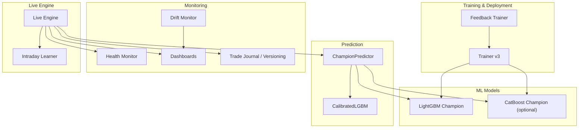
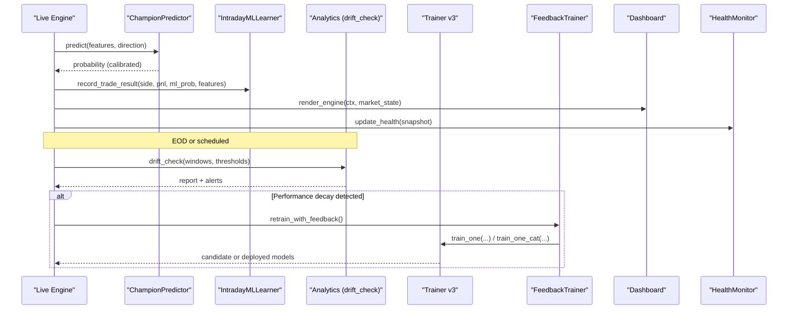
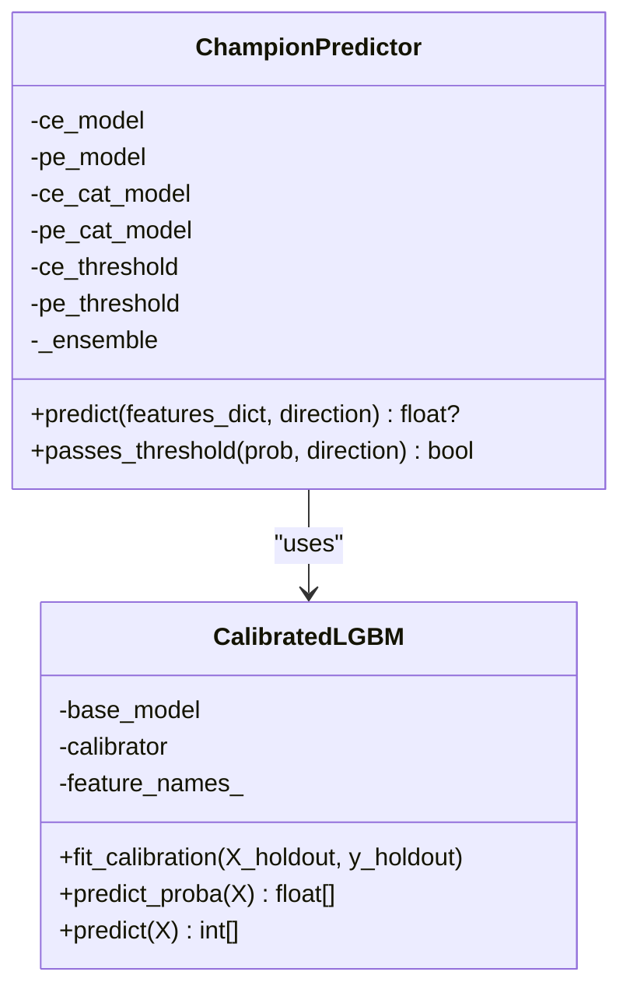
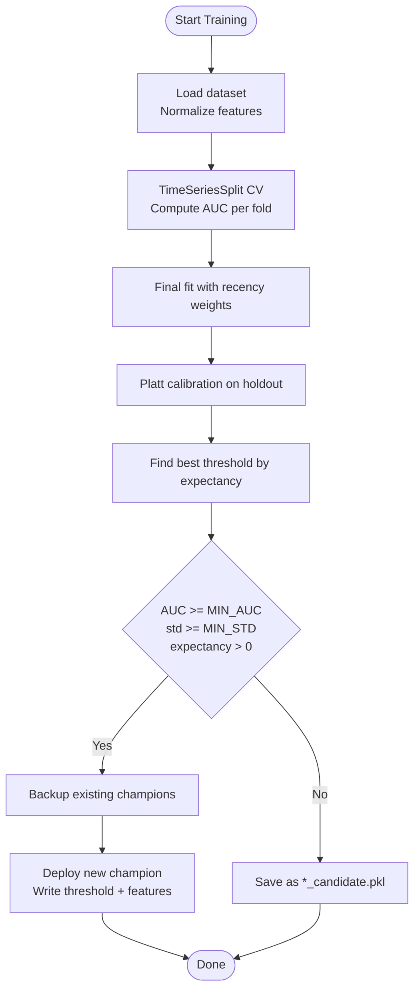
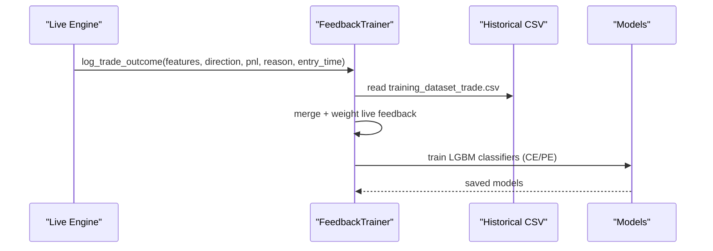
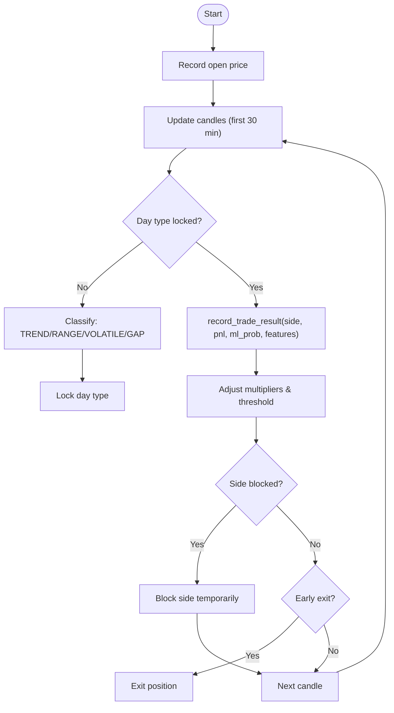
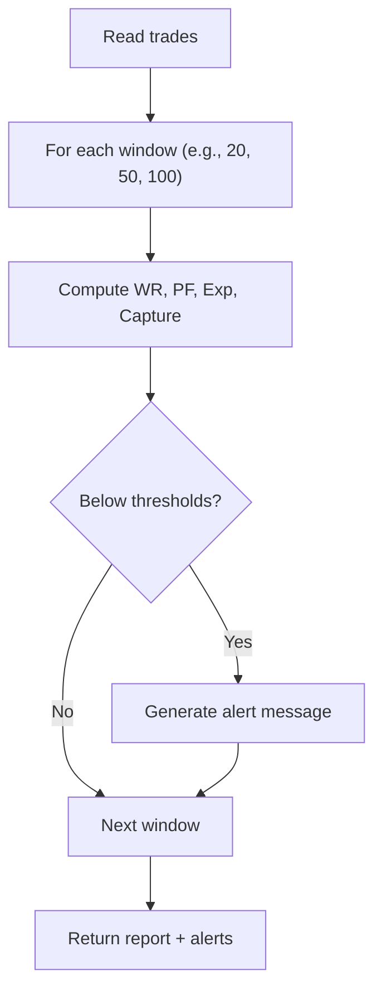
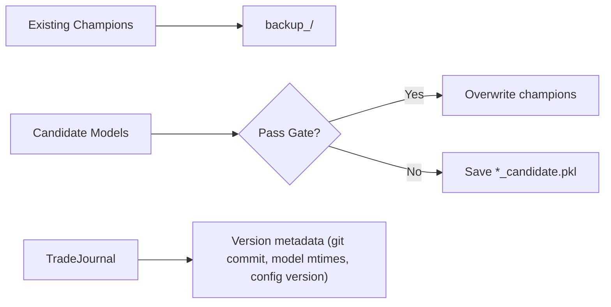
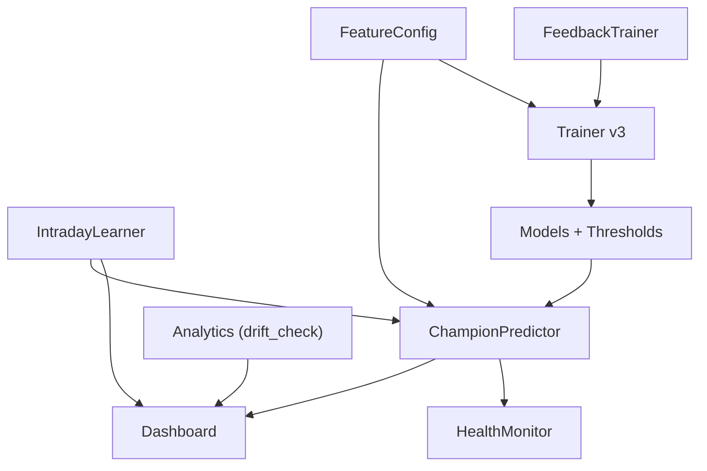

# Performance Monitoring

<cite>
**Referenced Files in This Document**
- [predictor_champion.py](file://ml/predictor_champion.py)
- [feedback_trainer.py](file://ml/feedback_trainer.py)
- [trainer.py](file://ml/trainer.py)
- [ml_intraday_learner.py](file://ml/ml_intraday_learner.py)
- [performance.py](file://engine/analytics/performance.py)
- [health_monitor.py](file://engine/core/health_monitor.py)
- [dashboard.py](file://engine/services/dashboard.py)
- [feature_config.py](file://ml/feature_config.py)
- [trade_journal.py](file://engine/diagnostics/trade_journal.py)
</cite>

## Table of Contents
1. [Introduction](#introduction)
2. [Project Structure](#project-structure)
3. [Core Components](#core-components)
4. [Architecture Overview](#architecture-overview)
5. [Detailed Component Analysis](#detailed-component-analysis)
6. [Dependency Analysis](#dependency-analysis)
7. [Performance Considerations](#performance-considerations)
8. [Troubleshooting Guide](#troubleshooting-guide)
9. [Conclusion](#conclusion)
10. [Appendices](#appendices)

## Introduction
This document explains the machine learning performance monitoring and maintenance systems used by the trading engine. It covers:
- Model performance tracking, accuracy metrics, and prediction quality assessment
- Drift detection algorithms that identify performance degradation and trigger alerts
- Logging and monitoring infrastructure for prediction accuracy, feature quality, and model health
- The feedback loop between live trading outcomes and model updates
- Automated retraining triggers, rollback mechanisms, versioning, A/B testing, and comparison tools
- Practical examples of dashboards, reports, and maintenance procedures

## Project Structure
The ML monitoring and maintenance system spans several modules:
- Prediction and calibration: predictor_champion.py
- Training and deployment gates: trainer.py
- Live feedback capture and retraining: feedback_trainer.py
- Intraday adaptive learning and early-exit logic: ml_intraday_learner.py
- Post-trade analytics and drift monitoring: performance.py
- System health snapshots: health_monitor.py
- Live dashboards: dashboard.py
- Feature engineering: feature_config.py
- Versioning and journaling: trade_journal.py

**Diagram sources**
- [predictor_champion.py:18-100](file://ml/predictor_champion.py#L18-L100)
- [trainer.py:18-274](file://ml/trainer.py#L18-L274)
- [feedback_trainer.py:29-100](file://ml/feedback_trainer.py#L29-L100)
- [ml_intraday_learner.py:46-100](file://ml/ml_intraday_learner.py#L46-L100)
- [performance.py:294-356](file://engine/analytics/performance.py#L294-L356)
- [health_monitor.py:12-48](file://engine/core/health_monitor.py#L12-L48)
- [dashboard.py:61-144](file://engine/services/dashboard.py#L61-L144)
- [feature_config.py:25-64](file://ml/feature_config.py#L25-L64)
- [trade_journal.py:208-222](file://engine/diagnostics/trade_journal.py#L208-L222)

**Section sources**
- [predictor_champion.py:18-100](file://ml/predictor_champion.py#L18-L100)
- [trainer.py:18-274](file://ml/trainer.py#L18-L274)
- [feedback_trainer.py:29-100](file://ml/feedback_trainer.py#L29-L100)
- [ml_intraday_learner.py:46-100](file://ml/ml_intraday_learner.py#L46-L100)
- [performance.py:294-356](file://engine/analytics/performance.py#L294-L356)
- [health_monitor.py:12-48](file://engine/core/health_monitor.py#L12-L48)
- [dashboard.py:61-144](file://engine/services/dashboard.py#L61-L144)
- [feature_config.py:25-64](file://ml/feature_config.py#L25-L64)
- [trade_journal.py:208-222](file://engine/diagnostics/trade_journal.py#L208-L222)

## Core Components
- ChampionPredictor loads LightGBM models (and optional CatBoost), validates features, computes calibrated probabilities, and applies thresholds per direction (CE/PE).
- CalibratedLGBM performs Platt scaling to produce well-calibrated probabilities.
- Trainer v3 trains directional models with time-series cross-validation, recency weighting, threshold selection, and a deploy gate based on AUC, calibration spread, and expectancy.
- FeedbackTrainer captures live trade outcomes, merges them with historical data, and retrains models when invoked.
- IntradayMLLearner adapts thresholds and multipliers intraday based on recent outcomes and day-type detection; it also provides early exit signals and AI-assisted review.
- Performance analytics compute win rate, profit factor, expectancy, capture ratio, equity curve stats, and ML signal bucket breakdowns; drift_check monitors performance decay across windows and emits alerts.
- HealthMonitor writes system health snapshots including PnL, positions, drawdown, regime, latency, and last order.
- Dashboards render live ML bias, technicals, decision status, and position details.
- FeatureConfig defines canonical feature set and builds live features consistently.
- TradeJournal records model file timestamps and config version for traceability.

**Section sources**
- [predictor_champion.py:18-218](file://ml/predictor_champion.py#L18-L218)
- [trainer.py:44-274](file://ml/trainer.py#L44-L274)
- [feedback_trainer.py:29-100](file://ml/feedback_trainer.py#L29-L100)
- [ml_intraday_learner.py:46-406](file://ml/ml_intraday_learner.py#L46-L406)
- [performance.py:94-128](file://engine/analytics/performance.py#L94-L128)
- [performance.py:294-356](file://engine/analytics/performance.py#L294-L356)
- [health_monitor.py:12-48](file://engine/core/health_monitor.py#L12-L48)
- [dashboard.py:61-144](file://engine/services/dashboard.py#L61-L144)
- [feature_config.py:25-64](file://ml/feature_config.py#L25-L64)
- [trade_journal.py:208-222](file://engine/diagnostics/trade_journal.py#L208-L222)

## Architecture Overview
The system integrates live prediction, adaptive learning, post-trade analytics, and gated training/deployment.

**Diagram sources**
- [predictor_champion.py:151-218](file://ml/predictor_champion.py#L151-L218)
- [ml_intraday_learner.py:247-311](file://ml/ml_intraday_learner.py#L247-L311)
- [performance.py:294-356](file://engine/analytics/performance.py#L294-L356)
- [trainer.py:212-274](file://ml/trainer.py#L212-L274)
- [feedback_trainer.py:55-100](file://ml/feedback_trainer.py#L55-L100)
- [dashboard.py:61-144](file://engine/services/dashboard.py#L61-L144)
- [health_monitor.py:12-48](file://engine/core/health_monitor.py#L12-L48)

## Detailed Component Analysis

### ChampionPredictor and Calibration
- Loads CE/PE LightGBM models and optional CatBoost ensemble.
- Validates required features and handles missing/invalid values safely.
- Applies Platt calibration via CalibratedLGBM to produce reliable probabilities.
- Enforces per-direction thresholds loaded from files.

**Diagram sources**
- [predictor_champion.py:18-53](file://ml/predictor_champion.py#L18-L53)
- [predictor_champion.py:57-218](file://ml/predictor_champion.py#L57-L218)

**Section sources**
- [predictor_champion.py:18-218](file://ml/predictor_champion.py#L18-L218)

### Training Pipeline and Deploy Gate
- Trains LightGBM and optional CatBoost directional models using TimeSeriesSplit.
- Applies recency weighting by date only (no label bias).
- Selects optimal threshold via expectancy optimization on holdout.
- Gates deployment behind AUC, calibration std, and positive expectancy.
- Backs up existing champions before overwrite; saves candidates if gate fails.

**Diagram sources**
- [trainer.py:82-129](file://ml/trainer.py#L82-L129)
- [trainer.py:132-176](file://ml/trainer.py#L132-L176)
- [trainer.py:179-210](file://ml/trainer.py#L179-L210)
- [trainer.py:212-274](file://ml/trainer.py#L212-L274)

**Section sources**
- [trainer.py:44-274](file://ml/trainer.py#L44-L274)

### Live Feedback Loop and Retraining
- Captures trade outcomes with features, direction, outcome, PnL, reason, and date.
- Merges live feedback with historical dataset, optionally weighting live samples higher.
- Retrains both CE/PE models and persists updated champions.

**Diagram sources**
- [feedback_trainer.py:29-53](file://ml/feedback_trainer.py#L29-L53)
- [feedback_trainer.py:55-100](file://ml/feedback_trainer.py#L55-L100)

**Section sources**
- [feedback_trainer.py:29-100](file://ml/feedback_trainer.py#L29-L100)

### Intraday Adaptive Learning and Early Exit
- Detects day type from first 30 minutes (trend, range, volatile, gap).
- Adjusts ML thresholds and side multipliers based on wins/losses.
- Tracks feature reliability scores and blocks sides after consecutive losses.
- Provides early exit logic tuned to day type and ML edge collapse.

**Diagram sources**
- [ml_intraday_learner.py:103-148](file://ml/ml_intraday_learner.py#L103-L148)
- [ml_intraday_learner.py:150-203](file://ml/ml_intraday_learner.py#L150-L203)
- [ml_intraday_learner.py:247-311](file://ml/ml_intraday_learner.py#L247-L311)
- [ml_intraday_learner.py:332-391](file://ml/ml_intraday_learner.py#L332-L391)

**Section sources**
- [ml_intraday_learner.py:46-406](file://ml/ml_intraday_learner.py#L46-L406)

### Drift Detection and Alerting
- Computes rolling statistics (win rate, profit factor, expectancy, capture ratio) across multiple windows.
- Compares against configurable thresholds and emits alerts when breached.
- Integrates with EOD reporting and can trigger retraining workflows.

**Diagram sources**
- [performance.py:294-356](file://engine/analytics/performance.py#L294-L356)

**Section sources**
- [performance.py:294-356](file://engine/analytics/performance.py#L294-L356)

### Model Versioning, A/B Testing, and Comparison Tools
- Trainer backs up current champions before deploying new ones; failed candidates are saved separately for inspection.
- TradeJournal records model file modification times and config version for session traceability.
- Walk-forward OOS evaluation computes per-fold AUC and compares strategies/thresholds across folds.

**Diagram sources**
- [trainer.py:179-210](file://ml/trainer.py#L179-L210)
- [trade_journal.py:208-222](file://engine/diagnostics/trade_journal.py#L208-L222)

**Section sources**
- [trainer.py:179-210](file://ml/trainer.py#L179-L210)
- [trade_journal.py:208-222](file://engine/diagnostics/trade_journal.py#L208-L222)

## Dependency Analysis
Key dependencies and relationships:
- Predictor depends on trained models and feature ordering; uses CalibratedLGBM for probability calibration.
- Trainer depends on feature_config for consistent feature sets and outputs threshold files consumed by Predictor.
- Intraday learner depends on live engine to receive trade results and market state; influences thresholds/multipliers applied to predictions.
- Analytics depend on trade logs to compute drift metrics and generate reports/alerts.
- Health monitor writes system-level telemetry consumed by dashboards and operators.

**Diagram sources**
- [feature_config.py:25-64](file://ml/feature_config.py#L25-L64)
- [predictor_champion.py:57-100](file://ml/predictor_champion.py#L57-L100)
- [trainer.py:212-274](file://ml/trainer.py#L212-L274)
- [ml_intraday_learner.py:247-311](file://ml/ml_intraday_learner.py#L247-L311)
- [performance.py:294-356](file://engine/analytics/performance.py#L294-L356)
- [feedback_trainer.py:55-100](file://ml/feedback_trainer.py#L55-L100)

**Section sources**
- [feature_config.py:25-64](file://ml/feature_config.py#L25-L64)
- [predictor_champion.py:57-100](file://ml/predictor_champion.py#L57-L100)
- [trainer.py:212-274](file://ml/trainer.py#L212-L274)
- [ml_intraday_learner.py:247-311](file://ml/ml_intraday_learner.py#L247-L311)
- [performance.py:294-356](file://engine/analytics/performance.py#L294-L356)
- [feedback_trainer.py:55-100](file://ml/feedback_trainer.py#L55-L100)

## Performance Considerations
- Calibration ensures probabilities are not saturated; monitor calibration std to detect signal loss.
- Recency weighting improves relevance without introducing label bias.
- Intraday thresholds adapt to daily conditions; ensure minimum sample sizes before trusting short windows.
- Drift checks use multiple windows to balance sensitivity and stability; tune thresholds based on strategy risk tolerance.
- Feature computation must match training pipeline exactly to avoid distribution shifts.

[No sources needed since this section provides general guidance]

## Troubleshooting Guide
Common issues and resolutions:
- Missing features or invalid values cause predictions to return None; verify feature construction and cleaning.
- Low calibration std indicates saturated outputs; retrain with adjusted parameters or data.
- Frequent drift alerts suggest regime changes; consider retraining with fresh data or adjusting thresholds.
- Early exits may be too aggressive in certain regimes; review day-type logic and thresholds.
- Health monitor write failures indicate permission or path issues; ensure data directory exists and is writable.

**Section sources**
- [predictor_champion.py:156-178](file://ml/predictor_champion.py#L156-L178)
- [trainer.py:44-66](file://ml/trainer.py#L44-L66)
- [performance.py:294-356](file://engine/analytics/performance.py#L294-L356)
- [ml_intraday_learner.py:332-391](file://ml/ml_intraday_learner.py#L332-L391)
- [health_monitor.py:12-48](file://engine/core/health_monitor.py#L12-L48)

## Conclusion
The system combines robust model calibration, gated training, adaptive intraday learning, and comprehensive post-trade analytics to maintain model performance and respond to drift. Alerts and dashboards provide visibility into prediction quality, feature health, and overall system status. Retraining pipelines integrate live feedback to keep models aligned with current market conditions while preserving safety through backup and candidate workflows.

[No sources needed since this section summarizes without analyzing specific files]

## Appendices

### Practical Examples
- Monitoring dashboards: Rendered via dashboard functions showing ML bias, technical indicators, decision status, and position details.
- Performance reports: EOD reviews, regime breakdowns, ML signal buckets, setup performance, and equity curve stats.
- Maintenance procedures: Run drift checks, inspect alerts, trigger retraining with feedback, validate candidates, and deploy passing models.

**Section sources**
- [dashboard.py:61-144](file://engine/services/dashboard.py#L61-L144)
- [performance.py:143-219](file://engine/analytics/performance.py#L143-L219)
- [performance.py:226-287](file://engine/analytics/performance.py#L226-L287)
- [performance.py:363-394](file://engine/analytics/performance.py#L363-L394)
- [performance.py:401-487](file://engine/analytics/performance.py#L401-L487)