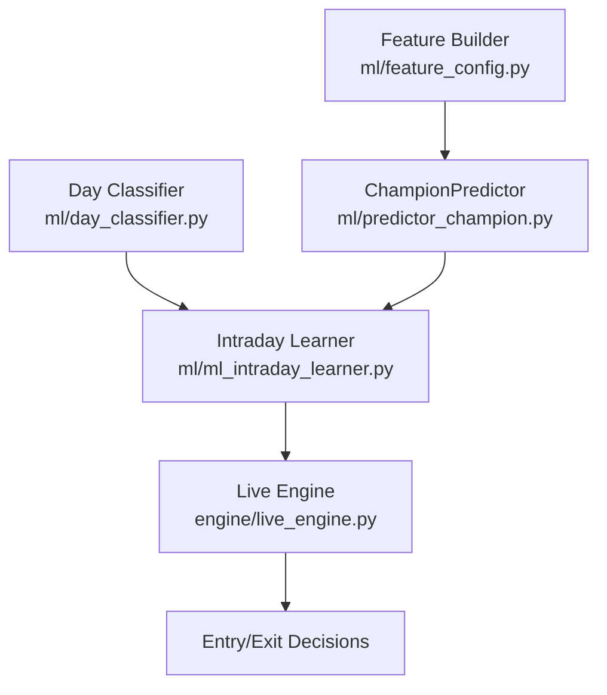
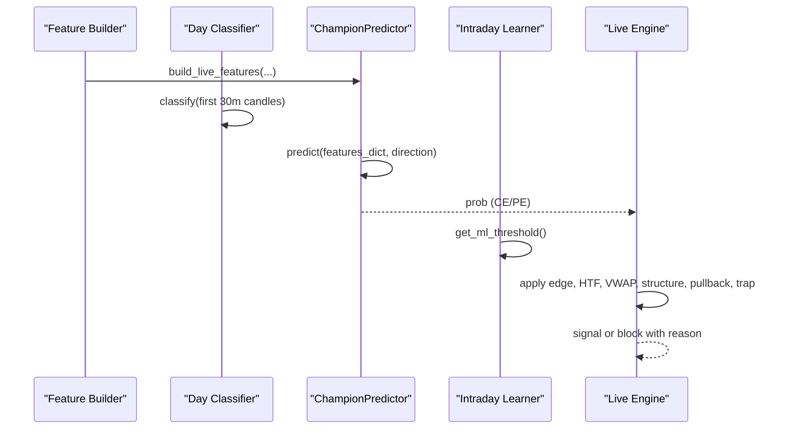
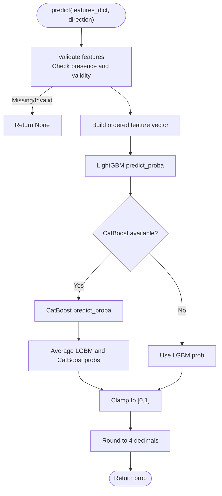
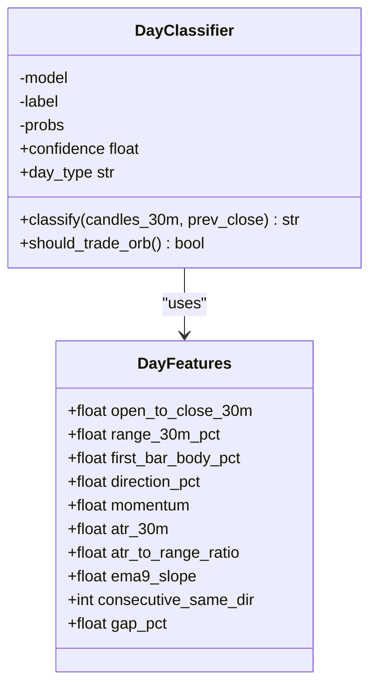
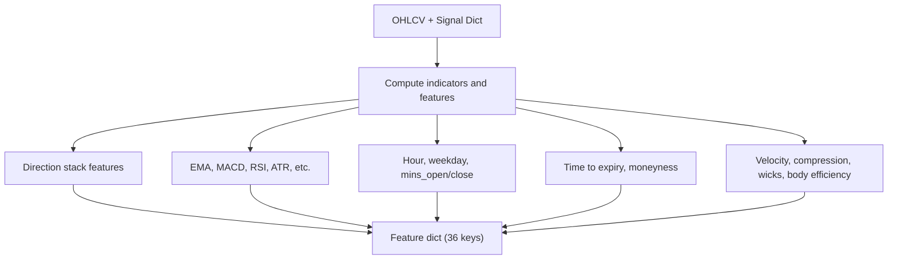
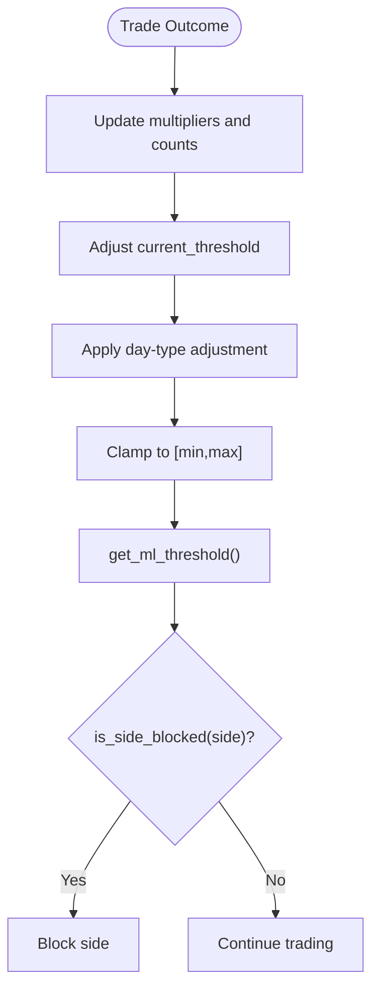
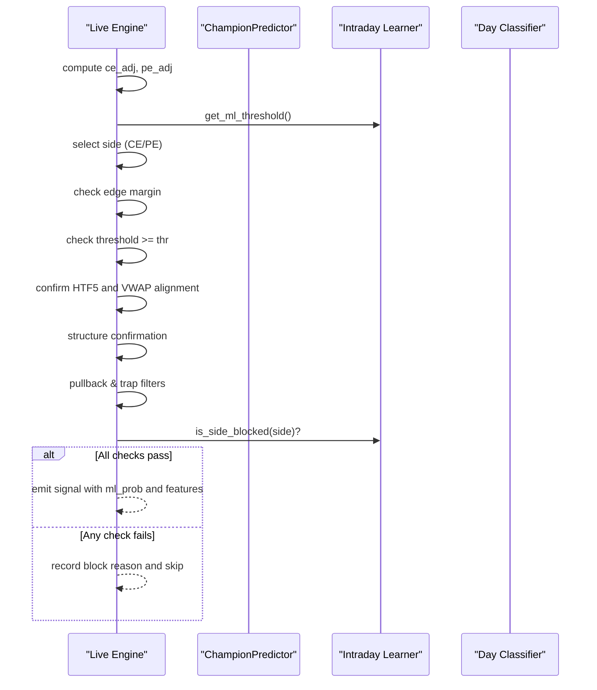
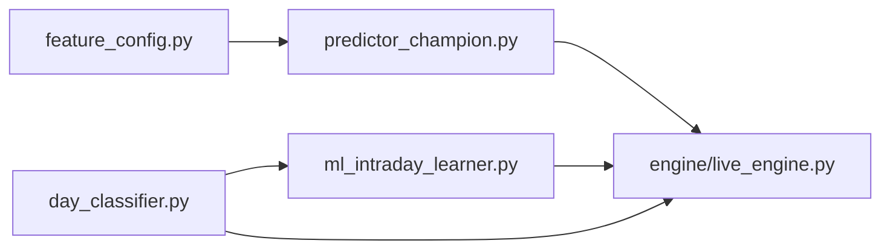

# Prediction Serving

<cite>
**Referenced Files in This Document**
- [predictor_champion.py](file://ml/predictor_champion.py)
- [day_classifier.py](file://ml/day_classifier.py)
- [feature_config.py](file://ml/feature_config.py)
- [live_engine.py](file://engine/live_engine.py)
- [ml_intraday_learner.py](file://ml/ml_intraday_learner.py)
</cite>

## Table of Contents
1. [Introduction](#introduction)
2. [Project Structure](#project-structure)
3. [Core Components](#core-components)
4. [Architecture Overview](#architecture-overview)
5. [Detailed Component Analysis](#detailed-component-analysis)
6. [Dependency Analysis](#dependency-analysis)
7. [Performance Considerations](#performance-considerations)
8. [Troubleshooting Guide](#troubleshooting-guide)
9. [Conclusion](#conclusion)
10. [Appendices](#appendices)

## Introduction
This document explains the prediction serving layer that provides real-time directional bias for call (CE) and put (PE) options. It covers:
- The ChampionPredictor ensemble combining LightGBM and CatBoost, with probability calibration and threshold-based decisions.
- Day regime detection via day_classifier.py and how it influences confidence and thresholds.
- End-to-end workflow from feature input to probability output, including validation, model selection, and ensemble averaging.
- Threshold management for CE/PE predictions, dynamic adjustment, and confidence scoring.
- Practical examples of inputs and outputs.
- Error handling, fallbacks, and performance monitoring.
- Integration points with the trading engine and how predictions influence entry/exit decisions.

## Project Structure
The prediction serving layer spans ML inference and live trading integration:
- ml/predictor_champion.py: Ensemble predictor (LightGBM + optional CatBoost), calibration wrapper, and threshold checks.
- ml/day_classifier.py: Market regime classifier (TREND/RANGE/VOLATILE) using first 30 minutes of data.
- ml/feature_config.py: Canonical 36-feature builder used by live engines and backtests.
- engine/live_engine.py: Orchestrates prediction calls, applies additional filters, and integrates with adaptive thresholds.
- ml/ml_intraday_learner.py: Intraday learner that adapts thresholds and multipliers based on daily outcomes and day type.

**Diagram sources**
- [feature_config.py:82-252](file://ml/feature_config.py#L82-L252)
- [predictor_champion.py:57-218](file://ml/predictor_champion.py#L57-L218)
- [day_classifier.py:293-339](file://ml/day_classifier.py#L293-L339)
- [ml_intraday_learner.py:210-232](file://ml/ml_intraday_learner.py#L210-L232)
- [live_engine.py:1170-1274](file://engine/live_engine.py#L1170-L1274)

**Section sources**
- [feature_config.py:25-64](file://ml/feature_config.py#L25-L64)
- [predictor_champion.py:57-100](file://ml/predictor_champion.py#L57-L100)
- [day_classifier.py:42-46](file://ml/day_classifier.py#L42-L46)
- [ml_intraday_learner.py:210-232](file://ml/ml_intraday_learner.py#L210-L232)
- [live_engine.py:1170-1274](file://engine/live_engine.py#L1170-L1274)

## Core Components
- ChampionPredictor: Loads CE/PE models (LightGBM required; CatBoost optional), validates features, predicts probabilities, optionally ensembles with CatBoost, and checks thresholds.
- DayClassifier: Classifies market regime (TREND/RANGE/VOLATILE) from first 30 minutes to gate strategies and adjust confidence.
- FeatureBuilder: Produces a canonical set of 36 features consistently across training and live environments.
- IntradayLearner: Adapts thresholds and side-specific multipliers intraday based on outcomes and day type.
- LiveEngine: Integrates all components, applies edge and confirmation filters, and decides entries/exits.

**Section sources**
- [predictor_champion.py:57-218](file://ml/predictor_champion.py#L57-L218)
- [day_classifier.py:293-339](file://ml/day_classifier.py#L293-L339)
- [feature_config.py:82-252](file://ml/feature_config.py#L82-L252)
- [ml_intraday_learner.py:210-232](file://ml/ml_intraday_learner.py#L210-L232)
- [live_engine.py:1170-1274](file://engine/live_engine.py#L1170-L1274)

## Architecture Overview
Prediction serving is a pipeline:
1. Features are built from OHLCV and indicators.
2. ChampionPredictor selects CE or PE model(s), validates inputs, and returns calibrated probabilities.
3. DayClassifier determines regime early in the session.
4. IntradayLearner adjusts thresholds and multipliers based on daily performance and regime.
5. LiveEngine applies edge, trend alignment, VWAP alignment, structure confirmation, pullback/trap filters, and learner-side blocks before issuing signals.

**Diagram sources**
- [feature_config.py:82-252](file://ml/feature_config.py#L82-L252)
- [day_classifier.py:293-339](file://ml/day_classifier.py#L293-L339)
- [predictor_champion.py:151-218](file://ml/predictor_champion.py#L151-L218)
- [ml_intraday_learner.py:210-232](file://ml/ml_intraday_learner.py#L210-L232)
- [live_engine.py:1170-1274](file://engine/live_engine.py#L1170-L1274)

## Detailed Component Analysis

### ChampionPredictor: Ensemble, Calibration, and Thresholding
- Model loading:
  - CE and PE LightGBM models are required; CatBoost models are optional and enable ensemble mode when both exist.
  - Threshold files per model are loaded if present; otherwise defaults apply.
- Feature validation:
  - Ensures all required feature columns exist and values are finite; missing or invalid features return None to prevent bad predictions.
- Prediction:
  - Builds an ordered feature vector matching model expectations.
  - Predicts probability from LightGBM; if CatBoost is available, averages probabilities for robustness.
  - Clamps probabilities to [0, 1] and rounds to four decimals.
- Threshold decision:
  - Separate thresholds for CE and PE; passes_threshold compares predicted probability against the appropriate threshold.

**Diagram sources**
- [predictor_champion.py:151-204](file://ml/predictor_champion.py#L151-L204)

**Section sources**
- [predictor_champion.py:57-100](file://ml/predictor_champion.py#L57-L100)
- [predictor_champion.py:105-147](file://ml/predictor_champion.py#L105-L147)
- [predictor_champion.py:151-218](file://ml/predictor_champion.py#L151-L218)

### DayClassifier: Market Regime Detection
- Purpose: Classify the entire day into TREND, RANGE, or VOLATILE using the first 30 minutes of 1-minute candles.
- Features: Includes open-to-close move, range metrics, momentum, ATR ratios, EMA slope, consecutive same-direction bars, and gap percentage.
- Output: Returns a string label and exposes confidence (max class probability).
- Strategy gating: should_trade_orb returns True only for TREND days, reducing noise and improving quality.

**Diagram sources**
- [day_classifier.py:49-62](file://ml/day_classifier.py#L49-L62)
- [day_classifier.py:293-339](file://ml/day_classifier.py#L293-L339)

**Section sources**
- [day_classifier.py:64-148](file://ml/day_classifier.py#L64-L148)
- [day_classifier.py:293-339](file://ml/day_classifier.py#L293-L339)

### Feature Building: Canonical 36 Features
- Provides a consistent feature set across training and live systems.
- Includes a “direction stack” (supertrend, VWAP bias, ADX, DI spread, EMA alignment, volume ratio) plus core indicators, time/session context, options-specific fields, and reversal/momentum features.
- Robust building with safe fallbacks to zeroed features on errors or insufficient data.

**Diagram sources**
- [feature_config.py:25-64](file://ml/feature_config.py#L25-L64)
- [feature_config.py:82-252](file://ml/feature_config.py#L82-L252)

**Section sources**
- [feature_config.py:25-64](file://ml/feature_config.py#L25-L64)
- [feature_config.py:82-252](file://ml/feature_config.py#L82-L252)

### Intraday Learner: Dynamic Threshold Management and Confidence Scoring
- Adaptive threshold:
  - Starts at a base threshold and adjusts up/down based on wins/losses and day type.
  - Day type adjustments: volatile days raise bar; trend days allow slightly lower bar; range/gap days moderate increases.
  - Threshold clamped to a realistic intraday range to keep system usable.
- Side multipliers:
  - Boosts winning side’s multiplier and reduces losing side’s multiplier to reflect today’s reliability.
- Blocking logic:
  - Blocks sides after consecutive losses or persistent underperformance to avoid further risk.
- Early exit guidance:
  - Uses day type and ML disagreement to suggest exits under adverse conditions.

**Diagram sources**
- [ml_intraday_learner.py:210-232](file://ml/ml_intraday_learner.py#L210-L232)
- [ml_intraday_learner.py:270-346](file://ml/ml_intraday_learner.py#L270-L346)

**Section sources**
- [ml_intraday_learner.py:210-232](file://ml/ml_intraday_learner.py#L210-L232)
- [ml_intraday_learner.py:270-346](file://ml/ml_intraday_learner.py#L270-L346)

### Live Engine Integration: From Prediction to Entry/Exit
- Prediction flow:
  - Computes adjusted CE/PE probabilities and selects the stronger side.
  - Applies edge margin to ensure clear directional conviction.
  - Enforces thresholds from the adaptive learner.
  - Confirms with higher timeframe trends and VWAP alignment.
  - Validates structure (HH/HL or LH/LL), pullback entry, and trap filter.
  - Checks learner-side blocks before signaling.
- Monitoring:
  - Tracks block reasons and computes percentile ranks and scores for transparency.

**Diagram sources**
- [live_engine.py:1170-1274](file://engine/live_engine.py#L1170-L1274)
- [ml_intraday_learner.py:210-232](file://ml/ml_intraday_learner.py#L210-L232)
- [ml_intraday_learner.py:332-346](file://ml/ml_intraday_learner.py#L332-L346)

**Section sources**
- [live_engine.py:1170-1274](file://engine/live_engine.py#L1170-L1274)

## Dependency Analysis
- ChampionPredictor depends on:
  - LightGBM models (required) and optional CatBoost models.
  - Feature column order defined in feature_config.py.
  - Threshold files stored alongside models.
- DayClassifier depends on:
  - Historical 1-minute data and labels for training.
  - LightGBM classifier saved to disk.
- LiveEngine depends on:
  - Feature builder for canonical inputs.
  - IntradayLearner for adaptive thresholds and side blocking.
  - DayClassifier for regime-aware strategy gating.

**Diagram sources**
- [feature_config.py:82-252](file://ml/feature_config.py#L82-L252)
- [predictor_champion.py:57-218](file://ml/predictor_champion.py#L57-L218)
- [day_classifier.py:293-339](file://ml/day_classifier.py#L293-L339)
- [ml_intraday_learner.py:210-232](file://ml/ml_intraday_learner.py#L210-L232)
- [live_engine.py:1170-1274](file://engine/live_engine.py#L1170-L1274)

**Section sources**
- [predictor_champion.py:57-100](file://ml/predictor_champion.py#L57-L100)
- [day_classifier.py:293-339](file://ml/day_classifier.py#L293-L339)
- [ml_intraday_learner.py:210-232](file://ml/ml_intraday_learner.py#L210-L232)
- [live_engine.py:1170-1274](file://engine/live_engine.py#L1170-L1274)

## Performance Considerations
- Ensemble averaging:
  - When CatBoost models exist, averaging with LightGBM improves robustness; falls back to LightGBM-only if CatBoost prediction fails.
- Probability calibration:
  - A calibration wrapper exists for Platt scaling; ensure consistent usage across training and inference to avoid saturation issues.
- Feature consistency:
  - Strict ordering and clipping of features reduce drift between training and live environments.
- Threshold adaptivity:
  - Intraday thresholds adjust to daily performance and regime, preventing over-trading in unfavorable conditions.
- Logging and diagnostics:
  - Predictor logs warnings for missing/invalid features and errors during prediction; live engine records block reasons and percentiles for post-session analysis.

[No sources needed since this section provides general guidance]

## Troubleshooting Guide
Common issues and resolutions:
- Missing or invalid features:
  - Symptom: Predictor returns None.
  - Cause: Missing keys or non-finite values in features_dict.
  - Action: Ensure all required features are present and valid; use safe feature builder to default to zeros on error.
- Model files not found:
  - Symptom: FileNotFoundError during initialization.
  - Action: Verify model paths and ensure models are trained and saved.
- CatBoost ensemble failure:
  - Symptom: Warning about CatBoost predict failure; uses LightGBM only.
  - Action: Check CatBoost model integrity; ensemble will degrade gracefully.
- Stale thresholds:
  - Symptom: No ML trades due to high thresholds.
  - Action: Use adaptive thresholds from IntradayLearner; verify day type and recent performance.
- Low confidence or saturated outputs:
  - Symptom: Probabilities near 0 or 1 across the day.
  - Action: Review calibration and feature scaling; ensure feature builder matches training pipeline.

**Section sources**
- [predictor_champion.py:151-208](file://ml/predictor_champion.py#L151-L208)
- [predictor_champion.py:57-73](file://ml/predictor_champion.py#L57-L73)
- [feature_config.py:255-267](file://ml/feature_config.py#L255-L267)
- [live_engine.py:1170-1274](file://engine/live_engine.py#L1170-L1274)

## Conclusion
The prediction serving layer combines robust feature engineering, ensemble modeling, regime detection, and adaptive thresholds to deliver reliable directional bias for options. The ChampionPredictor ensures consistent, validated predictions; the DayClassifier gates strategies based on market regime; the IntradayLearner dynamically tunes thresholds and multipliers; and the LiveEngine applies comprehensive filters to produce high-quality entry/exit decisions. Together, these components form a resilient, transparent, and performant prediction pipeline suitable for live trading.

[No sources needed since this section summarizes without analyzing specific files]

## Appendices

### Practical Examples

- Input feature dictionary:
  - Provide a dict with all 36 canonical features (see feature_config.py for key names).
  - Ensure numeric values are finite and within expected ranges.
- Prediction call:
  - Call ChampionPredictor.predict(features_dict, direction="CE" or "PE").
  - Expected output: probability rounded to four decimals or None on error.
- Threshold decision:
  - Use ChampionPredictor.passes_threshold(prob, direction) to compare against per-side thresholds.
- Day regime:
  - Call DayClassifier.classify(first 30m candles) to get TREND/RANGE/VOLATILE.
  - Use should_trade_orb() to gate ORB-related strategies.
- Adaptive threshold:
  - Retrieve IntradayLearner.get_ml_threshold() for the current day’s threshold.
- Live engine integration:
  - LiveEngine computes adjusted probabilities, applies edge and confirmation filters, and emits signals or records block reasons.

**Section sources**
- [feature_config.py:25-64](file://ml/feature_config.py#L25-L64)
- [predictor_champion.py:151-218](file://ml/predictor_champion.py#L151-L218)
- [day_classifier.py:293-339](file://ml/day_classifier.py#L293-L339)
- [ml_intraday_learner.py:210-232](file://ml/ml_intraday_learner.py#L210-L232)
- [live_engine.py:1170-1274](file://engine/live_engine.py#L1170-L1274)