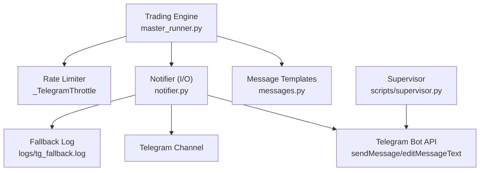
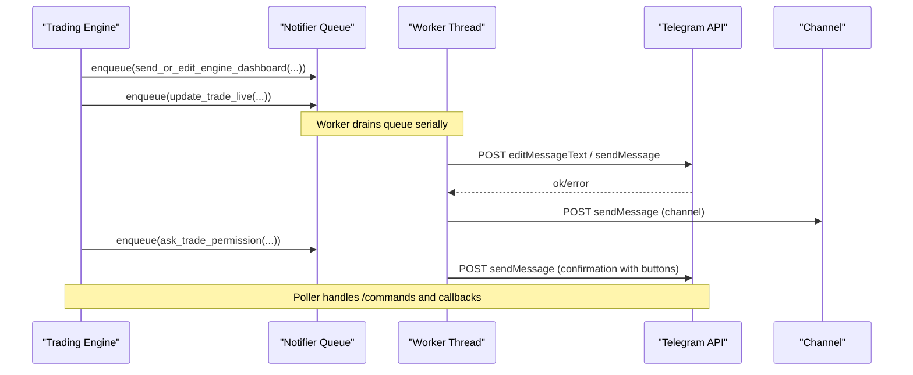
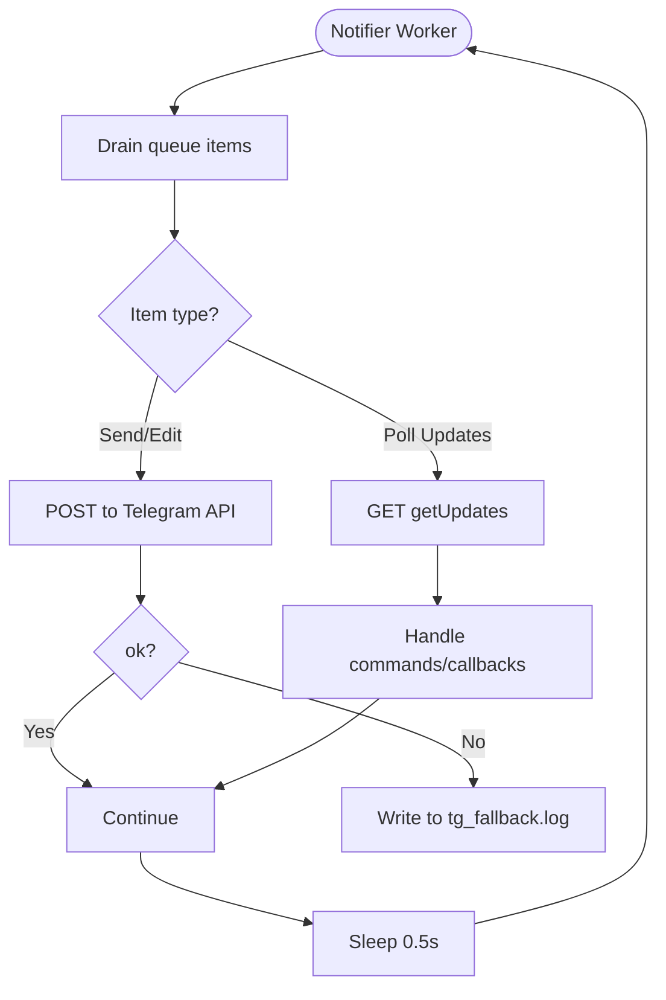
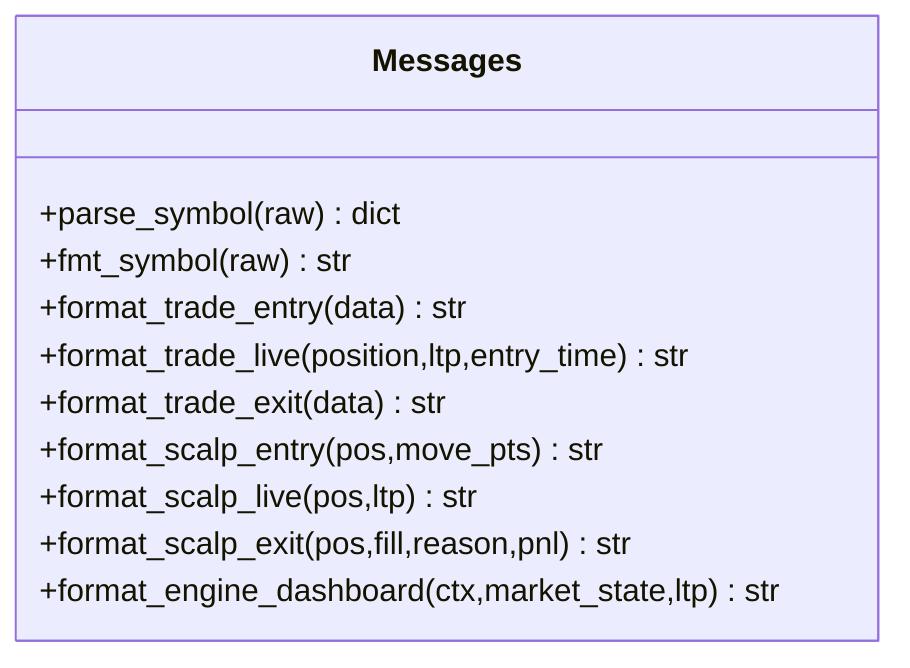
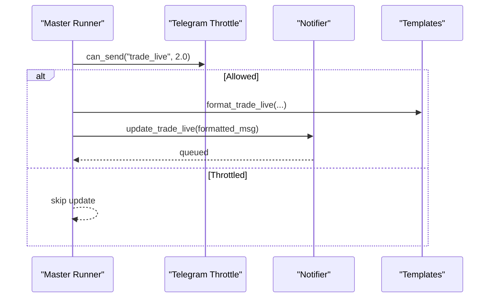
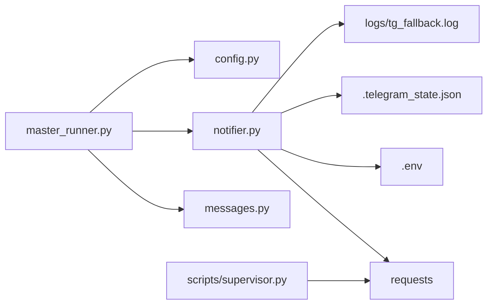

# Alert System

<cite>
**Referenced Files in This Document**
- [notifier.py](file://telegram/notifier.py)
- [messages.py](file://telegram/messages.py)
- [master_runner.py](file://master_runner.py)
- [config.py](file://engine/config/config.py)
- [supervisor.py](file://scripts/supervisor.py)
</cite>

## Table of Contents
1. [Introduction](#introduction)
2. [Project Structure](#project-structure)
3. [Core Components](#core-components)
4. [Architecture Overview](#architecture-overview)
5. [Detailed Component Analysis](#detailed-component-analysis)
6. [Dependency Analysis](#dependency-analysis)
7. [Performance Considerations](#performance-considerations)
8. [Troubleshooting Guide](#troubleshooting-guide)
9. [Conclusion](#conclusion)
10. [Appendices](#appendices)

## Introduction
This document describes the Telegram-based alert system that provides real-time notifications for trading events and system status. It covers the notifier module responsible for sending trade confirmations, error alerts, and system health updates; message formatting and template systems; notification routing; configuration options; integration with the trading engine; rate limiting, retries, fallbacks; and security considerations for sensitive trading information and user privacy.

## Project Structure
The alert system is implemented under the telegram package and integrated into the master runner:
- telegram/notifier.py: Background worker, persistent dashboards, command polling, trade confirmation prompts, and delivery to bot chat and channel.
- telegram/messages.py: Human-readable templates for entry/live/exit messages, dashboard snapshots, and scalper cards.
- master_runner.py: Orchestrates trading cycles, invokes notifier/message formatters, applies rate limiting, and reacts to Telegram commands.
- engine/config/config.py: Centralized configuration flags that influence alert behavior (e.g., dry-run mode).
- scripts/supervisor.py: Supervisor process that sends direct Telegram alerts without starting a second poller to avoid conflicts.

**Diagram sources**
- [master_runner.py:518-532](file://master_runner.py#L518-L532)
- [notifier.py:205-224](file://telegram/notifier.py#L205-L224)
- [notifier.py:227-305](file://telegram/notifier.py#L227-L305)
- [supervisor.py:51-68](file://scripts/supervisor.py#L51-L68)

**Section sources**
- [notifier.py:1-115](file://telegram/notifier.py#L1-L115)
- [messages.py:1-120](file://telegram/messages.py#L1-L120)
- [master_runner.py:82-110](file://master_runner.py#L82-L110)
- [config.py:1-164](file://engine/config/config.py#L1-L164)
- [supervisor.py:1-28](file://scripts/supervisor.py#L1-L28)

## Core Components
- Notifier (telegram/notifier.py):
  - Persistent dual dashboards (engine and market) edited in place via message IDs persisted to .telegram_state.json.
  - Background thread with queue to ensure non-blocking I/O from the trading loop.
  - Command polling for /status, /pause, /resume, /stop, threshold overrides, and manual exit.
  - Trade confirmation prompt with YES/SKIP buttons and auto-execute timeout in live mode.
  - Delivery to both private bot chat and a public channel.
- Message Templates (telegram/messages.py):
  - Symbol parsing and human-friendly formatting for NIFTY/BANKNIFTY/SENSEX options.
  - Entry, live update, and exit messages for regular trades and scalps.
  - Dashboard snapshot including ML confidence bars, blockers, feed health, and daily stats.
- Master Runner Integration (master_runner.py):
  - Rate-limited wrappers tg_bot and tg_force to send alerts without flooding Telegram.
  - Periodic heartbeat and diagnostics alerts during market hours.
  - Live trade updates using formatted messages and notifier’s edit-in-place APIs.
- Configuration (engine/config/config.py):
  - Environment-driven toggles affecting alert behavior (e.g., DRY_RUN, PAPER_MODE).
- Supervisor (scripts/supervisor.py):
  - Direct HTTP requests to Telegram to avoid multiple getUpdates pollers on the same token.

**Section sources**
- [notifier.py:105-164](file://telegram/notifier.py#L105-L164)
- [notifier.py:321-379](file://telegram/notifier.py#L321-L379)
- [notifier.py:419-479](file://telegram/notifier.py#L419-L479)
- [notifier.py:544-579](file://telegram/notifier.py#L544-L579)
- [notifier.py:600-698](file://telegram/notifier.py#L600-L698)
- [messages.py:160-324](file://telegram/messages.py#L160-L324)
- [messages.py:331-445](file://telegram/messages.py#L331-L445)
- [messages.py:615-710](file://telegram/messages.py#L615-L710)
- [master_runner.py:518-532](file://master_runner.py#L518-L532)
- [master_runner.py:1087-1101](file://master_runner.py#L1087-L1101)
- [master_runner.py:1232-1237](file://master_runner.py#L1232-L1237)
- [config.py:1-164](file://engine/config/config.py#L1-L164)
- [supervisor.py:51-68](file://scripts/supervisor.py#L51-L68)

## Architecture Overview
The notifier runs a background daemon thread that processes queued tasks serially and polls Telegram updates at an adaptive interval. The trading engine calls notifier functions to send or edit messages; these are enqueued and executed off the critical path. Persistent message IDs survive restarts so dashboards remain stable. Commands and callback queries are handled by the notifier’s poller, which updates shared state consumed by the engine.

**Diagram sources**
- [notifier.py:117-145](file://telegram/notifier.py#L117-L145)
- [notifier.py:205-224](file://telegram/notifier.py#L205-L224)
- [notifier.py:227-305](file://telegram/notifier.py#L227-L305)
- [notifier.py:321-379](file://telegram/notifier.py#L321-L379)
- [notifier.py:544-579](file://telegram/notifier.py#L544-L579)
- [notifier.py:600-698](file://telegram/notifier.py#L600-L698)

## Detailed Component Analysis

### Notifier Module (telegram/notifier.py)
Responsibilities:
- Background I/O: A single-threaded worker drains a bounded queue to prevent blocking the trading loop.
- Persistent Dashboards: Two edit-in-place messages (engine and market) with IDs saved to .telegram_state.json.
- Trade Prompts: Confirmation dialog with inline keyboard; auto-approve in paper/dry-run modes.
- Command Handling: Polling for messages and callback queries; supports /status, /pause, /resume, /stop, threshold overrides, and dashboard reset.
- Routing: Sends to both bot chat and channel; supports optional proxy via TELEGRAM_PROXY.

Key behaviors:
- Fail-fast HTTP session with no retries to avoid stalls; errors fall through to logs/tg_fallback.log.
- Adaptive polling interval increases on failures and resets on success.
- Edit operations detect “message gone” conditions and recreate messages when needed.

**Diagram sources**
- [notifier.py:117-145](file://telegram/notifier.py#L117-L145)
- [notifier.py:205-224](file://telegram/notifier.py#L205-L224)
- [notifier.py:227-305](file://telegram/notifier.py#L227-L305)
- [notifier.py:600-698](file://telegram/notifier.py#L600-L698)

**Section sources**
- [notifier.py:22-63](file://telegram/notifier.py#L22-L63)
- [notifier.py:105-164](file://telegram/notifier.py#L105-L164)
- [notifier.py:166-198](file://telegram/notifier.py#L166-L198)
- [notifier.py:205-305](file://telegram/notifier.py#L205-L305)
- [notifier.py:321-379](file://telegram/notifier.py#L321-L379)
- [notifier.py:419-479](file://telegram/notifier.py#L419-L479)
- [notifier.py:544-579](file://telegram/notifier.py#L544-L579)
- [notifier.py:600-698](file://telegram/notifier.py#L600-L698)

### Message Templates (telegram/messages.py)
Responsibilities:
- Parse option symbols into readable components (index, expiry, strike, type).
- Format entry, live, and exit messages for both standard and scalp strategies.
- Build dashboard snapshots with ML confidence bars, blockers, feed health, and daily metrics.

Highlights:
- Emojis and concise sections improve readability on mobile.
- Exit reasons mapped to human-friendly labels and icons.
- Dashboard includes current engine status, market direction, VWAP alignment, RSI/ADX, ML confidence, and today’s P&L.

**Diagram sources**
- [messages.py:25-87](file://telegram/messages.py#L25-L87)
- [messages.py:160-324](file://telegram/messages.py#L160-L324)
- [messages.py:331-445](file://telegram/messages.py#L331-L445)
- [messages.py:615-710](file://telegram/messages.py#L615-L710)

**Section sources**
- [messages.py:25-87](file://telegram/messages.py#L25-L87)
- [messages.py:160-324](file://telegram/messages.py#L160-L324)
- [messages.py:331-445](file://telegram/messages.py#L331-L445)
- [messages.py:615-710](file://telegram/messages.py#L615-L710)

### Integration with Trading Engine (master_runner.py)
Responsibilities:
- Rate limiting per message type to avoid Telegram bans.
- Sending periodic heartbeats and diagnostics during market hours.
- Updating live trade messages using templates and notifier APIs.
- Reacting to Telegram commands (pause/resume/stop/manual exit).

Integration patterns:
- tg_bot(key, interval) wraps send_bot with throttling.
- tg_force(msg) bypasses throttle for critical alerts.
- Live updates triggered every cycle if within cooldown thresholds.

**Diagram sources**
- [master_runner.py:135-148](file://master_runner.py#L135-L148)
- [master_runner.py:518-532](file://master_runner.py#L518-L532)
- [master_runner.py:1232-1237](file://master_runner.py#L1232-L1237)

**Section sources**
- [master_runner.py:135-148](file://master_runner.py#L135-L148)
- [master_runner.py:518-532](file://master_runner.py#L518-L532)
- [master_runner.py:1087-1101](file://master_runner.py#L1087-L1101)
- [master_runner.py:1232-1237](file://master_runner.py#L1232-L1237)
- [master_runner.py:1263-1269](file://master_runner.py#L1263-L1269)

### Configuration Options
Environment variables influencing alert behavior:
- TELEGRAM_BOT_TOKEN, TELEGRAM_BOT_CHAT_ID, TELEGRAM_CHANNEL_ID, TELEGRAM_ADMIN_ID: Required for all Telegram operations.
- TELEGRAM_PROXY: Optional outbound proxy for restricted networks.
- PAPER_MODE, DRY_RUN: In paper/dry-run modes, trade confirmations are auto-approved and some alerts may be suppressed or marked accordingly.
- Additional risk and execution settings in config.py indirectly affect alert content (e.g., lot size, thresholds).

Delivery schedules:
- Live trade updates are rate-limited per message type (e.g., 2 seconds) to avoid spamming.
- Heartbeat and diagnostics are sent periodically during market hours.
- End-of-day summary is queued for both bot and channel.

**Section sources**
- [notifier.py:38-63](file://telegram/notifier.py#L38-L63)
- [notifier.py:721-753](file://telegram/notifier.py#L721-L753)
- [master_runner.py:518-532](file://master_runner.py#L518-L532)
- [master_runner.py:1087-1101](file://master_runner.py#L1087-L1101)
- [config.py:1-164](file://engine/config/config.py#L1-L164)

### Security Considerations
- Authorization: Only the configured AUTHORIZED_USER_ID can execute commands and trigger actions via Telegram.
- Secrets Management: Bot token, chat/channel IDs, and admin ID are loaded from environment variables; never hard-coded.
- Network Security: Optional TELEGRAM_PROXY allows routing through trusted proxies; trust_env disabled to avoid unintended system proxy usage.
- Privacy: Sensitive trading data is only sent to authorized chats/channels; fallback log strips HTML tags for readability but still contains message content—ensure log access is restricted.
- Operational Safety: Broker stop failures trigger PAUSE and alerts; manual exit and stop commands provide immediate control.

**Section sources**
- [notifier.py:38-46](file://telegram/notifier.py#L38-L46)
- [notifier.py:55-63](file://telegram/notifier.py#L55-L63)
- [notifier.py:625-626](file://telegram/notifier.py#L625-L626)
- [notifier.py:24-33](file://telegram/notifier.py#L24-L33)
- [master_runner.py:179-200](file://master_runner.py#L179-L200)

## Dependency Analysis
- master_runner depends on:
  - telegram.messages for formatting.
  - telegram.notifier for sending/editing and command handling.
  - engine.config.config for runtime flags.
- notifier depends on:
  - requests for HTTP calls.
  - dotenv for environment loading.
  - filesystem for state persistence (.telegram_state.json) and fallback logging.
- supervisor uses direct requests to avoid getUpdates conflicts.

**Diagram sources**
- [master_runner.py:82-110](file://master_runner.py#L82-L110)
- [notifier.py:11-18](file://telegram/notifier.py#L11-L18)
- [notifier.py:22-33](file://telegram/notifier.py#L22-L33)
- [notifier.py:91-98](file://telegram/notifier.py#L91-L98)
- [supervisor.py:51-68](file://scripts/supervisor.py#L51-L68)

**Section sources**
- [master_runner.py:82-110](file://master_runner.py#L82-L110)
- [notifier.py:11-18](file://telegram/notifier.py#L11-L18)
- [notifier.py:22-33](file://telegram/notifier.py#L22-L33)
- [notifier.py:91-98](file://telegram/notifier.py#L91-L98)
- [supervisor.py:51-68](file://scripts/supervisor.py#L51-L68)

## Performance Considerations
- Non-blocking I/O: All Telegram operations are enqueued to a background worker; the trading loop remains responsive.
- Fast-fail HTTP: No retries in the HTTP adapter to prevent stalls; higher-level retries or next-cycle re-sends handle transient issues.
- Adaptive Polling: Poll interval backoffs on repeated failures to reduce load and recover gracefully.
- Rate Limiting: Per-message-type throttling prevents Telegram API bans and reduces unnecessary traffic.
- Connection Pooling: Pooled keep-alive connections reuse sockets for frequent edits.

[No sources needed since this section provides general guidance]

## Troubleshooting Guide
Common issues and resolutions:
- Missing environment variables: Ensure TELEGRAM_BOT_TOKEN, TELEGRAM_BOT_CHAT_ID, TELEGRAM_CHANNEL_ID, and TELEGRAM_ADMIN_ID are set; otherwise initialization raises errors.
- Blocked network: Configure TELEGRAM_PROXY to route through a working HTTP/HTTPS/SOCKS5 proxy; MTProto proxy links do not work here.
- Duplicate pollers: Do not start another getUpdates poller on the same token; use supervisor’s direct requests instead to avoid 409 conflicts.
- Failed deliveries: Check logs/tg_fallback.log for stripped message content when Telegram API fails; investigate network/proxy and retry later.
- Command not responding: Verify AUTHORIZED_USER_ID matches your Telegram user ID; commands are ignored for unauthorized users.

**Section sources**
- [notifier.py:38-46](file://telegram/notifier.py#L38-L46)
- [notifier.py:55-63](file://telegram/notifier.py#L55-L63)
- [notifier.py:24-33](file://telegram/notifier.py#L24-L33)
- [supervisor.py:19-22](file://scripts/supervisor.py#L19-L22)
- [notifier.py:625-626](file://telegram/notifier.py#L625-L626)

## Conclusion
The Telegram alert system provides robust, real-time notifications for trading events and system status with resilient I/O, persistent dashboards, and safe operational controls. It integrates cleanly with the trading engine through rate-limited wrappers and template-based formatting, while offering secure configuration and fallback mechanisms to maintain reliability under adverse conditions.

[No sources needed since this section summarizes without analyzing specific files]

## Appendices

### Example Alert Messages
- Trade entry card: Includes symbol, side, entry price, quantity, stop loss, target, ML confidence, regime, and timestamp. See [messages.py:160-194](file://telegram/messages.py#L160-L194).
- Live trade update: Shows LTP, P&L, peak P&L, trailing lock status, and hold time. See [messages.py:202-267](file://telegram/messages.py#L202-L267).
- Trade exit card: Summarizes result, reason, MFE/MAE, and duration. See [messages.py:274-324](file://telegram/messages.py#L274-L324).
- Scalp messages: Entry, live, and exit formats tailored for short-duration trades. See [messages.py:331-445](file://telegram/messages.py#L331-L445).
- End-of-day summary: Aggregated P&L, win rate, best/worst trades. See [notifier.py:721-753](file://telegram/notifier.py#L721-L753).

### Custom Notification Templates
- Extend messages.py with new formatter functions and integrate via master_runner to produce custom alerts.
- Use parse_symbol/fmt_symbol to ensure consistent symbol rendering across templates.

**Section sources**
- [messages.py:25-87](file://telegram/messages.py#L25-L87)
- [messages.py:160-324](file://telegram/messages.py#L160-L324)
- [messages.py:331-445](file://telegram/messages.py#L331-L445)
- [notifier.py:721-753](file://telegram/notifier.py#L721-L753)

### Integration Patterns with Trading Engine
- Use tg_bot for routine alerts with throttling; tg_force for critical alerts.
- Call update_trade_live/update_scalp_live to refresh position cards.
- Invoke ask_trade_permission to gate live-mode entries with user confirmation.
- Monitor ENGINE_PAUSED/ENGINE_STOP_REQUESTED/MANUAL_EXIT_REQUESTED to react to user commands.

**Section sources**
- [master_runner.py:518-532](file://master_runner.py#L518-L532)
- [master_runner.py:1232-1237](file://master_runner.py#L1232-L1237)
- [notifier.py:544-579](file://telegram/notifier.py#L544-L579)
- [master_runner.py:1263-1269](file://master_runner.py#L1263-L1269)