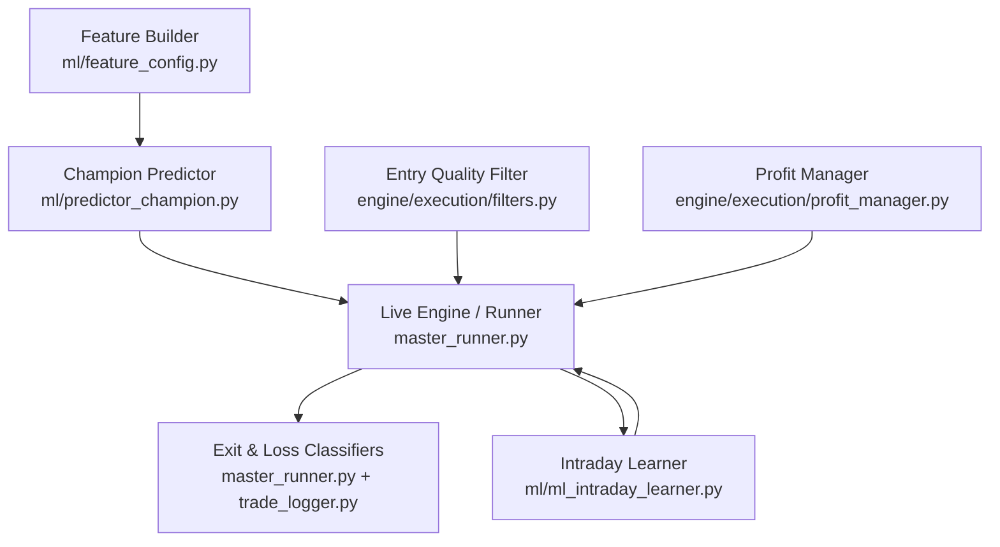
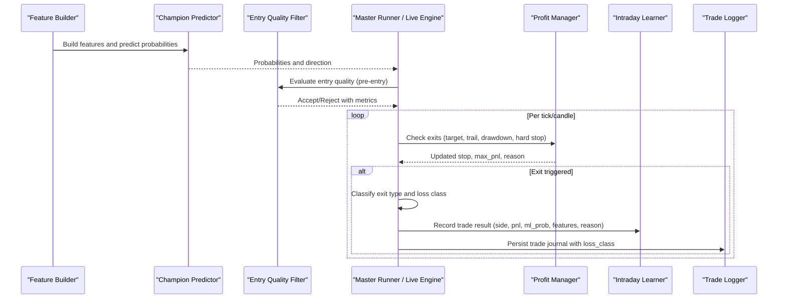
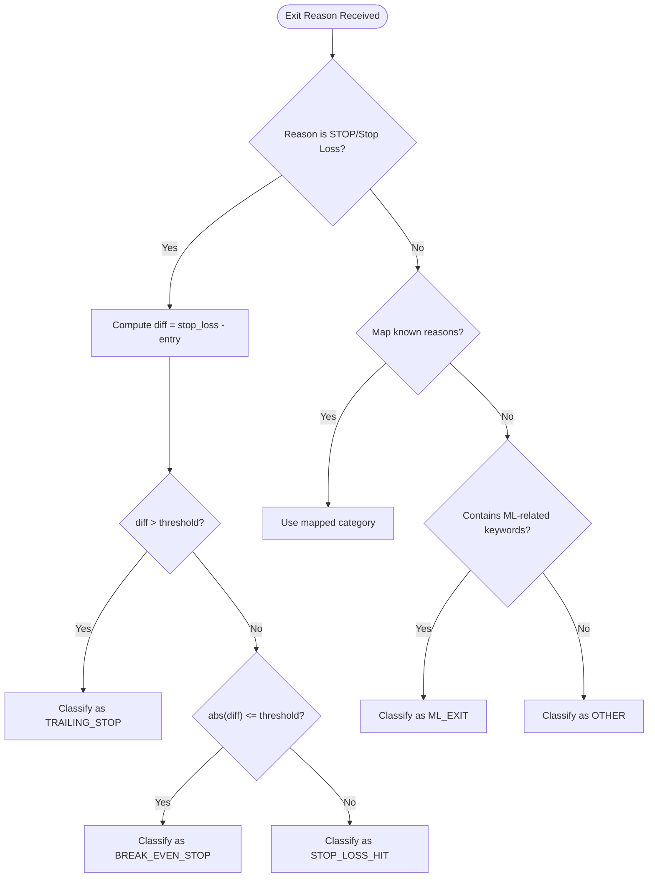
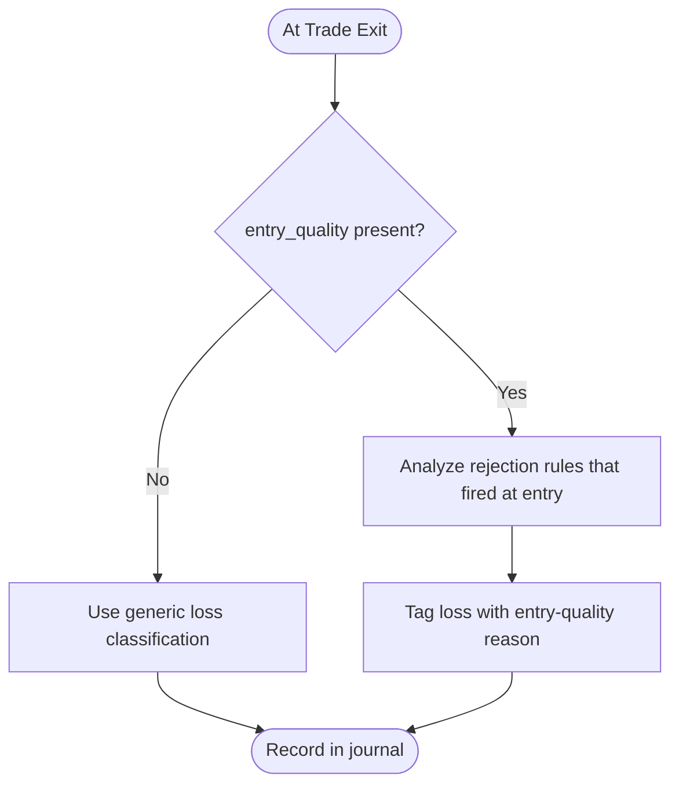
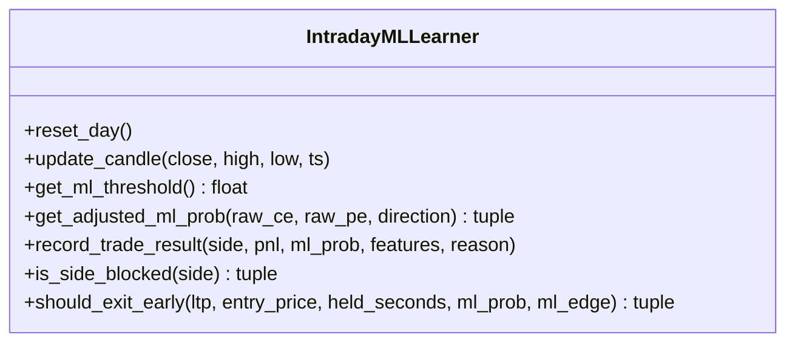
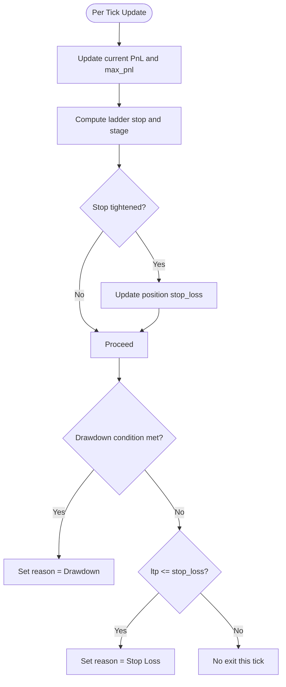
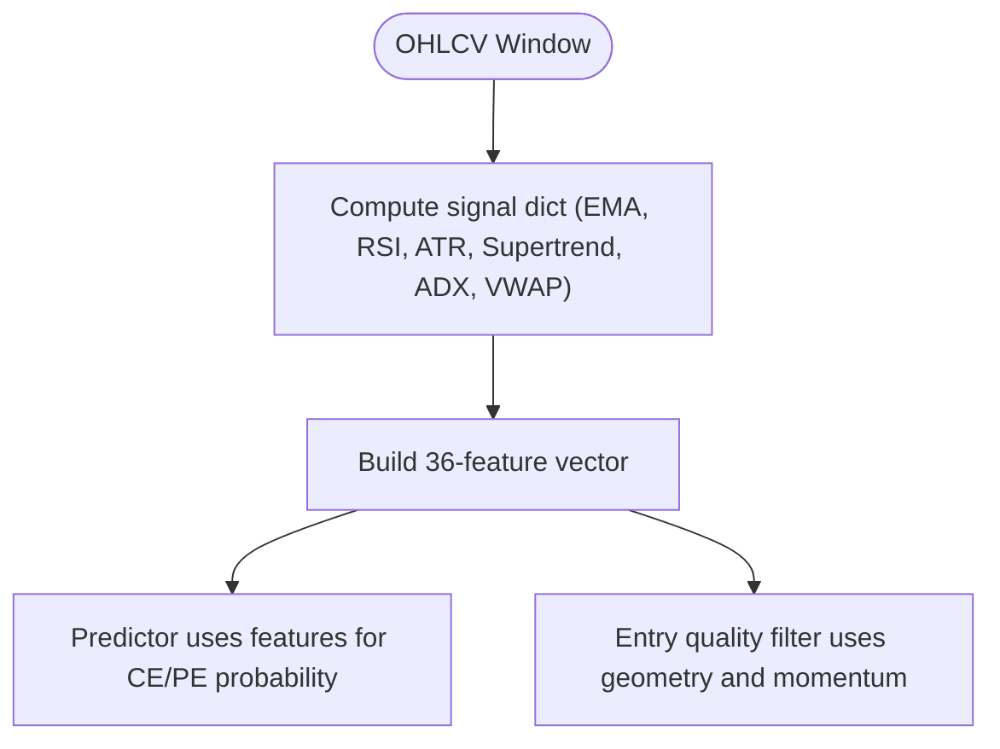
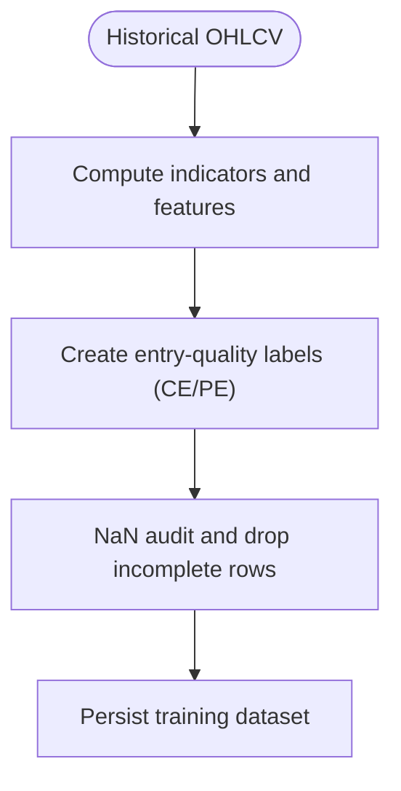
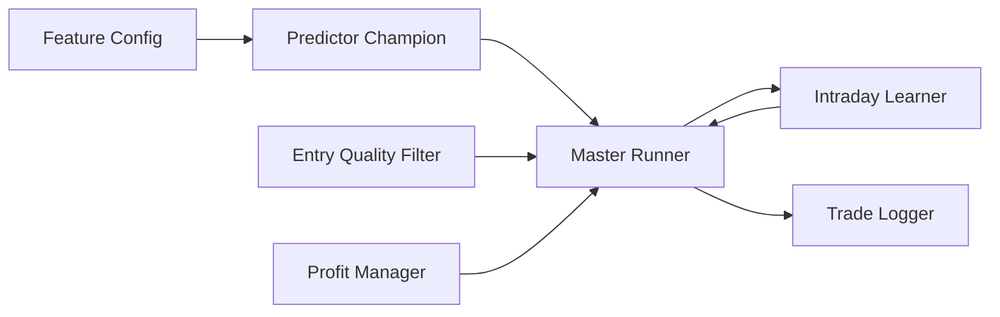

# Loss Classification

<cite>
**Referenced Files in This Document**
- [master_runner.py](file://master_runner.py)
- [trade_logger.py](file://engine/services/trade_logger.py)
- [filters.py](file://engine/execution/filters.py)
- [profit_manager.py](file://engine/execution/profit_manager.py)
- [ml_intraday_learner.py](file://ml/ml_intraday_learner.py)
- [predictor_champion.py](file://ml/predictor_champion.py)
- [feature_config.py](file://ml/feature_config.py)
- [dataset_builder.py](file://ml/dataset_builder.py)
</cite>

## Table of Contents
1. [Introduction](#introduction)
2. [Project Structure](#project-structure)
3. [Core Components](#core-components)
4. [Architecture Overview](#architecture-overview)
5. [Detailed Component Analysis](#detailed-component-analysis)
6. [Dependency Analysis](#dependency-analysis)
7. [Performance Considerations](#performance-considerations)
8. [Troubleshooting Guide](#troubleshooting-guide)
9. [Conclusion](#conclusion)

## Introduction
This document explains the loss classification system used by the trading engine to categorize why a trade exited as a loss and how that classification is recorded for analytics, reporting, and adaptive learning. It covers:
- Exit-type classification (stop types, target hits, ML-driven exits).
- Entry-quality-based loss classification using pre-trade metrics.
- Integration with the intraday learner’s adaptive thresholds and multipliers.
- How classifications are persisted into journals and reports.

## Project Structure
Loss classification spans multiple modules:
- Execution filters evaluate entry quality before trades.
- Profit management determines exit triggers and reasons.
- The master runner classifies exits and records results.
- The ML learner adapts thresholds and side confidence based on outcomes.
- Feature engineering ensures consistent inputs for models and filters.

**Diagram sources**
- [feature_config.py:82-267](file://ml/feature_config.py#L82-L267)
- [predictor_champion.py:57-218](file://ml/predictor_champion.py#L57-L218)
- [filters.py:126-264](file://engine/execution/filters.py#L126-L264)
- [profit_manager.py:173-224](file://engine/execution/profit_manager.py#L173-L224)
- [master_runner.py:408-430](file://master_runner.py#L408-L430)
- [trade_logger.py:105-132](file://engine/services/trade_logger.py#L105-L132)
- [ml_intraday_learner.py:208-245](file://ml/ml_intraday_learner.py#L208-L245)

**Section sources**
- [feature_config.py:82-267](file://ml/feature_config.py#L82-L267)
- [predictor_champion.py:57-218](file://ml/predictor_champion.py#L57-L218)
- [filters.py:126-264](file://engine/execution/filters.py#L126-L264)
- [profit_manager.py:173-224](file://engine/execution/profit_manager.py#L173-L224)
- [master_runner.py:408-430](file://master_runner.py#L408-L430)
- [trade_logger.py:105-132](file://engine/services/trade_logger.py#L105-L132)
- [ml_intraday_learner.py:208-245](file://ml/ml_intraday_learner.py#L208-L245)

## Core Components
- Exit-type classifier: Maps raw exit reasons to standardized categories such as stop-loss variants, target hit, profit protection, time exit, manual exit, ML-driven exit, or other.
- Entry-quality-based loss classifier: Uses pre-trade metrics captured at signal time to label losses as avoidable due to poor entry conditions.
- Intraday learner: Adjusts per-day thresholds and side multipliers based on outcomes; influences future entries and early exits.
- Profit manager: Computes trailing stops, drawdown exits, and hard stops; returns structured reasons consumed by classifiers.
- Feature pipeline: Supplies consistent indicators and regime context to both prediction and filtering stages.

**Section sources**
- [master_runner.py:408-430](file://master_runner.py#L408-L430)
- [trade_logger.py:105-132](file://engine/services/trade_logger.py#L105-L132)
- [ml_intraday_learner.py:208-245](file://ml/ml_intraday_learner.py#L208-L245)
- [profit_manager.py:173-224](file://engine/execution/profit_manager.py#L173-L224)
- [feature_config.py:82-267](file://ml/feature_config.py#L82-L267)

## Architecture Overview
The loss classification flow integrates pre-trade quality checks, live exit logic, and post-trade analysis:

**Diagram sources**
- [feature_config.py:82-267](file://ml/feature_config.py#L82-L267)
- [predictor_champion.py:151-218](file://ml/predictor_champion.py#L151-L218)
- [filters.py:126-264](file://engine/execution/filters.py#L126-L264)
- [profit_manager.py:173-224](file://engine/execution/profit_manager.py#L173-L224)
- [master_runner.py:1350-1549](file://master_runner.py#L1350-L1549)
- [ml_intraday_learner.py:247-319](file://ml/ml_intraday_learner.py#L247-L319)
- [trade_logger.py:105-132](file://engine/services/trade_logger.py#L105-L132)

## Detailed Component Analysis

### Exit-Type Classification
- Purpose: Normalize diverse exit reasons into a small set of categories for reporting and strategy tuning.
- Logic:
  - Stop-related exits are split into trailing stop, break-even stop, or stop-loss hit based on stop vs entry distance.
  - Target hits, profit protection, time exits, and manual exits are mapped directly.
  - ML-driven exits (including fast reversal, day-type exits, edge collapse) are grouped under ML exit.
  - Anything else falls back to “other.”

**Diagram sources**
- [master_runner.py:408-430](file://master_runner.py#L408-L430)

**Section sources**
- [master_runner.py:408-430](file://master_runner.py#L408-L430)

### Entry-Quality-Based Loss Classification
- Purpose: Identify whether a loss was likely avoidable due to poor entry timing or structure.
- Inputs: Pre-trade metrics computed by the entry quality filter (e.g., move already done, late entry, buying-at-top, rejection candle, momentum dying, low composite score, not profitable after costs).
- Behavior:
  - If entry_quality is present at exit, classify_loss uses it to tag the loss as attributable to specific entry issues.
  - If entry_quality is absent (e.g., restored positions), classify_loss tolerates None and may fall back to generic classification.

**Diagram sources**
- [filters.py:126-264](file://engine/execution/filters.py#L126-L264)
- [trade_logger.py:105-132](file://engine/services/trade_logger.py#L105-L132)
- [master_runner.py:1350-1549](file://master_runner.py#L1350-L1549)

**Section sources**
- [filters.py:126-264](file://engine/execution/filters.py#L126-L264)
- [trade_logger.py:105-132](file://engine/services/trade_logger.py#L105-L132)
- [master_runner.py:1350-1549](file://master_runner.py#L1350-L1549)

### Intraday Learner Integration
- Purpose: Adaptively adjust ML thresholds and side multipliers based on daily performance to reduce future losses.
- Mechanism:
  - After each trade, record outcome and update win/loss counters per side.
  - Increase threshold when consecutive losses occur; decrease when wins happen.
  - Apply day-type adjustments (volatile/gap/range/trend) to threshold.
  - Adjust CE/PE multipliers to boost winning sides and suppress losing ones.
  - Provide early-exit signals based on day type and adverse moves.

**Diagram sources**
- [ml_intraday_learner.py:52-319](file://ml/ml_intraday_learner.py#L52-L319)

**Section sources**
- [ml_intraday_learner.py:52-319](file://ml/ml_intraday_learner.py#L52-L319)

### Profit Management and Exit Reasons
- Purpose: Compute dynamic stops and determine exit triggers that feed into classification.
- Key behaviors:
  - Ladder-based profit lock and trailing updates.
  - Drawdown exits when profits retreat below retention thresholds.
  - Hard stop when premium drops to stop level.
  - Returns structured reasons consumed by exit-type classifier.

**Diagram sources**
- [profit_manager.py:173-224](file://engine/execution/profit_manager.py#L173-L224)

**Section sources**
- [profit_manager.py:173-224](file://engine/execution/profit_manager.py#L173-L224)

### Feature Pipeline and Regime Context
- Purpose: Provide consistent indicators and regime signals to both prediction and filtering components.
- Highlights:
  - Direction stack (Supertrend, VWAP bias, ADX, DI spread, EMA alignment, volume ratio).
  - Time and session features ensure correct behavior across backtests and live.
  - Options-specific features like moneyness and time-to-expiry.

**Diagram sources**
- [feature_config.py:82-267](file://ml/feature_config.py#L82-L267)
- [predictor_champion.py:151-218](file://ml/predictor_champion.py#L151-L218)
- [filters.py:126-264](file://engine/execution/filters.py#L126-L264)

**Section sources**
- [feature_config.py:82-267](file://ml/feature_config.py#L82-L267)
- [predictor_champion.py:151-218](file://ml/predictor_champion.py#L151-L218)
- [filters.py:126-264](file://engine/execution/filters.py#L126-L264)

### Dataset Labels and Entry Quality Ground Truth
- Purpose: Train models on entry-quality labels rather than simple directional outcomes, improving relevance to live scalps.
- Mechanics:
  - Label CE/PE if favorable excursion within horizon meets threshold.
  - Force bad entries to zero when prior move is extended.
  - Drop bars without full forward windows to avoid leakage.

**Diagram sources**
- [dataset_builder.py:99-191](file://ml/dataset_builder.py#L99-L191)
- [dataset_builder.py:242-320](file://ml/dataset_builder.py#L242-L320)

**Section sources**
- [dataset_builder.py:99-191](file://ml/dataset_builder.py#L99-L191)
- [dataset_builder.py:242-320](file://ml/dataset_builder.py#L242-L320)

## Dependency Analysis
- Master runner depends on:
  - Profit manager for exit reasons.
  - Entry quality filter for pre-trade metrics.
  - Intraday learner for adaptive thresholds and AI review triggers.
  - Trade logger for journaling with loss classification.
- Predictor depends on feature pipeline for consistent inputs.
- Learner depends on recorded trade results to update thresholds and multipliers.

**Diagram sources**
- [feature_config.py:82-267](file://ml/feature_config.py#L82-L267)
- [predictor_champion.py:57-218](file://ml/predictor_champion.py#L57-L218)
- [filters.py:126-264](file://engine/execution/filters.py#L126-L264)
- [profit_manager.py:173-224](file://engine/execution/profit_manager.py#L173-L224)
- [ml_intraday_learner.py:208-319](file://ml/ml_intraday_learner.py#L208-L319)
- [trade_logger.py:105-132](file://engine/services/trade_logger.py#L105-L132)
- [master_runner.py:1350-1549](file://master_runner.py#L1350-L1549)

**Section sources**
- [master_runner.py:1350-1549](file://master_runner.py#L1350-L1549)
- [ml_intraday_learner.py:208-319](file://ml/ml_intraday_learner.py#L208-L319)
- [filters.py:126-264](file://engine/execution/filters.py#L126-L264)
- [profit_manager.py:173-224](file://engine/execution/profit_manager.py#L173-L224)
- [feature_config.py:82-267](file://ml/feature_config.py#L82-L267)
- [trade_logger.py:105-132](file://engine/services/trade_logger.py#L105-L132)

## Performance Considerations
- Keep feature computation efficient and consistent between training and live to avoid drift.
- Use rejection-first entry quality checks to prevent costly low-quality entries.
- Ensure adaptive thresholds remain within realistic bounds to balance selectivity and opportunity.
- Avoid excessive logging in hot paths; rely on structured telemetry for diagnostics.

[No sources needed since this section provides general guidance]

## Troubleshooting Guide
- Missing or inconsistent features:
  - Verify feature builder outputs match expected columns and ranges.
  - Check for NaN or infinite values in feature vectors.
- Entry quality rejections:
  - Review rejection stats and metrics to identify common causes (late entry, buying-at-top, momentum dying).
- Excessive ML exits:
  - Inspect day-type detection and adaptive thresholds; consider adjusting day-type parameters if too conservative.
- Stop slippage:
  - Monitor slippage logs around stop triggers; adjust execution parameters if necessary.

**Section sources**
- [feature_config.py:255-267](file://ml/feature_config.py#L255-L267)
- [filters.py:71-89](file://engine/execution/filters.py#L71-L89)
- [ml_intraday_learner.py:208-245](file://ml/ml_intraday_learner.py#L208-L245)
- [master_runner.py:1331-1340](file://master_runner.py#L1331-L1340)

## Conclusion
The loss classification system combines pre-trade entry quality assessment, robust exit logic, and adaptive learning to categorize and understand losses. By standardizing exit types, leveraging entry-quality metrics, and continuously adapting thresholds and multipliers, the system improves decision-making and reduces avoidable losses over time.

[No sources needed since this section summarizes without analyzing specific files]