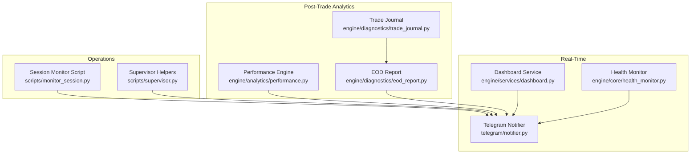
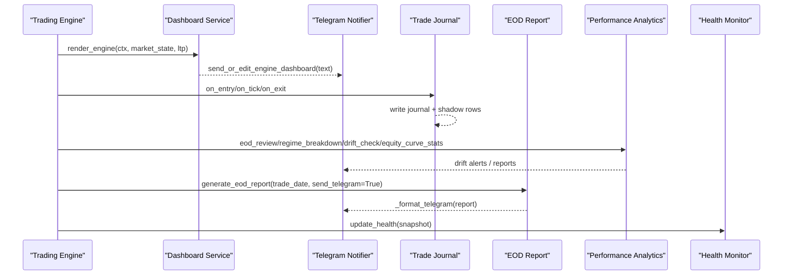
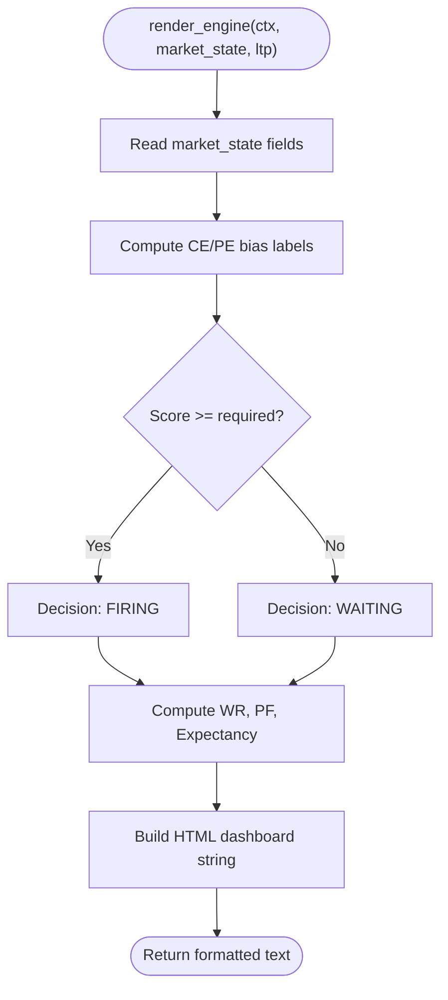
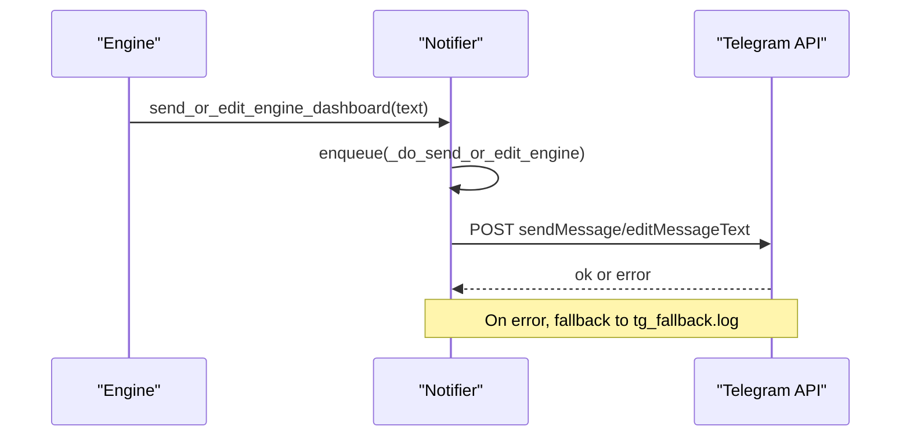
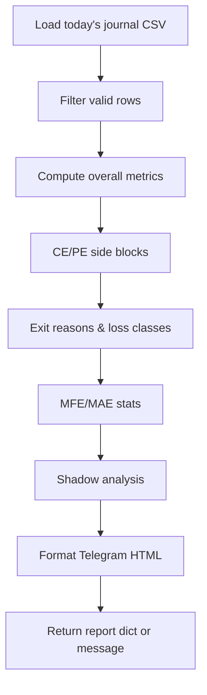
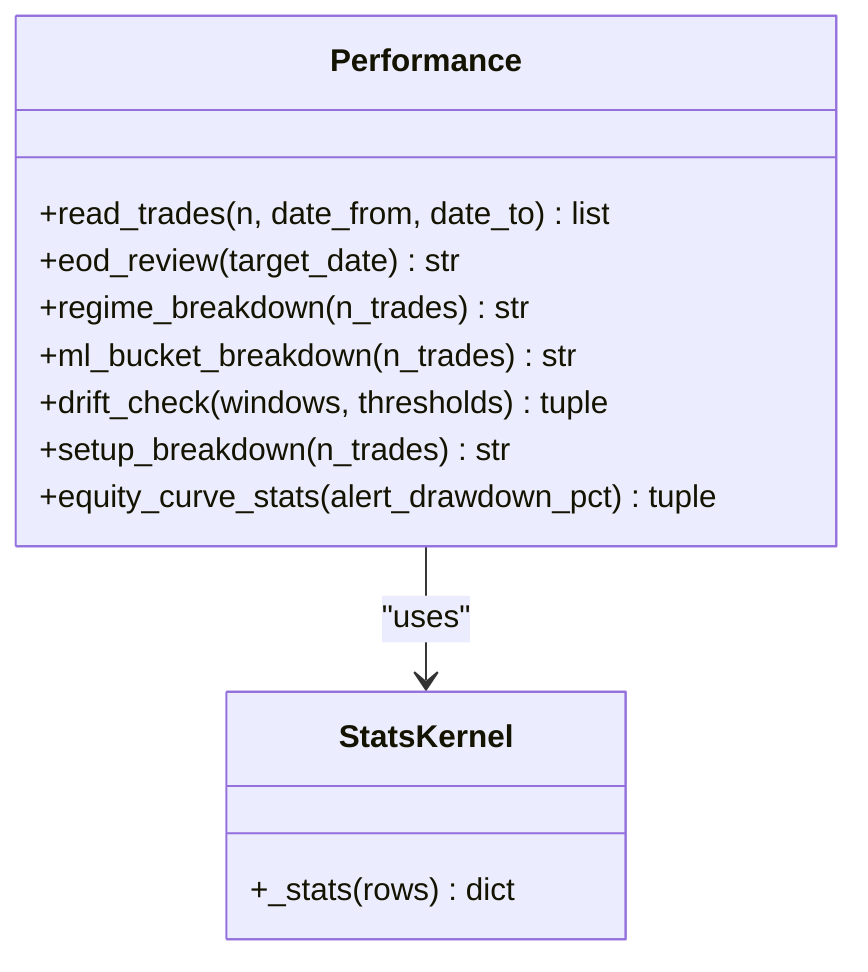
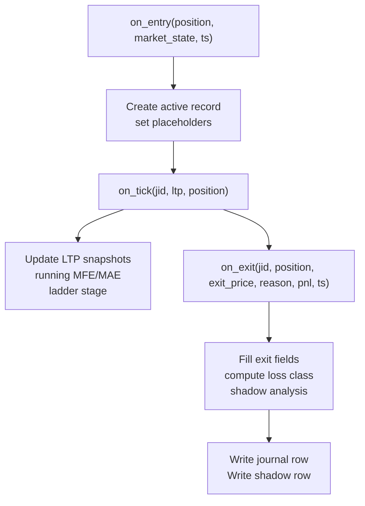
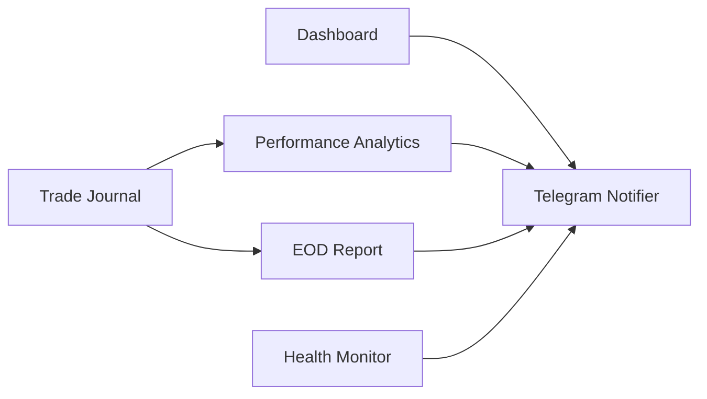

# Monitoring and Analytics

<cite>
**Referenced Files in This Document**
- [dashboard.py](file://engine/services/dashboard.py)
- [eod_report.py](file://engine/diagnostics/eod_report.py)
- [performance.py](file://engine/analytics/performance.py)
- [notifier.py](file://telegram/notifier.py)
- [trade_journal.py](file://engine/diagnostics/trade_journal.py)
- [health_monitor.py](file://engine/core/health_monitor.py)
- [monitor_session.py](file://scripts/monitor_session.py)
- [supervisor.py](file://scripts/supervisor.py)
</cite>

## Table of Contents
1. [Introduction](#introduction)
2. [Project Structure](#project-structure)
3. [Core Components](#core-components)
4. [Architecture Overview](#architecture-overview)
5. [Detailed Component Analysis](#detailed-component-analysis)
6. [Dependency Analysis](#dependency-analysis)
7. [Performance Considerations](#performance-considerations)
8. [Troubleshooting Guide](#troubleshooting-guide)
9. [Conclusion](#conclusion)
10. [Appendices](#appendices)

## Introduction
This document explains the monitoring and analytics subsystem that provides real-time visibility into trading operations and performance. It covers:
- Live dashboards for AI engine status and market conditions
- End-of-day reporting with comprehensive trade analysis
- Performance analytics engine for key metrics (win rate, profit factor, expectancy, drawdown, capture ratio)
- Telegram notification system for alerts, confirmations, and persistent dashboards
- Trade journaling for recording and analyzing activity
- Operational guidance for custom rules, external integrations, data retention, log rotation, and production performance considerations

## Project Structure
The monitoring and analytics subsystem spans several modules:
- Real-time dashboards and notifications via Telegram
- Post-trade analytics and drift monitoring
- End-of-day reporting from daily journals
- Trade journaling with loss classification and shadow analysis
- System health snapshots and operational scripts for monitoring logs

**Diagram sources**
- [dashboard.py:61-144](file://engine/services/dashboard.py#L61-L144)
- [notifier.py:373-379](file://telegram/notifier.py#L373-L379)
- [health_monitor.py:12-48](file://engine/core/health_monitor.py#L12-L48)
- [performance.py:143-219](file://engine/analytics/performance.py#L143-L219)
- [eod_report.py:124-178](file://engine/diagnostics/eod_report.py#L124-L178)
- [trade_journal.py:229-256](file://engine/diagnostics/trade_journal.py#L229-L256)
- [monitor_session.py:40-68](file://scripts/monitor_session.py#L40-L68)
- [supervisor.py:116-130](file://scripts/supervisor.py#L116-L130)

**Section sources**
- [dashboard.py:61-144](file://engine/services/dashboard.py#L61-L144)
- [notifier.py:373-379](file://telegram/notifier.py#L373-L379)
- [health_monitor.py:12-48](file://engine/core/health_monitor.py#L12-L48)
- [performance.py:143-219](file://engine/analytics/performance.py#L143-L219)
- [eod_report.py:124-178](file://engine/diagnostics/eod_report.py#L124-L178)
- [trade_journal.py:229-256](file://engine/diagnostics/trade_journal.py#L229-L256)
- [monitor_session.py:40-68](file://scripts/monitor_session.py#L40-L68)
- [supervisor.py:116-130](file://scripts/supervisor.py#L116-L130)

## Core Components
- Dashboard service renders two rich Telegram dashboards: an AI engine dashboard and a live market dashboard. It formats technicals, ML bias, scoring, decision state, and today’s PnL summary.
- Telegram notifier manages persistent edit-in-place messages, trade confirmation prompts, command polling, and fallback logging when Telegram is unreachable.
- Performance analytics reads trade logs to compute win rate, profit factor, expectancy, capture ratio, regime breakdown, ML signal quality buckets, drift alerts, and equity curve stats.
- EOD report builds structured summaries from the daily journal CSV, including overall metrics, side-specific stats, exit reasons, loss classes, MFE/MAE, and shadow analysis.
- Trade journal records entry snapshots, intra-trade LTP snapshots, running MFE/MAE, exit details, loss classification, and shadow analysis; it writes to per-day CSV files safely under a lock.
- Health monitor writes a JSON snapshot of core metrics and system state to disk for external consumption.

**Section sources**
- [dashboard.py:61-144](file://engine/services/dashboard.py#L61-L144)
- [notifier.py:373-379](file://telegram/notifier.py#L373-L379)
- [performance.py:94-128](file://engine/analytics/performance.py#L94-L128)
- [eod_report.py:124-178](file://engine/diagnostics/eod_report.py#L124-L178)
- [trade_journal.py:229-256](file://engine/diagnostics/trade_journal.py#L229-L256)
- [health_monitor.py:12-48](file://engine/core/health_monitor.py#L12-L48)

## Architecture Overview
The subsystem integrates real-time dashboards, post-trade analytics, and operational monitoring through Telegram and file-based artifacts.

**Diagram sources**
- [dashboard.py:61-144](file://engine/services/dashboard.py#L61-L144)
- [notifier.py:373-379](file://telegram/notifier.py#L373-L379)
- [trade_journal.py:297-491](file://engine/diagnostics/trade_journal.py#L297-L491)
- [performance.py:143-219](file://engine/analytics/performance.py#L143-L219)
- [eod_report.py:124-178](file://engine/diagnostics/eod_report.py#L124-L178)
- [health_monitor.py:12-48](file://engine/core/health_monitor.py#L12-L48)

## Detailed Component Analysis

### Dashboard Service
- Renders two dashboards:
  - AI Engine: technical indicators, ML bias bars, thresholds, scoring pass/fail, decision state, and today’s PnL, win rate, profit factor, expectancy.
  - Live Market: current position details (entry, LTP, PnL, trailing SL ladder), ORB status, VWAP, engine state.
- Uses helper functions to format bars, labels, arrows, and colorized PnL strings.
- Backward-compatible render alias maps legacy inputs to modern market state fields.

**Diagram sources**
- [dashboard.py:61-144](file://engine/services/dashboard.py#L61-L144)

**Section sources**
- [dashboard.py:61-144](file://engine/services/dashboard.py#L61-L144)
- [dashboard.py:151-226](file://engine/services/dashboard.py#L151-L226)
- [dashboard.py:230-253](file://engine/services/dashboard.py#L230-L253)

### Telegram Notification System
- Persistent dual dashboards: engine and market messages are created once and edited in place across cycles. Message IDs persist in a state file to survive restarts.
- Background worker thread processes a queue of Telegram requests to avoid blocking the trading loop.
- Trade confirmation flow: sends a message with YES/SKIP buttons and auto-executes after a timeout unless skipped.
- Command poller handles commands like pause/resume/stop, threshold overrides, dashboard reset, and status retrieval.
- Fallback logging to a local file if Telegram API calls fail.

**Diagram sources**
- [notifier.py:117-163](file://telegram/notifier.py#L117-L163)
- [notifier.py:205-263](file://telegram/notifier.py#L205-L263)
- [notifier.py:333-379](file://telegram/notifier.py#L333-L379)
- [notifier.py:544-579](file://telegram/notifier.py#L544-L579)
- [notifier.py:600-704](file://telegram/notifier.py#L600-L704)

**Section sources**
- [notifier.py:117-163](file://telegram/notifier.py#L117-L163)
- [notifier.py:205-263](file://telegram/notifier.py#L205-L263)
- [notifier.py:333-379](file://telegram/notifier.py#L333-L379)
- [notifier.py:544-579](file://telegram/notifier.py#L544-L579)
- [notifier.py:600-704](file://telegram/notifier.py#L600-L704)

### End-of-Day Reporting
- Reads the day’s journal CSV from data/diagnostics/journals.
- Computes overall metrics: trades, wins, losses, win rate, profit factor, expectancy, gross profit/loss, net PnL, max drawdown.
- Side-specific blocks for CE and PE: n, win rate, profit factor, expectancy, average win/loss, total.
- Exit reason aggregation and loss class distribution.
- MFE/MAE statistics and percentage of zero MFE and profitable-then-lost trades.
- Shadow analysis: how many trades would have been blocked by HTF/ML filters and whether alternative exits (BE@3, trail@10) would improve outcomes.
- Optional formatting to Telegram HTML and logging.

**Diagram sources**
- [eod_report.py:18-35](file://engine/diagnostics/eod_report.py#L18-L35)
- [eod_report.py:45-121](file://engine/diagnostics/eod_report.py#L45-L121)
- [eod_report.py:124-178](file://engine/diagnostics/eod_report.py#L124-L178)
- [eod_report.py:199-250](file://engine/diagnostics/eod_report.py#L199-L250)

**Section sources**
- [eod_report.py:18-35](file://engine/diagnostics/eod_report.py#L18-L35)
- [eod_report.py:45-121](file://engine/diagnostics/eod_report.py#L45-L121)
- [eod_report.py:124-178](file://engine/diagnostics/eod_report.py#L124-L178)
- [eod_report.py:199-250](file://engine/diagnostics/eod_report.py#L199-L250)

### Performance Analytics Engine
- Reads trade logs from data/trades (trade_log_*.csv).
- Shared stats kernel computes win rate, profit factor, expectancy, average MFE/MAE, capture ratio, best/worst trades, and average holding time.
- Features:
  - Daily auto review: summarizes trades, highlights best/worst, top exit/setup reasons, and regime breakdown.
  - Regime breakdown: groups trades by regime and computes stats per regime.
  - ML signal quality: buckets by probability ranges and shows WR, avg PnL, MFE, capture.
  - Strategy drift monitor: checks windows (e.g., last 20/50/100 trades) against thresholds for win rate, expectancy, profit factor, capture; returns alerts when breached.
  - Equity curve stats: daily aggregation, max drawdown, recovery factor, consecutive win/loss streaks, weekly/monthly rollups; alerts on drawdown breaches.

**Diagram sources**
- [performance.py:47-87](file://engine/analytics/performance.py#L47-L87)
- [performance.py:94-128](file://engine/analytics/performance.py#L94-L128)
- [performance.py:143-219](file://engine/analytics/performance.py#L143-L219)
- [performance.py:226-251](file://engine/analytics/performance.py#L226-L251)
- [performance.py:258-287](file://engine/analytics/performance.py#L258-L287)
- [performance.py:294-356](file://engine/analytics/performance.py#L294-L356)
- [performance.py:363-394](file://engine/analytics/performance.py#L363-L394)
- [performance.py:401-486](file://engine/analytics/performance.py#L401-L486)

**Section sources**
- [performance.py:47-87](file://engine/analytics/performance.py#L47-L87)
- [performance.py:94-128](file://engine/analytics/performance.py#L94-L128)
- [performance.py:143-219](file://engine/analytics/performance.py#L143-L219)
- [performance.py:226-251](file://engine/analytics/performance.py#L226-L251)
- [performance.py:258-287](file://engine/analytics/performance.py#L258-L287)
- [performance.py:294-356](file://engine/analytics/performance.py#L294-L356)
- [performance.py:363-394](file://engine/analytics/performance.py#L363-L394)
- [performance.py:401-486](file://engine/analytics/performance.py#L401-L486)

### Trade Journal
- Records entry snapshots with market context (VWAP state, HTF trend, ORB state), ML probabilities, ATR, quantity.
- Intra-trade ticks update LTP snapshots at 5s/10s/30s/60s and track running MFE/MAE and highest ladder stage reached.
- On exit, finalizes record with exit price/reason, realized PnL, holding seconds, peak drawdown; classifies losses into categories (winner, immediate adverse move, spread loss, good trade reversed, stop too tight, wrong directional signal, theta decay, other); computes shadow analysis for alternative strategies (HTF/ML block, BE@3, trail@10).
- Thread-safe writes to per-day CSV files using a lock.

**Diagram sources**
- [trade_journal.py:297-380](file://engine/diagnostics/trade_journal.py#L297-L380)
- [trade_journal.py:384-419](file://engine/diagnostics/trade_journal.py#L384-L419)
- [trade_journal.py:423-491](file://engine/diagnostics/trade_journal.py#L423-L491)

**Section sources**
- [trade_journal.py:297-380](file://engine/diagnostics/trade_journal.py#L297-L380)
- [trade_journal.py:384-419](file://engine/diagnostics/trade_journal.py#L384-L419)
- [trade_journal.py:423-491](file://engine/diagnostics/trade_journal.py#L423-L491)

### System Health Monitoring
- Writes a JSON snapshot to data/system_health.json containing PnL, positions, win rate, drawdown, regime, signal, mode, latency, last order, and any additional debug fields.
- Provides a convenience snapshot builder from a TradingContext object.

**Section sources**
- [health_monitor.py:12-48](file://engine/core/health_monitor.py#L12-L48)
- [health_monitor.py:53-67](file://engine/core/health_monitor.py#L53-L67)

## Dependency Analysis
- Dashboard depends on context attributes (positions, trades_today, pnl) and market state fields to render content.
- Telegram notifier persists message IDs and coordinates background I/O; it also exposes global flags for engine control (pause/stop/threshold overrides).
- Performance analytics reads trade logs without modifying trading state; outputs are formatted for Telegram and can trigger alerts.
- EOD report reads daily journals and optionally formats Telegram messages; it relies on consistent schema in journal CSV.
- Trade journal writes to per-day CSVs and uses a lock to ensure thread safety; it does not alter strategy logic.
- Health monitor writes JSON snapshots consumed by external tools or dashboards.

**Diagram sources**
- [dashboard.py:61-144](file://engine/services/dashboard.py#L61-L144)
- [notifier.py:373-379](file://telegram/notifier.py#L373-L379)
- [performance.py:143-219](file://engine/analytics/performance.py#L143-L219)
- [eod_report.py:124-178](file://engine/diagnostics/eod_report.py#L124-L178)
- [trade_journal.py:229-256](file://engine/diagnostics/trade_journal.py#L229-L256)
- [health_monitor.py:12-48](file://engine/core/health_monitor.py#L12-L48)

**Section sources**
- [dashboard.py:61-144](file://engine/services/dashboard.py#L61-L144)
- [notifier.py:373-379](file://telegram/notifier.py#L373-L379)
- [performance.py:143-219](file://engine/analytics/performance.py#L143-L219)
- [eod_report.py:124-178](file://engine/diagnostics/eod_report.py#L124-L178)
- [trade_journal.py:229-256](file://engine/diagnostics/trade_journal.py#L229-L256)
- [health_monitor.py:12-48](file://engine/core/health_monitor.py#L12-L48)

## Performance Considerations
- Non-blocking Telegram I/O: All Telegram operations are enqueued to a background worker thread with a bounded queue to prevent stalls in the trading loop.
- Efficient edits: Edit-in-place messages reuse existing message IDs and skip redundant edits when content has not changed.
- File I/O safety: Trade journal uses a lock around writes to ensure thread safety and avoids frequent flushes during intra-trade ticks.
- Data access patterns: Performance analytics reads trade logs in sorted order and supports date filtering and limiting rows to reduce memory usage.
- Fallback logging: When Telegram API fails, messages are written to a local fallback log to preserve observability.

[No sources needed since this section provides general guidance]

## Troubleshooting Guide
- Telegram connectivity issues:
  - Check environment variables for bot token, chat ID, channel ID, admin ID.
  - If Telegram is blocked, configure TELEGRAM_PROXY to route requests through a working proxy.
  - Inspect logs/tg_fallback.log for failed send/edit attempts.
- Dashboard not updating:
  - Use /newdash to reset persistent message IDs and create fresh messages.
  - Ensure the background worker thread is alive and processing the queue.
- Drift alerts:
  - Review drift_check output for threshold breaches; adjust thresholds or investigate regime changes.
- EOD report missing data:
  - Verify that the daily journal CSV exists in data/diagnostics/journals and contains expected columns.
- Log rotation and monitoring:
  - Use scripts/monitor_session.py to tail engine logs and filter events; it detects log truncation/rotation automatically.
  - Supervisor helpers provide utilities to read PID files and recent log lines.

**Section sources**
- [notifier.py:205-263](file://telegram/notifier.py#L205-L263)
- [notifier.py:385-390](file://telegram/notifier.py#L385-L390)
- [performance.py:294-356](file://engine/analytics/performance.py#L294-L356)
- [eod_report.py:18-35](file://engine/diagnostics/eod_report.py#L18-L35)
- [monitor_session.py:40-68](file://scripts/monitor_session.py#L40-L68)
- [supervisor.py:116-130](file://scripts/supervisor.py#L116-L130)

## Conclusion
The monitoring and analytics subsystem delivers comprehensive visibility into trading operations through live dashboards, robust post-trade analytics, and automated end-of-day reporting. The Telegram integration ensures real-time alerts and persistent updates, while the trade journal provides deep insights into trade quality and potential improvements. Operational scripts support log monitoring and supervision. Together, these components enable informed decision-making, risk management, and continuous strategy refinement.

[No sources needed since this section summarizes without analyzing specific files]

## Appendices

### Examples and Usage

- Dashboard usage:
  - Call render_engine with context, market state, and LTP to get an HTML dashboard string; send via send_or_edit_engine_dashboard.
  - Call render_market with position and market state to get live market dashboard; send via send_or_edit_market_dashboard.
  - Example paths:
    - [dashboard.py:61-144](file://engine/services/dashboard.py#L61-L144)
    - [dashboard.py:151-226](file://engine/services/dashboard.py#L151-L226)
    - [notifier.py:373-379](file://telegram/notifier.py#L373-L379)

- Report interpretation:
  - Use eod_report.generate_eod_report to build a structured report; inspect overall metrics, side blocks, exit reasons, loss classes, MFE/MAE, and shadow analysis.
  - Optionally format to Telegram with send_telegram=True or use format_eod_telegram.
  - Example paths:
    - [eod_report.py:124-178](file://engine/diagnostics/eod_report.py#L124-L178)
    - [eod_report.py:199-250](file://engine/diagnostics/eod_report.py#L199-L250)

- Alert configuration:
  - Configure drift thresholds via DRIFT_DEFAULTS or override per call in drift_check; alerts are returned alongside formatted reports.
  - Example paths:
    - [performance.py:17-23](file://engine/analytics/performance.py#L17-L23)
    - [performance.py:294-356](file://engine/analytics/performance.py#L294-L356)

- Custom monitoring rules:
  - Extend drift_check thresholds or add new alert conditions based on metrics like win rate, expectancy, profit factor, capture ratio.
  - Integrate with Telegram notifier to send alerts via send_bot or send_trade_channel.
  - Example paths:
    - [performance.py:294-356](file://engine/analytics/performance.py#L294-L356)
    - [notifier.py:321-327](file://telegram/notifier.py#L321-L327)

- External monitoring integration:
  - Consume data/system_health.json for external dashboards or alerting systems.
  - Tail engine logs with scripts/monitor_session.py to filter and forward events.
  - Example paths:
    - [health_monitor.py:12-48](file://engine/core/health_monitor.py#L12-L48)
    - [monitor_session.py:40-68](file://scripts/monitor_session.py#L40-L68)

### Data Retention Policies, Log Rotation, and Production Considerations
- Data retention:
  - Journals and shadow files are stored per day under data/diagnostics/journals and data/diagnostics/shadow; consider archiving or purging older files based on storage policies.
  - Trade logs in data/trades are named by week; manage retention accordingly.
- Log rotation:
  - scripts/monitor_session.py detects log truncation/rotation and resets its read position; integrate with OS-level log rotation tools if needed.
- Production performance:
  - Keep Telegram I/O non-blocking via the background worker; tune queue size and poll intervals if necessary.
  - Limit analytics queries by date range and row count to reduce memory usage.
  - Use fallback logging to maintain observability when Telegram is unavailable.

[No sources needed since this section provides general guidance]