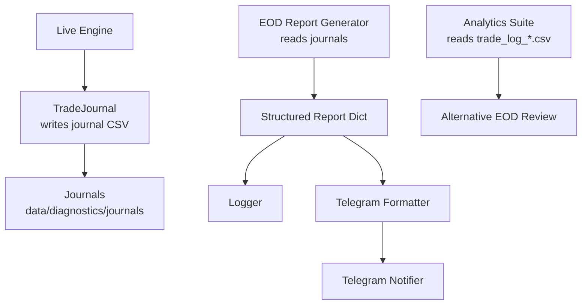
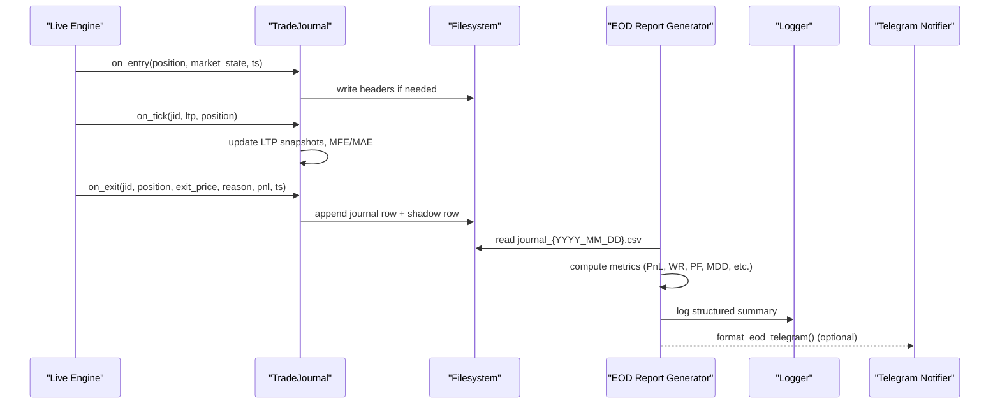
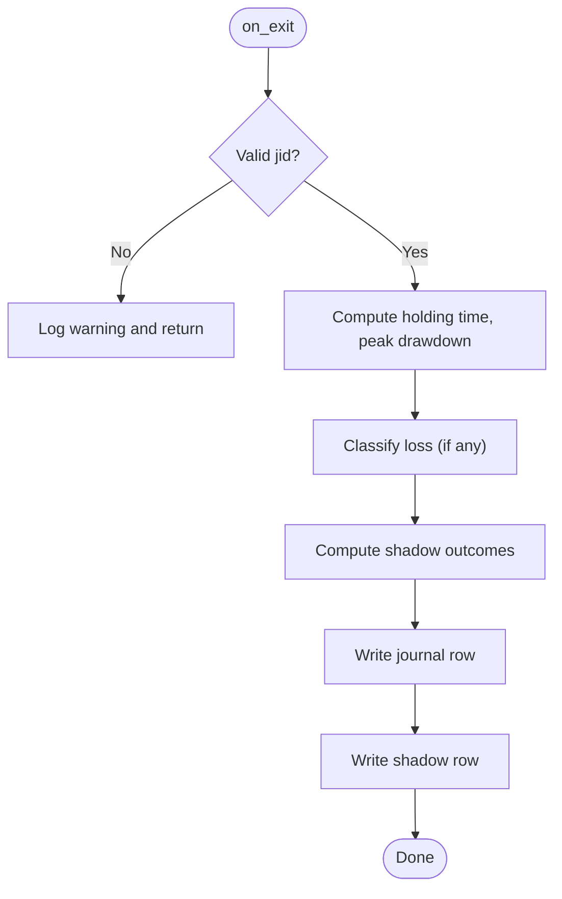
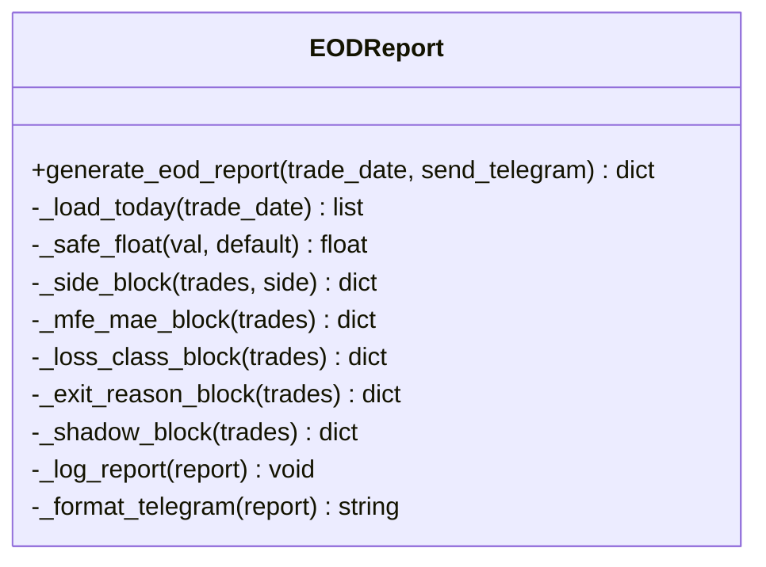
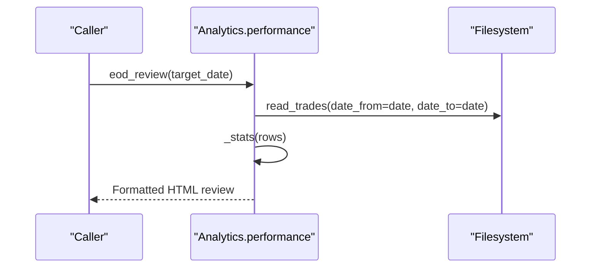
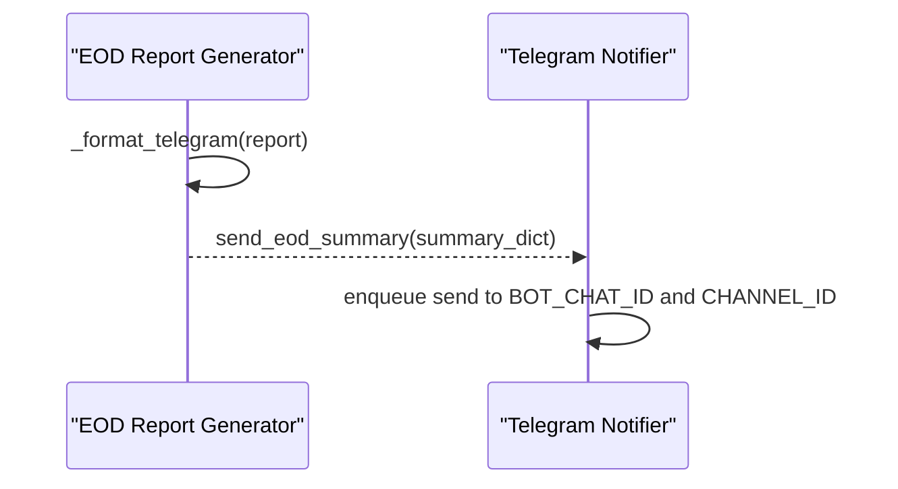
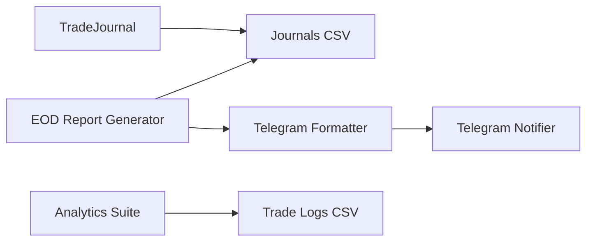

# End-of-Day Reports

<cite>
**Referenced Files in This Document**
- [eod_report.py](file://engine/diagnostics/eod_report.py)
- [trade_journal.py](file://engine/diagnostics/trade_journal.py)
- [performance.py](file://engine/analytics/performance.py)
- [notifier.py](file://telegram/notifier.py)
- [master_runner.py](file://master_runner.py)
- [session_version.json](file://data/diagnostics/session_version.json)
</cite>

## Table of Contents
1. [Introduction](#introduction)
2. [Project Structure](#project-structure)
3. [Core Components](#core-components)
4. [Architecture Overview](#architecture-overview)
5. [Detailed Component Analysis](#detailed-component-analysis)
6. [Dependency Analysis](#dependency-analysis)
7. [Performance Considerations](#performance-considerations)
8. [Troubleshooting Guide](#troubleshooting-guide)
9. [Conclusion](#conclusion)
10. [Appendices](#appendices)

## Introduction
This document explains the End-of-Day (EOD) reporting system that transforms daily trading journals into structured performance summaries. It covers how trade data is loaded, how P&L and related metrics are computed, and how reports are formatted for logging and Telegram notifications. It also documents the journal file schema, validation and error handling, report structure (overall metrics, CE/PE breakdowns, exit reasons, loss classification, MFE/MAE analysis, shadow analysis), configuration options, date filtering, and export formats.

## Project Structure
The EOD reporting pipeline spans three main areas:
- Journaling and data capture during live sessions
- EOD report generation from daily journals
- Analytics and alternative EOD reviews from consolidated trade logs

**Diagram sources**
- [trade_journal.py:229-508](file://engine/diagnostics/trade_journal.py#L229-L508)
- [eod_report.py:124-178](file://engine/diagnostics/eod_report.py#L124-L178)
- [performance.py:143-219](file://engine/analytics/performance.py#L143-L219)
- [notifier.py:721-753](file://telegram/notifier.py#L721-L753)

**Section sources**
- [trade_journal.py:229-508](file://engine/diagnostics/trade_journal.py#L229-L508)
- [eod_report.py:124-178](file://engine/diagnostics/eod_report.py#L124-L178)
- [performance.py:143-219](file://engine/analytics/performance.py#L143-L219)
- [notifier.py:721-753](file://telegram/notifier.py#L721-L753)

## Core Components
- TradeJournal: Captures entry snapshots, tick updates, and exits; computes MFE/MAE and writes per-day journal and shadow files.
- EOD Report Generator: Reads the day’s journal CSV, computes overall metrics, CE/PE breakdowns, exit reason stats, loss classes, MFE/MAE insights, and shadow analysis.
- Analytics Suite: Provides an alternative EOD review by reading consolidated trade logs with additional breakdowns and drift monitoring.
- Telegram Notifier: Sends or edits persistent messages and can receive EOD summaries.

Key responsibilities:
- Data capture and persistence (journaling)
- Metric computation (P&L, win rate, profit factor, drawdown, MFE/MAE, shadow)
- Formatting for human consumption (logs and Telegram)
- Optional integration points for scheduling and alerts

**Section sources**
- [trade_journal.py:31-73](file://engine/diagnostics/trade_journal.py#L31-L73)
- [trade_journal.py:78-184](file://engine/diagnostics/trade_journal.py#L78-L184)
- [trade_journal.py:229-508](file://engine/diagnostics/trade_journal.py#L229-L508)
- [eod_report.py:18-42](file://engine/diagnostics/eod_report.py#L18-L42)
- [eod_report.py:45-121](file://engine/diagnostics/eod_report.py#L45-L121)
- [eod_report.py:124-178](file://engine/diagnostics/eod_report.py#L124-L178)
- [performance.py:47-87](file://engine/analytics/performance.py#L47-L87)
- [performance.py:143-219](file://engine/analytics/performance.py#L143-L219)
- [notifier.py:721-753](file://telegram/notifier.py#L721-L753)

## Architecture Overview
The EOD system follows a clear separation between data capture and analytics:
- During trading, TradeJournal records granular trade lifecycle events to CSV files under data/diagnostics.
- At end-of-day, the EOD report generator reads the relevant daily journal CSV and produces a structured report dict containing overall metrics, side-specific breakdowns, exit reasons, loss classes, MFE/MAE insights, and shadow analysis.
- The report is logged and optionally formatted for Telegram. An alternative analytics path reads consolidated trade logs for broader reviews and drift monitoring.

**Diagram sources**
- [trade_journal.py:297-491](file://engine/diagnostics/trade_journal.py#L297-L491)
- [eod_report.py:23-35](file://engine/diagnostics/eod_report.py#L23-L35)
- [eod_report.py:124-178](file://engine/diagnostics/eod_report.py#L124-L178)
- [notifier.py:721-753](file://telegram/notifier.py#L721-L753)

## Detailed Component Analysis

### TradeJournal: Data Capture and Validation
- Schema: Defines explicit columns for identity, entry snapshot, intra-trade extremes, exit details, loss classification, and shadow fields. Ensures consistent CSV structure across days.
- Lifecycle:
  - on_entry: Creates a unique journal_id, captures market state context (VWAP, HTF trend, ORB), initializes in-memory tracking for MFE/MAE and ladder stage.
  - on_tick: Updates LTP snapshots at 5/10/30/60 seconds and running MFE/MAE without file I/O.
  - on_exit: Finalizes record, classifies losses, computes shadow outcomes, and writes both journal and shadow rows.
- Validation and Error Handling:
  - Uses safe defaults when numeric conversion fails.
  - Guards against unknown jid on exit with warnings.
  - Thread-safe writes via a lock to prevent corruption.

**Diagram sources**
- [trade_journal.py:423-491](file://engine/diagnostics/trade_journal.py#L423-L491)

**Section sources**
- [trade_journal.py:31-73](file://engine/diagnostics/trade_journal.py#L31-L73)
- [trade_journal.py:78-184](file://engine/diagnostics/trade_journal.py#L78-L184)
- [trade_journal.py:229-508](file://engine/diagnostics/trade_journal.py#L229-L508)

### EOD Report Generator: Metrics and Structure
- Data Loading:
  - Locates today’s journal CSV by date; returns empty list if missing.
  - Safely parses rows, ignoring malformed entries.
- Metric Computation:
  - Overall: trades count, wins/losses, win rate, profit factor, expectancy, gross profit/loss, net P&L, max drawdown via running equity.
  - Side Breakdowns: CE and PE separately compute n, win rate, profit factor, expectancy, average win/loss, total.
  - Exit Reasons: Counts and aggregated P&L per exit reason.
  - Loss Classes: Distribution of loss categories excluding winners.
  - MFE/MAE: Percentages for zero MFE and profitable-then-lost scenarios; averages for MFE/MAE; average peak before stop.
  - Shadow Analysis: Counts where HTF or ML95 would have blocked; counts where BE@3 or Trail@10 would improve outcome.
- Output:
  - Logs a concise summary.
  - Formats HTML for Telegram if requested.

**Diagram sources**
- [eod_report.py:18-42](file://engine/diagnostics/eod_report.py#L18-L42)
- [eod_report.py:45-121](file://engine/diagnostics/eod_report.py#L45-L121)
- [eod_report.py:124-178](file://engine/diagnostics/eod_report.py#L124-L178)
- [eod_report.py:181-256](file://engine/diagnostics/eod_report.py#L181-L256)

**Section sources**
- [eod_report.py:23-35](file://engine/diagnostics/eod_report.py#L23-L35)
- [eod_report.py:45-121](file://engine/diagnostics/eod_report.py#L45-L121)
- [eod_report.py:124-178](file://engine/diagnostics/eod_report.py#L124-L178)
- [eod_report.py:181-256](file://engine/diagnostics/eod_report.py#L181-L256)

### Analytics Suite: Alternative EOD Review
- Reads consolidated trade logs (trade_log_*.csv) rather than daily journals.
- Provides:
  - Daily EOD review with highlights, regime breakdowns, and top exit/setup reasons.
  - Regime performance breakdowns.
  - ML signal quality by probability buckets.
  - Strategy drift monitoring with configurable thresholds.
  - Equity curve stats including drawdown and recovery factors.

**Diagram sources**
- [performance.py:47-87](file://engine/analytics/performance.py#L47-L87)
- [performance.py:143-219](file://engine/analytics/performance.py#L143-L219)

**Section sources**
- [performance.py:47-87](file://engine/analytics/performance.py#L47-L87)
- [performance.py:143-219](file://engine/analytics/performance.py#L143-L219)
- [performance.py:226-251](file://engine/analytics/performance.py#L226-L251)
- [performance.py:258-287](file://engine/analytics/performance.py#L258-L287)
- [performance.py:294-356](file://engine/analytics/performance.py#L294-L356)
- [performance.py:401-487](file://engine/analytics/performance.py#L401-L487)

### Telegram Integration
- EOD formatting:
  - The EOD report generator can produce an HTML-formatted message for Telegram.
- Sending:
  - The notifier provides functions to enqueue sending messages to bot chat and channel.
  - There is also a dedicated function to send an end-of-day summary using a simplified summary dict.

**Diagram sources**
- [eod_report.py:199-256](file://engine/diagnostics/eod_report.py#L199-L256)
- [notifier.py:721-753](file://telegram/notifier.py#L721-L753)

**Section sources**
- [eod_report.py:199-256](file://engine/diagnostics/eod_report.py#L199-L256)
- [notifier.py:721-753](file://telegram/notifier.py#L721-L753)

## Dependency Analysis
- TradeJournal depends on filesystem paths for journals/shadow directories and writes session version metadata.
- EOD Report Generator depends on the daily journal CSV produced by TradeJournal.
- Analytics Suite depends on consolidated trade logs and provides complementary views.
- Telegram Notifier depends on environment variables for credentials and proxies and uses a background thread for non-blocking sends.

**Diagram sources**
- [trade_journal.py:22-28](file://engine/diagnostics/trade_journal.py#L22-L28)
- [trade_journal.py:265-282](file://engine/diagnostics/trade_journal.py#L265-L282)
- [eod_report.py:15-35](file://engine/diagnostics/eod_report.py#L15-L35)
- [performance.py:15-44](file://engine/analytics/performance.py#L15-L44)
- [notifier.py:38-63](file://telegram/notifier.py#L38-L63)

**Section sources**
- [trade_journal.py:22-28](file://engine/diagnostics/trade_journal.py#L22-L28)
- [trade_journal.py:265-282](file://engine/diagnostics/trade_journal.py#L265-L282)
- [eod_report.py:15-35](file://engine/diagnostics/eod_report.py#L15-L35)
- [performance.py:15-44](file://engine/analytics/performance.py#L15-L44)
- [notifier.py:38-63](file://telegram/notifier.py#L38-L63)

## Performance Considerations
- Journaling minimizes I/O during ticks by keeping MFE/MAE and LTP snapshots in memory until exit.
- EOD report loading is lightweight: reads a single daily CSV and performs O(n) computations.
- Profit factor avoids division by zero by using a small epsilon when gross loss is zero.
- Telegram sends are enqueued to avoid blocking the engine loop.

[No sources needed since this section provides general guidance]

## Troubleshooting Guide
Common issues and mitigations:
- Missing journal file:
  - If no journal exists for the target date, the EOD generator returns an empty report and logs accordingly.
- Malformed rows:
  - Row parsing errors are caught and skipped to prevent crashes.
- Unknown journal ID on exit:
  - Logged as a warning; ensures robustness if on_exit is called without a prior on_entry.
- Telegram connectivity:
  - Environment variables must be set; fallback logging is used if API calls fail.

Operational checks:
- Verify data/diagnostics/journals contains journal_YYYY_MM_DD.csv for the target date.
- Confirm session_version.json reflects current git commit and config version.
- Ensure TELEGRAM_* environment variables are configured for notifications.

**Section sources**
- [eod_report.py:23-35](file://engine/diagnostics/eod_report.py#L23-L35)
- [eod_report.py:124-132](file://engine/diagnostics/eod_report.py#L124-L132)
- [trade_journal.py:437-439](file://engine/diagnostics/trade_journal.py#L437-L439)
- [notifier.py:38-63](file://telegram/notifier.py#L38-L63)
- [session_version.json:1-7](file://data/diagnostics/session_version.json#L1-L7)

## Conclusion
The EOD reporting system provides a robust, modular approach to summarizing daily trading performance. It separates data capture from analytics, ensuring reliable journaling and flexible reporting. The structured report includes comprehensive metrics and analyses, while optional Telegram integration enables timely distribution. The alternative analytics suite offers additional insights from consolidated trade logs. Together, these components deliver actionable end-of-day intelligence with minimal impact on live trading.

[No sources needed since this section summarizes without analyzing specific files]

## Appendices

### Journal File Format
- Columns include identity, entry snapshot, intra-trade LTP snapshots, extremes (MFE/MAE), exit details, loss classification, and shadow fields.
- Headers are ensured at startup for both journal and shadow CSVs.

**Section sources**
- [trade_journal.py:31-73](file://engine/diagnostics/trade_journal.py#L31-L73)
- [trade_journal.py:265-282](file://engine/diagnostics/trade_journal.py#L265-L282)

### Report Structure
- Overall metrics: trades, wins, losses, win rate, profit factor, expectancy, gross profit/loss, net P&L, max drawdown.
- CE/PE breakdowns: per-side statistics.
- Exit reasons: counts and aggregated P&L.
- Loss classes: distribution of loss categories.
- MFE/MAE analysis: percentages and averages.
- Shadow analysis: hypothetical improvements and blocks.

**Section sources**
- [eod_report.py:45-121](file://engine/diagnostics/eod_report.py#L45-L121)
- [eod_report.py:124-178](file://engine/diagnostics/eod_report.py#L124-L178)

### Configuration Options
- Date filtering:
  - EOD report supports specifying a trade_date to generate reports for past dates.
  - Analytics suite supports date ranges via read_trades parameters.
- Export formats:
  - Primary output is a structured dictionary; Telegram formatter produces HTML strings.
  - Underlying data persists as CSV files for further analysis.

**Section sources**
- [eod_report.py:18-20](file://engine/diagnostics/eod_report.py#L18-L20)
- [performance.py:47-87](file://engine/analytics/performance.py#L47-L87)

### Example Outputs
- Log summary:
  - Includes trades, win rate, profit factor, expectancy, net P&L, and max drawdown.
- Telegram message:
  - Structured HTML with sections for overall, CE/PE, MFE/MAE, shadow analysis, exit reasons, and loss categories.

**Section sources**
- [eod_report.py:181-256](file://engine/diagnostics/eod_report.py#L181-L256)

### Integration Points
- Master runner triggers EOD-related tasks around session close and can call analytics or EOD functions.
- Telegram notifier provides functions to send summaries and manage persistent dashboards.

**Section sources**
- [master_runner.py:2115-2137](file://master_runner.py#L2115-L2137)
- [notifier.py:721-753](file://telegram/notifier.py#L721-L753)