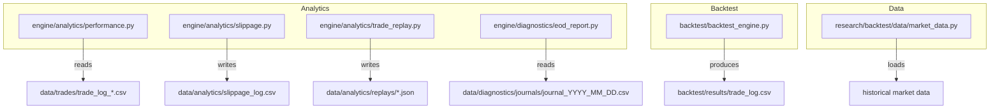
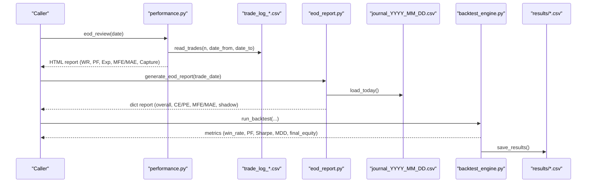
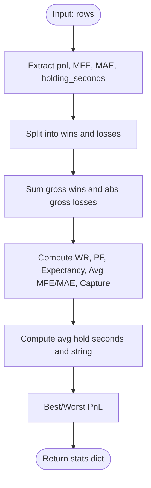
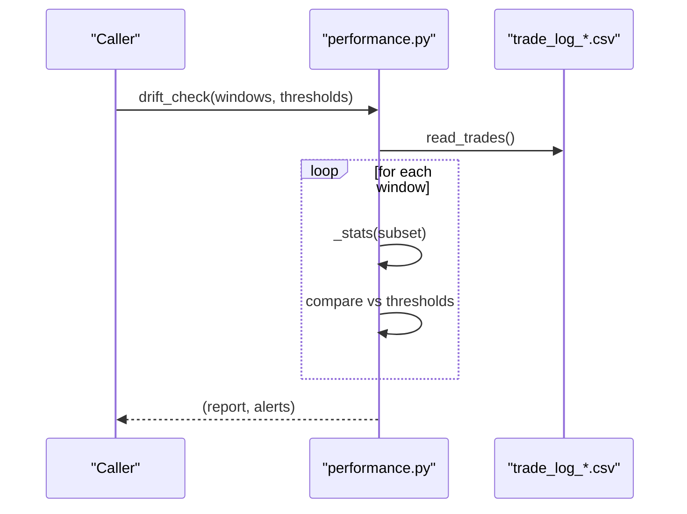
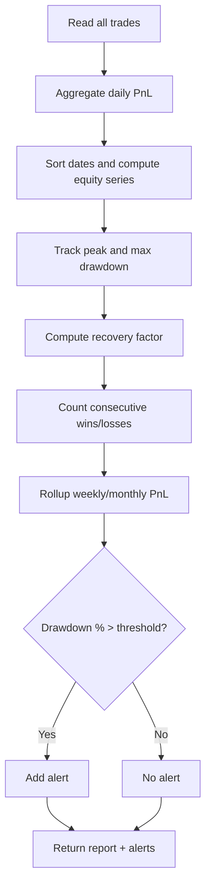
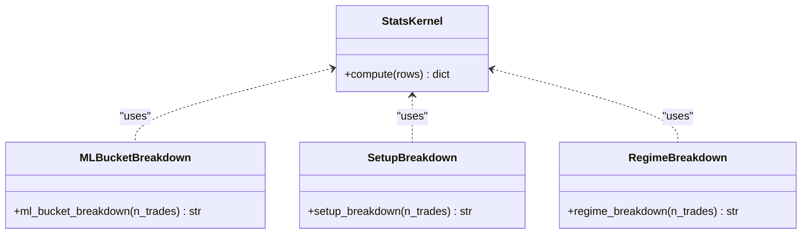
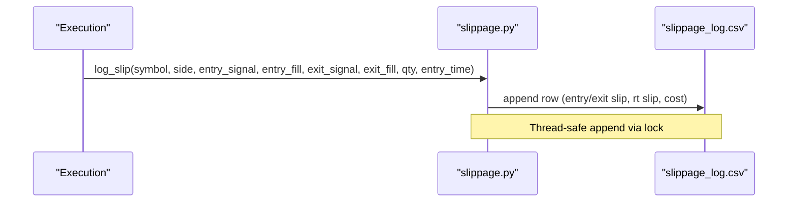
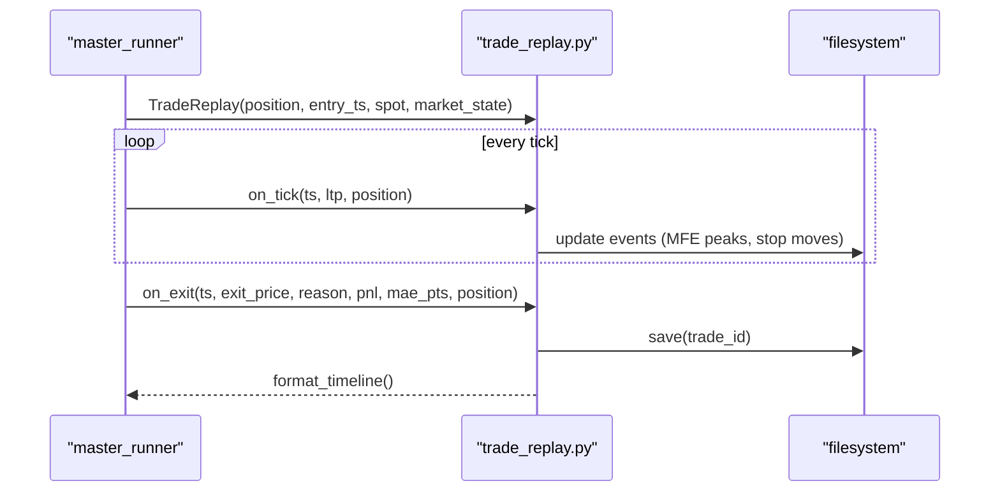
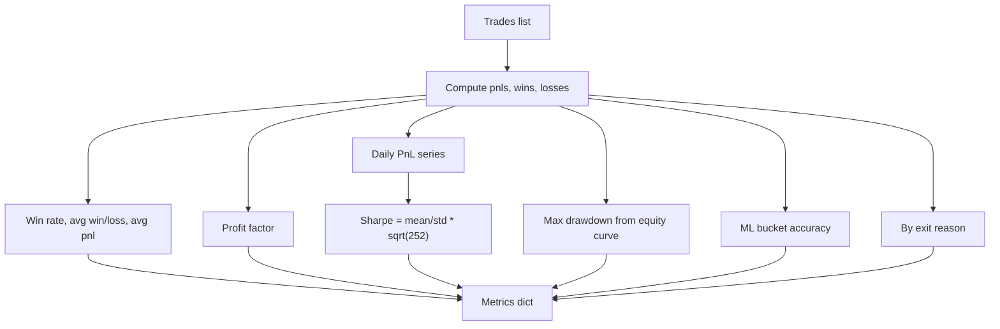
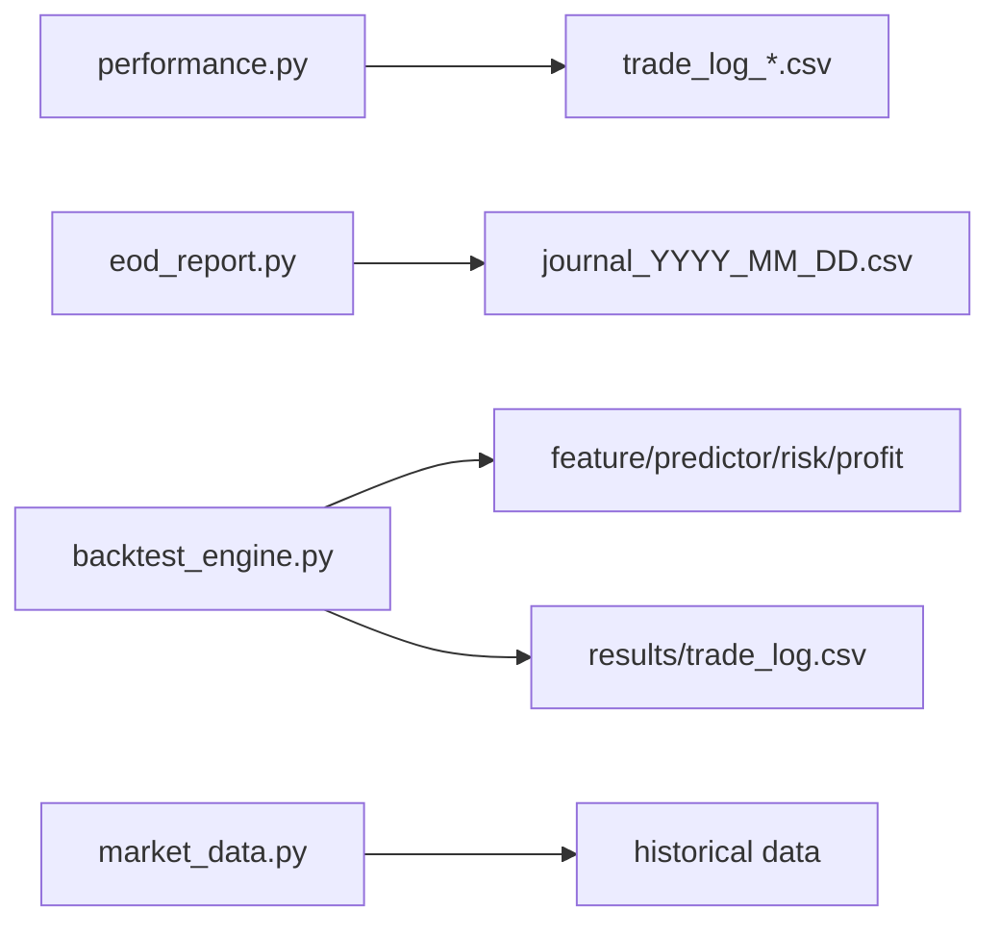

# Performance Metrics Calculation

<cite>
**Referenced Files in This Document**
- [performance.py](file://engine/analytics/performance.py)
- [eod_report.py](file://engine/diagnostics/eod_report.py)
- [backtest_engine.py](file://backtest/backtest_engine.py)
- [slippage.py](file://engine/analytics/slippage.py)
- [trade_replay.py](file://engine/analytics/trade_replay.py)
- [market_data.py](file://research/backtest/data/market_data.py)
</cite>

## Table of Contents
1. [Introduction](#introduction)
2. [Project Structure](#project-structure)
3. [Core Components](#core-components)
4. [Architecture Overview](#architecture-overview)
5. [Detailed Component Analysis](#detailed-component-analysis)
6. [Dependency Analysis](#dependency-analysis)
7. [Performance Considerations](#performance-considerations)
8. [Troubleshooting Guide](#troubleshooting-guide)
9. [Conclusion](#conclusion)
10. [Appendices](#appendices)

## Introduction
This document explains the performance analytics engine that calculates key trading metrics and statistical measures used to evaluate strategy performance. It covers how win rate, profit factor, expectancy, maximum drawdown, Sharpe ratio, recovery factor, capture ratio, MFE/MAE, slippage, equity curve statistics, and ML signal quality are computed from trade logs and backtest outputs. It also describes data aggregation processes (daily/weekly/monthly rollups), time-series analysis (equity curves and drawdowns), benchmarking procedures (by regime, setup, exit reason, ML probability buckets), historical comparison capabilities, visualization methods, integration points with reporting systems, and scalability considerations for large datasets.

## Project Structure
The performance analytics system is primarily implemented under:
- Post-trade analytics and reports: engine/analytics/* and engine/diagnostics/*
- Backtesting metrics and export: backtest/backtest_engine.py
- Data loading utilities for research backtests: research/backtest/data/market_data.py

**Diagram sources**
- [performance.py:37-87](file://engine/analytics/performance.py#L37-L87)
- [slippage.py:28-65](file://engine/analytics/slippage.py#L28-L65)
- [trade_replay.py:15-223](file://engine/analytics/trade_replay.py#L15-L223)
- [eod_report.py:18-35](file://engine/diagnostics/eod_report.py#L18-L35)
- [backtest_engine.py:1379-1426](file://backtest/backtest_engine.py#L1379-L1426)
- [market_data.py:13-44](file://research/backtest/data/market_data.py#L13-L44)

**Section sources**
- [performance.py:37-87](file://engine/analytics/performance.py#L37-L87)
- [eod_report.py:18-35](file://engine/diagnostics/eod_report.py#L18-L35)
- [backtest_engine.py:1379-1426](file://backtest/backtest_engine.py#L1379-L1426)
- [market_data.py:13-44](file://research/backtest/data/market_data.py#L13-L44)

## Core Components
- Trade log reader and shared stats kernel: reads trade CSVs, computes win rate, profit factor, expectancy, MFE/MAE averages, capture ratio, best/worst PnL, average holding time.
- End-of-day review and drift monitoring: aggregates daily trades, computes regime breakdown, ML bucket quality, and alerts on metric drift across rolling windows.
- Equity curve analytics: builds daily equity series, computes max drawdown, recovery factor, consecutive win/loss streaks, weekly/monthly rollups, and drawdown alerts.
- Slippage analytics: records per-trade entry/exit slippage and cost, provides side-wise summaries.
- Trade replay: captures per-trade event timeline (entry, MFE peaks, stop moves, exit) for post-trade verification and reporting.
- Backtest metrics: computes win rate, profit factor, Sharpe ratio (annualized), max drawdown, final equity, by-strategy and by-exit breakdowns, ML bucket accuracy.

**Section sources**
- [performance.py:94-128](file://engine/analytics/performance.py#L94-L128)
- [performance.py:143-219](file://engine/analytics/performance.py#L143-L219)
- [performance.py:294-356](file://engine/analytics/performance.py#L294-L356)
- [performance.py:401-486](file://engine/analytics/performance.py#L401-L486)
- [slippage.py:68-131](file://engine/analytics/slippage.py#L68-L131)
- [trade_replay.py:35-244](file://engine/analytics/trade_replay.py#L35-L244)
- [backtest_engine.py:1300-1373](file://backtest/backtest_engine.py#L1300-L1373)

## Architecture Overview
The analytics pipeline is read-only with respect to live trading state. It ingests persisted trade logs and journals, computes metrics, and returns formatted reports or structured results suitable for dashboards and Telegram messages.

**Diagram sources**
- [performance.py:47-87](file://engine/analytics/performance.py#L47-L87)
- [performance.py:143-219](file://engine/analytics/performance.py#L143-L219)
- [eod_report.py:23-35](file://engine/diagnostics/eod_report.py#L23-L35)
- [eod_report.py:124-178](file://engine/diagnostics/eod_report.py#L124-L178)
- [backtest_engine.py:1300-1373](file://backtest/backtest_engine.py#L1300-L1373)
- [backtest_engine.py:1411-1426](file://backtest/backtest_engine.py#L1411-L1426)

## Detailed Component Analysis

### Shared Statistics Kernel
- Computes per-group metrics: number of trades, wins/losses, win rate, total PnL, profit factor, expectancy, average MFE/MAE, average PnL, average hold time, capture ratio (realized PnL / MFE when MFE > threshold), best/worst PnL.
- Used by EOD review, regime breakdown, setup breakdown, drift monitor, and equity curve stats.

**Diagram sources**
- [performance.py:94-128](file://engine/analytics/performance.py#L94-L128)

**Section sources**
- [performance.py:94-128](file://engine/analytics/performance.py#L94-L128)

### End-of-Day Review and Drift Monitoring
- EOD review aggregates same-day trades, identifies best/worst trades, counts exit reasons and setups, and summarizes regime performance.
- Drift monitor evaluates rolling windows (default 20/50/100 trades) against thresholds for win rate, expectancy, profit factor, and capture ratio; emits alerts when breached.

**Diagram sources**
- [performance.py:294-356](file://engine/analytics/performance.py#L294-L356)
- [performance.py:47-87](file://engine/analytics/performance.py#L47-L87)

**Section sources**
- [performance.py:143-219](file://engine/analytics/performance.py#L143-L219)
- [performance.py:294-356](file://engine/analytics/performance.py#L294-L356)

### Equity Curve Analytics
- Builds daily PnL series from trade logs, computes cumulative equity, peak equity, and maximum drawdown.
- Calculates recovery factor (total equity / absolute max drawdown), tracks consecutive win/loss streaks, and produces weekly/monthly rollups.
- Emits a drawdown alert if drawdown percentage from peak exceeds a configurable threshold.

**Diagram sources**
- [performance.py:401-486](file://engine/analytics/performance.py#L401-L486)

**Section sources**
- [performance.py:401-486](file://engine/analytics/performance.py#L401-L486)

### ML Signal Quality and Setup/Regime Breakdowns
- ML bucket breakdown groups trades by predicted probability ranges and reports win rate, average PnL, average MFE, and capture ratio per bucket.
- Setup breakdown ranks entry setups by total PnL and shows win rate, expectancy, profit factor, and average MFE.
- Regime breakdown groups trades by market regime and reports similar metrics per regime.

**Diagram sources**
- [performance.py:94-128](file://engine/analytics/performance.py#L94-L128)
- [performance.py:258-287](file://engine/analytics/performance.py#L258-L287)
- [performance.py:363-394](file://engine/analytics/performance.py#L363-L394)
- [performance.py:226-251](file://engine/analytics/performance.py#L226-L251)

**Section sources**
- [performance.py:226-287](file://engine/analytics/performance.py#L226-L287)
- [performance.py:363-394](file://engine/analytics/performance.py#L363-L394)

### Slippage Analytics
- Records per completed trade: signal vs fill prices at entry and exit, round-trip slippage, quantity, and slippage cost in currency.
- Provides overall averages and best/worst round-trip slippage, plus side-wise breakdowns (CE/PE).

**Diagram sources**
- [slippage.py:28-65](file://engine/analytics/slippage.py#L28-L65)

**Section sources**
- [slippage.py:68-131](file://engine/analytics/slippage.py#L68-L131)

### Trade Replay
- Captures per-trade events: entry context (ML probabilities, ADX, RSI, VWAP bias, Supertrend direction), MFE peaks, stop-level changes (ladder stages), and exit details (reason, PnL, MFE/MAE).
- Persists JSON replays for offline review and formats human-readable timelines.

**Diagram sources**
- [trade_replay.py:35-244](file://engine/analytics/trade_replay.py#L35-L244)

**Section sources**
- [trade_replay.py:35-244](file://engine/analytics/trade_replay.py#L35-L244)

### Backtest Metrics and Export
- Computes win rate, average win/loss, average PnL, profit factor, Sharpe ratio (annualized using daily PnL series), max drawdown, final equity.
- Produces breakdowns by strategy (entry reason), exit reason, and ML probability buckets.
- Exports trade and day logs to CSV for downstream analysis.

**Diagram sources**
- [backtest_engine.py:1300-1373](file://backtest/backtest_engine.py#L1300-L1373)

**Section sources**
- [backtest_engine.py:1300-1373](file://backtest/backtest_engine.py#L1300-L1373)
- [backtest_engine.py:1379-1426](file://backtest/backtest_engine.py#L1379-L1426)

## Dependency Analysis
- The analytics modules depend on persisted CSV files for trade logs and journals; they do not modify live trading state.
- Backtest engine depends on feature builders, predictors, risk and profit managers to simulate trades and produce logs.
- Market data loader supports research backtests by reading historical data and filtering by date range.

**Diagram sources**
- [performance.py:37-87](file://engine/analytics/performance.py#L37-L87)
- [eod_report.py:18-35](file://engine/diagnostics/eod_report.py#L18-L35)
- [backtest_engine.py:1379-1426](file://backtest/backtest_engine.py#L1379-L1426)
- [market_data.py:13-44](file://research/backtest/data/market_data.py#L13-L44)

**Section sources**
- [performance.py:37-87](file://engine/analytics/performance.py#L37-L87)
- [eod_report.py:18-35](file://engine/diagnostics/eod_report.py#L18-L35)
- [backtest_engine.py:1379-1426](file://backtest/backtest_engine.py#L1379-L1426)
- [market_data.py:13-44](file://research/backtest/data/market_data.py#L13-L44)

## Performance Considerations
- Data access patterns:
  - Trade log reader scans multiple weekly CSV files and sorts by date/time; consider pre-indexing or partitioning by date for very large histories.
  - Daily aggregation uses dictionaries keyed by date; this is efficient but can be optimized with streaming accumulators if memory is constrained.
- Statistical computations:
  - Win rate, profit factor, expectancy, MFE/MAE averages are O(N) per group; grouping by regime/setup/bucket adds overhead proportional to number of groups.
  - Equity curve computation is O(D) where D is number of trading days; drawdown detection is single-pass.
- Concurrency:
  - Slippage logging uses a thread lock to ensure safe concurrent writes to the CSV file.
- Scalability tips:
  - Use chunked reading for massive CSVs.
  - Cache grouped results (e.g., by regime or setup) if repeatedly queried within a session.
  - For backtests, leverage vectorized operations (NumPy/Pandas) already present in the backtest engine for speed.

[No sources needed since this section provides general guidance]

## Troubleshooting Guide
- Missing trade data:
  - If no trades are found for a given date, EOD review and equity curve functions return empty or minimal reports; verify trade log filenames and date filters.
- Malformed numeric fields:
  - The trade reader converts numeric columns safely; non-numeric values default to zero. Check source CSVs for missing or malformed entries.
- Drawdown alerts:
  - Equity curve stats emit alerts when drawdown percentage from peak exceeds the configured threshold; adjust the threshold based on risk tolerance.
- Slippage log issues:
  - If slippage log cannot be read or written, check directory permissions and file existence; the module creates the file if missing.

**Section sources**
- [performance.py:47-87](file://engine/analytics/performance.py#L47-L87)
- [performance.py:401-486](file://engine/analytics/performance.py#L401-L486)
- [slippage.py:68-131](file://engine/analytics/slippage.py#L68-L131)

## Conclusion
The performance analytics engine provides a comprehensive suite of metrics and reports derived from trade logs and backtest outputs. It computes essential indicators such as win rate, profit factor, expectancy, maximum drawdown, Sharpe ratio, recovery factor, capture ratio, and MFE/MAE. It supports time-series analysis through equity curves and drawdown tracking, offers benchmarking by regime, setup, exit reason, and ML probability buckets, and integrates with reporting systems via formatted text outputs and structured dictionaries. Operational robustness includes safe file I/O, concurrency controls, and clear alerting mechanisms. For large-scale usage, consider caching, chunked processing, and pre-aggregation strategies to maintain responsiveness.

[No sources needed since this section summarizes without analyzing specific files]

## Appendices

### Metric Interpretation Guidelines
- Win Rate: Percentage of profitable trades; higher is generally better but must be considered alongside payoff ratios.
- Profit Factor: Ratio of gross profits to gross losses; values above 1 indicate profitability; infinite when no losses occur.
- Expectancy: Average PnL per trade; positive indicates edge; combine with win rate and payoff to understand consistency.
- Maximum Drawdown: Peak-to-trough decline in equity; lower is better; use recovery factor to assess resilience.
- Sharpe Ratio: Risk-adjusted return using daily PnL volatility; annualized; higher implies better risk-adjusted performance.
- Capture Ratio: Realized PnL relative to maximum favorable excursion; indicates execution quality and trade management effectiveness.
- MFE/MAE: Measure potential and adverse moves; useful for refining stops and targets.

[No sources needed since this section provides general guidance]

### Benchmarking and Historical Comparison
- Regime-based benchmarking: Compare metrics across TREND/RANGE/EXPANSION regimes to identify environment-specific performance.
- Setup-based benchmarking: Rank entry setups by total PnL and other metrics to prioritize high-quality signals.
- Exit reason benchmarking: Analyze exits (stop, target, time, etc.) to refine exit logic.
- ML bucket benchmarking: Evaluate predictive calibration by comparing win rates across probability buckets.
- Historical comparisons: Use weekly/monthly rollups and multi-period equity curves to track evolution and detect drift.

**Section sources**
- [performance.py:226-287](file://engine/analytics/performance.py#L226-L287)
- [performance.py:363-394](file://engine/analytics/performance.py#L363-L394)
- [performance.py:401-486](file://engine/analytics/performance.py#L401-L486)

### Visualization Methods
- Equity curve plots: Plot cumulative equity over time with peak and drawdown bands.
- Drawdown charts: Visualize drawdown depth and duration.
- Regime and setup heatmaps: Color-coded matrices showing win rate and PnL by regime/setup.
- ML bucket calibration plots: Predicted probability vs observed win rate.
- Slippage distributions: Histograms of entry/exit slippage and round-trip costs.

[No sources needed since this section provides general guidance]

### Integration with Reporting Systems
- Telegram-ready HTML strings: EOD review, drift monitor, and slippage reports return formatted text suitable for messaging platforms.
- Structured dictionaries: EOD report returns a dictionary with overall, side-specific, MFE/MAE, and shadow analysis fields for dashboard ingestion.
- CSV exports: Backtest engine saves trade and day logs for BI tools and further analysis.

**Section sources**
- [performance.py:143-219](file://engine/analytics/performance.py#L143-L219)
- [performance.py:294-356](file://engine/analytics/performance.py#L294-L356)
- [eod_report.py:124-178](file://engine/diagnostics/eod_report.py#L124-L178)
- [backtest_engine.py:1411-1426](file://backtest/backtest_engine.py#L1411-L1426)

### Optimization Techniques and Caching Strategies
- Caching:
  - Cache grouped stats (by regime/setup/bucket) during a session to avoid recomputation.
  - Cache daily aggregations for repeated queries.
- Streaming:
  - Process trade logs in chunks to reduce memory footprint.
- Vectorization:
  - Leverage NumPy/Pandas for batch computations in backtests.
- Concurrency:
  - Use locks for file writes (as implemented in slippage logging).

[No sources needed since this section provides general guidance]