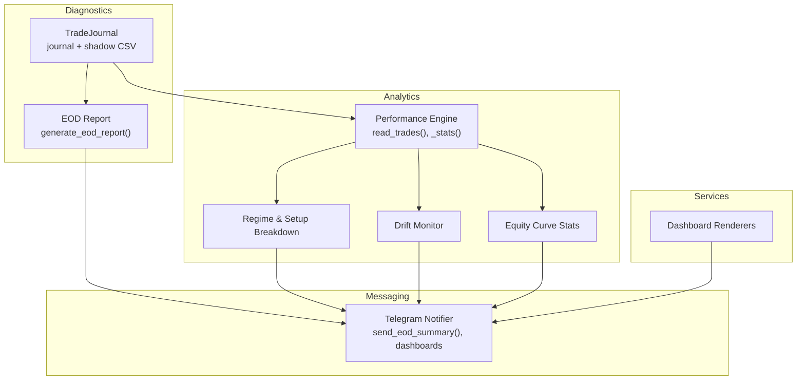
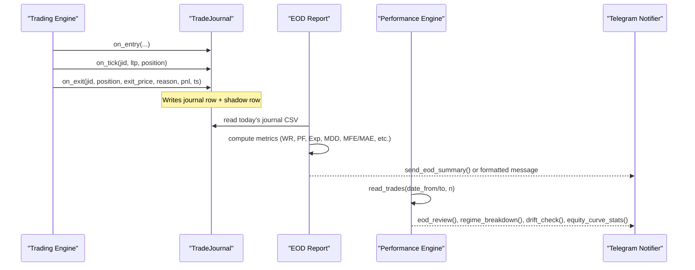
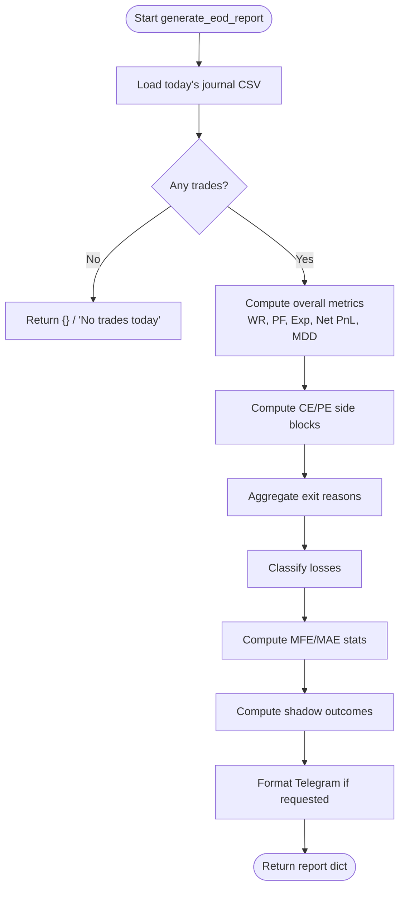
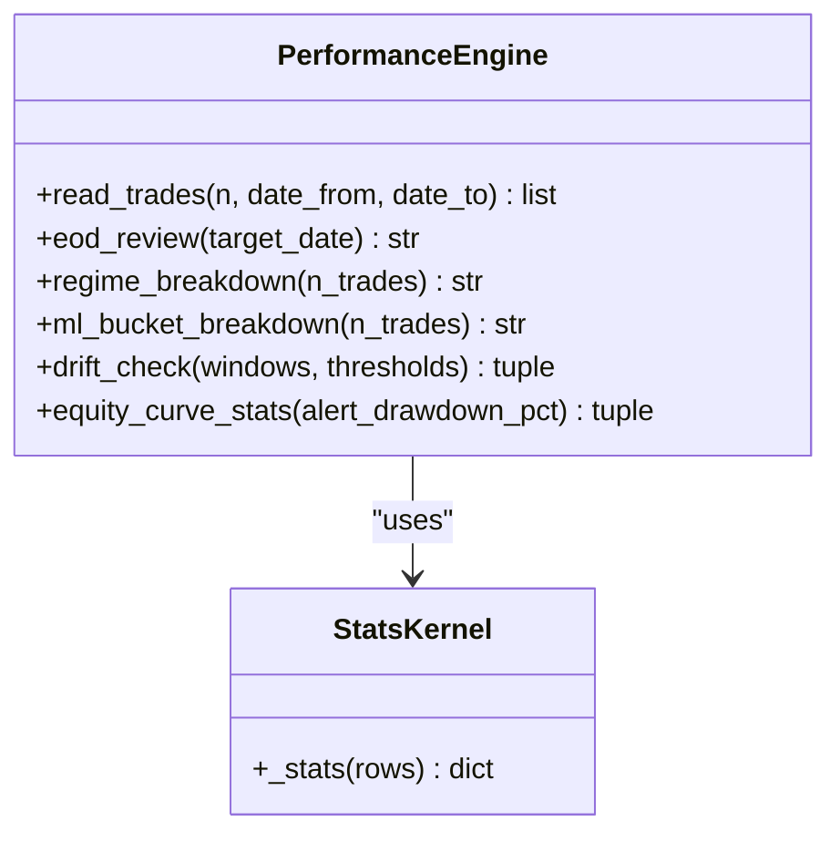
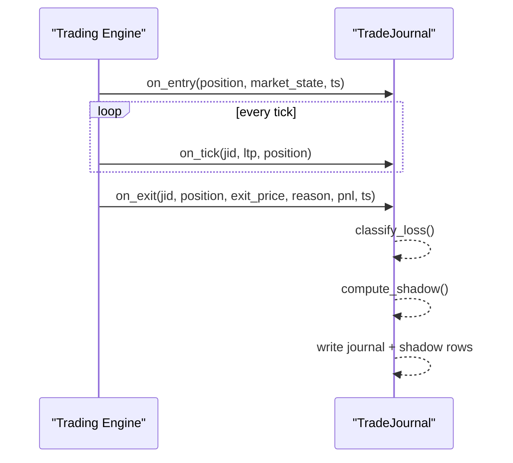
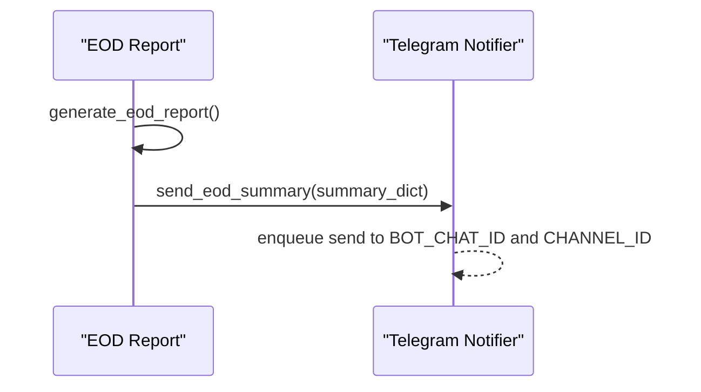
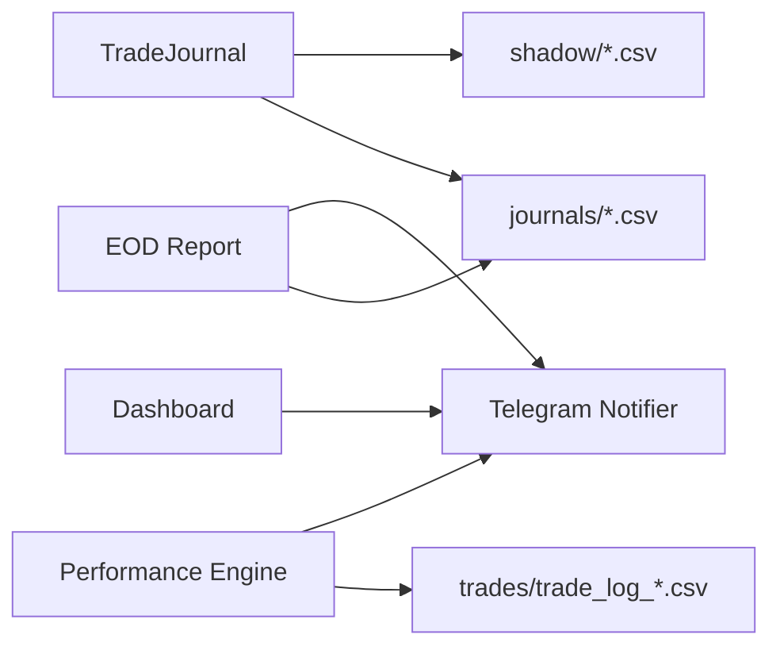

# Performance Reporting

<cite>
**Referenced Files in This Document**
- [eod_report.py](file://engine/diagnostics/eod_report.py)
- [performance.py](file://engine/analytics/performance.py)
- [trade_journal.py](file://engine/diagnostics/trade_journal.py)
- [dashboard.py](file://engine/services/dashboard.py)
- [notifier.py](file://telegram/notifier.py)
- [backtest_engine.py](file://backtest/backtest_engine.py)
- [scalp_wfo.py](file://backtest/scalp_wfo.py)
</cite>

## Table of Contents
1. Introduction
2. Project Structure
3. Core Components
4. Architecture Overview
5. Detailed Component Analysis
6. Dependency Analysis
7. Performance Considerations
8. Troubleshooting Guide
9. Conclusion
10. Appendices

## Introduction
This document explains the performance reporting system that generates end-of-day (EOD) reports and computes key trading metrics. It covers:
- EOD report generation from daily journals, including trade analysis, P&L attribution by side, win rate, profit factor, expectancy, drawdown, MFE/MAE, exit reasons, loss classification, and shadow analysis.
- The performance analytics engine for aggregating historical trades, computing regime/setup breakdowns, ML signal quality buckets, drift monitoring, and equity curve statistics.
- Report formatting and export to Telegram dashboards and messages.
- Data sources, aggregation methods, customization options, historical comparisons, and integration points with external tools.
- Data retention and archival considerations based on file-based storage patterns.

## Project Structure
The performance reporting system is implemented across diagnostics, analytics, services, and messaging layers:
- Diagnostics: Trade journaling and EOD report generation.
- Analytics: Historical trade analytics, drift alerts, setup/regime breakdowns, equity curve stats.
- Services: Dashboard rendering for live status and AI engine insights.
- Messaging: Telegram notifications and persistent dashboards.

**Diagram sources**
- [trade_journal.py:229-508](file://engine/diagnostics/trade_journal.py#L229-L508)
- [eod_report.py:124-178](file://engine/diagnostics/eod_report.py#L124-L178)
- [performance.py:47-87](file://engine/analytics/performance.py#L47-L87)
- [performance.py:143-219](file://engine/analytics/performance.py#L143-L219)
- [performance.py:226-251](file://engine/analytics/performance.py#L226-L251)
- [performance.py:294-356](file://engine/analytics/performance.py#L294-L356)
- [performance.py:401-486](file://engine/analytics/performance.py#L401-L486)
- [dashboard.py:61-144](file://engine/services/dashboard.py#L61-L144)
- [notifier.py:721-752](file://telegram/notifier.py#L721-L752)

**Section sources**
- [trade_journal.py:229-508](file://engine/diagnostics/trade_journal.py#L229-L508)
- [eod_report.py:124-178](file://engine/diagnostics/eod_report.py#L124-L178)
- [performance.py:47-87](file://engine/analytics/performance.py#L47-L87)
- [dashboard.py:61-144](file://engine/services/dashboard.py#L61-L144)
- [notifier.py:721-752](file://telegram/notifier.py#L721-L752)

## Core Components
- Trade Journal: Captures entry snapshots, intra-trade LTP snapshots, running MFE/MAE, exit details, loss classification, and shadow analysis into per-day CSV files.
- EOD Report: Reads the day’s journal CSV, computes overall metrics (trades, wins, losses, win rate, profit factor, expectancy, net PnL, max drawdown), side-specific blocks (CE/PE), exit reasons, loss classes, MFE/MAE, and shadow outcomes; optionally formats a Telegram message.
- Performance Analytics: Reads historical trade logs, computes aggregated stats, regime/setup breakdowns, ML probability bucket quality, drift alerts across windows, and equity curve statistics with weekly/monthly rollups.
- Dashboard Rendering: Produces rich HTML-formatted messages for AI engine status and live market view.
- Telegram Integration: Sends EOD summaries, updates dashboards, and supports commands and manual exits.

**Section sources**
- [trade_journal.py:31-73](file://engine/diagnostics/trade_journal.py#L31-L73)
- [trade_journal.py:78-129](file://engine/diagnostics/trade_journal.py#L78-L129)
- [trade_journal.py:133-184](file://engine/diagnostics/trade_journal.py#L133-L184)
- [trade_journal.py:229-508](file://engine/diagnostics/trade_journal.py#L229-L508)
- [eod_report.py:18-35](file://engine/diagnostics/eod_report.py#L18-L35)
- [eod_report.py:45-121](file://engine/diagnostics/eod_report.py#L45-L121)
- [eod_report.py:124-178](file://engine/diagnostics/eod_report.py#L124-L178)
- [performance.py:47-87](file://engine/analytics/performance.py#L47-L87)
- [performance.py:94-128](file://engine/analytics/performance.py#L94-L128)
- [performance.py:143-219](file://engine/analytics/performance.py#L143-L219)
- [performance.py:226-251](file://engine/analytics/performance.py#L226-L251)
- [performance.py:294-356](file://engine/analytics/performance.py#L294-L356)
- [performance.py:401-486](file://engine/analytics/performance.py#L401-L486)
- [dashboard.py:61-144](file://engine/services/dashboard.py#L61-L144)
- [notifier.py:721-752](file://telegram/notifier.py#L721-L752)

## Architecture Overview
The reporting pipeline reads from two primary data sources:
- Daily journals (per-day CSV) for EOD reports.
- Historical trade logs (trade_log_*.csv) for analytics and long-term metrics.

**Diagram sources**
- [trade_journal.py:297-498](file://engine/diagnostics/trade_journal.py#L297-L498)
- [eod_report.py:124-178](file://engine/diagnostics/eod_report.py#L124-L178)
- [performance.py:47-87](file://engine/analytics/performance.py#L47-L87)
- [performance.py:143-219](file://engine/analytics/performance.py#L143-L219)
- [performance.py:294-356](file://engine/analytics/performance.py#L294-L356)
- [performance.py:401-486](file://engine/analytics/performance.py#L401-L486)
- [notifier.py:721-752](file://telegram/notifier.py#L721-L752)

## Detailed Component Analysis

### End-of-Day Report Generation
- Data source: Per-day journal CSV under data/diagnostics/journals named by date.
- Metrics computed:
  - Overall: trades count, wins/losses, win rate, profit factor, expectancy, gross profit/loss, net PnL, max drawdown via running equity.
  - Side blocks: CE and PE separately (win rate, profit factor, expectancy, average win/loss, total).
  - Exit reasons: counts and total PnL per reason.
  - Loss classes: categorized losing trades with counts and percentages.
  - MFE/MAE: percentage of zero MFE, profitable-then-lost ratio, averages, peak before stop.
  - Shadow analysis: hypothetical HTF/ML95 blocks and improvements from alternative exits (BE@3, trail@10).
- Output: Structured dict and optional Telegram-formatted string.

**Diagram sources**
- [eod_report.py:18-35](file://engine/diagnostics/eod_report.py#L18-L35)
- [eod_report.py:45-121](file://engine/diagnostics/eod_report.py#L45-L121)
- [eod_report.py:124-178](file://engine/diagnostics/eod_report.py#L124-L178)
- [eod_report.py:199-256](file://engine/diagnostics/eod_report.py#L199-L256)

**Section sources**
- [eod_report.py:18-35](file://engine/diagnostics/eod_report.py#L18-L35)
- [eod_report.py:45-121](file://engine/diagnostics/eod_report.py#L45-L121)
- [eod_report.py:124-178](file://engine/diagnostics/eod_report.py#L124-L178)
- [eod_report.py:199-256](file://engine/diagnostics/eod_report.py#L199-L256)

### Performance Analytics Engine
- Data access: Reads trade_log_*.csv files from data/trades, filters by date range or last N rows, converts numeric fields.
- Shared stats kernel: Computes n, wins/losses, win rate, total PnL, profit factor, expectancy, avg MFE/MAE, avg holding time, capture ratio, best/worst.
- Reports:
  - EOD review: Today’s trades summary with highlights, top exit/setup reasons, regime breakdown.
  - Regime breakdown: Group by regime and compute stats per group.
  - ML signal quality: Buckets by ml_prob ranges with WR, avg PnL, MFE, capture.
  - Drift monitor: Rolling windows (default 20/50/100), alert thresholds for WR, expectancy, PF, capture.
  - Equity curve stats: Daily aggregation, max drawdown, recovery factor, streaks, weekly/monthly rollups, drawdown alerts.

**Diagram sources**
- [performance.py:47-87](file://engine/analytics/performance.py#L47-L87)
- [performance.py:94-128](file://engine/analytics/performance.py#L94-L128)
- [performance.py:143-219](file://engine/analytics/performance.py#L143-L219)
- [performance.py:226-251](file://engine/analytics/performance.py#L226-L251)
- [performance.py:294-356](file://engine/analytics/performance.py#L294-L356)
- [performance.py:401-486](file://engine/analytics/performance.py#L401-L486)

**Section sources**
- [performance.py:47-87](file://engine/analytics/performance.py#L47-L87)
- [performance.py:94-128](file://engine/analytics/performance.py#L94-L128)
- [performance.py:143-219](file://engine/analytics/performance.py#L143-L219)
- [performance.py:226-251](file://engine/analytics/performance.py#L226-L251)
- [performance.py:294-356](file://engine/analytics/performance.py#L294-L356)
- [performance.py:401-486](file://engine/analytics/performance.py#L401-L486)

### Trade Journaling and Shadow Analysis
- Entry snapshot: Records identity, entry context (symbol, side, regime, signals), probabilities, ATR, VWAP state, ORB state, quantity.
- Intra-trade ticks: Updates LTP snapshots at 5/10/30/60 seconds, tracks running MFE/MAE and ladder stage.
- Exit finalization: Writes exit fields, holding seconds, realized PnL, MFE/MAE, peak drawdown; classifies losses; computes shadow outcomes; writes journal and shadow rows.
- Loss classification: Categorizes losers into immediate adverse move, spread loss, good trade reversed, stop too tight, wrong directional signal, theta decay, other.
- Shadow analysis: Estimates alternate outcomes (break-even triggers, trailing adjustments) and whether HTF/ML95 would have blocked.

**Diagram sources**
- [trade_journal.py:297-380](file://engine/diagnostics/trade_journal.py#L297-L380)
- [trade_journal.py:384-420](file://engine/diagnostics/trade_journal.py#L384-L420)
- [trade_journal.py:423-498](file://engine/diagnostics/trade_journal.py#L423-L498)
- [trade_journal.py:78-129](file://engine/diagnostics/trade_journal.py#L78-L129)
- [trade_journal.py:133-184](file://engine/diagnostics/trade_journal.py#L133-L184)

**Section sources**
- [trade_journal.py:297-380](file://engine/diagnostics/trade_journal.py#L297-L380)
- [trade_journal.py:384-420](file://engine/diagnostics/trade_journal.py#L384-L420)
- [trade_journal.py:423-498](file://engine/diagnostics/trade_journal.py#L423-L498)
- [trade_journal.py:78-129](file://engine/diagnostics/trade_journal.py#L78-L129)
- [trade_journal.py:133-184](file://engine/diagnostics/trade_journal.py#L133-L184)

### Report Formatting and Export
- EOD Telegram format: Builds an HTML-formatted message summarizing overall metrics, CE/PE blocks, MFE/MAE, shadow analysis, exit reasons, and loss categories.
- EOD summary via notifier: send_eod_summary() sends a concise daily summary to bot chat and channel.
- Dashboards: render_engine() and render_market() produce rich HTML messages for live status and AI engine insights.

**Diagram sources**
- [eod_report.py:199-256](file://engine/diagnostics/eod_report.py#L199-L256)
- [notifier.py:721-752](file://telegram/notifier.py#L721-L752)
- [dashboard.py:61-144](file://engine/services/dashboard.py#L61-L144)

**Section sources**
- [eod_report.py:199-256](file://engine/diagnostics/eod_report.py#L199-L256)
- [notifier.py:721-752](file://telegram/notifier.py#L721-L752)
- [dashboard.py:61-144](file://engine/services/dashboard.py#L61-L144)

### Metric Interpretations and Benchmarking
- Win Rate: Percentage of winning trades; higher indicates better selection but must be considered alongside payoff.
- Profit Factor: Gross profits divided by gross losses; >1 generally favorable; infinite when no losses.
- Expectancy: Average PnL per trade; positive indicates edge.
- Capture Ratio: Realized PnL relative to maximum favorable excursion; measures how much of potential moves are captured.
- Max Drawdown: Peak-to-trough decline in cumulative PnL; risk indicator.
- Recovery Factor: Equity divided by absolute max drawdown; higher is better.
- Streaks: Consecutive wins/losses; informs psychological and sizing considerations.
- ML Signal Quality: Stratified by probability buckets; checks calibration and effectiveness.
- Drift Alerts: Threshold breaches across rolling windows; flags strategy degradation.

Note: Sharpe ratio computation is present in backtesting utilities rather than the live analytics module. See below for references.

**Section sources**
- [performance.py:94-128](file://engine/analytics/performance.py#L94-L128)
- [performance.py:294-356](file://engine/analytics/performance.py#L294-L356)
- [performance.py:401-486](file://engine/analytics/performance.py#L401-L486)
- [backtest_engine.py:1311-1346](file://backtest/backtest_engine.py#L1311-L1346)
- [scalp_wfo.py:227-240](file://backtest/scalp_wfo.py#L227-L240)

## Dependency Analysis
- EOD Report depends on daily journal CSVs produced by TradeJournal.
- Performance Analytics depends on historical trade log CSVs.
- Telegram Notifier integrates with both EOD and Analytics outputs for messaging.
- Dashboard rendering consumes runtime context and market state to produce live messages.

**Diagram sources**
- [trade_journal.py:229-508](file://engine/diagnostics/trade_journal.py#L229-L508)
- [eod_report.py:18-35](file://engine/diagnostics/eod_report.py#L18-L35)
- [performance.py:47-87](file://engine/analytics/performance.py#L47-L87)
- [notifier.py:721-752](file://telegram/notifier.py#L721-L752)

**Section sources**
- [trade_journal.py:229-508](file://engine/diagnostics/trade_journal.py#L229-L508)
- [eod_report.py:18-35](file://engine/diagnostics/eod_report.py#L18-L35)
- [performance.py:47-87](file://engine/analytics/performance.py#L47-L87)
- [notifier.py:721-752](file://telegram/notifier.py#L721-L752)

## Performance Considerations
- File I/O: Journal writes are append-only with a lock to ensure thread safety; EOD and analytics read CSVs sequentially. For large datasets, consider batching or indexing strategies.
- Memory: Analytics loads all matching trade logs into memory; filtering by date range or limiting rows reduces footprint.
- Computation: Shared stats kernel is efficient; avoid recomputing by caching results where appropriate.
- Telegram: Background queue prevents blocking the trading loop; fallback logging ensures resilience.

[No sources needed since this section provides general guidance]

## Troubleshooting Guide
- Missing journal/trade files: EOD returns empty or “No trades today”; verify paths and permissions.
- CSV schema mismatches: Numeric conversion errors handled gracefully; ensure columns exist.
- Telegram connectivity: Fallback logging captures failures; check environment variables and proxy settings.
- Drift alerts: Adjust thresholds or window sizes if false positives occur; review recent trades for anomalies.
- Drawdown alerts: Review equity curve stats and adjust risk parameters if thresholds are breached frequently.

**Section sources**
- [eod_report.py:124-178](file://engine/diagnostics/eod_report.py#L124-L178)
- [performance.py:294-356](file://engine/analytics/performance.py#L294-L356)
- [performance.py:401-486](file://engine/analytics/performance.py#L401-L486)
- [notifier.py:24-33](file://telegram/notifier.py#L24-L33)
- [notifier.py:55-63](file://telegram/notifier.py#L55-L63)

## Conclusion
The performance reporting system provides comprehensive EOD reporting and historical analytics through modular components:
- TradeJournal ensures detailed observability without impacting trading logic.
- EOD Report aggregates daily performance with rich diagnostics.
- Performance Analytics offers deep insights into regimes, setups, ML signal quality, drift, and equity curves.
- Telegram integration delivers actionable summaries and live dashboards.
Adopting these tools enables robust performance monitoring, benchmarking, and continuous improvement of trading strategies.

[No sources needed since this section summarizes without analyzing specific files]

## Appendices

### Example Outputs and Interpretation
- EOD Telegram message includes overall metrics, side breakdowns, MFE/MAE, shadow analysis, exit reasons, and loss categories.
- Analytics reports include regime/setup breakdowns, ML bucket quality, drift alerts, and equity curve stats with weekly/monthly views.
- Interpret guidelines:
  - High win rate with low profit factor suggests small frequent wins offset by occasional large losses; focus on tail risk.
  - Low capture ratio indicates poor trade management; refine exits and trails.
  - Negative expectancy despite decent win rate implies insufficient payoff; adjust sizing or filters.

[No sources needed since this section provides general guidance]

### Data Retention and Archival
- Journals: Stored per day under data/diagnostics/journals with filenames based on date.
- Shadow analysis: Stored per day under data/diagnostics/shadow with filenames based on date.
- Session version info: Persisted in data/diagnostics/session_version.json.
- Historical trades: Stored as trade_log_*.csv under data/trades.
- Recommendations:
  - Implement periodic archival (e.g., monthly zipping) to manage disk usage.
  - Maintain retention policies aligned with compliance and analysis needs.
  - Ensure backups of journals, shadow, and trade logs for auditability.

**Section sources**
- [trade_journal.py:22-28](file://engine/diagnostics/trade_journal.py#L22-L28)
- [trade_journal.py:260-273](file://engine/diagnostics/trade_journal.py#L260-L273)
- [performance.py:37-44](file://engine/analytics/performance.py#L37-L44)