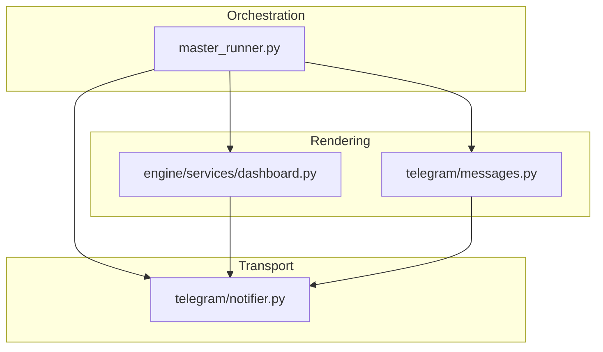
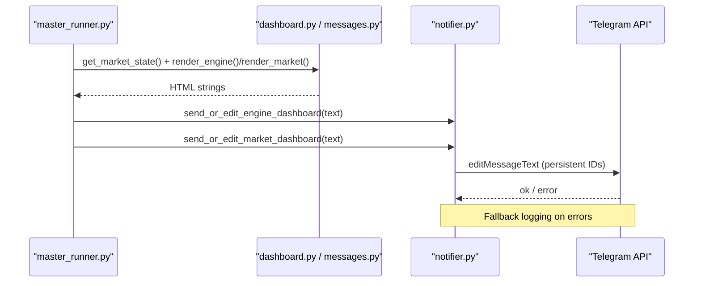
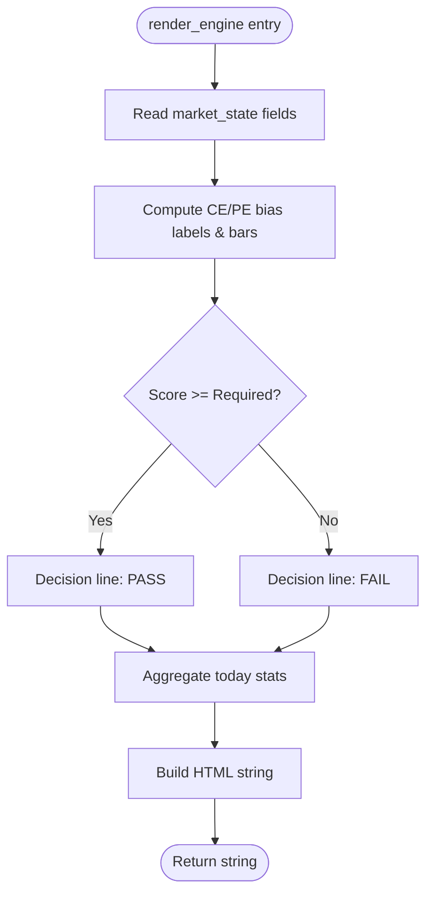
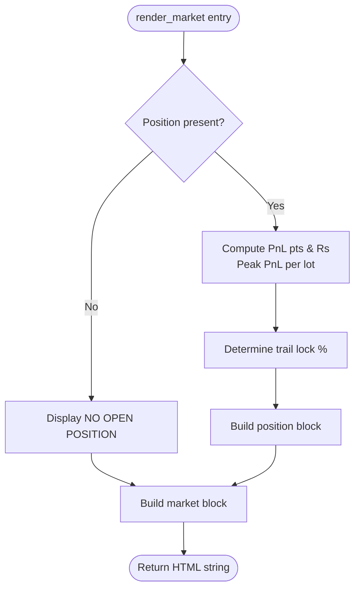
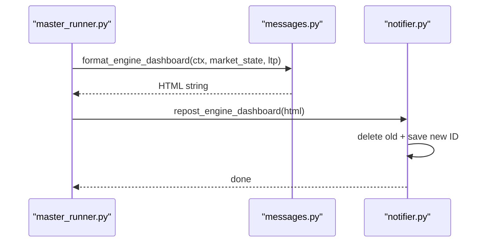
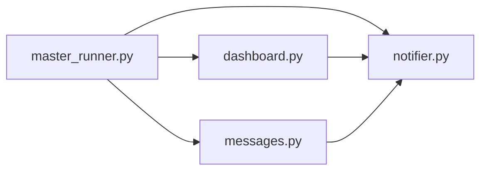

# Real-Time Dashboard

<cite>
**Referenced Files in This Document**
- [dashboard.py](file://engine/services/dashboard.py)
- [notifier.py](file://telegram/notifier.py)
- [messages.py](file://telegram/messages.py)
- [master_runner.py](file://master_runner.py)
</cite>

## Table of Contents
1. [Introduction](#introduction)
2. [Project Structure](#project-structure)
3. [Core Components](#core-components)
4. [Architecture Overview](#architecture-overview)
5. [Detailed Component Analysis](#detailed-component-analysis)
6. [Dependency Analysis](#dependency-analysis)
7. [Performance Considerations](#performance-considerations)
8. [Troubleshooting Guide](#troubleshooting-guide)
9. [Conclusion](#conclusion)
10. [Appendices](#appendices)

## Introduction
This document explains the real-time Telegram dashboard system that provides live trading visibility through two persistent, edit-in-place messages:
- AI Engine Status dashboard: ML bias, technical indicators, scoring metrics, and decision logic.
- Live Market dashboard: position tracking, P&L calculations, trailing stops, and market internals.

It covers how to configure updates, customize display formats, integrate with engine state, and optimize performance for real-time updates.

## Project Structure
The dashboard system spans three layers:
- Rendering: builds rich HTML strings for dashboards and trade cards.
- Transport: manages Telegram API calls, message persistence, and background queueing.
- Orchestration: runs the main loop, decides when to update dashboards, and integrates with engine state.

**Diagram sources**
- [dashboard.py:61-144](file://engine/services/dashboard.py#L61-L144)
- [messages.py:615-709](file://telegram/messages.py#L615-L709)
- [notifier.py:333-418](file://telegram/notifier.py#L333-L418)
- [master_runner.py:2085-2115](file://master_runner.py#L2085-L2115)

**Section sources**
- [dashboard.py:1-252](file://engine/services/dashboard.py#L1-L252)
- [notifier.py:1-753](file://telegram/notifier.py#L1-L753)
- [messages.py:1-710](file://telegram/messages.py#L1-L710)
- [master_runner.py:2085-2115](file://master_runner.py#L2085-L2115)

## Core Components
- render_engine(ctx, market_state, ltp): Produces the AI Engine Status dashboard string. It reads technicals (EMA, RSI, ADX, SuperTrend, VWAP), ML bias (CE/PE adjusted probabilities and thresholds), scoring (score vs required, percentile), decision status (waiting or firing), and today’s stats (P&L, win rate, profit factor, expectancy).
- render_market(ctx, market_state, position, ltp): Produces the Live Market dashboard string. It shows current position details (entry, LTP, P&L, peak P&L, trailing stop lock level, target, ML probability), ORB range, VWAP, time, and engine state.
- format_engine_dashboard(ctx, market_state, ltp): A human-readable alternative used by the orchestrator for the AI Engine dashboard. It includes status (RUNNING/PAUSED/STOPPED), direction, VWAP alignment, ML confidence bars, plain-language decision, last trade, and daily summary.
- notifier transport: send_or_edit_engine_dashboard / send_or_edit_market_dashboard persist message IDs and edit in place; repost_engine_dashboard deletes old and posts fresh; poll_commands handles commands like /pause, /resume, /stop, /ce, /pe, /reset, /newdash, /status, /help.

Key parameters and outputs:
- render_engine(ctx, market_state, ltp=0.0) -> str
  - market_state keys include: session, direction_bias, ema20, ema50, ema_direction, rsi_1m, adx, supertrend_dir, vwap, price_vs_vwap, ce_adj, pe_adj, ce_prob, pe_prob, ml_threshold, ce_threshold, ml_percentile, ml_score, score_required, block_reason.
  - ctx attributes read: positions, trades_today, pnl.
  - Output: HTML string for AI Engine Status.
- render_market(ctx, market_state, position=None, ltp=0.0) -> str
  - market_state keys include: orb_high, orb_low, orb_done, vwap, feed_health, orb_mode.
  - position keys include: entry, side, symbol, qty, stop_loss, target, ml_prob, max_pnl, entry_ts.
  - Output: HTML string for Live Market Status.
- format_engine_dashboard(ctx, market_state, ltp=0.0) -> str
  - Uses same market_state fields plus optional block_counts and exit analytics via ctx.
  - Output: Human-friendly HTML string for AI Engine Status.

**Section sources**
- [dashboard.py:61-144](file://engine/services/dashboard.py#L61-L144)
- [dashboard.py:151-226](file://engine/services/dashboard.py#L151-L226)
- [messages.py:615-709](file://telegram/messages.py#L615-L709)

## Architecture Overview
The system uses a dual-dashboard model with persistent message IDs stored in .telegram_state.json. The orchestrator periodically gathers market state and renders dashboards, then enqueues edits to Telegram. Trade cards temporarily pause dashboard updates to avoid conflicts.

**Diagram sources**
- [master_runner.py:2085-2115](file://master_runner.py#L2085-L2115)
- [notifier.py:333-418](file://telegram/notifier.py#L333-L418)
- [dashboard.py:61-144](file://engine/services/dashboard.py#L61-L144)
- [dashboard.py:151-226](file://engine/services/dashboard.py#L151-L226)

## Detailed Component Analysis

### AI Engine Status Dashboard (render_engine)
- Inputs:
  - ctx: trading context with positions, trades_today, pnl.
  - market_state: technicals, ML bias, thresholds, scoring, decision reason.
  - ltp: last traded price.
- Processing:
  - Computes visual bars for CE/PE adjusted probabilities.
  - Determines direction bias and Supertrend direction.
  - Evaluates scoring pass/fail against required threshold.
  - Escapes raw block reasons to prevent HTML breakage.
  - Aggregates today’s stats: wins/losses, average win/loss, profit factor, expectancy.
- Output:
  - HTML string with sections: Technicals, ML Bias, Scoring, Decision, Today stats.

**Diagram sources**
- [dashboard.py:61-144](file://engine/services/dashboard.py#L61-L144)

**Section sources**
- [dashboard.py:61-144](file://engine/services/dashboard.py#L61-L144)

### Live Market Dashboard (render_market)
- Inputs:
  - ctx: trading context (used indirectly via notifier state).
  - market_state: ORB high/low/done, VWAP, feed health, orb mode.
  - position: open position details if any.
  - ltp: last traded price.
- Processing:
  - If no position, displays “[NO OPEN POSITION]”.
  - If position exists, computes P&L points and rupees, peak P&L per lot, and trailing stop lock percentage based on peak points ladder.
  - Reads engine state from notifier global ENGINE_PAUSED flag.
- Output:
  - HTML string with sections: Position block, ORB, VWAP, time, engine state.

**Diagram sources**
- [dashboard.py:151-226](file://engine/services/dashboard.py#L151-L226)

**Section sources**
- [dashboard.py:151-226](file://engine/services/dashboard.py#L151-L226)

### Human-Readable Engine Dashboard (format_engine_dashboard)
- Purpose: Provides a more user-friendly version of the AI Engine Status with clear status lines, plain-language blockers, and last trade info.
- Integration: Used by master_runner to post a fresh engine dashboard at each cycle.

**Diagram sources**
- [messages.py:615-709](file://telegram/messages.py#L615-L709)
- [notifier.py:393-418](file://telegram/notifier.py#L393-L418)
- [master_runner.py:2105-2114](file://master_runner.py#L2105-L2114)

**Section sources**
- [messages.py:615-709](file://telegram/messages.py#L615-L709)
- [notifier.py:393-418](file://telegram/notifier.py#L393-L418)
- [master_runner.py:2105-2114](file://master_runner.py#L2105-L2114)

## Dependency Analysis
- master_runner imports rendering functions and notifier helpers to orchestrate updates.
- notifier persists message IDs and queues edits to avoid blocking the engine loop.
- messages provides additional human-readable formatting and emoji mapping.

**Diagram sources**
- [master_runner.py:80-87](file://master_runner.py#L80-L87)
- [dashboard.py:61-144](file://engine/services/dashboard.py#L61-L144)
- [messages.py:615-709](file://telegram/messages.py#L615-L709)
- [notifier.py:333-418](file://telegram/notifier.py#L333-L418)

**Section sources**
- [master_runner.py:80-87](file://master_runner.py#L80-L87)
- [master_runner.py:2085-2115](file://master_runner.py#L2085-L2115)

## Performance Considerations
- Background thread and queue: All Telegram I/O is queued to a single worker thread to prevent stalls in the engine loop.
- Persistent edits: Messages are edited in place using stored IDs to minimize API calls and avoid spamming chat history.
- Rate limiting: Dashboard updates are throttled to once per minute when not in a trade; trade cards update more frequently but do not conflict with dashboards.
- Fail-fast HTTP: The requests session disables retries and uses keep-alive pooling to reduce latency and avoid long stalls.
- Fallback logging: On Telegram failures, content is logged locally for observability without impacting performance.

Practical tips:
- Keep dashboards disabled during active trades to let trade cards take over.
- Use /newdash to reset message IDs if Telegram reports “message to edit not found.”
- Avoid excessive custom formatting; HTML is supported but keep messages concise for faster rendering and transmission.

[No sources needed since this section provides general guidance]

## Troubleshooting Guide
Common issues and resolutions:
- Message edit fails (“message to edit not found”): Use /newdash to recreate dashboard messages.
- Telegram blocked or proxy issues: Configure TELEGRAM_PROXY environment variable; ensure it is an HTTP/SOCKS proxy URL.
- Dashboard not updating: Verify _in_trade gating; dashboards pause while trade cards are active.
- Commands not recognized: Ensure you are sending from the authorized user ID; check /help for available commands.

Operational commands:
- /status: prints engine snapshot.
- /pause: pauses new entries.
- /resume: resumes entries.
- /stop: halts after current trade.
- /ce <value>: override CE threshold.
- /pe <value>: override PE threshold.
- /reset: clear threshold overrides.
- /newdash: create fresh dashboard messages.
- /help: list commands.

Error handling highlights:
- Edit fallback logs to tg_fallback.log with cleaned text.
- Poller adapts polling interval on repeated failures to back off gracefully.

**Section sources**
- [notifier.py:227-305](file://telegram/notifier.py#L227-L305)
- [notifier.py:586-698](file://telegram/notifier.py#L586-L698)
- [notifier.py:707-718](file://telegram/notifier.py#L707-L718)

## Conclusion
The real-time dashboard system delivers continuous visibility into both AI decision-making and live market conditions through two persistent Telegram messages. It balances rich information with performance by editing in place, queuing I/O, and throttling updates. Configuration is straightforward via environment variables and interactive commands, and integration with engine state is seamless through well-defined parameters and attributes.

[No sources needed since this section summarizes without analyzing specific files]

## Appendices

### Example Dashboard Messages and Emoji Usage
- AI Engine Status:
  - Sections: Technicals, ML Bias, Scoring, Decision, Today stats.
  - Emojis: Bull/bear arrows, progress bars, pass/fail markers, currency symbols.
- Live Market Status:
  - Sections: Position block, ORB, VWAP, time, engine state.
  - Emojis: Profit/loss indicators, trailing lock states, timestamps.

Formatting options:
- HTML parse mode is used throughout; ensure special characters are escaped where necessary.
- Use concise lines and avoid excessive nesting to maintain readability and speed.

Integration with engine state:
- Provide market_state with expected keys for accurate rendering.
- Ensure ctx has positions, trades_today, pnl for today’s stats.
- For human-readable engine dashboard, include block_counts and exit analytics in market_state/ctx as applicable.

Performance optimization checklist:
- Throttle dashboard frequency to once per minute outside trades.
- Disable dashboards during active trades to avoid conflicts.
- Use /newdash to recover from stale message IDs.
- Set TELEGRAM_PROXY if your network blocks api.telegram.org.

**Section sources**
- [dashboard.py:61-144](file://engine/services/dashboard.py#L61-L144)
- [dashboard.py:151-226](file://engine/services/dashboard.py#L151-L226)
- [messages.py:615-709](file://telegram/messages.py#L615-L709)
- [notifier.py:586-698](file://telegram/notifier.py#L586-L698)
- [master_runner.py:2085-2115](file://master_runner.py#L2085-L2115)