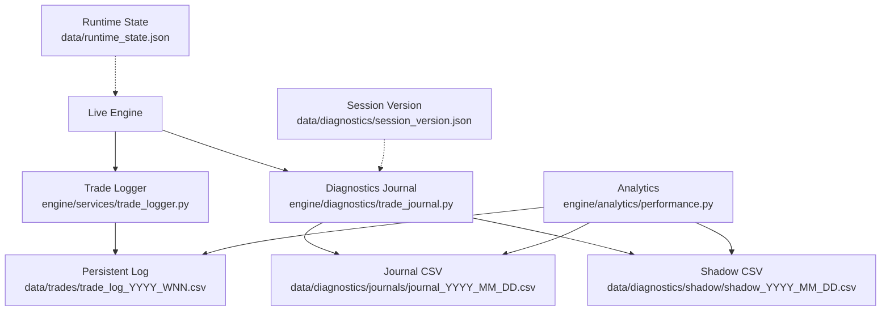
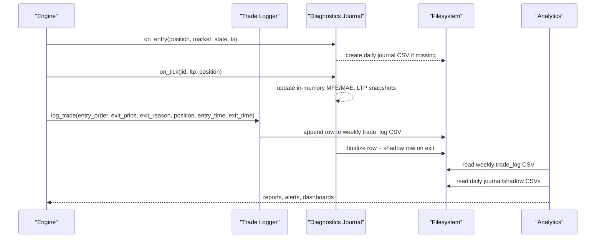
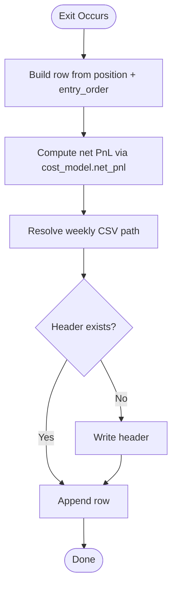
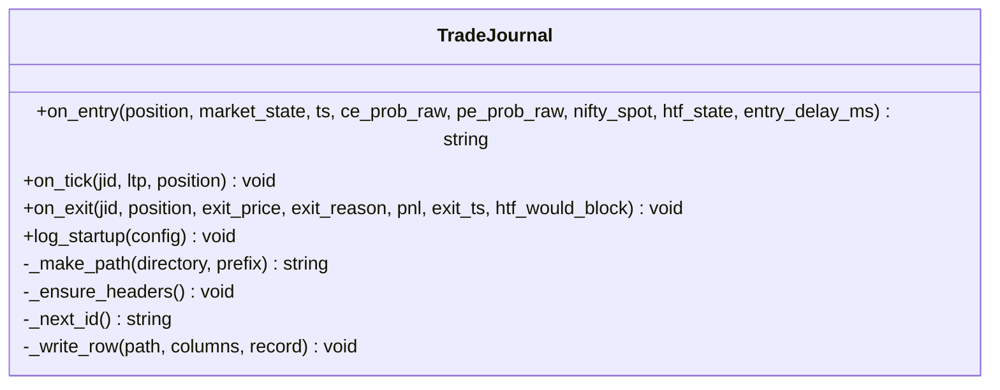
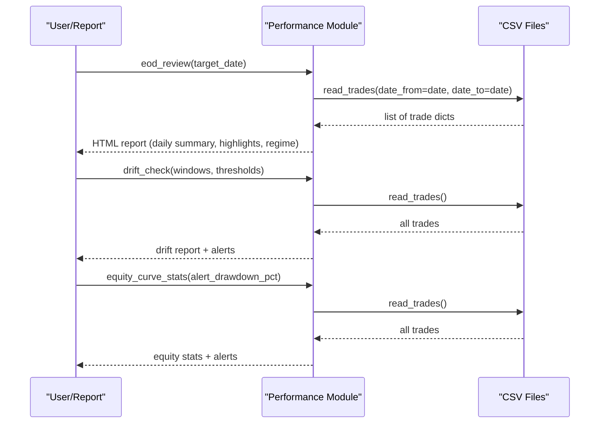
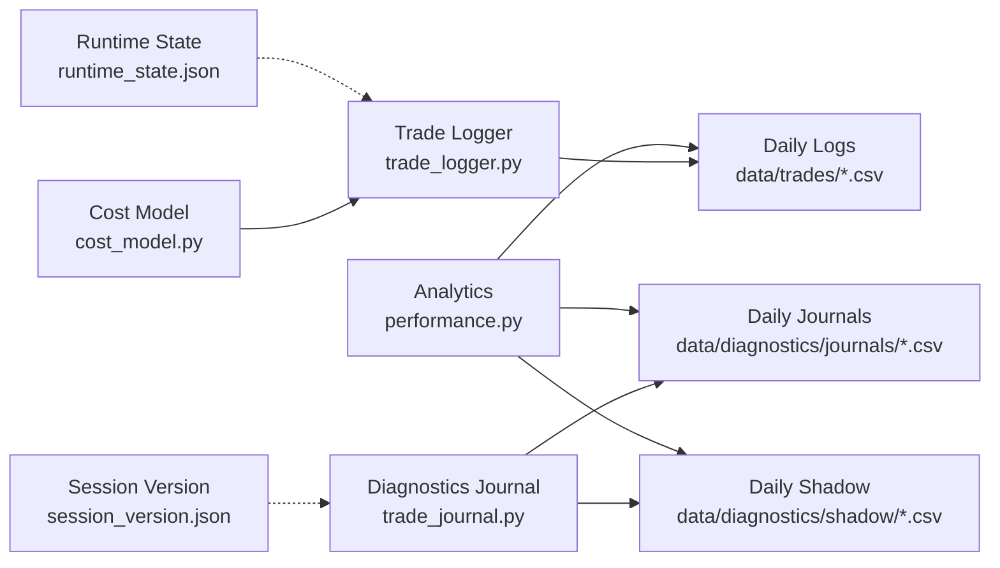

# Trade Journaling

<cite>
**Referenced Files in This Document**
- [trade_journal.py](file://engine/diagnostics/trade_journal.py)
- [performance.py](file://engine/analytics/performance.py)
- [trade_logger.py](file://engine/services/trade_logger.py)
- [cost_model.py](file://engine/execution/cost_model.py)
- [session_version.json](file://data/diagnostics/session_version.json)
- [runtime_state.json](file://data/runtime_state.json)
- [session_monitor.sh](file://scripts/session_monitor.sh)
</cite>

## Table of Contents
1. Introduction
2. Project Structure
3. Core Components
4. Architecture Overview
5. Detailed Component Analysis
6. Dependency Analysis
7. Performance Considerations
8. Troubleshooting Guide
9. Conclusion
10. Appendices

## Introduction
This document describes the trade journaling system that records and analyzes all trading activity for performance review and strategy refinement. It covers:
- Journal structure and data fields captured per trade (entry/exit details, P&L, execution quality metrics)
- Persistence and storage formats (CSV-based), retrieval methods, and analysis capabilities
- Filtering, performance attribution, pattern recognition, queries, export formats, and integration with reporting tools
- Data validation, audit trails, compliance considerations, backup procedures, and data migration strategies

The system is designed to be passive and write-only from the trading path’s perspective, ensuring maximum observability without impacting live decisions.

## Project Structure
The journaling system spans three primary areas:
- Live trade persistence: writes a canonical CSV log after each exit
- Diagnostics journal: captures rich intra-trade snapshots, loss classification, and shadow analysis
- Analytics: reads persisted logs to produce reports, drift alerts, regime breakdowns, and equity curve stats

**Diagram sources**
- [trade_logger.py:17-46](file://engine/services/trade_logger.py#L17-L46)
- [trade_journal.py:21-28](file://engine/diagnostics/trade_journal.py#L21-L28)
- [performance.py:15-44](file://engine/analytics/performance.py#L15-L44)
- [session_version.json:1-7](file://data/diagnostics/session_version.json#L1-L7)
- [runtime_state.json:1-9](file://data/runtime_state.json#L1-L9)

**Section sources**
- [trade_logger.py:17-46](file://engine/services/trade_logger.py#L17-L46)
- [trade_journal.py:21-28](file://engine/diagnostics/trade_journal.py#L21-L28)
- [performance.py:15-44](file://engine/analytics/performance.py#L15-L44)

## Core Components
- Persistent Trade Logger: Writes a canonical weekly CSV after every exit, including net PnL, execution timestamps, slippage, and order latency.
- Diagnostics Trade Journal: Captures entry snapshots, intra-trade LTP snapshots, MFE/MAE, ladder stage, loss classification, and shadow analysis; writes daily CSVs.
- Analytics Suite: Reads persisted logs to compute end-of-day reviews, regime breakdowns, ML signal quality by probability buckets, drift monitoring, setup performance, and equity curve statistics.
- Cost Model: Centralized source for round-trip costs and net PnL calculations used across logging and analytics.

Key responsibilities:
- Capture complete trade lifecycle with minimal overhead
- Ensure thread-safe, append-only persistence
- Provide robust analysis and alerting on performance drift
- Maintain versioned context for reproducibility

**Section sources**
- [trade_logger.py:25-46](file://engine/services/trade_logger.py#L25-L46)
- [trade_journal.py:31-73](file://engine/diagnostics/trade_journal.py#L31-L73)
- [performance.py:94-128](file://engine/analytics/performance.py#L94-L128)
- [cost_model.py:29-44](file://engine/execution/cost_model.py#L29-L44)

## Architecture Overview
The journaling architecture separates concerns into three layers:
- Capture Layer: Trade logger and diagnostics journal record trades at exit and during life-cycle
- Storage Layer: CSV files organized by week (persistent log) and day (diagnostic journals and shadow)
- Analysis Layer: Analytics module reads CSVs to generate reports and alerts

**Diagram sources**
- [trade_journal.py:297-491](file://engine/diagnostics/trade_journal.py#L297-L491)
- [trade_logger.py:49-141](file://engine/services/trade_logger.py#L49-L141)
- [performance.py:47-87](file://engine/analytics/performance.py#L47-L87)

## Detailed Component Analysis

### Persistent Trade Logger
- Purpose: Authoritative, persistent trade log written after every exit, resilient to restarts.
- Storage: Weekly rolling CSV under data/trades named trade_log_YYYY_WNN.csv.
- Fields captured include identity, prices, quantities, PnL, R-multiple, ML probabilities, MFE/MAE, holding time, stop/target levels, reasons, execution timestamps, bid/ask/LTP snapshots, spread/slippage, latencies, and thresholds.
- Net PnL uses centralized cost model to ensure consistency.

**Diagram sources**
- [trade_logger.py:49-141](file://engine/services/trade_logger.py#L49-L141)
- [cost_model.py:36-44](file://engine/execution/cost_model.py#L36-L44)

**Section sources**
- [trade_logger.py:25-46](file://engine/services/trade_logger.py#L25-L46)
- [trade_logger.py:49-141](file://engine/services/trade_logger.py#L49-L141)
- [cost_model.py:29-44](file://engine/execution/cost_model.py#L29-L44)

### Diagnostics Trade Journal
- Purpose: Passive, high-fidelity observability layer capturing entry snapshots, intra-trade dynamics, loss classification, and counterfactual “shadow” analysis.
- Storage: Daily CSVs under data/diagnostics/journals and data/diagnostics/shadow.
- Lifecycle:
  - on_entry: Records identity, market state, signals, probabilities, environment flags, and placeholders for intra-trade metrics.
  - on_tick: Updates LTP snapshots at 5/10/30/60 seconds, tracks MFE/MAE, and highest ladder stage reached.
  - on_exit: Finalizes exit fields, computes realized PnL, holding time, peak drawdown, classifies losses, runs shadow analysis, and writes both journal and shadow rows.

**Diagram sources**
- [trade_journal.py:229-282](file://engine/diagnostics/trade_journal.py#L229-L282)
- [trade_journal.py:297-491](file://engine/diagnostics/trade_journal.py#L297-L491)

**Section sources**
- [trade_journal.py:31-73](file://engine/diagnostics/trade_journal.py#L31-L73)
- [trade_journal.py:229-282](file://engine/diagnostics/trade_journal.py#L229-L282)
- [trade_journal.py:297-491](file://engine/diagnostics/trade_journal.py#L297-L491)

### Analytics and Reporting
- Reads weekly trade logs and diagnostic CSVs to produce:
  - End-of-day review with highlights, top exit/setup reasons, and regime breakdown
  - Regime performance breakdown
  - ML signal quality by probability buckets
  - Strategy drift monitoring with configurable thresholds and alerts
  - Setup performance ranking
  - Equity curve stats with drawdown alerts and weekly/monthly rollups

**Diagram sources**
- [performance.py:143-219](file://engine/analytics/performance.py#L143-L219)
- [performance.py:294-356](file://engine/analytics/performance.py#L294-L356)
- [performance.py:401-486](file://engine/analytics/performance.py#L401-L486)
- [performance.py:47-87](file://engine/analytics/performance.py#L47-L87)

**Section sources**
- [performance.py:47-87](file://engine/analytics/performance.py#L47-L87)
- [performance.py:143-219](file://engine/analytics/performance.py#L143-L219)
- [performance.py:226-287](file://engine/analytics/performance.py#L226-L287)
- [performance.py:294-356](file://engine/analytics/performance.py#L294-L356)
- [performance.py:363-394](file://engine/analytics/performance.py#L363-L394)
- [performance.py:401-486](file://engine/analytics/performance.py#L401-L486)

## Dependency Analysis
- Trade Logger depends on the centralized cost model for consistent net PnL calculation.
- Analytics depends on persisted CSVs produced by Trade Logger and Diagnostics Journal.
- Diagnostics Journal writes daily files and maintains session version metadata for auditability.
- Runtime state supports recovery and reconciliation but is separate from the journaling pipeline.

**Diagram sources**
- [cost_model.py:29-44](file://engine/execution/cost_model.py#L29-L44)
- [trade_logger.py:49-141](file://engine/services/trade_logger.py#L49-L141)
- [trade_journal.py:229-282](file://engine/diagnostics/trade_journal.py#L229-L282)
- [performance.py:47-87](file://engine/analytics/performance.py#L47-L87)
- [session_version.json:1-7](file://data/diagnostics/session_version.json#L1-L7)
- [runtime_state.json:1-9](file://data/runtime_state.json#L1-L9)

**Section sources**
- [cost_model.py:29-44](file://engine/execution/cost_model.py#L29-L44)
- [trade_logger.py:49-141](file://engine/services/trade_logger.py#L49-L141)
- [trade_journal.py:229-282](file://engine/diagnostics/trade_journal.py#L229-L282)
- [performance.py:47-87](file://engine/analytics/performance.py#L47-L87)

## Performance Considerations
- Thread safety: Both logger and journal use locks around file I/O to prevent corruption under concurrent writes.
- Append-only design: Minimizes locking and ensures durability even after crashes.
- In-memory tracking: Diagnostics journal updates MFE/MAE and LTP snapshots in memory until exit, reducing disk writes during the trade.
- Weekly rolling files: Keeps individual CSV sizes manageable for analytics scans.
- Numeric conversion: Analytics safely coerces numeric fields to float, handling malformed rows gracefully.

[No sources needed since this section provides general guidance]

## Troubleshooting Guide
Common issues and resolutions:
- Missing headers: On first run or empty files, modules auto-create headers. If corrupted, recreate the affected CSV.
- Unknown journal ID on exit: Diagnostics journal warns and ignores unknown jid; verify on_entry was called before on_exit.
- No trades found in analytics: Ensure weekly CSV exists and contains valid dates; check read_trades filters and encoding.
- Drift alerts: Review thresholds and recent windows; adjust DRIFT_DEFAULTS or pass custom thresholds.
- Session version mismatch: Verify session_version.json reflects current commit and model mtimes; bump config_version when strategy changes.

Operational checks:
- Use session monitor script to track process health and view recent entries/exits.
- Validate runtime state for open positions and reconcile on restart.

**Section sources**
- [trade_journal.py:437-439](file://engine/diagnostics/trade_journal.py#L437-L439)
- [performance.py:47-87](file://engine/analytics/performance.py#L47-L87)
- [session_monitor.sh:1-40](file://scripts/session_monitor.sh#L1-L40)
- [runtime_state.json:1-9](file://data/runtime_state.json#L1-L9)

## Conclusion
The trade journaling system provides comprehensive, passive observability with strong persistence and rich analytics. It captures detailed trade lifecycles, enforces consistent PnL accounting, and delivers actionable insights through filtering, attribution, and drift detection. The CSV-based storage simplifies portability and integration with external reporting tools while maintaining an audit trail via version metadata.

[No sources needed since this section summarizes without analyzing specific files]

## Appendices

### Journal Schema and Data Fields
- Persistent Trade Log (weekly): Includes trade identifiers, timestamps, symbol/side/regime, entry/exit prices, quantity, net PnL, R-multiple, ML probabilities, MFE/MAE, holding time, stops/targets, reasons, execution details (signal/submit/fill timestamps, prices, bid/ask/LTP, spread, slippage), and thresholds.
- Diagnostics Journal (daily): Adds identity/version info, entry snapshot fields (market state, probabilities, ATR, VWAP/HTF/ORB states), intra-trade LTP snapshots, MFE/MAE/peak drawdown, ladder stage, entry delay, exit details, loss classification, and shadow analysis flags/outcomes.
- Shadow CSV (daily): Counterfactual outcomes for alternative exits (e.g., break-even triggers, earlier trailing) and blocking conditions (HTF/ML thresholds).

**Section sources**
- [trade_logger.py:25-46](file://engine/services/trade_logger.py#L25-L46)
- [trade_journal.py:31-73](file://engine/diagnostics/trade_journal.py#L31-L73)

### Retrieval Methods and Queries
- Read last N trades or filter by date range using analytics read_trades.
- Compute daily summaries, regime breakdowns, ML bucket performance, drift alerts, setup rankings, and equity curve stats via analytics functions.
- Access today’s trades and summaries directly from the trade logger helpers.

Example query patterns:
- Last 50 trades: call read_trades(n=50)
- Trades between two dates: call read_trades(date_from=start, date_to=end)
- Today’s summary: call today_summary(trade_date=today)
- Full day details: call get_trades_for_day(trade_date=today)

**Section sources**
- [performance.py:47-87](file://engine/analytics/performance.py#L47-L87)
- [performance.py:143-219](file://engine/analytics/performance.py#L143-L219)
- [trade_logger.py:144-224](file://engine/services/trade_logger.py#L144-L224)

### Export Formats and Integration
- All outputs are CSV files with well-defined headers, suitable for import into Excel, BI tools, or custom pipelines.
- Analytics returns Telegram-ready HTML strings for quick reporting; underlying data remains CSV for deeper analysis.

**Section sources**
- [performance.py:143-219](file://engine/analytics/performance.py#L143-L219)
- [trade_logger.py:25-46](file://engine/services/trade_logger.py#L25-L46)

### Data Validation, Audit Trails, and Compliance
- Validation: Numeric fields are coerced to float with safe defaults; invalid rows are skipped in analytics.
- Audit trails: Session version JSON records git commit, model modification times, and config version; journal rows embed version metadata for traceability.
- Compliance: Append-only CSVs provide immutable records; centralized cost model ensures consistent financial reporting.

**Section sources**
- [performance.py:47-87](file://engine/analytics/performance.py#L47-L87)
- [trade_journal.py:189-222](file://engine/diagnostics/trade_journal.py#L189-L222)
- [cost_model.py:29-44](file://engine/execution/cost_model.py#L29-L44)

### Backup Procedures and Data Migration
- Backups: Existing scripts demonstrate timestamped backups before overwriting data; apply similar patterns to journal and trade logs.
- Migration: Since storage is CSV, migrating involves copying weekly and daily files to new locations or converting to other formats using standard tools.
- Recovery: Restart logic reloads runtime state and reconciles against broker; ensure CSV integrity and re-run analytics to rebuild reports.

**Section sources**
- [session_monitor.sh:1-40](file://scripts/session_monitor.sh#L1-L40)
- [runtime_state.json:1-9](file://data/runtime_state.json#L1-L9)