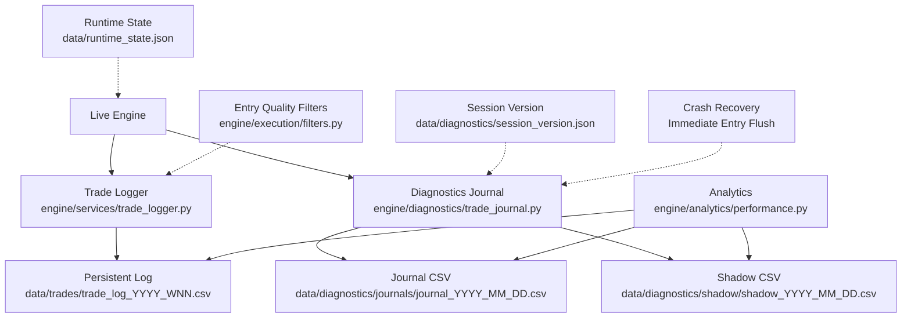
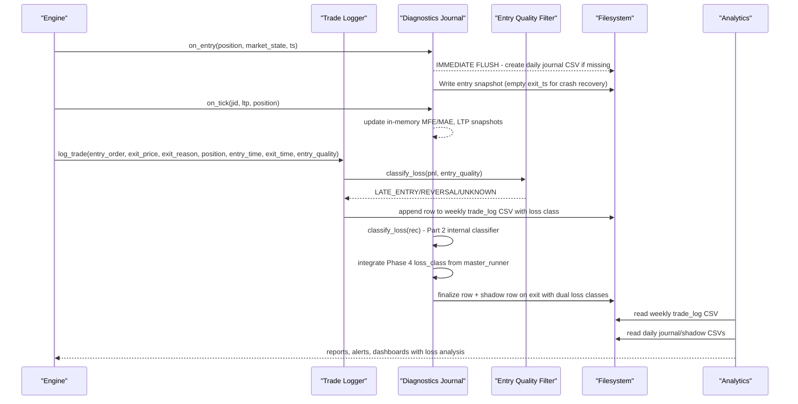
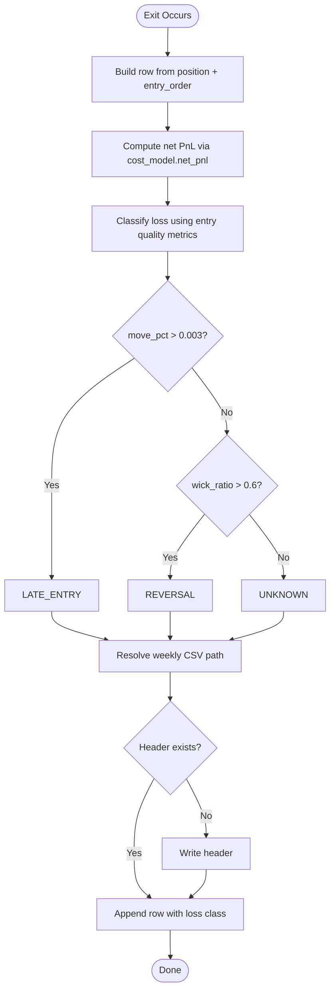
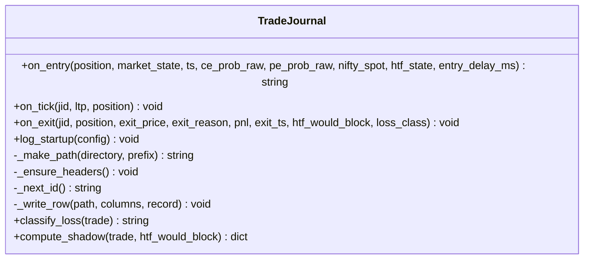
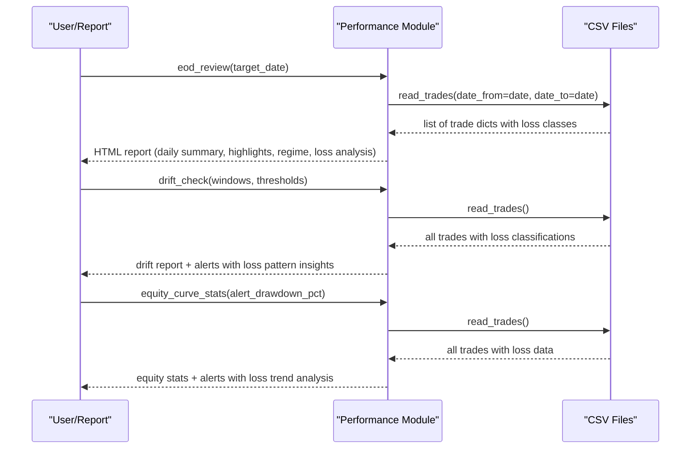
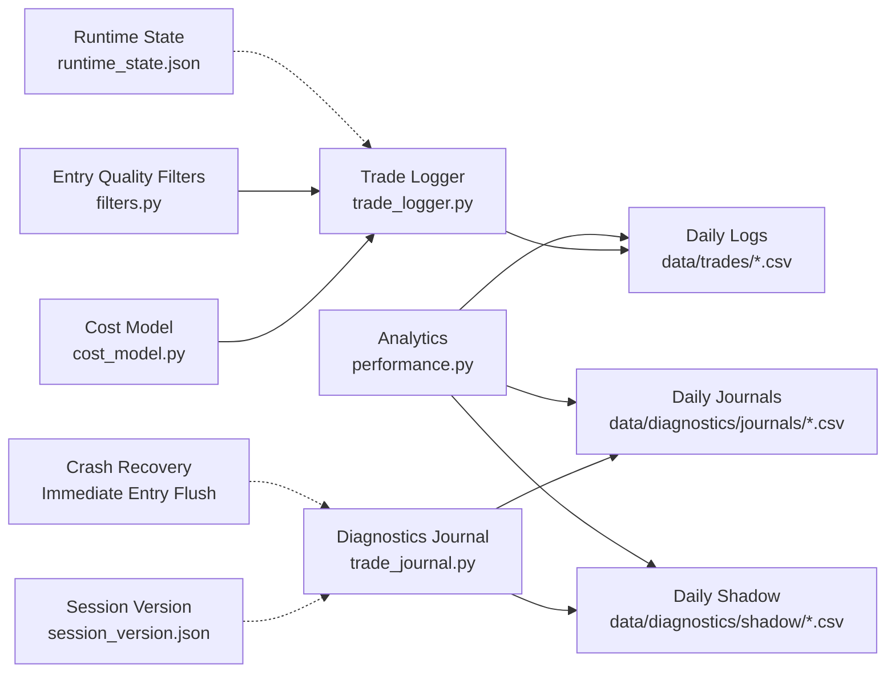

# Trade Journaling

<cite>
**Referenced Files in This Document**
- [trade_journal.py](file://engine/diagnostics/trade_journal.py)
- [performance.py](file://engine/analytics/performance.py)
- [trade_logger.py](file://engine/services/trade_logger.py)
- [cost_model.py](file://engine/execution/cost_model.py)
- [filters.py](file://engine/execution/filters.py)
- [session_version.json](file://data/diagnostics/session_version.json)
- [runtime_state.json](file://data/runtime_state.json)
- [session_monitor.sh](file://scripts/session_monitor.sh)
</cite>

## Update Summary
**Changes Made**
- Enhanced trade journal system with immediate entry snapshot flushing to prevent data loss during crashes
- Implemented same append mechanism for entry records as exit records with empty exit timestamps for later correlation
- Improved crash resilience by ensuring entry-time data survives system failures before completion
- Updated journal architecture to support dual persistence strategy for critical trade lifecycle data

## Table of Contents
1. Introduction
2. Project Structure
3. Core Components
4. Architecture Overview
5. Detailed Component Analysis
6. Dependency Analysis
7. Performance Considerations
8. Troubleshooting Guide
9. Conclusion
10. Appendices

## Introduction
This document describes the enhanced trade journaling system that records and analyzes all trading activity for performance review and strategy refinement. The system now features sophisticated loss classification capabilities that categorize trades based on both entry quality metrics and internal trade dynamics, along with enhanced crash resilience through immediate entry snapshot flushing. It covers:
- Enhanced journal structure with dual loss classification (Phase 4 entry quality + Part 2 internal classification)
- Data fields captured per trade including entry/exit details, P&L, execution quality metrics, and comprehensive loss categorization
- **Enhanced crash resilience**: Immediate entry snapshot flushing prevents data loss during system failures
- Persistence and storage formats (CSV-based), retrieval methods, and analysis capabilities
- Filtering, performance attribution, pattern recognition, queries, export formats, and integration with reporting tools
- Data validation, audit trails, compliance considerations, backup procedures, and data migration strategies

The system is designed to be passive and write-only from the trading path's perspective, ensuring maximum observability without impacting live decisions while providing deep insights into trade performance and loss patterns.

## Project Structure
The enhanced journaling system spans three primary areas with improved loss classification and crash resilience:
- Live trade persistence: writes a canonical CSV log after each exit with enhanced loss categorization
- Diagnostics journal: captures rich intra-trade snapshots, dual loss classification, shadow analysis, and **immediate entry persistence**
- Analytics: reads persisted logs to produce reports, drift alerts, regime breakdowns, and equity curve stats with loss analysis

**Diagram sources**
- [trade_logger.py:17-46](file://engine/services/trade_logger.py#L17-L46)
- [trade_journal.py:21-28](file://engine/diagnostics/trade_journal.py#L21-L28)
- [performance.py:15-44](file://engine/analytics/performance.py#L15-L44)
- [filters.py:126-264](file://engine/execution/filters.py#L126-L264)
- [session_version.json:1-7](file://data/diagnostics/session_version.json#L1-L7)
- [runtime_state.json:1-9](file://data/runtime_state.json#L1-L9)

**Section sources**
- [trade_logger.py:17-46](file://engine/services/trade_logger.py#L17-L46)
- [trade_journal.py:21-28](file://engine/diagnostics/trade_journal.py#L21-L28)
- [performance.py:15-44](file://engine/analytics/performance.py#L15-L44)

## Core Components
- **Enhanced Persistent Trade Logger**: Writes a canonical weekly CSV after every exit, including net PnL, execution timestamps, slippage, order latency, and Phase 4 entry quality loss classification (LATE_ENTRY, REVERSAL, UNKNOWN).
- **Advanced Diagnostics Trade Journal**: Captures entry snapshots, intra-trade LTP snapshots, MFE/MAE, ladder stage, dual loss classification (internal Part 2 + Phase 4 entry quality), and shadow analysis; writes daily CSVs with **immediate entry persistence**.
- **Dual Loss Classification System**: 
  - **Part 2 Internal Classifier**: Classifies losses based on trade dynamics (immediate adverse move, spread loss, good trade reversed, stop too tight, wrong directional signal, theta decay)
  - **Phase 4 Entry Quality Classifier**: Categorizes losses using entry-time metrics (LATE_ENTRY, REVERSAL, UNKNOWN)
- **Enhanced Crash Resilience**: **Immediate entry snapshot flushing** ensures entry-time data survives system crashes or kills before trade completion, using the same append mechanism as exit records with empty exit timestamps for later correlation.
- **Analytics Suite**: Reads persisted logs to compute end-of-day reviews, regime breakdowns, ML signal quality by probability buckets, drift monitoring, setup performance, and equity curve statistics with enhanced loss analysis.
- **Cost Model**: Centralized source for round-trip costs and net PnL calculations used across logging and analytics.

Key responsibilities:
- Capture complete trade lifecycle with minimal overhead and comprehensive loss categorization
- Ensure thread-safe, append-only persistence with dual loss classification and **crash-resistant entry persistence**
- Provide robust analysis and alerting on performance drift with loss pattern insights
- Maintain versioned context for reproducibility

**Section sources**
- [trade_logger.py:25-46](file://engine/services/trade_logger.py#L25-L46)
- [trade_journal.py:31-73](file://engine/diagnostics/trade_journal.py#L31-L73)
- [trade_journal.py:78-129](file://engine/diagnostics/trade_journal.py#L78-L129)
- [performance.py:94-128](file://engine/analytics/performance.py#L94-L128)
- [cost_model.py:29-44](file://engine/execution/cost_model.py#L29-L44)

## Architecture Overview
The enhanced journaling architecture separates concerns into three layers with integrated loss classification and enhanced crash resilience:
- **Capture Layer**: Trade logger and diagnostics journal record trades at exit with dual loss classification and during life-cycle, with **immediate entry persistence** for crash protection
- **Storage Layer**: CSV files organized by week (persistent log) and day (diagnostic journals and shadow) with enhanced loss categorization and **dual entry/exit records**
- **Analysis Layer**: Analytics module reads CSVs to generate reports and alerts with comprehensive loss pattern analysis

**Diagram sources**
- [trade_journal.py:297-491](file://engine/diagnostics/trade_journal.py#L297-L491)
- [trade_logger.py:49-141](file://engine/services/trade_logger.py#L49-L141)
- [performance.py:47-87](file://engine/analytics/performance.py#L47-L87)
- [filters.py:126-264](file://engine/execution/filters.py#L126-L264)

## Detailed Component Analysis

### Enhanced Persistent Trade Logger
- **Purpose**: Authoritative, persistent trade log written after every exit, resilient to restarts, with Phase 4 entry quality loss classification.
- **Storage**: Weekly rolling CSV under data/trades named trade_log_YYYY_WNN.csv.
- **Enhanced Fields**: Includes identity, prices, quantities, PnL, R-multiple, ML probabilities, MFE/MAE, holding time, stop/target levels, reasons, execution timestamps, bid/ask/LTP snapshots, spread/slippage, latencies, and Phase 4 loss classification (LATE_ENTRY, REVERSAL, UNKNOWN).
- **Net PnL**: Uses centralized cost model to ensure consistency.
- **Loss Classification**: Integrates entry quality metrics to categorize losing trades based on entry timing and candle geometry.

**Diagram sources**
- [trade_logger.py:49-141](file://engine/services/trade_logger.py#L49-L141)
- [trade_logger.py:22-43](file://engine/services/trade_logger.py#L22-L43)
- [cost_model.py:36-44](file://engine/execution/cost_model.py#L36-L44)

**Section sources**
- [trade_logger.py:25-46](file://engine/services/trade_logger.py#L25-L46)
- [trade_logger.py:49-141](file://engine/services/trade_logger.py#L49-L141)
- [trade_logger.py:22-43](file://engine/services/trade_logger.py#L22-L43)
- [cost_model.py:29-44](file://engine/execution/cost_model.py#L29-L44)

### Advanced Diagnostics Trade Journal with Dual Loss Classification and Crash Resilience
- **Purpose**: Passive, high-fidelity observability layer capturing entry snapshots, intra-trade dynamics, dual loss classification, and counterfactual "shadow" analysis with **enhanced crash resilience**.
- **Storage**: Daily CSVs under data/diagnostics/journals and data/diagnostics/shadow.
- **Enhanced Lifecycle**:
  - **on_entry**: Records identity, market state, signals, probabilities, environment flags, and placeholders for intra-trade metrics. **Immediately flushes entry snapshot to disk** to prevent data loss during crashes.
  - **on_tick**: Updates LTP snapshots at 5/10/30/60 seconds, tracks MFE/MAE, and highest ladder stage reached.
  - **on_exit**: Finalizes exit fields, computes realized PnL, holding time, peak drawdown, applies dual loss classification (Part 2 internal + Phase 4 entry quality), runs shadow analysis, and writes both journal and shadow rows.

**Updated** Added immediate entry snapshot flushing to prevent data loss during crashes, using the same append mechanism as exit records with empty exit timestamps for later correlation.

**Diagram sources**
- [trade_journal.py:229-282](file://engine/diagnostics/trade_journal.py#L229-L282)
- [trade_journal.py:297-491](file://engine/diagnostics/trade_journal.py#L297-L491)
- [trade_journal.py:78-129](file://engine/diagnostics/trade_journal.py#L78-L129)

**Section sources**
- [trade_journal.py:31-73](file://engine/diagnostics/trade_journal.py#L31-L73)
- [trade_journal.py:229-282](file://engine/diagnostics/trade_journal.py#L229-L282)
- [trade_journal.py:297-491](file://engine/diagnostics/trade_journal.py#L297-L491)
- [trade_journal.py:78-129](file://engine/diagnostics/trade_journal.py#L78-L129)

### Enhanced Analytics and Reporting with Loss Pattern Analysis
- **Reads** weekly trade logs and diagnostic CSVs to produce:
  - End-of-day review with highlights, top exit/setup reasons, regime breakdown, and loss pattern analysis
  - Regime performance breakdown with loss categorization
  - ML signal quality by probability buckets with loss type distribution
  - Strategy drift monitoring with configurable thresholds and alerts, including loss pattern drift detection
  - Setup performance ranking with loss classification insights
  - Equity curve stats with drawdown alerts and weekly/monthly rollups, incorporating loss analysis

**Diagram sources**
- [performance.py:143-219](file://engine/analytics/performance.py#L143-L219)
- [performance.py:294-356](file://engine/analytics/performance.py#L294-356)
- [performance.py:401-486](file://engine/analytics/performance.py#L401-486)
- [performance.py:47-87](file://engine/analytics/performance.py#L47-L87)

**Section sources**
- [performance.py:47-87](file://engine/analytics/performance.py#L47-L87)
- [performance.py:143-219](file://engine/analytics/performance.py#L143-L219)
- [performance.py:226-287](file://engine/analytics/performance.py#L226-287)
- [performance.py:294-356](file://engine/analytics/performance.py#L294-356)
- [performance.py:363-394](file://engine/analytics/performance.py#L363-394)
- [performance.py:401-486](file://engine/analytics/performance.py#L401-486)

## Dependency Analysis
- **Trade Logger** depends on the centralized cost model for consistent net PnL calculation and integrates with entry quality filters for Phase 4 loss classification.
- **Analytics** depends on persisted CSVs produced by Trade Logger and Diagnostics Journal with enhanced loss classification data.
- **Diagnostics Journal** writes daily files with dual loss classification and maintains session version metadata for auditability, with **enhanced crash resilience through immediate entry persistence**.
- **Entry Quality Filters** provide the foundation for Phase 4 loss classification based on entry-time metrics.
- Runtime state supports recovery and reconciliation but is separate from the journaling pipeline.

**Diagram sources**
- [cost_model.py:29-44](file://engine/execution/cost_model.py#L29-L44)
- [trade_logger.py:49-141](file://engine/services/trade_logger.py#L49-L141)
- [filters.py:126-264](file://engine/execution/filters.py#L126-L264)
- [trade_journal.py:229-282](file://engine/diagnostics/trade_journal.py#L229-L282)
- [performance.py:47-87](file://engine/analytics/performance.py#L47-L87)
- [session_version.json:1-7](file://data/diagnostics/session_version.json#L1-L7)
- [runtime_state.json:1-9](file://data/runtime_state.json#L1-L9)

**Section sources**
- [cost_model.py:29-44](file://engine/execution/cost_model.py#L29-L44)
- [trade_logger.py:49-141](file://engine/services/trade_logger.py#L49-L141)
- [filters.py:126-264](file://engine/execution/filters.py#L126-L264)
- [trade_journal.py:229-282](file://engine/diagnostics/trade_journal.py#L229-L282)
- [performance.py:47-87](file://engine/analytics/performance.py#L47-L87)

## Performance Considerations
- **Thread safety**: Both logger and journal use locks around file I/O to prevent corruption under concurrent writes.
- **Append-only design**: Minimizes locking and ensures durability even after crashes.
- **In-memory tracking**: Diagnostics journal updates MFE/MAE and LTP snapshots in memory until exit, reducing disk writes during the trade.
- **Weekly rolling files**: Keeps individual CSV sizes manageable for analytics scans.
- **Numeric conversion**: Analytics safely coerces numeric fields to float, handling malformed rows gracefully.
- **Efficient loss classification**: Dual classifier system operates efficiently with minimal computational overhead during trade exits.
- **Enhanced crash resilience**: Immediate entry snapshot flushing adds minimal overhead while providing critical crash protection for entry-time data.

## Troubleshooting Guide
Common issues and resolutions:
- **Missing headers**: On first run or empty files, modules auto-create headers. If corrupted, recreate the affected CSV.
- **Unknown journal ID on exit**: Diagnostics journal warns and ignores unknown jid; verify on_entry was called before on_exit.
- **No trades found in analytics**: Ensure weekly CSV exists and contains valid dates; check read_trades filters and encoding.
- **Drift alerts**: Review thresholds and recent windows; adjust DRIFT_DEFAULTS or pass custom thresholds.
- **Session version mismatch**: Verify session_version.json reflects current commit and model mtimes; bump config_version when strategy changes.
- **Loss classification issues**: Check that entry quality metrics are properly captured and that both Phase 4 and Part 2 classifiers have sufficient data.
- **Crash recovery**: Entry snapshots are now immediately flushed to disk, so partial trade records with empty exit timestamps indicate crashed trades that can be correlated with completed trades using journal_id.

Operational checks:
- Use session monitor script to track process health and view recent entries/exits.
- Validate runtime state for open positions and reconcile on restart.
- Monitor loss classification accuracy by reviewing journal entries for proper categorization.
- **Verify crash resilience**: Check for journal entries with empty exit_timestamps that should be correlated with completed trades.

**Section sources**
- [trade_journal.py:437-439](file://engine/diagnostics/trade_journal.py#L437-L439)
- [performance.py:47-87](file://engine/analytics/performance.py#L47-L87)
- [session_monitor.sh:1-40](file://scripts/session_monitor.sh#L1-L40)
- [runtime_state.json:1-9](file://data/runtime_state.json#L1-L9)

## Conclusion
The enhanced trade journaling system provides comprehensive, passive observability with strong persistence, dual loss classification, and **enhanced crash resilience**. It captures detailed trade lifecycles, enforces consistent PnL accounting, and delivers actionable insights through filtering, attribution, drift detection, and sophisticated loss pattern analysis. The CSV-based storage simplifies portability and integration with external reporting tools while maintaining an audit trail via version metadata. The dual loss classification system enables deeper understanding of trade performance by categorizing losses based on both entry quality and internal trade dynamics. **The new immediate entry snapshot flushing ensures critical entry-time data survives system crashes, significantly improving data reliability and recovery capabilities.**

## Appendices

### Enhanced Journal Schema and Data Fields
- **Persistent Trade Log (weekly)**: Includes trade identifiers, timestamps, symbol/side/regime, entry/exit prices, quantity, net PnL, R-multiple, ML probabilities, MFE/MAE, holding time, stops/targets, reasons, execution details (signal/submit/fill timestamps, prices, bid/ask/LTP, spread, slippage), thresholds, and Phase 4 loss classification (LATE_ENTRY, REVERSAL, UNKNOWN).
- **Diagnostics Journal (daily)**: Adds identity/version info, entry snapshot fields (market state, probabilities, ATR, VWAP/HTF/ORB states), intra-trade LTP snapshots, MFE/MAE/peak drawdown, ladder stage, entry delay, exit details, dual loss classification (Part 2 internal + Phase 4 entry quality), and shadow analysis flags/outcomes. **Now includes immediate entry persistence with empty exit timestamps for crash recovery correlation.**
- **Shadow CSV (daily)**: Counterfactual outcomes for alternative exits (e.g., break-even triggers, earlier trailing) and blocking conditions (HTF/ML thresholds) with loss classification notes.

**Section sources**
- [trade_logger.py:25-46](file://engine/services/trade_logger.py#L25-L46)
- [trade_journal.py:31-73](file://engine/diagnostics/trade_journal.py#L31-L73)

### Enhanced Loss Classification System
- **Part 2 Internal Classifier**: Classifies losses based on trade dynamics:
  - `winner`: Profitable trades
  - `immediate_adverse_move`: Option moved against us within 5 seconds
  - `spread_loss`: Option never moved, loss ≈ stop distance
  - `good_trade_reversed`: Peaked well, then reversed to stop
  - `stop_too_tight`: Peaked at 1–4 pts then stopped
  - `wrong_directional_signal`: Option moved immediately and continuously against us
  - `theta_decay`: Option decayed without directional move
  - `other`: Other loss scenarios
- **Phase 4 Entry Quality Classifier**: Categorizes losses using entry-time metrics:
  - `LATE_ENTRY`: Entry chased a large move (move_pct > 0.003)
  - `REVERSAL`: Entry candle was wick-heavy (wick_ratio > 0.6)
  - `UNKNOWN`: Loser with missing/absent entry quality data

**Section sources**
- [trade_journal.py:78-129](file://engine/diagnostics/trade_journal.py#L78-L129)
- [trade_logger.py:22-43](file://engine/services/trade_logger.py#L22-L43)
- [filters.py:126-264](file://engine/execution/filters.py#L126-L264)

### Retrieval Methods and Queries
- Read last N trades or filter by date range using analytics read_trades.
- Compute daily summaries, regime breakdowns, ML bucket performance, drift alerts, setup rankings, and equity curve stats via analytics functions with enhanced loss analysis.
- Access today's trades and summaries directly from the trade logger helpers.
- **Crash recovery queries**: Identify incomplete trades by looking for journal entries with empty exit_timestamps and correlate them with completed trades using journal_id.

Example query patterns:
- Last 50 trades: call read_trades(n=50)
- Trades between two dates: call read_trades(date_from=start, date_to=end)
- Today's summary: call today_summary(trade_date=today)
- Full day details: call get_trades_for_day(trade_date=today)
- Loss pattern analysis: analyze journal CSVs for loss classification distributions
- **Crash recovery**: Query journal entries with empty exit_timestamps and match with completed trades by journal_id

**Section sources**
- [performance.py:47-87](file://engine/analytics/performance.py#L47-L87)
- [performance.py:143-219](file://engine/analytics/performance.py#L143-L219)
- [trade_logger.py:144-224](file://engine/services/trade_logger.py#L144-L224)

### Export Formats and Integration
- All outputs are CSV files with well-defined headers, suitable for import into Excel, BI tools, or custom pipelines.
- Analytics returns Telegram-ready HTML strings for quick reporting; underlying data remains CSV for deeper analysis.
- Enhanced loss classification data enables advanced reporting on trade performance patterns and loss categorization.
- **Crash recovery data**: Journal entries with empty exit_timestamps can be exported and processed separately for crash analysis and trade correlation.

**Section sources**
- [performance.py:143-219](file://engine/analytics/performance.py#L143-L219)
- [trade_logger.py:25-46](file://engine/services/trade_logger.py#L25-L46)

### Data Validation, Audit Trails, and Compliance
- **Validation**: Numeric fields are coerced to float with safe defaults; invalid rows are skipped in analytics.
- **Audit trails**: Session version JSON records git commit, model modification times, and config version; journal rows embed version metadata for traceability.
- **Compliance**: Append-only CSVs provide immutable records; centralized cost model ensures consistent financial reporting.
- **Loss classification audit**: Dual loss classification system provides comprehensive audit trail for trade performance analysis.
- **Enhanced crash audit**: Immediate entry persistence creates additional audit trail for crash recovery and data integrity verification.

**Section sources**
- [performance.py:47-87](file://engine/analytics/performance.py#L47-L87)
- [trade_journal.py:189-222](file://engine/diagnostics/trade_journal.py#L189-L222)
- [cost_model.py:29-44](file://engine/execution/cost_model.py#L29-L44)

### Backup Procedures and Data Migration
- **Backups**: Existing scripts demonstrate timestamped backups before overwriting data; apply similar patterns to journal and trade logs.
- **Migration**: Since storage is CSV, migrating involves copying weekly and daily files to new locations or converting to other formats using standard tools.
- **Recovery**: Restart logic reloads runtime state and reconciles against broker; ensure CSV integrity and re-run analytics to rebuild reports.
- **Loss classification preservation**: Enhanced loss classification data is preserved in existing CSV schemas, ensuring backward compatibility.
- **Enhanced crash recovery**: Backup procedures should preserve journal entries with empty exit_timestamps for crash analysis and trade correlation.

**Section sources**
- [session_monitor.sh:1-40](file://scripts/session_monitor.sh#L1-L40)
- [runtime_state.json:1-9](file://data/runtime_state.json#L1-L9)