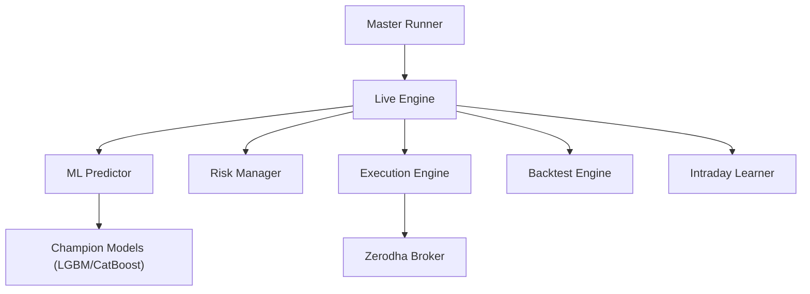
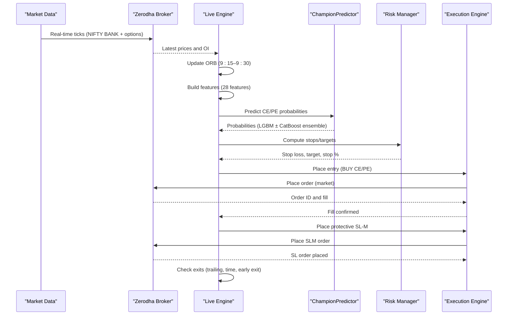
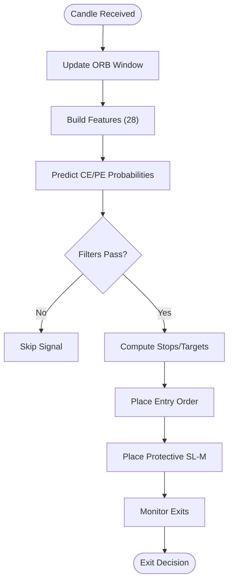
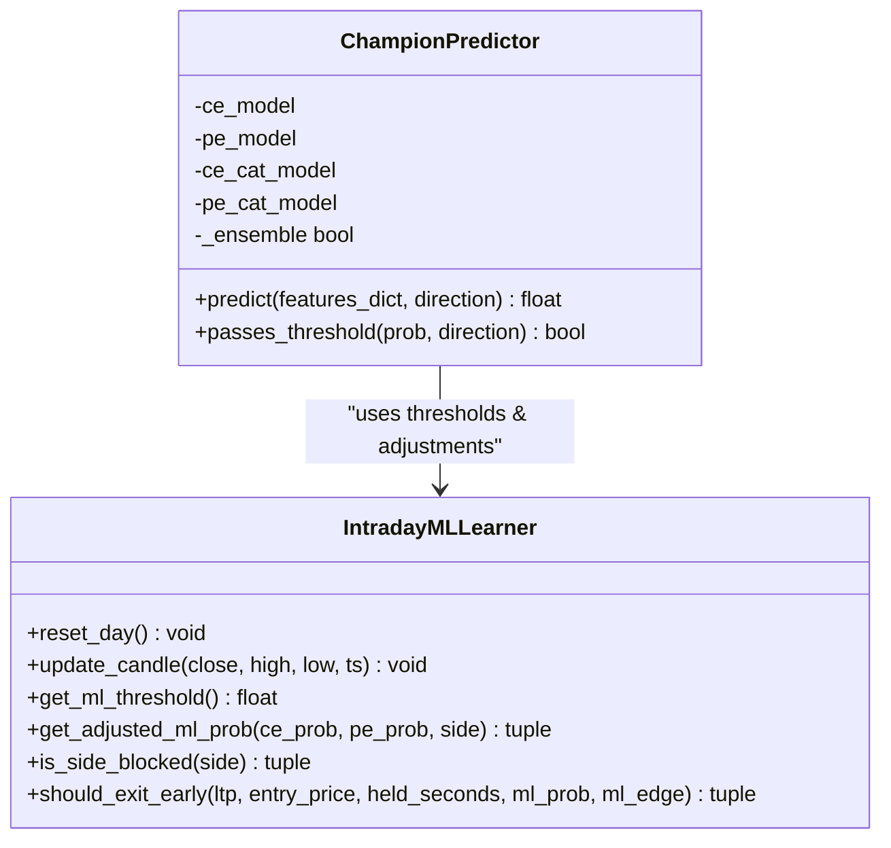
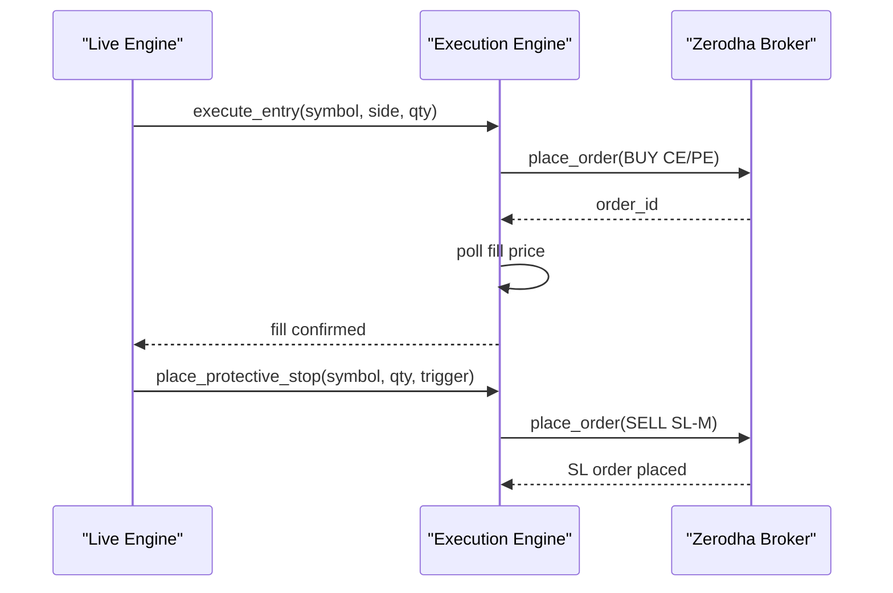
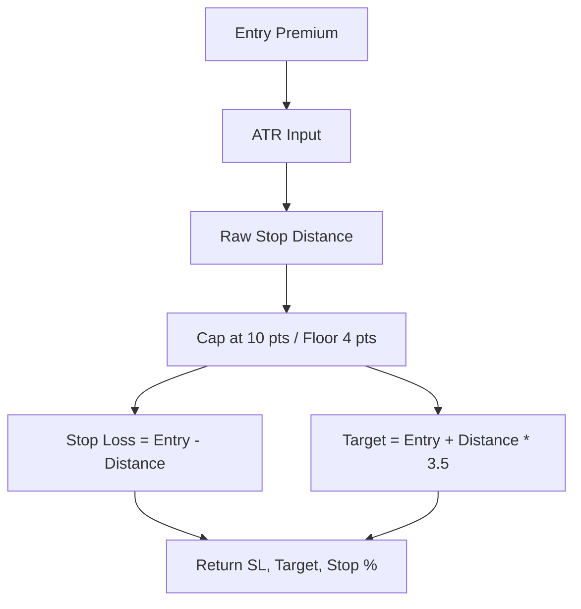
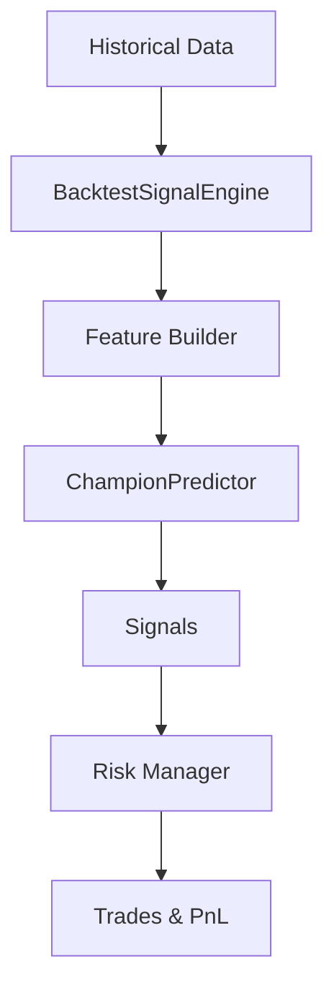
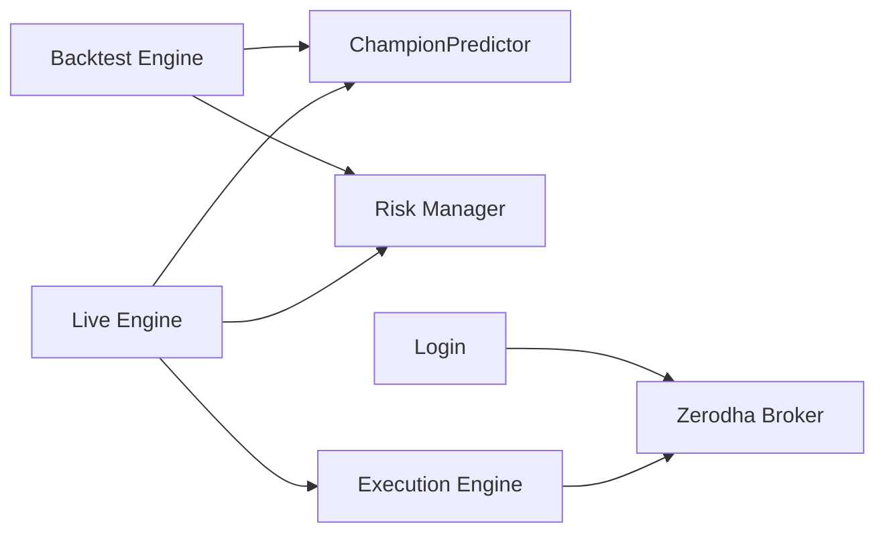

# System Overview

<cite>
**Referenced Files in This Document**
- [master_runner.py](file://master_runner.py)
- [engine/live_engine.py](file://engine/live_engine.py)
- [engine/execution/broker.py](file://engine/execution/broker.py)
- [engine/execution/execution_engine.py](file://engine/execution/execution_engine.py)
- [ml/predictor_champion.py](file://ml/predictor_champion.py)
- [ml/ml_intraday_learner.py](file://ml/ml_intraday_learner.py)
- [engine/risk/risk_manager.py](file://engine/risk/risk_manager.py)
- [backtest/backtest_engine.py](file://backtest/backtest_engine.py)
- [requirements.txt](file://requirements.txt)
- [login.py](file://login.py)
</cite>

## Table of Contents
1. Introduction
2. Project Structure
3. Core Components
4. Architecture Overview
5. Detailed Component Analysis
6. Dependency Analysis
7. Performance Considerations
8. Troubleshooting Guide
9. Conclusion

## Introduction
This document provides a comprehensive overview of an algorithmic options trading system designed for the Indian stock market (Bank Nifty/Nifty). It is a production-ready, automated platform that combines machine learning with technical analysis to execute real-time trades through Zerodha’s brokerage API. The system implements an Opening Range Breakout (ORB) strategy with multi-timeframe confirmation and uses LightGBM/CatBoost models to predict directional probability for call (CE) and put (PE) options. It emphasizes sub-second decision-making, robust risk management, and a clear separation between research, development, and production environments.

## Project Structure
The repository is organized into modular layers:
- Live trading engine orchestrates signal generation, ML inference, and execution gating
- Execution layer abstracts broker connectivity and order lifecycle
- Risk management enforces capital protection and position sizing
- Backtesting framework reuses live logic for historical validation
- ML pipeline builds features, trains champions, and adapts thresholds intraday
- Utilities handle authentication, notifications, and diagnostics

**Diagram sources**
- [master_runner.py:2388-2395](file://master_runner.py#L2388-L2395)
- [engine/live_engine.py:71-184](file://engine/live_engine.py#L71-L184)
- [ml/predictor_champion.py:57-100](file://ml/predictor_champion.py#L57-L100)
- [engine/risk/risk_manager.py:15-59](file://engine/risk/risk_manager.py#L15-L59)
- [engine/execution/execution_engine.py:21-47](file://engine/execution/execution_engine.py#L21-L47)
- [engine/execution/broker.py:11-56](file://engine/execution/broker.py#L11-L56)
- [backtest/backtest_engine.py:196-206](file://backtest/backtest_engine.py#L196-L206)

**Section sources**
- [master_runner.py:2388-2395](file://master_runner.py#L2388-L2395)
- [engine/live_engine.py:71-184](file://engine/live_engine.py#L71-L184)
- [engine/execution/broker.py:11-56](file://engine/execution/broker.py#L11-L56)
- [engine/execution/execution_engine.py:21-47](file://engine/execution/execution_engine.py#L21-L47)
- [ml/predictor_champion.py:57-100](file://ml/predictor_champion.py#L57-L100)
- [engine/risk/risk_manager.py:15-59](file://engine/risk/risk_manager.py#L15-L59)
- [backtest/backtest_engine.py:196-206](file://backtest/backtest_engine.py#L196-L206)

## Core Components
- Live Trading Engine: Central decision loop integrating ORB tracking, feature computation, ML prediction, HTF alignment, trap detection, and exit delegation.
- ML Pipeline: Champion predictor loading LGBM/CatBoost models, feature validation, ensemble averaging, and threshold checks; Intraday learner adapting probabilities and classifying day type from first 30 minutes.
- Execution Layer: Zerodha Kite Connect integration via WebSocket ticks and REST calls; order placement, fill polling, protective stop-loss orders, and paper/dry-run modes.
- Risk Management: Capital-first stop/target calculation with hard caps and trailing exits; position sizing based on confidence.
- Backtesting Framework: Reuses live components to simulate trades on historical data with option price simulation and telemetry.

Key design principles:
- Sub-second latency: per-candle updates, deduplication guards, and efficient feature building
- Robustness: graceful degradation when models or data are unavailable; safe reconstruction of ORB if startup misses window
- Modularity: clear separation between signal generation, execution, risk, and ML
- Environment separation: research (analysis), development (testing), production (live execution)

**Section sources**
- [engine/live_engine.py:71-184](file://engine/live_engine.py#L71-L184)
- [ml/predictor_champion.py:57-100](file://ml/predictor_champion.py#L57-L100)
- [ml/ml_intraday_learner.py:46-99](file://ml/ml_intraday_learner.py#L46-L99)
- [engine/execution/broker.py:11-56](file://engine/execution/broker.py#L11-L56)
- [engine/execution/execution_engine.py:21-47](file://engine/execution/execution_engine.py#L21-L47)
- [engine/risk/risk_manager.py:15-59](file://engine/risk/risk_manager.py#L15-L59)
- [backtest/backtest_engine.py:196-206](file://backtest/backtest_engine.py#L196-L206)

## Architecture Overview
High-level architecture shows how modules interact to achieve real-time, low-latency decisions:

**Diagram sources**
- [engine/live_engine.py:190-217](file://engine/live_engine.py#L190-L217)
- [engine/live_engine.py:445-470](file://engine/live_engine.py#L445-L470)
- [ml/predictor_champion.py:151-204](file://ml/predictor_champion.py#L151-L204)
- [engine/risk/risk_manager.py:20-59](file://engine/risk/risk_manager.py#L20-L59)
- [engine/execution/execution_engine.py:94-154](file://engine/execution/execution_engine.py#L94-L154)
- [engine/execution/execution_engine.py:235-256](file://engine/execution/execution_engine.py#L235-L256)
- [engine/execution/broker.py:59-123](file://engine/execution/broker.py#L59-L123)

## Detailed Component Analysis

### Live Trading Engine
Responsibilities:
- ORB builder using actual market timestamps (9:15–9:30)
- Feature computation across multiple indicators and higher-timeframe alignment
- Day classification at 9:45 to adapt regime-specific behavior
- Entry filters: structure confirmation, pullback entries, HTF trend alignment, trap detection
- Exit delegation to profit manager and risk controls

**Diagram sources**
- [engine/live_engine.py:190-217](file://engine/live_engine.py#L190-L217)
- [engine/live_engine.py:445-470](file://engine/live_engine.py#L445-L470)
- [engine/live_engine.py:643-666](file://engine/live_engine.py#L643-L666)
- [engine/live_engine.py:695-792](file://engine/live_engine.py#L695-L792)

**Section sources**
- [engine/live_engine.py:71-184](file://engine/live_engine.py#L71-L184)
- [engine/live_engine.py:190-217](file://engine/live_engine.py#L190-L217)
- [engine/live_engine.py:445-470](file://engine/live_engine.py#L445-L470)
- [engine/live_engine.py:643-666](file://engine/live_engine.py#L643-L666)
- [engine/live_engine.py:695-792](file://engine/live_engine.py#L695-L792)

### ML Pipeline
Components:
- ChampionPredictor loads LGBM and optional CatBoost models, validates features, averages ensemble probabilities, and applies thresholds
- IntradayMLLearner performs Bayesian updates after each trade, detects day type from first 30 minutes, and adjusts thresholds/multipliers intraday

**Diagram sources**
- [ml/predictor_champion.py:57-100](file://ml/predictor_champion.py#L57-L100)
- [ml/predictor_champion.py:151-204](file://ml/predictor_champion.py#L151-L204)
- [ml/ml_intraday_learner.py:46-99](file://ml/ml_intraday_learner.py#L46-L99)
- [ml/ml_intraday_learner.py:109-148](file://ml/ml_intraday_learner.py#L109-L148)

**Section sources**
- [ml/predictor_champion.py:57-100](file://ml/predictor_champion.py#L57-L100)
- [ml/predictor_champion.py:151-204](file://ml/predictor_champion.py#L151-L204)
- [ml/ml_intraday_learner.py:46-99](file://ml/ml_intraday_learner.py#L46-L99)
- [ml/ml_intraday_learner.py:109-148](file://ml/ml_intraday_learner.py#L109-L148)

### Execution Layer
Capabilities:
- ZerodhaBroker manages WebSocket subscriptions for index and options, maintains instrument maps, and retrieves LTP/OI
- ExecutionEngine handles order placement, fill validation, protective stop-loss orders, and dry-run/paper modes

**Diagram sources**
- [engine/execution/execution_engine.py:94-154](file://engine/execution/execution_engine.py#L94-L154)
- [engine/execution/execution_engine.py:235-256](file://engine/execution/execution_engine.py#L235-L256)
- [engine/execution/broker.py:59-123](file://engine/execution/broker.py#L59-L123)

**Section sources**
- [engine/execution/broker.py:11-56](file://engine/execution/broker.py#L11-L56)
- [engine/execution/broker.py:59-123](file://engine/execution/broker.py#L59-L123)
- [engine/execution/execution_engine.py:94-154](file://engine/execution/execution_engine.py#L94-L154)
- [engine/execution/execution_engine.py:235-256](file://engine/execution/execution_engine.py#L235-L256)

### Risk Management
Design:
- Tight institutional stops capped at 10 premium points to limit worst-case losses
- Target guidance set at 3.5R; trailing exits managed by profit manager
- Position sizing scales with confidence to protect small capital

**Diagram sources**
- [engine/risk/risk_manager.py:20-59](file://engine/risk/risk_manager.py#L20-L59)

**Section sources**
- [engine/risk/risk_manager.py:15-59](file://engine/risk/risk_manager.py#L15-L59)

### Backtesting Framework
Approach:
- Mirrors live engine logic without broker dependencies
- Simulates option premiums from spot moves and time decay
- Telemetry tracks signals, blocks, executions, and day stats

**Diagram sources**
- [backtest/backtest_engine.py:196-206](file://backtest/backtest_engine.py#L196-L206)
- [backtest/backtest_engine.py:330-347](file://backtest/backtest_engine.py#L330-L347)
- [backtest/backtest_engine.py:431-458](file://backtest/backtest_engine.py#L431-L458)

**Section sources**
- [backtest/backtest_engine.py:196-206](file://backtest/backtest_engine.py#L196-L206)
- [backtest/backtest_engine.py:330-347](file://backtest/backtest_engine.py#L330-L347)
- [backtest/backtest_engine.py:431-458](file://backtest/backtest_engine.py#L431-L458)

## Dependency Analysis
Core dependencies and interactions:
- Live Engine depends on ML predictor and risk manager for signal gating and exits
- Execution Engine depends on ZerodhaBroker for connectivity and order lifecycle
- Backtest Engine reuses live components to ensure parity between research and production
- Authentication via login.py ensures secure session setup and token management

**Diagram sources**
- [engine/live_engine.py:71-184](file://engine/live_engine.py#L71-L184)
- [ml/predictor_champion.py:57-100](file://ml/predictor_champion.py#L57-L100)
- [engine/risk/risk_manager.py:15-59](file://engine/risk/risk_manager.py#L15-L59)
- [engine/execution/execution_engine.py:21-47](file://engine/execution/execution_engine.py#L21-L47)
- [engine/execution/broker.py:11-56](file://engine/execution/broker.py#L11-L56)
- [backtest/backtest_engine.py:196-206](file://backtest/backtest_engine.py#L196-L206)
- [login.py:147-243](file://login.py#L147-L243)

**Section sources**
- [engine/live_engine.py:71-184](file://engine/live_engine.py#L71-L184)
- [ml/predictor_champion.py:57-100](file://ml/predictor_champion.py#L57-L100)
- [engine/risk/risk_manager.py:15-59](file://engine/risk/risk_manager.py#L15-L59)
- [engine/execution/execution_engine.py:21-47](file://engine/execution/execution_engine.py#L21-L47)
- [engine/execution/broker.py:11-56](file://engine/execution/broker.py#L11-L56)
- [backtest/backtest_engine.py:196-206](file://backtest/backtest_engine.py#L196-L206)
- [login.py:147-243](file://login.py#L147-L243)

## Performance Considerations
- Sub-second decision making achieved via per-candle updates, deduplication guards, and efficient feature computation
- Ensemble predictions (LGBM + CatBoost) balanced for accuracy and speed; fallback to LGBM-only if CatBoost unavailable
- Protective SL-M orders reduce reliance on polling loops and mitigate gaps
- Session filters (lunch chop avoidance) reduce false signals during thin liquidity
- Adaptive thresholds and Bayesian updates improve signal quality intraday without retraining

[No sources needed since this section provides general guidance]

## Troubleshooting Guide
Common issues and mitigations:
- Missing access tokens or API keys: validate environment variables and use login flow to refresh tokens
- WebSocket subscription drift: ATM drift detection triggers re-subscription to maintain accurate OI/LTP feeds
- Model files missing: ensure champion model paths exist; otherwise predictor logs warnings and may fall back
- ORB reconstruction failures: if startup occurs after 9:30, reconstruct ORB from historical data; log warnings but continue ML-only entries
- Fill validation delays: poll order book with retries; use fallback prices when necessary

**Section sources**
- [login.py:147-243](file://login.py#L147-L243)
- [engine/execution/broker.py:209-228](file://engine/execution/broker.py#L209-L228)
- [ml/predictor_champion.py:61-73](file://ml/predictor_champion.py#L61-L73)
- [engine/live_engine.py:222-315](file://engine/live_engine.py#L222-L315)
- [engine/execution/execution_engine.py:52-88](file://engine/execution/execution_engine.py#L52-L88)

## Conclusion
This system delivers a production-grade, automated options trading platform tailored for Bank Nifty/Nifty with a focus on reliability, performance, and risk control. By combining ORB breakout strategies with multi-timeframe technical analysis and adaptive machine learning, it achieves sub-second decision-making while maintaining strict capital protection. The modular architecture separates concerns cleanly across research, development, and production, enabling iterative improvement and robust deployment.

[No sources needed since this section summarizes without analyzing specific files]